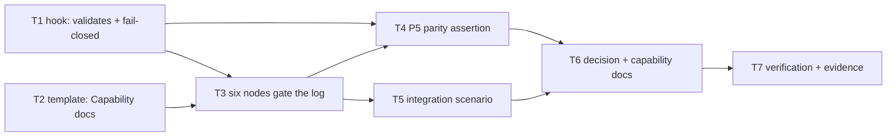

# Tasks: gating a shared artifact, and failing closed when there is nothing to gate

> Phase 4 of 4. Derived from the locked [`design.md`](design.md) and
> [`testing-plan.md`](testing-plan.md) — each task's `_Test:_` names a row of the matrix.

## Task list

- [x] **T1 — `validate-artifacts` learns `validates:`, and fails closed without a target**
  `cli/the_loop/graph/hooks/artifacts.py`. Resolve `params["validates"]` through the
  shared `resolve_produces` and check it alongside `produces`. When any content check
  (`sections`, `locked`, `frontMatter`, `checkmarks`) is declared and **no** slot
  resolves, block with a message naming the misconfiguration, `retriable=False`. Leave
  every other branch — including the `optional:` skip and the exact missing-artifact
  message — untouched.
  _Requirements: R1.1–R1.5, R2.1–R2.4_
  _Test: T1 (unit), T8 (fail-closed + not-retriable)_ — write the failing tests first.

- [x] **T2 — the execution-log template offers `## Capability docs`**
  `skills/the-loop/templates/execution-log.md`, after `## Final validation evidence`.
  Carries the loop's capability-docs rule: which docs were touched, and the history row
  tracing the behaviour back to this work item. Must land **with** T3 — the moment
  `capability-docs` stops skipping, a template without this section blocks every work
  item.
  _Requirements: R3.3_
  _Test: T8 (P5 template assertion), T11_

- [x] **T3 — the six nodes declare `validates: execution-log.md`**
  `cli/the_loop/graph/pdlc.yaml`: `self-review`, `critic-review`, `security-review`,
  `evidence`, `capability-docs`, `reviewer-briefing`. `locked:` is not set — the log is
  append-only and never `approved`. Depends on T1 and T2.
  _Requirements: R3.1, R3.2, R3.4_
  _Test: T2 (integration), T8 (P5), T11 (reproduction script)_

- [x] **T4 — P5: every section gate has something to resolve it against**
  `cli/tests/test_graph_parity.py`, in the shape of P1–P4 and asserted against the
  **shipped** graph: (a) a `validate-artifacts` that declares checks resolves a target;
  (b) every validated name is tracked by `.the-loop/manifest.yaml`; (c) every section it
  demands exists in that artifact's bundled template, read through the gate's own parser.
  Confirm it fails against the pre-T3 graph before landing.
  _Requirements: R4.1–R4.4_
  _Test: T8_

- [x] **T5 — integration scenario over the real `security-review` node**
  `cli/tests/test_graph_verification_integration.py`: drive the shipped node's exit chain
  through `run_chain` against a temp spec directory — blocked without the section,
  passing with it. Gherkin docstrings (`testing.gherkinDocstrings: required`) with a
  `Requirement:` link.
  _Requirements: R3.1, R3.2_
  _Test: T2_

- [x] **T6 — decision record and capability docs**
  `docs/decisions/decision-063.md` (option 2 + option 3, and why option 1 was rejected),
  indexed in `docs/decisions/decisions.md`; `docs/capabilities/process-graph.md` gains the
  new vocabulary and the fail-closed rule. Same PR as the change.
  _Requirements: R5.1–R5.3_
  _Test: T11_

- [x] **T7 — execute the testing plan and commit the evidence**
  Run every activity in `testing-plan.md`, tick each only once it has actually run, and
  record command/outcome/evidence under `docs/specs/issue-167/evidence/`.
  _Requirements: all_
  _Test: T1, T2, T8, T11_
