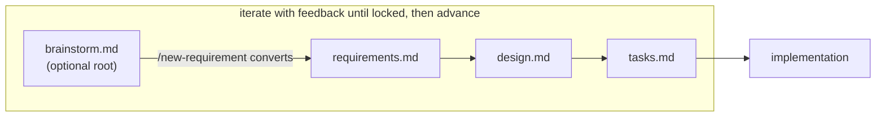

# Design: a brainstorm phase and `/brainstorm` command

> Derives from the approved [`requirements.md`](requirements.md).

## Overview

This is a **plugin content** change — templates, a command, config/manifest wiring, and
skill/reference/README docs. No runtime code. The brainstorm is modelled exactly like the
existing spec artifacts (front-matter `type`/`phase`/`status`/`approvedBy`, a
`docs/specs/<id>/` home, a manifest entry) so it reuses every existing mechanism: phase
labels, per-phase review, the draft-folder promotion flow, and `status: approved` as the
"locked" signal.

## Architecture



Phase state machine (label `loop:<phase>`), `brainstorming` optional:

```
not-started → brainstorming → requirements-definition → design → tasks-breakdown
            → implementation → needs-review → complete
```

## Components & interfaces

| Component | Change | Responsibility |
|-----------|--------|----------------|
| `.the-loop/templates/brainstorm.md` | **new** | Free-form root-artifact template. |
| `commands/brainstorm.md` | **new** | `/the-loop:brainstorm <title>` → creates `brainstorm.md` in `draft-<slug>/`; iterate→lock→convert. |
| `commands/new-requirement.md` | edit | Read a sibling `brainstorm.md` (if `approved`) and derive requirements from it. |
| `commands/create-ticket.md` | edit | Promotion carries `brainstorm.md` and rewrites its `workItem`. |
| `commands/work-on.md` | edit | Add optional Phase 0 step; update state machine + iterate-until-locked note. |
| `.the-loop/config.schema.json` | edit | Add `brainstorming` to `workflow.phases` enum + default. |
| `.the-loop/config.yaml`, `.the-loop/templates/config.yaml` | edit | List `brainstorming` in `workflow.phases`. |
| `.the-loop/manifest.yaml` | edit | Add the template + an **optional** `spec-brainstorm` work-item artifact. |
| `skills/the-loop/SKILL.md`, `reference/workflow.md`, `README.md` | edit | Document the artifact chain, the optional phase, and the generalized rule. |
| `docs/decisions/decision-017.md` + index | **new/edit** | Record the decision. |

## Data models

Brainstorm front-matter mirrors the other spec artifacts; `status: approved` == "locked".
Manifest gains `optional: true` on the `spec-brainstorm` work-item artifact to signal it
need not exist. `workflow.phases` gains one enum value; the ordering encodes the state
machine.

## Error handling

- **Unlocked brainstorm** → `new-requirement` refuses to convert and tells the user to lock
  it first (R3.2).
- **No brainstorm present** → `new-requirement`/`work-on` behave exactly as before
  (backwards compatible); start at requirements.
- **Config drift** → schema validation catches an invalid `phases` value.

## Testing strategy

No runtime code, so validation is by **gates + inspection**, mapped to requirements:

- **R1/R4 (config):** `python scripts/validate_config.py` — `config.yaml` validates against
  the updated schema (which now includes `brainstorming`). Evidence: validator exit 0.
- **R1–R5 (docs):** `markdownlint` (via pre-commit) passes on every new/changed markdown
  file. Evidence: pre-commit run output.
- **R1/R2/R3 (wiring):** manifest lists the template + optional artifact; the command files
  exist and reference the template path and conversion step (inspection).

No integration tests are added (no code paths), so no new Gherkin scenarios.

## Trade-offs & decisions

Recorded in [`docs/decisions/decision-017.md`](../../decisions/decision-017.md): optional
(not mandatory) phase, a separate root artifact (not a requirements section), and reusing
`new-requirement` for conversion (no new command).

## Open questions

None.
