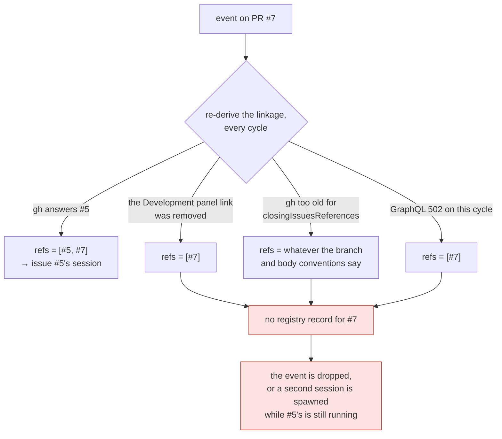

# Bugfix: a PR's routing target is recomputed from `gh` on every event, and stored nowhere

> Phase 1 of 4 (bugfix → design → testing plan → tasks). Ticket:
> [issue #172](https://github.com/MadaraUchiha-314/the-loop/issues/172).

## Summary

**Which session owns a PR's events is a value the-loop recomputes from a remote API every
cycle, and never writes down.** When a PR declares a closing reference to an issue, events
on the PR route to that issue's session — correct, and what
[issue-93](https://github.com/MadaraUchiha-314/the-loop/issues/93) asked for. But the
routing decision leaves no trace: `sessions/` holds a record for the issue and nothing for
the PR. The binding exists only as the output of `linked_issue_numbers()`, re-derived from
whatever `gh` answered this cycle.

So the binding is exactly as durable as GitHub's answer is stable — and that answer has
three ways to change after the session was created:

The session that owns the work is still alive through all of it. Nothing on disk
contradicts the derivation, because nothing on disk has an opinion.

## Steps to reproduce

Observed in practice against a self-hosted GitHub instance (the-loop 6.2.0, `gh` transport,
polling source, `routing.tmux.resumeOnRespawn: true`):

1. Open an issue and a PR whose body declares `Closes #<issue>`.
2. Comment `the-loop start` on the issue — a session registers under it.
3. Comment on the PR. The event routes to the issue's session. **Note that `sessions/`
   contains no file for the PR.**
4. Remove the link from the PR's Development panel (or edit the closing keyword out of the
   body).
5. Comment on the PR again.

## Expected vs actual

- **Expected:** step 5 still reaches the session that has been working this PR since step 2.
  A binding established when the session spawned is not re-litigated by a remote API.
- **Actual:** routing resolves to the PR itself, which has no session. Depending on the
  spawn policy the event is dropped (`dispatch.dropped` / `awaiting-start`) or a *second*
  session is spawned against the PR's ref while the issue's session is still running and
  still owns the work.

The same failure arrives without anyone touching the Development panel:
`poller/github.py:203-217` latches a fallback when the installed `gh` does not support
`closingIssuesReferences` — one warning, then a different answer forever — and a transient
GraphQL error on the listing changes the answer for exactly the cycle it hits.

## Root cause (confirmed)

Routing is derived, and derivation is the only record. Three files, one gap:

| Where | What happens | What is stored |
|---|---|---|
| `poller/github.py` | asks `gh pr list --json …,closingIssuesReferences` | nothing |
| `webhook/router.py:240-242` | `linked_issue_numbers(pr, …)` first, then the PR's own number | nothing |
| `sessions/registry.py:327` | `_path_for` is `<slug>.json`, one file per ref | the **issue's** record only |

`Dispatcher.handle` then walks `routed.work_items` and asks the registry about each ref.
There is no third step — no place a ref that *is not* a work item can point at one that is.
The PR appears in the portable poll ledger (`seenComments`, `commentAttempts`) because that
ledger is keyed by whatever was polled; the ledger says nothing about sessions.

The session-recovery ladder makes the cost concrete. All three rungs hang off *finding a
registry entry*:

| Rung | Behaviour | Reachable for a PR-keyed event today |
|---|---|---|
| 1 | stored record → live tmux session → deliver | no — there is no record to find |
| 2 | tmux gone → respawn, resuming the recorded conversation (`resumeOnRespawn`, `dispatcher.py:1358+`) | no |
| 3 | resume impossible → fresh session | reached, wrongly: the "fresh session" is a *duplicate* |

A failed derivation does not degrade through the ladder. It skips the whole thing.

## Requirements

### Requirement 1 — the PR → session binding is written down

**User story:** As an operator whose PR is delivering an issue's work item, I want the
routing decision recorded when it is made, so that the binding survives GitHub changing its
mind and survives a daemon restart.

#### Acceptance criteria (EARS)

1. WHEN an event whose payload carries a pull-request entity is dispatched to a session
   whose work item is **not** the PR's own ref THEN the system SHALL persist a binding from
   the PR's ref to that session's work-item ref.
2. WHEN a session is **spawned** for a linked issue in response to such an event THEN the
   binding SHALL be persisted on that path too — the spawn is the moment the binding is
   established.
3. WHEN the persisted binding already names that same target THEN the system SHALL NOT
   rewrite the record and SHALL NOT emit an event: a poll cycle must not churn the
   filesystem or the audit trail once per comment.
4. The persisted binding SHALL be readable without any GitHub API call, and SHALL survive a
   restart of the receiver or the poller.
5. A ref SHALL NOT be bound to itself, and a binding SHALL NOT be written for an event that
   carries no pull-request entity.

### Requirement 2 — routing resolves through the stored binding

**User story:** As an operator, I want an event on a PR whose linkage has gone to still
reach the session that owns the work, so that removing a link (or `gh` failing once) does
not strand a running agent.

#### Acceptance criteria (EARS)

1. WHEN a routed ref has no session record of its own AND has a stored binding whose target
   **does** have a live session THEN the event SHALL be delivered into that session.
2. Resolution SHALL be ordered per ref: the ref's own record first, the stored binding
   second. WHERE the ref has its own live session, the binding SHALL NOT be consulted.
3. Resolution SHALL be **single-hop**: a binding whose target is itself bound SHALL NOT be
   followed further, so no chain of records can loop or lengthen.
4. WHEN a ref resolves through a binding THEN the whole session-recovery ladder SHALL apply
   unchanged — live tmux session, else respawn resuming the recorded conversation
   (`resumeOnRespawn`), else a fresh session.
5. A stored binding SHALL NOT suppress a session that derivation *does* find: the binding
   adds a resolution and never removes one. WHERE a PR is re-linked to a different issue
   that has its own live session, both sessions receive the event, as two matched sessions
   do today.
6. WHEN neither the ref nor its binding resolves to a live session THEN the spawn policy
   SHALL apply exactly as it does today, against `work_items[0]` — this change adds a
   lookup, not a spawn path.
7. Control commands (`the-loop start|stop|pause|resume` on a PR) SHALL resolve their target
   session through the same order, so a `stop` commented on a PR whose linkage broke still
   stops the session that is running.
8. **Poll-path retry accounting SHALL resolve identically.** WHEN a delivery succeeded into a
   session reached through a binding THEN the poller's status query SHALL report it `done`,
   not `unhandled` — otherwise a successful delivery is re-forwarded until the retry budget
   is spent.
9. **First-sight detection SHALL resolve identically.** WHEN a polled pull request has a
   stored binding to a work item with a live session THEN the poller SHALL treat it as a
   known, session-owning item — not as first sight, which would baseline its entire existing
   thread as read and arm a spawn against the PR while that session is still running.
10. Verbs that name a work item **explicitly** — `sessions pause|resume|stop|attach|reset` —
    SHALL NOT resolve through a binding: acting on a different work item than the one the
    operator named is worse than making them name the one they meant.

### Requirement 3 — what a close ends is unchanged

**User story:** As a maintainer, I want issue-101's rule to survive this change, so that
merging one of several PRs does not end the work item.

#### Acceptance criteria (EARS)

1. WHEN a `pull_request` `closed` event matches a session **through a binding** THEN that
   session SHALL be left open and logged as `session.kept_open`, exactly as a session
   matched through the derived linkage is today — a PR merging is not the work item ending
   ([decision-039](../../decisions/decision-039.md)).
2. WHEN the closing PR has a session registered against its **own** ref THEN that session
   SHALL still be auto-closed.

### Requirement 4 — the binding is inspectable, classified, and removable

**User story:** As an operator, I want the new file to behave like every other thing
the-loop writes under `state.root`, so that backup, `.gitignore` and `sessions reset` need
no new special cases.

#### Acceptance criteria (EARS)

1. Binding records SHALL be written into the registry directory with a name the
   session-record scan does not admit, so `sessions list`, `reset --all` enumeration and the
   "skipping unreadable registry file" warning are untouched by their presence.
2. The record SHALL be classified in `the_loop.state.GENERATED_PATHS` as **local** (it names
   a session handle on this machine) and documented in `docs/cli/state.md`'s classification
   table with the same verdict.
3. `the-loop sessions reset` SHALL remove the work item's own binding record **and** every
   binding record naming it as target, and SHALL report it as a removed piece.
4. Closing a session SHALL **not** remove its bindings: a closed session is reopenable and
   respawnable, and the binding is still the truth about which work item the PR delivers.
5. `session.linked` and `session.unlinked` SHALL be registered in `eventlog.EVENT_TYPES`, so
   `the-loop events --type session.linked` answers "which PR is bound to what" without
   opening a file.

### Requirement 5 — a regression test that fails before the fix

**User story:** As a maintainer, I want the ticket's own reproduction encoded as a test, so
this cannot silently return.

#### Acceptance criteria (EARS)

1. An integration test SHALL drive the ticket's reproduction — a session registered against
   the issue, a first PR event carrying the linkage, then a second PR event carrying **no**
   linkage — and SHALL assert the second event is delivered into the issue's session. It
   SHALL fail against the unfixed dispatcher.
2. It SHALL carry a Gherkin docstring naming the scenario and linking this requirement
   (`config.testing.gherkinDocstrings: required`).

## Security considerations

**Threat model:** this change adds a locally-written, locally-read record that binds one
work-item ref to another. No new network reach, no new privilege, no new external input
format.

| | |
|---|---|
| **Untrusted actors** | Anyone who can comment on, or open, a PR in a watched repository. They already control the linkage this change *records*; what changes is that the-loop now remembers the linkage it acted on instead of re-asking. The record's **content** is never free-form payload text: both ends are `WorkItemRef`s the router already constructed and validated, re-parsed on read, so nothing attacker-shaped reaches a path, an argv or a prompt. |
| **Trust boundaries** | Unchanged. The record is written under `routing.registryDir` (default `<state.root>/local/`), the directory that already holds session records, and its file name is derived from `WorkItemRef.slug` — the same sanitiser (`[^A-Za-z0-9._-]+` → `-`) that names every session record. A ref that does not parse yields no record and no lookup. |
| **Abuse case — binding a PR to a session it should not reach** | Bounded by *who may create a binding*: only the dispatcher, and only for a session an event **already routed to** under the existing guards (`authorizedUsers`, the self-comment marker, the auto-execute label, `requireStartCommand`). A stranger cannot cause a binding the un-fixed the-loop would not already have delivered into. |
| **Abuse case — a stale binding outliving its purpose** | A binding to a work item whose session is closed resolves to nothing (`find_by_work_item` refuses a closed record for dispatch), so the worst case is the pre-fix behaviour. `sessions reset` removes bindings in both directions (R4.3), which is the escape hatch. |
| **Abuse case — a chain or cycle of bindings** | Prevented structurally: resolution is single-hop (R2.3) and self-binding is refused (R1.5). There is no recursion to bound. |
| **Abuse case — the record as an input carried between machines** | These records are **local**, classified as such in `GENERATED_PATHS` (R4.2) and therefore inside the existing `.the-loop/local/` ignore rule. They cannot arrive by pull request the way a portable record can, so the "a tracked control section is an input" analysis in `docs/cli/state.md` does not extend to them. |
| **Fail-closed** | Every failure degrades to today's behaviour, never past it. An unreadable, unparseable or absent binding is "no binding": derivation alone decides, exactly as now. A write failure is logged and the dispatch proceeds — a delivery is never lost because a bookkeeping write failed. |
| **Secrets** | None. The record holds two work-item refs and two timestamps. Nothing in it is a credential, a path or a conversation id. |

**Blast radius, stated plainly:** an event that reaches no session today can reach one after
this change, and an event that reaches one session can reach two (R2.5) when a PR has been
deliberately re-linked to a *different* issue that also has a live session. That second case
is the accepted cost of never losing the first binding, and it is loud — both sessions see
the same comment on the same PR — where the failure it replaces is silent.

## Out of scope

- **Changing the routing decision.** issue-93's order (linked issues before the PR's own
  number) is correct and is untouched. This ticket persists the decision's outcome.
- **A new CLI or HTTP surface for bindings.** The records are human-readable JSON beside the
  session records, and `session.linked` is queryable through `the-loop events`. Adding a
  column to `sessions list` would mean a new field in the OpenAPI contract for a fact the
  event log already answers.
- **Jira and other providers.** `WorkItemRef` is provider-qualified and the mechanism is
  provider-agnostic, but only the GitHub ingresses create bindings, because only they have a
  linkage to record.
- **Garbage-collecting bindings on a schedule.** Removal is tied to `sessions reset`
  (R4.3); a per-PR record of ~200 bytes does not justify a reaper.

## Open questions

None. The ticket named two acceptable shapes ("an alias file under the PR's slug, or a
`linkedRefs` field on the issue's session record") and left the choice open; it is taken in
[`design.md`](design.md) and recorded as a decision record.
