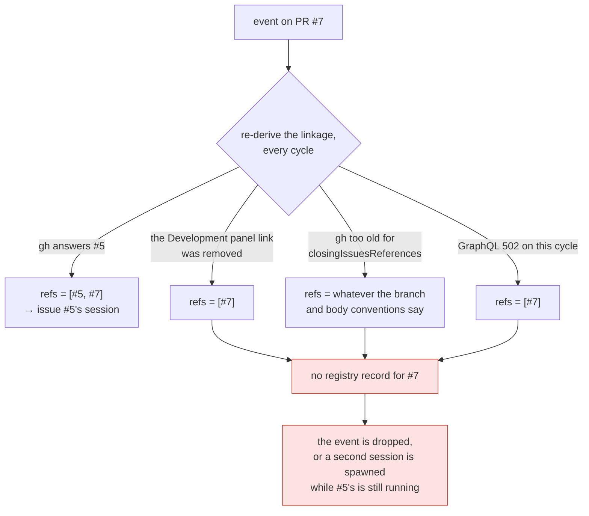

# Bugfix: a PR's routing target is recomputed from `gh` on every event, and stored nowhere

> Phase 1 of 4 (bugfix → design → testing plan → tasks). Ticket:
> [issue #172](https://github.com/MadaraUchiha-314/the-loop/issues/172).

## Summary

**Which session owns a PR's events is a value the-loop recomputes from a remote API every
cycle, and never writes down.** When a PR declares a closing reference to an issue, events
on the PR route to that issue's session — correct, and what
[issue-93](https://github.com/MadaraUchiha-314/the-loop/issues/93) asked for. But the
routing decision leaves no trace: `sessions/` holds a record for the issue and nothing for
the PR. The binding exists only as the output of `linked_issue_numbers()`, re-derived from
whatever `gh` answered this cycle.

So the binding is exactly as durable as GitHub's answer is stable — and that answer has
three ways to change after the session was created:

The session that owns the work is still alive through all of it. Nothing on disk
contradicts the derivation, because nothing on disk has an opinion.

## Steps to reproduce

Observed in practice against a self-hosted GitHub instance (the-loop 6.2.0, `gh` transport,
polling source, `routing.tmux.resumeOnRespawn: true`):

1. Open an issue and a PR whose body declares `Closes #<issue>`.
2. Comment `the-loop start` on the issue — a session registers under it.
3. Comment on the PR. The event routes to the issue's session. **Note that `sessions/`
   contains no file for the PR.**
4. Remove the link from the PR's Development panel (or edit the closing keyword out of the
   body).
5. Comment on the PR again.

## Expected vs actual

- **Expected:** step 5 still reaches the session that has been working this PR since step 2.
  A binding established when the session spawned is not re-litigated by a remote API.
- **Actual:** routing resolves to the PR itself, which has no session. Depending on the
  spawn policy the event is dropped (`dispatch.dropped` / `awaiting-start`) or a *second*
  session is spawned against the PR's ref while the issue's session is still running and
  still owns the work.

The same failure arrives without anyone touching the Development panel:
`poller/github.py:203-217` latches a fallback when the installed `gh` does not support
`closingIssuesReferences` — one warning, then a different answer forever — and a transient
GraphQL error on the listing changes the answer for exactly the cycle it hits.

## Root cause (confirmed)

Routing is derived, and derivation is the only record. Three files, one gap:

| Where | What happens | What is stored |
|---|---|---|
| `poller/github.py` | asks `gh pr list --json …,closingIssuesReferences` | nothing |
| `webhook/router.py:240-242` | `linked_issue_numbers(pr, …)` first, then the PR's own number | nothing |
| `sessions/registry.py:327` | `_path_for` is `<slug>.json`, one file per ref | the **issue's** record only |

`Dispatcher.handle` then walks `routed.work_items` and asks the registry about each ref.
There is no third step — no place a ref that *is not* a work item can point at one that is.
The PR appears in the portable poll ledger (`seenComments`, `commentAttempts`) because that
ledger is keyed by whatever was polled; the ledger says nothing about sessions.

The session-recovery ladder makes the cost concrete. All three rungs hang off *finding a
registry entry*:

| Rung | Behaviour | Reachable for a PR-keyed event today |
|---|---|---|
| 1 | stored record → live tmux session → deliver | no — there is no record to find |
| 2 | tmux gone → respawn, resuming the recorded conversation (`resumeOnRespawn`, `dispatcher.py:1358+`) | no |
| 3 | resume impossible → fresh session | reached, wrongly: the "fresh session" is a *duplicate* |

A failed derivation does not degrade through the ladder. It skips the whole thing.

## Requirements

> Revised in owner review on [PR #173](https://github.com/MadaraUchiha-314/the-loop/pull/173):
> the binding is stored **on the work item's single session record**, and each recorded PR
> gets **its own session** by default. The original requirements (a separate binding
> record, one conversation per work item) are superseded, not amended — the paper trail is
> [decision-064](../../decisions/decision-064.md) § How this decision changed.

### Requirement 1 — the work item's record carries its pull requests

**User story:** As an operator, I want everything about a work item's sessions — every PR
delivering it, every tmux session and conversation involved — recorded on that work item's
one session record, so the routing decision survives GitHub changing its mind and a
restart, and is readable in one file.

#### Acceptance criteria (EARS)

1. WHEN an event whose payload carries a pull-request entity is dispatched to a work
   item's record that is **not** the PR's own ref THEN the system SHALL record the PR in
   that record's `pullRequests` list.
2. WHEN a session is **spawned** for a linked issue in response to such an event THEN the
   PR SHALL be recorded on that path too — after registration, so a failed spawn records
   nothing.
3. WHEN the PR is already listed THEN the system SHALL NOT rewrite the record and SHALL
   NOT emit an event: a poll cycle must not churn the file once per comment.
4. The record SHALL be readable without any GitHub API call and SHALL survive a restart of
   the receiver or the poller.
5. A work item SHALL NOT be recorded as its own pull request, and nothing SHALL be
   recorded for an event carrying no pull-request entity or for a close event.
6. A `pullRequests` entry that cannot be parsed SHALL be skipped — never fatal to the
   record — and nesting SHALL be one level: an entry's own `pullRequests` is dropped on
   read.

### Requirement 2 — each recorded PR is a session of its own, and resolution uses the record

**User story:** As an operator, I want each PR delivering a work item to work in its own
tmux session and harness conversation, and events on a PR whose linkage has gone to still
reach the right conversation.

#### Acceptance criteria (EARS)

1. WHEN `routing.tmux.sessionPerPr` is true (**the default**) THEN each recorded PR's
   events SHALL be delivered into that PR's **own** endpoint — its own tmux session and
   harness conversation — spawned lazily by the first event that needs it, announced like
   any spawn. A work item with two PRs therefore has three sessions.
2. WHEN `sessionPerPr` is false THEN every PR's events SHALL be delivered into the work
   item's single session — the pre-issue-172 behaviour, kept as a configured choice.
3. Resolution SHALL be ordered per ref: the ref's **own record** first; only a ref with no
   record of its own SHALL be looked up across the live records' PR lists. A recorded PR
   SHALL NOT suppress a work item the derived linkage still finds — a re-linked PR
   delivers to both records.
4. WHEN a PR's endpoint is closed, or cannot spawn, THEN its events SHALL fall back to the
   work item's own session — an event is never lost to endpoint bookkeeping.
5. WHEN neither a record nor a recorded PR resolves THEN the spawn policy SHALL apply
   exactly as today, against `work_items[0]`.
6. Control commands on a PR SHALL resolve to its work item's record, so a `stop` commented
   on a PR whose linkage broke still stops the session that owns the work.
7. Poll-path retry accounting SHALL resolve per endpoint (`done` for an id recorded on the
   PR's endpoint, and dedup SHALL NOT leak between a work item's conversations), and
   first-sight detection SHALL treat a recorded PR as a known, owned item.
8. Verbs that name a work item **explicitly** — `sessions pause|resume|stop|attach|reset`
   — SHALL NOT resolve through the PR list.
9. A pull-request endpoint SHALL NOT enter or advance the work item's process graph: the
   graph stays keyed to the work item (the **outer loop**); the per-PR **inner-loop**
   graph is defined and built as its own work item (decision-064 § the direction this
   sets).

### Requirement 3 — a PR closing ends its endpoint; the work item's close is unchanged

**User story:** As a maintainer, I want issue-101's rule to hold in the model: one of
several PRs merging ends that PR's conversation, never the work item.

#### Acceptance criteria (EARS)

1. WHEN a `pull_request` `closed` event's closed object is a **recorded PR** of a
   still-open work item THEN that PR's endpoint SHALL be closed (its tmux session handled
   per the existing retention rules, `session.pr_closed`) and the work item's record left
   live (`session.kept_open`).
2. WHEN the closing PR has a record registered against its **own** ref THEN that record
   SHALL still be auto-closed, exactly as today.

### Requirement 4 — inspectable, classified, removable — with nothing new to classify

**User story:** As an operator, I want the new state to behave like the session record it
lives in, so backup, `.gitignore` and `sessions reset` need no new special cases.

#### Acceptance criteria (EARS)

1. The PR entries SHALL live **inside** `local/<slug>.json` — no new generated path, so
   `GENERATED_PATHS`, the portability classification and the `.gitignore` recipe are
   unchanged; the session record's documented contents SHALL name them.
2. `the-loop sessions reset` (and `close`-then-`forget`) SHALL remove the PR entries with
   the record they live in — no separate piece, nothing left behind.
3. `session.pr_linked`, `session.pr_spawned`, `session.pr_closed` and
   `session.link_failed` SHALL be registered in `eventlog.EVENT_TYPES`, so
   `the-loop events` answers "which PRs deliver what" without opening a file.

### Requirement 5 — a regression test that fails before the fix

**User story:** As a maintainer, I want the ticket's own reproduction encoded as a test,
so this cannot silently return.

#### Acceptance criteria (EARS)

1. An integration test SHALL drive the ticket's reproduction — a session registered
   against the issue, a first PR event carrying the linkage, then a second PR event
   carrying **no** linkage — and SHALL assert the second event is delivered into the PR's
   recorded endpoint. It SHALL fail against the unfixed resolver.
2. It SHALL carry a Gherkin docstring naming the scenario and linking this requirement
   (`config.testing.gherkinDocstrings: required`).

## Security considerations

**Threat model:** this change adds locally-written, locally-read entries on an existing
record, and (by default) additional harness processes — one per active PR.

| | |
|---|---|
| **Untrusted actors** | Anyone who can comment on, or open, a PR in a watched repository. They already control the linkage this change *records*; what changes is that the-loop remembers the linkage it acted on instead of re-asking. Entry **content** is never free-form payload text: both ends are `WorkItemRef`s the router constructed and validated, re-parsed on read. |
| **Trust boundaries** | Unchanged in kind. Each PR endpoint is spawned by the same guarded path as the work item's own session — downstream of the self-comment marker, `authorizedUsers`, the auto-execute label and `requireStartCommand` — in the same checkout, with the same pre-flight trust handling. What multiplies is the **number of harness processes**, which is operator-visible (`sessions list`, spawn announcements) and bounded by the number of open recorded PRs. |
| **Abuse case — recording a PR against a session it should not reach** | Bounded by *who may record*: only the dispatcher, only for a record an event already routed into under the existing guards. |
| **Abuse case — a hand-edited entry** | Skipped per entry (`WorkItemRef.parse` on both ends); the work item's own session survives. One-level nesting is enforced on read, so no tree or cycle is constructible. |
| **Abuse case — event flooding spawning processes** | A spawn per recorded PR requires the PR to pass the label/start gates that any spawn requires; an unauthorized actor's comment never reaches dispatch. The lazy spawn means a merely-linked PR costs nothing. |
| **Fail-closed** | Every failure degrades to a behaviour the-loop already had: unreadable entry → that PR unrecorded; endpoint unspawnable → deliver to the record; recording fails → derivation alone, as before issue-172. |
| **Secrets** | None. The entries hold work-item refs, a conversation id and a tmux name — the same classes of value the record already held, in the same local, never-tracked file. |

**Blast radius, stated plainly:** the default behaviour changes — a PR's events now land
in a PR-specific session rather than the work item's, and a work item with N open PRs runs
N+1 harness processes. `sessionPerPr: false` restores the old shape. And a deliberately
re-linked PR delivers to both records (loud), where the failure it replaces was silent.

## Out of scope

- **Changing how linkage is derived.** issue-93's order (linked issues before the PR's own
  number) is untouched. This ticket records the decision's outcome.
- **The inner-loop graph.** This change builds the substrate (per-PR endpoints) and the
  boundary (a PR endpoint has no graph); defining the PR's own sub-graph of nodes and how
  it reports into the outer loop is follow-up with its own work item (R2.9,
  decision-064).
- **A new CLI/HTTP surface.** `sessions list --format json` already returns the record
  verbatim, `pullRequests` included; `the-loop events` answers the rest.
- **Jira and other providers.** The mechanism is provider-agnostic; only the GitHub
  ingresses record PRs, because only they have a linkage to record.

## Open questions

None standing. The ticket left the storage shape open; the first draft's choice (a
separate link record) was overturned in owner review, and the record of both positions is
[decision-064](../../decisions/decision-064.md).
