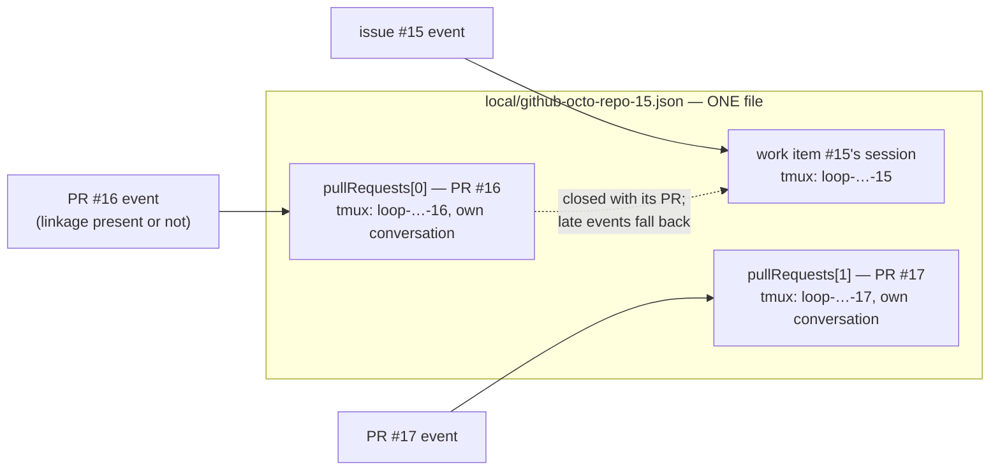

# Design: the work item's record owns its pull requests, and each PR is a session

> Phase 2 of 4. Derived from the locked [`bugfix.md`](bugfix.md), revised in owner review
> on [PR #173](https://github.com/MadaraUchiha-314/the-loop/pull/173). Ticket:
> [issue #172](https://github.com/MadaraUchiha-314/the-loop/issues/172).

## Architecture

**One record per work item, carrying everything about its sessions.** The record holds the
work item's own session and a `pullRequests[]` list — one entry per PR delivering it, each
an **endpoint**: its own tmux session and its own harness conversation
(`routing.tmux.sessionPerPr`, default on). The list is the routing decision written down,
so which work item owns a PR's events stops being a value recomputed from `gh` per event.



### The choice, and how it changed

The first version of this design chose a **separate link file per PR** and was rejected in
owner review; the reversal and its reasoning are the decision record's job —
[decision-064](../../decisions/decision-064.md) § How this decision changed. The load-bearing
points for the code:

- **One file per work item** answers "everything about this work item's sessions" in one
  read, which the link files never could.
- The reverse lookup ("which record owns PR #16?") is a scan — but only for a ref with
  **no record of its own**, over the live work items on one machine. Nothing that grows
  with history.
- The same-record write race between the two ingresses is real but bounded: the only
  writer of a PR entry is an event *for that PR*, and `os.replace` means the worst
  same-PR race writes the same entry twice.

### Record and endpoint: one type

A PR entry is a `Session` whose `work_item` is the PR's ref. One type for both roles is
what lets deliver, respawn, resume and close operate on either without knowing which they
have. Invariants, enforced structurally:

- **One level deep.** Only a record carries `pull_requests`; a nested entry's own list is
  dropped on read, so a hand-edited record cannot build a tree for any resolver to walk.
- **Per-entry degradation.** An entry that does not parse is skipped
  (`from_dict`, same posture as `_read`'s unreadable-file skip): a hand-edited PR entry
  reads as "that PR is unrecorded" and never takes the work item's own session down. Both
  ends re-parse through `WorkItemRef.parse`, so nothing unparsed reaches a lookup.
- **A work item does not deliver itself** — `link_pull_request(owner, owner)` is refused
  in the store, so no caller has to remember to check.

## Components and interfaces

**`cli/the_loop/sessions/registry.py`** — the endpoint API.

```python
class Session:
    pull_requests: List["Session"]            # empty on an endpoint
    def endpoint_for(self, ref) -> Optional["Session"]   # itself, or a PR entry
    def owns(self, ref) -> bool

class SessionRegistry:
    def record_owning(self, ref) -> Optional[Session]:
        """The live record serving ref — its own, else a scan of live records."""
    def session_for(self, ref, session_per_pr=True) -> Optional[Session]:
        """The ENDPOINT that owns ref's events; the record itself when collapsed."""
    def link_pull_request(self, owner, pr) -> Optional[Session]:
        """Record pr on owner's record; None when already listed / self / no record."""
    def save_endpoint(self, owner, endpoint) -> None
    def close_endpoint(self, owner, ref) -> Optional[Session]:
        """Close ONE PR's endpoint; the record stays live (issue-101 in the model)."""
    def touch(self, work_item, delivery_id=None, endpoint_ref=None) -> None
        # dedup is PER ENDPOINT: an id delivered into a PR's conversation is not
        # already-processed for the work item's
```

Policy stays out of the store: `session_for` is *told* whether per-PR sessions are wanted;
it never reads configuration.

**`cli/the_loop/webhook/router.py`** — `pr_work_item(event, payload)`, composed from the
same helpers `extract_work_items` uses so the ref a PR is recorded under is byte-identical
to the one routing emits last.

**`cli/the_loop/webhook/dispatcher.py`** — matching, endpoint selection, lazy spawn, close.

| Piece | Behaviour |
|---|---|
| `handle()` match loop | matches by **record** (`record_owning`), so an event naming an issue and its PR matches once; `_record_pr_binding` then records the PR on each matched record (never on a close event, never when the PR is the record itself; an `OSError` logs `session.link_failed` and the dispatch proceeds) |
| `_endpoint_for(record, routed)` | the PR's live endpoint when the event carries a PR and `sessionPerPr` is on; the record otherwise. Never `None` — a missing or closed endpoint falls back to the record, so an event is never lost to endpoint bookkeeping |
| `_spawn_endpoint` | a recorded PR's first event spawns its session — lazily, so a merely-linked PR costs nothing until something happens on it. Spawn failure falls back to delivering into the record's session. Emits `session.pr_spawned`; announces like any spawn. **Deliberately no graph entry** — see § The two loops |
| `_dispatch_one` | delivers into the endpoint; per-endpoint dedup; `touch(..., endpoint_ref=...)`; respawn of a dead endpoint goes through `save_endpoint` (keyed by the owning record) so respawning a PR's conversation never mints a second record |
| close branch | the closed object being a **recorded PR** of a still-open record → `close_endpoint` + tmux teardown for that endpoint, `session.pr_closed`, record kept (`session.kept_open`). The record's own close is unchanged |
| `_live_session_for` / `delivery_status` / poller `has_session` | resolve through `record_owning` / `session_for`, so control commands, poll-path retry accounting and first-sight detection all see a recorded PR as owned (the two poll-path cases were regressions caught in self-review — see the execution log) |

**Deliberately *not* resolved through the PR list:** `sessions pause|resume|stop|attach`
and `sessions reset` name a work item explicitly, and acting on a different one than the
operator named is worse than making them name the one they meant.

### Data model

See [`docs/cli/state.md`](../../cli/state.md) § Session record for the on-disk shape and
the operator-facing lifecycle. No new generated path: the PR entries live inside the
existing `local/<slug>.json`, so `GENERATED_PATHS` and the `.gitignore` recipe are
untouched — the session record's `holds` text now names them.

### Error handling

Every failure degrades to a behaviour the-loop already had, never past it:

| Failure | Behaviour |
|---|---|
| recording a PR fails (disk) | `session.link_failed`, dispatch proceeds; routing for that PR depends on derivation, as before issue-172 |
| a `pullRequests` entry is unreadable | skipped per entry; that PR is unrecorded, the record lives |
| a PR endpoint cannot spawn | the event is delivered into the work item's session |
| two records claim one PR (re-link) | both matched (additive resolution); their endpoints contend for the PR's one `loop-<slug>` tmux name, the loser falls back to its record's session — loud, bounded (decision-064 § Known edge) |

## The two loops (definition — built as follow-up)

The owner's review sets the direction this model serves: the **outer loop** is the work
item's process graph — the PDLC the-loop already executes, keyed to the work item and its
spec directory. The **inner loop** is a PR's own smaller graph, in service of delivering
the work item: a subset of nodes (implementation, testing, review — not requirements
definition, which is the outer loop's), running in the PR's endpoint, reporting its
outcome to the outer loop rather than advancing it directly.

What this change contributes, and deliberately stops at:

- **The substrate.** An inner loop needs a per-PR conversation to run in; a
  `pullRequests[]` endpoint is exactly that.
- **The boundary.** A PR endpoint has **no** graph in this change: `_spawn_endpoint` does
  not call `graphlink.on_spawn`, and endpoint deliveries do not advance the work item's
  graph on the PR's behalf. This is what keeps a PR from opening a second graph on the
  work item's spec directory — the one thing the inner loop must never do by accident.
- **The follow-up.** Defining the inner-loop graph — its nodes, its artifacts, how its
  completion reports into the outer loop's verification — is its own work item with its
  own spec chain; it changes the shipped process graph, which is sensitive-path territory.

## Security design

| Boundary | Enforcement |
|---|---|
| **Record content is never payload text** | Both ends of every PR entry are `WorkItemRef`s the router constructed, re-parsed on read; an entry hand-edited into a path or shell fragment fails `WorkItemRef.parse` and is skipped. Tmux names derive from `WorkItemRef.slug` (sanitised, no separators). |
| **Only the dispatcher records PRs** | `_record_pr_binding` runs downstream of the self-comment marker, `authorizedUsers`, the label and `requireStartCommand` — a PR can only be recorded against a record an event already routed into under those guards. |
| **No tree, no cycle** | One-level nesting enforced on read; self-recording refused in the store. |
| **More processes, same trust** | `sessionPerPr` multiplies harness processes (one per active PR), each spawned by the same guarded path, in the same checkout, with the same trust pre-flight as the work item's own session. No new privilege; the cost is operator-visible (`sessions list`, announcements). |
| **Fail-closed** | A missing/unreadable entry is "unrecorded" (pre-issue-172 behaviour for that PR); an unspawnable endpoint delivers to the record. Nothing new returns an event to nowhere. |

## Testing strategy

The proof is still a *sequence* — linkage present, then gone — now asserting the PR's
recorded endpoint receives the second event. Integration scenarios drive real signed
POSTs through a live receiver with `FakeTmux` as the seam; unit tests pin the store's
invariants (idempotence, one-level nesting, per-entry degradation, per-endpoint dedup,
collapsed mode); the close scenario asserts the endpoint ends and the record survives.
All seven regression tests fail against a resolver restored to pre-issue-172 behaviour.
Full matrix in [`testing-plan.md`](testing-plan.md).
