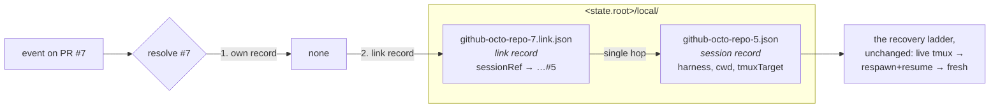

# Design: a link record beside the session record

> Phase 2 of 4. Derived from the locked [`bugfix.md`](bugfix.md). Ticket:
> [issue #172](https://github.com/MadaraUchiha-314/the-loop/issues/172).

## Architecture

**One new record type, one new resolution step, and one new write on a path that already
decided the answer.** No new component, no new configuration key, no schema change, no
change to how linkage is *derived*.

The registry gains a second kind of file. Session records stay exactly what they are — one
per work item that has a session. Link records sit beside them — one per ref that is
*delivered by* another ref's session:



The resolution is two reads of two known paths. Nothing scans, nothing is derived, nothing
asks GitHub.

### The choice: a link record, not a `linkedRefs` field

The ticket offers two shapes and leaves the choice open. **A separate link record is taken**;
the reasoning is recorded in [decision-064](../../decisions/decision-064.md), and the short
form is:

| Option | Verdict | Why |
|---|---|---|
| A — `linkedRefs: []` on the **issue's** session record | rejected | Lookup by PR becomes a reverse scan: to answer "which session owns PR #7?" the dispatcher must open every session file. It also puts the binding inside a record two ingresses already read-modify-write (`touch` fires on every delivered event), so a poll cycle and a webhook delivery racing on the same work item can drop a binding that was just added. |
| B — an alias file under the PR's own slug, `github-octo-repo-7.json` | rejected | It collides with the session-record namespace. A PR that later gets a session **of its own** (the supported case for non-GitHub ticketing — `webhook-triggers`, "the auto-execute label works on PRs directly") needs that exact filename, and `list_sessions` would have to tell two record types apart inside one name. |
| **C — a link record under a distinct suffix, `github-octo-repo-7.link.json`** | **taken** | Same file-per-key, atomic-write shape the registry already uses. The only writer of a given PR's file is a binding *for that PR*, so two ingresses working different work items never contend, and the worst a same-PR race can produce is the same record written twice — `os.replace` guarantees a reader never sees a partial one. The suffix is what keeps it out of the session-record namespace — see below. |

**Why the suffix is load-bearing.** `_REGISTRY_FILE_RE` is `[A-Za-z0-9._-]+-\d+\.json` — the
deliberate superset of what `_write` produces, so that a session record can never fail it
(issue-111). `github-octo-repo-7.link.json` does not match: it ends in `.link.json`, not
`-<number>.json`. So `list_sessions` ignores link records without being taught anything, the
"skipping unreadable registry file" warning never fires on one, and `reset --all`'s
enumeration is unaffected until it is *deliberately* extended (R4.3).

### Components and interfaces

Four files change. Two are the mechanism, one is where it is used, one is the reset path.

**`cli/the_loop/sessions/registry.py`** — the record and its five verbs.

```python
@dataclass
class SessionLink:
    """A durable binding from one work-item ref to the ref whose session owns it."""

    source: WorkItemRef          # the PR
    session_ref: WorkItemRef     # the work item whose session receives its events
    created_at: str = ""
    updated_at: str = ""

class SessionRegistry:
    def _link_path_for(self, item: WorkItemRef) -> Path:   # <slug>.link.json
    def link(self, source, target) -> Optional[SessionLink]:
        """Bind source → target. Idempotent: an unchanged binding is not rewritten."""
    def resolve_link(self, source) -> Optional[WorkItemRef]:
        """The bound target, or None. Single hop — never follows the target's own link."""
    def session_for(self, work_item) -> Optional[Session]:
        """The live session that owns this ref's events — record, then binding."""
    def unlink(self, source) -> bool:
    def links_to(self, target) -> List[SessionLink]:       # inbound, for reset
    def list_links(self) -> List[SessionLink]:
```

`link()` refuses a self-binding (R1.5) and returns `None` when the record already names the
same target, which is what makes R1.3 a property of the store rather than of every caller.

**`session_for` lives on the registry, not the dispatcher.** It is the question *both*
ingresses ask, and putting it anywhere else means the poller reaching through the dispatcher
for something the registry knows. There are four callers, and the fourth and fifth are the
reason this was not left as a private dispatcher helper:

| Caller | Why it resolves through the binding |
|---|---|
| `Dispatcher.handle`, the match loop | the delivery itself (R2.1) |
| `Dispatcher._live_session_for` | a control command commented on a PR (R2.7) |
| `Dispatcher.delivery_status` | poll-path retry accounting. The delivery id is recorded on the **bound** session's record, and the refs the poller asks about are the PR's — so asking the registry directly would report a *successful* delivery as `unhandled`, and the poller would re-forward the same comment until its retry budget was spent |
| `Poller._process_item`, `has_session` | first-sight detection. A PR whose linkage is no longer reported has only its own ref, so a direct lookup calls it session-less — which **baselines the entire existing thread as read** and arms a spawn against the PR, past a session that is still running. The more damaging half of the same defect |

**Deliberately *not* resolved through bindings:** `sessions pause|resume|stop|attach` and
`sessions reset` (`core/sessions.py`, `commands/sessions_cmd.py`, `reset.py`). Those name a
work item explicitly, and silently acting on a *different* one — "I asked to stop #16 and you
stopped #15" — is worse than making the operator name the item they meant.
`Dispatcher._dispatch_one` is not resolved either: its key is already a resolved session's
own ref.

**`cli/the_loop/webhook/router.py`** — one new pure function, so the dispatcher does not
re-implement repo/host parsing:

```python
def pr_work_item(event: str, payload: dict) -> Optional[WorkItemRef]:
    """The PR's **own** ref for an event that concerns one, else None."""
```

It composes the three private helpers the module already has (`_repo_parts`, `_host`,
`_pr_entity`), so the ref it returns is byte-identical to the one `extract_work_items` puts
last — the two cannot drift.

**`cli/the_loop/webhook/dispatcher.py`** — the resolver, the two write points, and the
control path.

```python
def _record_pr_binding(self, routed: RoutedEvent, target: WorkItemRef) -> None:
    """Persist PR → target when this event carries a PR that is not the target."""
```

Its three read sites swap `find_by_work_item` for `registry.session_for` (table above).
`_record_pr_binding` is called from two places, which are the two moments a routing decision
is actually made:

| Call site | When | Requirement |
|---|---|---|
| `handle()`, per matched session, before enqueue | an event was dispatched into an existing session | R1.1 |
| `_spawn_tmux()`, after `registry.register` succeeds | a session was spawned for the linked issue | R1.2 |

The spawn site is *after* registration on purpose: a binding to a session that failed to
spawn is a binding to nothing. Neither site is reached by a **close** event: `handle()`
returns from the close branch before the match loop's write, so a merging PR does not record
a binding on its way out.

**`cli/the_loop/poller/poller.py`** — one call site, `has_session`, per the table above.

**`cli/the_loop/reset.py`** — a fifth piece, `LINK`, removed between the session record and
the control section:

```python
PIECES = (WORKSPACE, SESSION, LINK, CONTROL, POLL)
```

`reset_work_item` removes the item's own link record and every link record naming it as
target; `work_items_with_state` adds link **sources** to its union, so `reset --all` reaches
a PR whose only state is a binding.

### Data models

One file, five fields, all of them derived from values the router already validated:

```json
{
  "ref": "github:octo/repo#7",
  "url": "https://github.com/octo/repo/issues/7",
  "sessionRef": "github:octo/repo#5",
  "createdAt": "2026-08-07T16:40:11Z",
  "updatedAt": "2026-08-07T16:40:11Z"
}
```

| Field | Meaning |
|---|---|
| `ref` | the bound work item — the PR. Also the file name's source, via `WorkItemRef.slug` |
| `url` | the same fact as a link, by the same derive-never-guess rule the portable record uses (absent when none can be derived) |
| `sessionRef` | the work item whose session receives this ref's events |
| `createdAt` / `updatedAt` | when the binding was first recorded, and when it last changed target |

`createdAt` is preserved across a re-point, so the record answers *"how long has this PR been
bound, and when did that last change?"* — which is the question an operator debugging a
mis-routed event actually has.

**Classification.** `GENERATED_PATHS` gains one entry, `attr="local_dir"`,
`default="<root>/local/<slug>.link.json"`, `portable=False`. It shares `local_dir` with the
session record, which the portability test permits (S2 accepts any default sitting under its
`attr`), and it is local for the same reason: it names a session handle on this machine, and
copied elsewhere it would point the new machine's routing at a session that is not there.

### Error handling

Every failure degrades to the pre-fix behaviour. That is the whole error policy, and it is
stated as a table because there are four independent failure points:

| Failure | Behaviour |
|---|---|
| the link record cannot be written (disk full, permissions) | logged at `warning`, `session.link_failed` emitted, **the dispatch proceeds** — a delivery is never lost because bookkeeping failed |
| the link record cannot be read or does not parse | treated as "no binding", logged at `debug`; derivation alone decides, exactly as today |
| `sessionRef` names a work item with no live session | `find_by_work_item` returns `None` → falls through to the spawn policy, exactly as today |
| `sessionRef` is itself a bound ref | not followed (single hop, R2.3); resolution ends there |

Nothing in this change can raise into a dispatch path. `resolve_link` catches
`OSError`/`ValueError` the way `_read` already does; `link` catches on write.

### Testing strategy

The reproduction in the ticket is a *sequence* — link present, then link absent — so the
proof has to be an integration test that drives two events through one dispatcher and asserts
on what the tmux runner was asked to do. That is `test_webhook_routing_integration.py`'s
existing shape (`FakeTmux.delivers` / `.spawns`), and it is where the regression test lives.
Unit tests cover the store's five verbs and the resolver's ordering; the fail-closed branches
get their own cases. Full matrix in [`testing-plan.md`](testing-plan.md).

## Security design

The requirements' threat model names five boundaries. Here is how each is enforced, in the
code rather than in prose:

| Boundary from `bugfix.md` | Enforcement |
|---|---|
| **Record content is never payload text** | Both ends are `WorkItemRef` objects the router constructed; `to_dict` writes `.ref` (a rendered form of validated fields) and `from_dict` re-parses through `WorkItemRef.parse`, which rejects anything that is not `<provider>:[<host>/]<owner>/<repo>#<number>`. A record hand-edited to hold a path or a shell fragment fails to parse and is treated as absent. |
| **The file name cannot escape the registry directory** | The name comes from `WorkItemRef.slug`, whose final step is `re.sub(r"[^A-Za-z0-9._-]+", "-", raw)` — no `/`, no `..`, no absolute path can survive it. This is the same sanitiser every session record's name goes through. |
| **Only the dispatcher creates bindings** | `_record_pr_binding` is called from `handle()` and `_spawn_tmux()`, both downstream of the self-comment marker check, the `authorizedUsers` guard, the auto-execute label and `requireStartCommand`. A binding can only name a session an event **already routed into** under those guards. |
| **No chain, no cycle** | `resolve_link` performs exactly one lookup and never recurses; `link` refuses `source == target`. There is no traversal to bound. |
| **Local, not portable** | Classified `portable=False` (R4.2), so it falls inside the existing `.the-loop/local/` ignore rule and cannot arrive by pull request. The "a tracked control section is an input" analysis in `docs/cli/state.md` does not extend to it. |

**Fail-closed, restated for the one case that matters:** a *missing* binding is safe (today's
behaviour). A *present* binding can only widen delivery to a session the same guards already
admitted. There is no state of this record that admits an event the un-fixed the-loop would
have refused.

## Alternatives considered

- **Cache the derivation instead of the decision.** Store `closingIssuesReferences` per PR
  and reuse it when `gh` fails. Rejected: it caches the *input*, so it still has to be
  invalidated, and it answers nothing when the panel link is deliberately removed — the
  ticket's own reproduction. The decision is the stable fact; the input is not.
- **Have the poller pass its linkage through to the registry.** Rejected: it fixes one
  ingress. The webhook path derives linkage from the PR body and head branch, and has the
  same failure (a body edit). The binding belongs where both ingresses meet, which is
  dispatch.
- **Prefer the binding over derivation outright (R2.5 inverted).** Rejected: it would make a
  deliberate re-link unactionable without a manual `sessions reset`, and it trades a loud
  failure (two sessions see one comment) for a silent one (the new issue's session never
  hears about its own PR).
- **Reap bindings when their target closes.** Rejected: a closed session is reopenable and
  respawnable, and the binding remains true. Removing it on close would lose the binding
  across exactly the close/reopen cycle it exists to survive. Removal is `sessions reset`'s
  job (R4.4).
