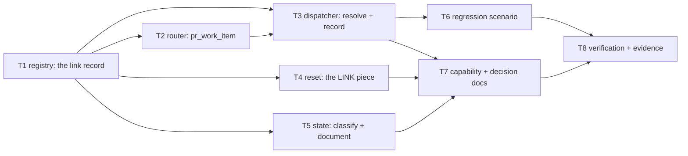

# Tasks: a link record beside the session record

> Phase 4 of 4. Derived from the locked [`design.md`](design.md) and
> [`testing-plan.md`](testing-plan.md) — each task's `_Test:_` names a row of the matrix.

## Task list

- [x] **T1 — the registry learns a second record type**
  `cli/the_loop/sessions/registry.py`: `SessionLink`, `_link_path_for`, and the five verbs
  `link` / `resolve_link` / `unlink` / `links_to` / `list_links`, exported from
  `sessions/__init__.py`. Atomic writes through the existing `_write`-shaped path; `link`
  refuses a self-binding and returns `None` when the record already names the same target;
  `resolve_link` is single-hop and swallows `OSError`/`ValueError` as "no binding". Add
  `session.linked`, `session.unlinked` and `session.link_failed` to `eventlog.EVENT_TYPES`.
  _Requirements: R1.3, R1.4, R1.5, R2.3, R4.1, R4.5_
  _Test: T1 (unit), T8 (abuse cases)_ — write the failing tests first.

- [x] **T2 — the router names a PR's own ref**
  `cli/the_loop/webhook/router.py`: `pr_work_item(event, payload)`, composed from
  `_repo_parts`, `_host` and `_pr_entity` so it cannot drift from the ref
  `extract_work_items` emits last. Returns `None` for an event that concerns no pull
  request.
  _Requirements: R1.1, R1.5_
  _Test: T1 (unit)_

- [x] **T3 — every ingress resolves through the binding, and dispatch records it**
  `SessionRegistry.session_for(item)` (own record, then stored binding) replaces the bare
  `find_by_work_item` at all four call sites that ask "which session owns this ref's
  events": `handle()`'s match loop, `_live_session_for`, `delivery_status` (poll-path retry
  accounting) and the poller's `has_session` (first-sight detection). The verbs that name a
  work item explicitly — `sessions pause|resume|stop|attach|reset` — are deliberately left
  direct. `Dispatcher._record_pr_binding(routed, target)` is called per matched session in
  `handle()` before enqueue, and in `_spawn_tmux()` **after** `registry.register` succeeds;
  a write failure logs and continues — the dispatch is never lost to bookkeeping.
  _Requirements: R1.1, R1.2, R2.1, R2.2, R2.4–R2.10, R3.1, R3.2_
  _Test: T2 (integration), T2b (poll path), T1 (resolver ordering)_

- [x] **T4 — `sessions reset` removes bindings in both directions**
  `cli/the_loop/reset.py`: a `LINK` piece between `SESSION` and `CONTROL`;
  `reset_work_item` removes the item's own record and every record naming it as target;
  `work_items_with_state` adds link sources to its union so `reset --all` reaches a PR whose
  only state is a binding. `close_session` is deliberately **not** touched.
  _Requirements: R4.3, R4.4_
  _Test: T10 (migration/upgrade)_

- [x] **T5 — classify the new path, and document it**
  `cli/the_loop/state.py`: a `GENERATED_PATHS` entry (`attr="local_dir"`,
  `<root>/local/<slug>.link.json`, `portable=False`) with the `why` the portability test
  requires. `docs/cli/state.md`: the classification table row, a record section describing
  the four fields and the "if you delete it" consequence, and the reset table row.
  _Requirements: R4.2_
  _Test: T10 (`test_state_portability.py` S1–S3)_

- [x] **T6 — the ticket's reproduction, as a test that fails without T3**
  `cli/tests/test_webhook_routing_integration.py`: a Gherkin-documented scenario driving
  two signed POSTs — the first carrying `Closes #<issue>`, the second carrying nothing —
  and asserting the second is delivered into the issue's session. Plus the
  binding-does-not-suppress case (R2.5), the control-command case (R2.7) and the close cases
  (R3.1, R3.2). On the poll path, `test_delivery_status_follows_a_binding` (R2.8) and
  `test_a_stored_binding_suppresses_presence_when_the_linkage_is_gone` (R2.9).
  _Requirements: R5.1, R5.2, R2.5, R2.7, R2.8, R2.9, R3.1, R3.2_
  _Test: T2, T2b_

- [x] **T7 — capability doc and decision record, in this PR**
  `docs/capabilities/webhook-triggers.md`: the durable-binding behaviour beside the
  linked-issue routing bullet it repairs, plus a history row.
  `docs/decisions/decision-064.md` (indexed in `decisions.md`): the three record shapes and
  why the separate link record won.
  _Requirements: R4.2, and the loop's own same-PR capability-docs rule_
  _Test: T11_

- [x] **T8 — execute the testing plan and commit the evidence**
  Run every activity in [`testing-plan.md`](testing-plan.md) § Verification activities,
  including the regression test against the un-fixed resolver. Record per-activity command,
  outcome and evidence under `evidence/`; tick each activity only once it has run.
  _Requirements: R5.1_
  _Test: T1, T2, T8, T10, T11_
