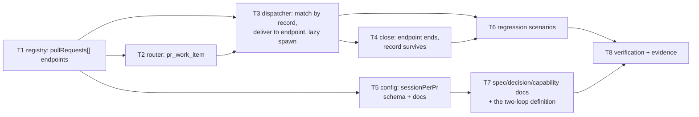

# Tasks: the work item's record owns its pull requests

> Phase 4 of 4. Derived from the locked [`design.md`](design.md) and
> [`testing-plan.md`](testing-plan.md) — each task's `_Test:_` names a row of the matrix.
> Revised with the design after owner review on
> [PR #173](https://github.com/MadaraUchiha-314/the-loop/pull/173); T1–T8 below are the
> rebuild's tasks (the link-record version's tasks are in this file's git history).

## Task list

- [x] **T1 — the registry learns endpoints**
  `cli/the_loop/sessions/registry.py`: `Session.pull_requests` (+ `endpoint_for`/`owns`,
  one-level nesting and per-entry degradation in `from_dict`, absent-key round-trip in
  `to_dict`), and the verbs `record_owning`, `session_for(ref, session_per_pr)`,
  `link_pull_request`, `save_endpoint`, `close_endpoint`, per-endpoint `touch`. Events
  `session.pr_linked` / `session.pr_spawned` / `session.pr_closed` /
  `session.link_failed` in `eventlog.EVENT_TYPES`.
  _Requirements: R1.1–R1.6, R2.3, R2.4, R4.3_
  _Test: T1 (unit), T8 (abuse cases)_

- [x] **T2 — the router names a PR's own ref**
  `cli/the_loop/webhook/router.py`: `pr_work_item(event, payload)`, composed from the same
  helpers `extract_work_items` uses so the recorded ref cannot drift from the routed one.
  _Requirements: R1.1, R1.5_
  _Test: T1 (unit)_

- [x] **T3 — the dispatcher matches by record and delivers to the endpoint**
  `cli/the_loop/webhook/dispatcher.py`: `handle()` matches via `record_owning`;
  `_record_pr_binding` records the PR on each matched record (never on close);
  `_endpoint_for` picks the conversation per `sessionPerPr`; `_spawn_endpoint` gives a
  recorded PR its session lazily (no graph entry — R2.9) with fallback to the record;
  `_dispatch_one` delivers per endpoint with per-endpoint dedup and touch; respawn goes
  through `save_endpoint`. Poll path: `delivery_status` and `has_session` resolve through
  the record.
  _Requirements: R1.1, R1.2, R2.1–R2.9_
  _Test: T2 (integration), T2b (poll path), T1 (resolver ordering)_

- [x] **T4 — a PR closing ends its endpoint, not the record**
  The close branch: a closed object that is a recorded PR of a still-open record →
  `close_endpoint` + tmux teardown for that endpoint (`session.pr_closed`), record kept
  (`session.kept_open`). A PR with its own record still auto-closes.
  _Requirements: R3.1, R3.2_
  _Test: T2_

- [x] **T5 — `routing.tmux.sessionPerPr`, declared and documented**
  `.the-loop/cli-config.schema.json` (+ `TmuxConfig.session_per_pr`, default true) and
  `docs/config/cli/routing-options.md`. Sensitive path (`**/*schema*`): flagged for the
  owner's sign-off on the PR.
  _Requirements: R2.1, R2.2_
  _Test: T10 (docs parity P3/P4, `validate_config.py`)_

- [x] **T6 — the ticket's reproduction, as tests that fail without T3**
  Seven Gherkin-documented scenarios across
  `test_webhook_routing_integration.py`/`test_poller.py`: the linkage-removed sequence,
  both recording paths, the re-link both-records case, control-command resolution, both
  close cases, and the poll-path pair. All seven fail against a pre-fix resolver.
  _Requirements: R5.1, R5.2_
  _Test: T2, T2b_

- [x] **T7 — the paper trail, and the two-loop definition**
  `decision-064` rewritten (the reversal recorded, not erased); spec chain revised;
  `docs/capabilities/webhook-triggers.md` clause + history row;
  `docs/cli/state.md` session-record section. The **inner/outer-loop** definition the
  owner asked for: outer loop = the work item's PDLC graph (unchanged, keyed to the work
  item); inner loop = a PR's sub-graph running in its endpoint, defined as follow-up —
  this change ships the substrate and the boundary (a PR endpoint has no graph).
  _Requirements: R2.9, R4.1, R4.2, and the loop's same-PR capability-docs rule_
  _Test: T11_

- [x] **T8 — execute the testing plan and commit the evidence**
  Every activity in [`testing-plan.md`](testing-plan.md) § Verification activities,
  including the seven-test negative run and the re-captured reproduction.
  _Requirements: R5.1_
  _Test: T1, T2, T2b, T8, T10, T11_
