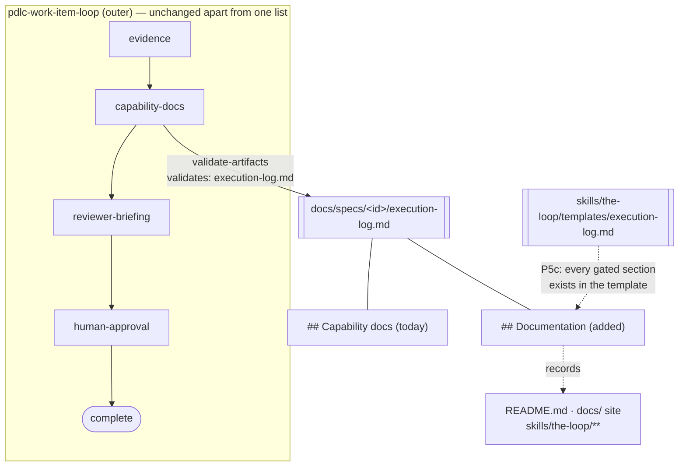

# Design: the public docs describe two loops, and describing them becomes a gate

> Phase 2 of 3 (requirements → design → tasks). Derives from the approved
> requirements. MUST be reviewed and approved before moving to tasks breakdown.

## Overview

**Two changes, one principle: the docs describe the graph, and the graph makes them.**

The first is editorial — `README.md` is rewritten around the graph, the two loops and the
CLI, and the site's three entry pages are brought up to the same standard. The second is
structural — `## Documentation` joins `## Capability docs` on the outer loop's
`capability-docs` node, so the editorial work has a gate behind it and the next process
change cannot ship without it.

The structural half deliberately reuses the machinery issue-167 already built rather than
adding any. `validate-artifacts` already reads `execution-log.md` for six nodes and already
checks a list of required headings; `sections:` is a list, so this is one more element in
it, plus one more heading in the bundled template so P5c holds. No hook changes, no runtime
changes, no schema changes.

## Architecture



Three files carry the whole structural change:

| File | Change | Why it is the right place |
|------|--------|---------------------------|
| `cli/the_loop/graph/pdlc-work-item-loop.yaml` | `sections: ["Capability docs", "Documentation"]` on `capability-docs` | The gate is a property of the node, declared as data — the graph *is* the process |
| `skills/the-loop/templates/execution-log.md` | a `## Documentation` section | P5c requires every gated section to exist in the artifact's bundled template |
| `skills/the-loop/SKILL.md` + `reference/workflow.md` | the rule, and the ready-to-ship gate item | The prose renders the graph; it never redefines it |

The inner `pdlc-pr-loop` is untouched. It has no `capability-docs` node, and R4.5 says it
should not grow one: a work item's documentation is decided once, at the outer level, for
the same reason its requirements are.

## Components & interfaces

### The rewritten README

Its contract is the *first* thing a reader learns, so the order of the sections is the
design. The chosen order, and what each part must carry:

1. **What it is** — one paragraph: an executable PDLC graph, driven by a CLI daemon that
   turns ticket and PR activity into agent sessions. The word "plugin" does not appear
   before the graph does.
2. **The two loops** — the outer loop's phase sequence, the inner loop's shorter one, and
   the `await-inner-loops` seam, drawn as a mermaid diagram (`writingStyle.diagramFirst`:
   two loops, a seam and a state directory is well past three named parts).
3. **The artifact chain** — the four artifacts in order, one line each, with
   `testing-plan.md`'s role stated rather than listed.
4. **The CLI** — the daemon verbs and the graph verbs, with a link to the site's CLI
   section.
5. **The plugins** — Claude Code and Cursor, two short install snippets, linked onward.
   Present, and no longer first.
6. **Working on the-loop** — the quality gates, in the four lines a contributor needs.
7. **Links out** — the site, feedback, licence.

Everything the site documents in full is a link, not a copy (R2.1). Concretely, these go:
the per-command tables (the site's `/reference/commands` and `/cli/commands/` carry them),
the install matrix beyond two snippets, the repository-layout tree (`/guide/how-it-works`),
the rules list (`/guide/what-is-the-loop`), and the v0-status and roadmap blocks — an
eight-major-version project describing itself as "v0 foundation" is the same drift this
work item exists to fix.

The workflow SVG stays. It is the one asset the site cannot substitute for at a glance, and
it renders on GitHub where the mermaid diagram of the two loops also renders.

### The site's entry pages

| Page | What changes |
|------|--------------|
| `docs/index.md` | The hero tagline leads with the graph; the four feature cards become: two loops · the graph is executable · the CLI · gated, reviewed, documented |
| `docs/guide/what-is-the-loop.md` | The one-line loop becomes the two loops with their sequences; the v0 status block goes; the artifact chain gains `testing-plan.md`; the rules list gains the documentation rule |
| `docs/guide/how-it-works.md` | Gains a "the process is data" paragraph naming both graph YAMLs and `the-loop graph`; the layout tree gains `cli/the_loop/graph/`, `docs/api-specs/`, `docs/capabilities/`, `testing-plan.md` and `evidence/` |

### The gate

```yaml
- id: capability-docs
  actor: agent
  stage: capability-docs
  entry: [log-entry, deliver-assignment]
  exit:
    - hook: validate-artifacts
      with:
        validates: execution-log.md
        sections: ["Capability docs", "Documentation"]
```

The node keeps its id, its stage and its phase. Renaming it to `documentation` was
considered and rejected: `stage: capability-docs` is a key in every operator's
`tokenEconomy.modelRouting.stages` and `thinkingEffort.stages` map, and a rename would
silently drop those routings on upgrade for a cosmetic gain.

### The regenerated workflow diagram (R5)

`docs/assets/the-loop-workflow.svg` was drawn by issue-150 against the process as it stood
then: one loop, three spec artifacts, no `test-planning` and no `verification`. Its own alt
text listed *"brainstorm.md, requirements.md, design.md, tasks.md"*. It is replaced, not
patched.

**The layout is the argument.** The three bands share one left edge and one width, and the
inner loop's boxes sit in the same columns as the outer loop's:

| Column | Outer (`pdlc-work-item-loop`) | Inner (`pdlc-pr-loop`) |
|--------|-------------------------------|------------------------|
| 1 | `implementation` | `implementation` (this PR's slice) |
| 2 | `verification` (across all PRs) | `verification` (this component) |
| 3 | self · critic · security · **evidence · capability-docs** · briefing | self · critic · security · briefing |
| 4 | human approval → `complete` | PR review → `complete` |

Read down a column and the owner's own description of the inner loop — *"basically the
same loop but with some steps skipped"* — is visible rather than asserted, including
**which** steps: everything above `implementation`, plus `evidence` and `capability-docs`,
which `pdlc-pr-loop.yaml` does not declare.

Production, and why each piece is the way it is:

- **Geometry is computed, not hand-placed** (R5.6). A generator
  (`evidence/diagram/generate-scene.py`) emits the `.excalidraw` JSON from a table of
  boxes; text is centred from measured Virgil metrics (`0.458 × fontSize` per character,
  derived from the issue-150 scene's own label offsets, so both scenes agree). Committing
  it makes the next regeneration a command. The diagram going stale was partly a cost
  problem: reproducing it meant re-deriving it.
- **Export is Excalidraw's own `exportToSvg`**, run in headless Chromium with
  `exportEmbedScene: true` — the same route issue-150 used, so the SVG round-trips back
  into excalidraw.com (R5.5). The exporter tooling stays in the scratchpad; only the two
  artifacts and the generator enter the repository.
- **The font is inlined afterwards** (R5.4). `exportToSvg` emits `@font-face` rules
  pointing at asset paths, which resolve to nothing on GitHub — the hand-drawn look would
  silently degrade to a system font. The build substitutes the Virgil `woff2` shipped in
  the same package as a `base64` data URI and drops the two unused faces (Cascadia,
  Assistant), leaving one self-contained rule.
- **One diagram, not two** (R5.3). The mermaid two-loop block this PR had added to the
  README is removed; the SVG replaces it in place, high on the page. The site's
  `what-is-the-loop.md` keeps its mermaid — `userInteraction.diagramFormat: mermaid` is the
  standing rule and issue-150's exception was scoped to the README hero image. That leaves
  two renderings of one process, which is a divergence risk this work item is otherwise
  arguing against; it is **raised for the reviewer** rather than settled unilaterally.

## Data models

None added. `sections:` is already `list[str]` in the hook's parameters, and
`execution-log.md` has no front-matter change — it stays `status: in-progress | complete`,
never `approved`, so no `locked:` check applies to the new section any more than to the old
ones.

## Error handling

- **An execution log without `## Documentation` blocks the node**, naming the file and the
  section, exactly as a missing `## Capability docs` does today. That is the intended
  failure and R4's whole point.
- **In-flight work items.** Any work item whose log predates this change fails
  `capability-docs` the next time it runs. This is stated rather than mitigated: the fix is
  to add the section — one heading and one sentence — which is precisely the work the gate
  is asking for. the-loop has one in-flight work item (this one) and its log carries the
  section from the start. Automatic backfill was rejected: a hook that writes the section
  it is about to check would report success without running, which is the defect issue-167
  was raised to remove.
- **A structural check is not a quality check.** A `## Documentation` heading holding
  placeholder text passes. `docs/capabilities/process-graph.md` already states this limit
  for every section gate; this design adds no exception to it and claims no more than the
  mechanism delivers.

## Security design

- **AuthN/AuthZ:** unchanged. The gate reads a checked-in file in the work item's own spec
  directory; no author is trusted or distrusted differently than before.
- **Input validation & injection surfaces:** none added. `validate-artifacts` matches
  headings structurally in a file it already opens for five other sections. No new ingress,
  no new parser, no shell, no network.
- **Secrets handling:** unchanged, and the rule the new section must not weaken is restated
  where an author will meet it — the docs tree is as public as the repository, so a
  `## Documentation` row names a document, never a credential, a token or an internal
  hostname.
- **Least privilege:** unchanged; the hook runs with the same filesystem read the node
  already performs.
- **Fail-closed behaviour:** an absent section blocks (R4's fail-closed criterion); an
  unreadable artifact blocks non-retriably by the rule decision-063 already set. Neither
  path is new code.
- **Abuse-case coverage:**
  - *Placeholder text passes the structural check* → mechanism: none claimed; the limit is
    documented in the capability doc and the human reviewer is the judge. The negative test
    asserted instead is the one that matters mechanically — an execution log **missing** the
    section does not pass (`test_p5c…` plus the graph-parity assertions over both loops).
  - *Secrets pasted into a public doc* → mechanism: the existing redaction rule, restated in
    the template's section preamble.

## Testing strategy

The structural half is proved by the parity suite that already exists: P5c asserts every
section a node gates exists in that artifact's bundled template, so adding `Documentation`
to the graph without adding it to the template is a red build — the assertion is the test,
and it runs over **both** shipped loops (issue-172's `test_graph_parity.py`). P5a and P5b
continue to hold unchanged, and P4's phase-sequence parity proves the README's and the
site's phase lists against the graph the moment they are copied from it.

The editorial half is proved by `markdownlint` over every changed file and by inspection of
each added link and anchor — the site's `ignoreDeadLinks: true` means the build cannot do
it (`docs/capabilities/documentation.md`). No new test file is added: a test asserting
prose says a particular thing would pin wording rather than behaviour, and the parity suite
already pins the two facts that are mechanically checkable (the phase sequence and the
gated sections).

The executable detail is in `testing-plan.md`.

## Trade-offs & decisions

| Decision | Alternative rejected | Why |
|----------|---------------------|-----|
| Extend `capability-docs`'s `sections:` | A new `documentation` node | A node costs an edge, a stage key, a phase question and a place in both loops' entry chains, to gate one heading in a file another node already reads |
| Keep the node id and stage | Rename to `documentation` | `stage:` is a public key in operators' model-routing and thinking-effort maps; a rename drops their configuration silently |
| One new section, not a rewrite of `## Capability docs` | Widen the existing section's meaning | Capability docs and user-facing docs are different audiences with different failure modes; folding them into one row loses which of the two was skipped |
| README delegates; the site is the manual | Keep the README comprehensive | Two copies of a fact is one copy that rots. R2 is the owner's instruction and this is how it is honoured |
| Drop the "v0 foundation" and roadmap blocks | Update them | The repository is at v8.0.0 and the roadmap's four items have all shipped or moved to issues; a status block that must be re-approved every release is the drift generator, not the cure |
| No new test file | A docs-freshness test | It would pin wording, not behaviour; what is mechanically checkable (phases, gated sections) is already pinned by P4/P5 |

Durable enough to record: **decision-066** — user-facing documentation is a completion
gate, and the gate rides the node that already reads the execution log.

## Open questions

None.

## Review comments

> Appended by the-loop's `record-feedback` hook when a human gate approves with
> comments (issue-109). Append-only and attributed.
