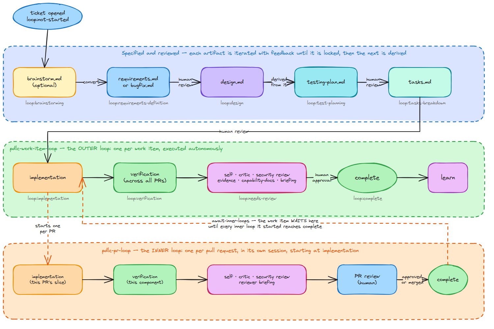

# Evidence — the workflow diagram (issue-174, R5 / T13)

Testing-plan row **T13**, added at PR review when the owner's two comments on #175 produced
R5. Three things are proved here: the diagram shows the process the shipped graphs declare,
the SVG is self-contained and script-free, and both artifacts round-trip into Excalidraw.

## What was wrong

The committed SVG was the issue-150 scene, drawn before `testing-plan.md` existed and
before the PDLC split in two. Its own text, extracted from the file:

```console
$ python3 -c "extract text nodes from docs/assets/the-loop-workflow.svg"
'brainstorm.md'  'requirements.md'  'design.md'  'tasks.md'
'loop:not-started' 'loop:brainstorming' 'loop:requirements-definition' 'loop:design'
'loop:tasks-breakdown' 'loop:implementation' 'loop:needs-review' 'loop:complete'
'implement' '+ self-check' 'self / critic review' 'evidence' 'complete' 'learn'
```

No `testing-plan.md`, no `loop:test-planning`, no `loop:verification`, no second loop. The
README's own alt text listed the same four artifacts. Every one of those omissions is a
thing this PR's prose was adding two paragraphs above the picture.

## The rendered result



Rendered from the committed `docs/assets/the-loop-workflow.svg` in headless Chromium at
1500×1000 (`preview.html` wraps the SVG inline; a `file://` `` is blocked by origin
policy, which is why the SVG is inlined rather than referenced).

## R5.1, R5.2 — the diagram against the shipped graphs

Read column by column, the inner loop sits under the outer one. That alignment is the
claim: *"basically the same loop but with some steps skipped"* — and it shows **which**.

| Column | `pdlc-work-item-loop` (outer) | `pdlc-pr-loop` (inner) | Agrees with the YAML? |
|--------|-------------------------------|------------------------|----------------------|
| 1 | `implementation` | `implementation` | ✅ inner `start: implementation` |
| 2 | `verification` (across all PRs) | `verification` (this component) | ✅ |
| 3 | self · critic · security · **evidence · capability-docs** · briefing | self · critic · security · briefing | ✅ inner declares no `evidence`, no `capability-docs` |
| 4 | `human-approval` → `complete` | `pr-approval` → `complete` | ✅ |

Everything above `implementation` — brainstorming, requirements, design, test-planning,
tasks-breakdown and their approvals — appears **only** in the spec band, which is exactly
`pdlc-pr-loop.yaml`'s stated reason for skipping them ("those are the work item's, decided
once at the outer level").

The seam is drawn as the two dashed arrows the runtime actually implements: the outer
`implementation` **starts one inner loop per PR**, and `await-inner-loops` holds the work
item at `implementation` until every started inner loop reaches `complete`.

Spec-band content against `workflow.phases` and the outer YAML: `brainstorm.md` (optional)
→ `requirements.md`/`bugfix.md` → `design.md` → `testing-plan.md` → `tasks.md`, carrying
`loop:brainstorming`, `loop:requirements-definition`, `loop:design`, `loop:test-planning`,
`loop:tasks-breakdown`. The two human gates are drawn where the graph puts them —
`requirements-approval` between requirements and design, and `design-approval` **after**
`test-planning`, which is what makes one approval cover the design and the plan derived
from it.

## R5.3 — one diagram, not two

The mermaid two-loop block this PR had added to the README is removed; the SVG stands in
its place, above the phase list. `grep -c '```mermaid' README.md` → `0`.

## R5.7 — the site embeds the same SVG, not a twin

Raised in the PR thread and answered by the owner (*"Can we use excalidraw for all diagrams
on the doc site as well?"*): `docs/guide/what-is-the-loop.md` no longer carries its own
mermaid rendering of the two loops. It embeds the **same** file. One drawing, one source —
a twin that starts accurate does not stay that way, which is this work item's whole thesis.

`ignoreDeadLinks: true` means the build does not police links, so the shared asset was
proved with a real build rather than by inspection:

```console
$ cd docs && bun install && bun run docs:build
docs: synced skills/the-loop/reference/ -> docs/operating-model/reference/
  vitepress v1.6.4
✓ building client + server bundles...
✓ rendering pages...
build complete in 46.33s.

$ ls docs/.vitepress/dist/assets/*.svg
docs/.vitepress/dist/assets/the-loop-workflow.DmLEvmbr.svg

$ grep -o 'src="[^"]*the-loop-workflow[^"]*"' docs/.vitepress/dist/guide/what-is-the-loop.html
src="/the-loop/assets/the-loop-workflow.DmLEvmbr.svg"
```

The emitted asset is the full 143 002 bytes — the self-contained file, font and all — and
the built page references it under the site's `/the-loop/` base path. A relative
`../assets/…` reference from a guide page therefore resolves correctly once deployed.

**Still mermaid, and deliberately so:** four authored site pages (`cli/index.md`,
`cli/concepts.md`, `cli/getting-started.md`, `config/index.md`) and 117 harness-produced
diagrams under `docs/specs/`, `docs/decisions/` and `docs/capabilities/`. Converting those
is a separate work item with a real design question in it — `cli/getting-started.md` is a
**sequence diagram**, a shape Excalidraw has no primitive for — and a `diagramFormat` rule
change that would put a headless-Chromium export in the path of every agent that draws a
picture mid-task. Raised in the PR thread with those costs named.

## R5.4, R5.5 — self-contained, script-free, round-trips

```console
$ grep -ci "<script\|onload=\|onclick=\|javascript:" docs/assets/the-loop-workflow.svg
0
$ grep -o 'https\?://[a-zA-Z0-9./@_-]*' docs/assets/the-loop-workflow.svg | sort -u
http://www.w3.org/2000/svg
$ grep -c "url(data:font/woff2" docs/assets/the-loop-workflow.svg
1
$ grep -c "payload-type:application/vnd.excalidraw+json" docs/assets/the-loop-workflow.svg
1
$ python3 -c "import json; d=json.load(open('docs/assets/the-loop-workflow.excalidraw')); \
    print('elements:', len(d['elements']), '| type:', d['type'])"
elements: 72 | type: excalidraw
```

The only URL is the SVG namespace declaration; the sole `@font-face` carries Virgil inline
as a `base64` data URI. This mattered more than it looks: `exportToSvg` emits `@font-face`
rules pointing at *asset paths*, which resolve to nothing on GitHub — the hand-drawn look
would have silently degraded to a system font, and nothing would have failed. The Virgil
`woff2` is taken from the same `@excalidraw/excalidraw` package that did the export, and
the two unused faces (Cascadia, Assistant) are dropped.

`payload-type:application/vnd.excalidraw+json` is the embedded scene: the **SVG itself**
re-opens on excalidraw.com, as does the `.excalidraw` source beside it.

## R5.6 — the generator is committed

[`diagram/generate-scene.py`](diagram/generate-scene.py) computes the scene from a table of
boxes rather than placing them by hand: one shared left edge and width per band, one row
height, so the columns line up by construction instead of by eye. Text is centred from
Virgil metrics measured off the issue-150 scene (`0.458 × fontSize` per character), so both
scenes agree on how a label sits inside a box.

It is committed because the staleness this row exists to fix was partly a cost problem —
regenerating the diagram meant re-deriving it. Running the generator plus the export step
is now the whole job. The export tooling itself (headless Chromium and the
`@excalidraw/excalidraw` package) stays in the scratchpad, per issue-150: only the two
artifacts and the generator enter the repository.

## What this row does not prove

That the diagram is *legible* or well-composed. Node-for-node agreement with the YAML is
mechanical and checked above; whether the picture reads well at a glance is the reviewer's
call, which is why the rendered PNG is committed rather than described.
