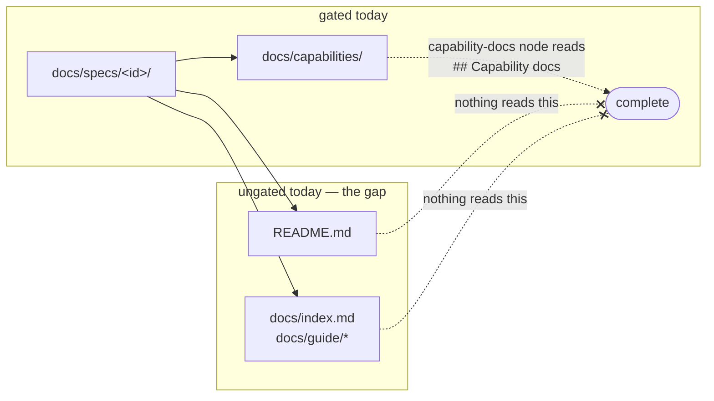

# Requirements: the public docs describe two loops, and describing them becomes a gate

> Phase 1 of 3 (requirements → design → tasks). Following the Kiro spec approach
> (<https://kiro.dev/docs/specs/>). This phase MUST be reviewed and approved by the
> required collaborators before moving to design.

## Introduction

**the-loop's front door describes a product that no longer exists.** `README.md` and the
first three pages of the documentation site say the-loop is a Claude Code / Cursor plugin
running *one* loop over a *3-phase* spec. Since then the-loop has become an executable
process graph driven by a Python CLI daemon, the spec chain grew a fourth artifact
(`testing-plan.md`), and issue-172 split the process into **two** loops — an outer
`pdlc-work-item-loop` per work item and an inner `pdlc-pr-loop` per pull request. None of
that reaches a reader who has not read the source.

The drift is not an accident of this one release; it is what happens when nothing gates
it. `docs/capabilities/` is kept current because the `capability-docs` node reads the
execution log's `## Capability docs` section before a work item can complete. The README
and the site are gated by nothing, so issue-172 shipped a breaking change to the process
itself and left the front page describing the process it replaced.

Ticket: [#174](https://github.com/MadaraUchiha-314/the-loop/issues/174).

## Requirements

### Requirement 1 — the README says what the-loop is now

**User story:** As someone who has just found the repository, I want the README to describe
the product the-loop actually is, so that I am not learning a superseded model I have to
unlearn from the source.

#### Acceptance criteria (EARS)

1. WHEN a reader opens `README.md` THEN it SHALL present the-loop as an **executable
   process graph** driven by the `the-loop` CLI, of which the Claude Code and Cursor
   plugins are one delivery surface rather than the headline.
2. WHEN the README names the process THEN it SHALL name **both** shipped loops — the outer
   `pdlc-work-item-loop` (per work item) and the inner `pdlc-pr-loop` (per pull request) —
   and SHALL state the single seam between them: the outer `implementation` node waits at
   `await-inner-loops` until every started inner loop reaches `complete`.
3. WHEN the README lists the artifact chain THEN it SHALL list all four spec artifacts in
   order — `requirements.md` (or `bugfix.md`) → `design.md` → `testing-plan.md` →
   `tasks.md` — and SHALL name `testing-plan.md`'s role: the work item's proof, planned
   before the task DAG that references its rows and completed at `verification`.
4. WHEN the README states the phase sequence THEN it SHALL match the sequence the shipped
   graph declares (`cli/the_loop/graph/pdlc-work-item-loop.yaml`), which is the same
   sequence `workflow.phases` carries.

### Requirement 2 — the README is minimal and delegates to the site

**User story:** As a maintainer, I want the README to be short and to hand off to the
documentation site, so that there is one place a fact can rot instead of two.

#### Acceptance criteria (EARS)

1. WHEN the README covers a topic that the site documents in full — installation, the
   command reference, the CLI's command-by-command pages, the configuration reference,
   the operating model — THEN it SHALL summarise in at most a few lines and **link the
   site page**, rather than restating the site's content.
2. WHEN the README is compared with its predecessor THEN it SHALL be **shorter**, and
   SHALL NOT carry the per-command tables, the full install matrix, the repository-layout
   tree or the rules list that the site already publishes.
3. IF a link in the README points at documentation THEN it SHALL point at the published
   site (`https://madarauchiha-314.github.io/the-loop/…`) rather than at a repository path,
   except for links to source the site does not render (`LICENSE`, graph YAML, the skill).
4. WHEN a reader finishes the README THEN it SHALL have offered an explicit next step into
   the site.

### Requirement 3 — the site's entry pages describe both loops

**User story:** As a reader following the README's hand-off, I want the site's own entry
pages to be current, so that delegating from the README does not delegate to a stale page.

#### Acceptance criteria (EARS)

1. WHEN a reader opens the site home page (`docs/index.md`) or **What is the-loop?**
   (`docs/guide/what-is-the-loop.md`) THEN those pages SHALL describe the two loops, the
   four-artifact spec chain and the graph, to the same standard R1 sets for the README.
2. WHEN a reader opens **How it works** (`docs/guide/how-it-works.md`) THEN it SHALL name
   the shipped graph definitions as the source of truth for the process, and its
   repository-layout listing SHALL include the directories added since it was written.
3. IF a site page states the phase sequence or the artifact chain THEN it SHALL agree with
   the shipped graph, by the same test as R1.4.

### Requirement 4 — updating the user-facing docs is a completion gate

**User story:** As the owner, I want "the docs, including the README, are updated" to be
part of finishing a work item, so that the next process change cannot leave the front page
describing the previous one.

#### Acceptance criteria (EARS)

1. WHEN a work item reaches the ready-to-ship gate THEN the gate SHALL include that the
   **user-facing documentation affected by the change** — `README.md`, the documentation
   site under `docs/`, and the operating-model skill and its references — has been updated
   **in the same PR**, alongside the capability-docs item already there.
2. WHEN a work item's execution log is written THEN it SHALL carry a `## Documentation`
   section recording which user-facing documents the work item changed, and the
   `capability-docs` node of the outer loop SHALL validate that section's presence in
   addition to `## Capability docs`.
3. IF a work item genuinely changes no user-facing documentation THEN it SHALL record that
   in the `## Documentation` section **with the reason**, and the section SHALL NOT be
   deleted to shorten the log.
4. WHEN the bundled `execution-log.md` template is rendered THEN it SHALL offer the
   `## Documentation` section, so that a log authored from the template satisfies the gate
   the graph declares (the P5c parity assertion).
5. WHILE the inner `pdlc-pr-loop` is running the documentation gate SHALL NOT be duplicated
   into it: the inner loop declares no `capability-docs` node, and the documentation of a
   work item is decided once, at the outer level.

### Requirement 5 — the README's diagram shows the process that exists

> Added during PR review (#175). The owner asked two questions on the README —
> *"Why do we still have an outdated excalidraw diagram??"* and, on the two-loop mermaid
> block, *"Can't we use excalidraw??"* — which together name a gap R1 had missed: R1.2
> governed the README's **prose**, and the diagram beside it was still the issue-150 scene
> drawn before `testing-plan.md` and before the split into two loops.

**User story:** As a reader who looks at the picture before reading a word, I want the
diagram to be the current process, so that the most glanceable thing on the page is not
also the most wrong.

#### Acceptance criteria (EARS)

1. WHEN a reader looks at the README's diagram THEN it SHALL show **both** loops, the
   four-artifact spec chain including `testing-plan.md`, and the `await-inner-loops` seam —
   the same content R1.2 and R1.3 require of the prose.
2. WHEN the diagram shows the inner loop THEN it SHALL start at `implementation`, because
   that is the `start:` node `pdlc-pr-loop.yaml` declares, and SHALL NOT show the
   `evidence` or `capability-docs` nodes, which the inner loop does not have.
3. WHEN the diagram is authored THEN it SHALL be an **Excalidraw** scene, per the owner's
   request and the precedent [issue-150](../issue-150/) set for the README hero image (a
   tier 1–2 change, so it carries no decision record) — not a mermaid block. The README
   SHALL carry **one** diagram, not both.
4. WHEN the exported SVG is committed THEN it SHALL be **self-contained**: the Virgil font
   embedded as a data URI, no external URL, and no scripting construct (`<script>`,
   `on*=`, `javascript:`) — the fail-closed grep issue-150 established.
5. WHEN the SVG is committed THEN the `.excalidraw` scene SHALL be committed beside it and
   the SVG SHALL embed the scene payload, so both re-open on excalidraw.com for editing.
6. WHEN the diagram's geometry is produced THEN it SHALL be **computed by a committed
   generator** rather than hand-placed, so the next regeneration is a command rather than a
   re-derivation — the diagram went stale in part because reproducing it was work.
7. WHEN the documentation site shows the same two loops THEN it SHALL embed the **same**
   SVG rather than maintaining a second rendering. One drawing, one source: two copies of
   one process is the divergence this work item exists to remove, and a twin that starts
   accurate does not stay that way.

## Non-functional requirements

- **Rendering.** Every changed page MUST pass `markdownlint` and MUST respect the site's
  rendering constraints recorded in `docs/capabilities/documentation.md`: no raw HTML, no
  em dash in a heading, same-page fragment links target dot-free `##` headings.
- **No link rot.** `ignoreDeadLinks: true` means the VitePress build does not catch a
  broken internal link, so every link this work item adds or edits MUST be checked by
  path/anchor inspection rather than by the build.
- **Backwards compatibility of the gate.** Adding a required section to a gated artifact
  makes every execution log that predates it fail the node. The design MUST state what
  happens to in-flight work items and MUST NOT leave the answer implicit.

## Security considerations

- **Actors & trust:** readers of a public README and a public documentation site; agents
  reading the bundled skill and the shipped graph. The only actor whose input this work
  item newly *reads* is the agent authoring an execution log, whose text was already read
  by five sibling gates.
- **Trust boundaries & data:** none crossed. The change edits checked-in markdown, one
  bundled template and one node's declared `sections:` list. No new ingress, no new
  network call, no new parsing of untrusted input: `validate-artifacts` performs the same
  structural heading check on the same file it already reads for `## Capability docs`.
- **Abuse cases (EARS):**
  1. WHEN an agent authors an execution log with a `## Documentation` heading holding
     placeholder text THEN the system SHALL pass the structural check and SHALL rely on
     the human reviewer for the judgement — the same, deliberately stated, limit
     `docs/capabilities/process-graph.md` already records for every section check.
  2. WHEN documentation text tempts an author to paste a token, an internal hostname or a
     credential into a public page THEN the system SHALL keep the existing rule that the
     evidence and docs trees are as public as the repository, and such content SHALL NOT
     be committed.
- **Fail closed:** an execution log missing the `## Documentation` section SHALL block the
  `capability-docs` node rather than pass it — identical to the treatment of an absent
  `## Capability docs` section, and the reason issue-167 introduced `validates:` in the
  first place.

## Out of scope

- Rewriting the whole documentation site. Only the three entry pages named in R3, plus the
  capability docs this change touches, are in scope; the CLI, config and reference
  sections are already current.
- Adding a `pdlc-project-management-loop`. The naming anticipates a third loop; shipping
  one is not this work item.
- Any mechanical link checker or docs-freshness test beyond the parity assertions that
  already exist. R4 makes the gate a *declared* one; automating "is this README sentence
  still true" is not attempted.
- Changing the plugin manifests, the install routes, or anything else the README merely
  describes. This work item changes descriptions, not the things described — the one
  exception being the gate R4 adds.

## Open questions

None. The issue body states the owner's requirements directly, and every choice this work
item makes below it is a design decision recorded in `design.md`.

## Review comments

> Appended by the-loop's `record-feedback` hook when a human gate approves with
> comments (issue-109). Append-only and attributed.
