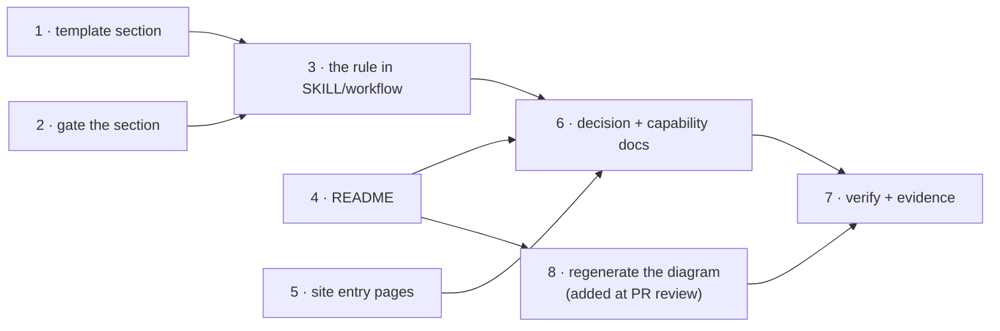

# Tasks: the public docs describe two loops, and describing them becomes a gate

> The last spec artifact (requirements → design → testing plan → tasks). A DAG of
> implementation tasks derived from the approved design and testing plan.

## Task list

- [x] 1. Add the `## Documentation` section to the bundled execution-log template
  - `skills/the-loop/templates/execution-log.md` gains the section after
    `## Capability docs`, with the preamble stating what it records, that "none — and why"
    is a valid entry, that the section is never deleted to shorten the log, and that a row
    names a document and never a credential
  - _Depends on:_ none
  - _Requirements:_ R4.2, R4.3, R4.4
  - _Test:_ `T1 — uv run --project cli pytest cli/tests/test_graph_parity.py -k p5c -v`
    (red→green: gate first in task 2 would invert the order, so this task's red is
    task 2's — see Checkpoints)

- [x] 2. Gate the section on the outer loop's `capability-docs` node
  - `cli/the_loop/graph/pdlc-work-item-loop.yaml`: `sections: ["Capability docs",
    "Documentation"]`, with a comment naming issue-174. The inner `pdlc-pr-loop` is
    deliberately not changed (R4.5)
  - _Depends on:_ none (task 1 and task 2 are the two halves of one red→green pair)
  - _Requirements:_ R4.2, R4.5
  - _Test:_ `T1 — uv run --project cli pytest cli/tests/test_graph_parity.py -v` (red with
    task 2 alone, green with task 1)

- [x] 3. Write the rule into the operating model
  - `skills/the-loop/SKILL.md`: extend the capability-docs operating principle so it names
    user-facing documentation, and `reference/workflow.md`: add the ready-to-ship gate item
    and the fold-in paragraph
  - _Depends on:_ 1, 2
  - _Requirements:_ R4.1
  - _Test:_ `T6 — pre-commit run markdownlint --all-files`

- [x] 4. Rewrite `README.md`
  - The seven-part order from `design.md` §Components: what it is → the two loops (mermaid)
    → the artifact chain → the CLI → the plugins → working on the-loop → links. Drop the
    per-command tables, the layout tree, the rules list, the v0 status block and the
    roadmap; keep the workflow SVG; every delegated topic becomes a site link
  - _Depends on:_ none
  - _Requirements:_ R1.1–R1.4, R2.1–R2.4
  - _Test:_ `T6 — pre-commit run markdownlint --all-files`; `T11 — manual read`

- [x] 5. Bring the site's three entry pages current
  - `docs/index.md` (hero + four feature cards), `docs/guide/what-is-the-loop.md` (two
    loops, four artifacts, no v0 block, the documentation rule) and
    `docs/guide/how-it-works.md` (the process-is-data paragraph, the refreshed layout tree)
  - _Depends on:_ none
  - _Requirements:_ R3.1, R3.2, R3.3
  - _Test:_ `T6 — pre-commit run markdownlint --all-files`; `T11 — manual read`

- [x] 6. Record the decision and fold in the capability docs
  - `docs/decisions/decision-066.md` + the index row; `docs/capabilities/documentation.md`
    (the new gate, the README's delegating contract) and
    `docs/capabilities/process-graph.md` (the `capability-docs` node now gates two sections)
  - _Depends on:_ 1, 2, 3, 4, 5
  - _Requirements:_ R4.1, R4.2
  - _Test:_ `T6 — pre-commit run markdownlint --all-files`

- [x] 7. Execute the testing plan and commit the evidence
  - Run T1, T6, T8, T10, T11, T12; tick each activity only once it has run; fill
    `testing-plan.md` §Verification results; commit `evidence/tests.md`,
    `evidence/lint-and-types.md`, `evidence/docs-review.md`
  - _Depends on:_ 1, 2, 3, 4, 5, 6
  - _Requirements:_ all
  - _Test:_ `T12 — make check` (the gate on the whole change)

- [x] 8. Regenerate the workflow diagram (added at PR review — R5)
  - Replace the stale issue-150 scene: a computed generator emits the two-loop
    `.excalidraw` scene (three column-aligned bands, the spec chain with
    `testing-plan.md`, the inner loop starting at `implementation`, the two seam arrows);
    export via Excalidraw's own `exportToSvg` with `exportEmbedScene`; inline Virgil as a
    data URI and drop the unused faces; remove the README's mermaid twin so one diagram
    remains; commit the generator
  - _Depends on:_ 4
  - _Requirements:_ R5.1–R5.6
  - _Test:_ `T13 — headless-Chromium render + self-containment greps`; `T6 — markdownlint`

## Dependency graph (DAG)

Tasks 1+2 are one red→green pair; 4 and 5 are independent of them and of each other.
Task 8 arrived from the owner's review of PR #175 and re-opened task 7, which is why the
verification results carry a second pass.

## Checkpoints

- **After 1+2** (`tdd.mode: standard`): the red→green transition is the parity suite.
  Applying task 2 alone makes `test_p5c_every_validated_section_exists_in_that_artifacts_template`
  fail naming `Documentation`; applying task 1 turns it green. Run task 2 first, capture
  the red, then task 1 — that order is the evidence, and it is recorded in `evidence/tests.md`.
- **After 5:** `pre-commit run markdownlint --all-files` over the whole tree.
- **After 6:** `make check` — the full gate before the review chain.
- **After 8:** re-run T13 (render + greps) and T6, then re-enter task 7 — a new
  requirement gets a new verification pass, not an amended old one.
- **After 7:** the `verification` node's own gate: every activity ticked, every row of
  §Verification results naming a command, an outcome and committed evidence. Then the
  review phases run the self/critic rounds and the **security review gate**.

## Review comments

> Appended by the-loop's `record-feedback` hook when a human gate approves with
> comments (issue-109). Append-only and attributed.
