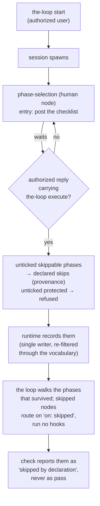

# Design: declared skips in the process graph

> Phase 2 of 4. Derived from the locked [`requirements.md`](requirements.md). Ticket:
> [issue #177](https://github.com/MadaraUchiha-314/the-loop/issues/177).

## Overview

**Three parties, one skip.** The graph says what *may* be skipped (`skippable: true`, a
compile-checked vocabulary shipped with the CLI). A human says what *is* skipped for one
work item — at the loop's own first phase, `phase-selection`, where the-loop posts a
checklist on the ticket and an authorized user replies with the phases to keep plus
`the-loop execute`. The runtime records the declaration with provenance and routes around
the node along a declared `on: skipped` edge. The harness — the party issue-177 says must
never make this call — has no channel at all: it can neither extend the vocabulary (the
graph is package data) nor answer the gate (its own comments carry the self-authored
marker and are dropped before authorization is even checked).



## Architecture

### The graph declares skippability (`model.py`, the two YAML loops)

- `Node` gains `skippable: bool` (default false), carried into `as_mapping()` so
  `graph show` prints it.
- Compile-time validation, in the spirit of "every structural failure is a startup
  failure":
  - `required` and `skippable` on one node → `GraphConfigError` (R1.2).
  - a skippable node without a declared `(node, "skipped")` edge → `GraphConfigError`
    (R1.3) — the routing around a node is authored in the same file that made it
    skippable, never inferred by the runtime.
  - `skipSets:` (top-level mapping, name → node list) with any member that is undeclared
    or not skippable → `GraphConfigError` (R1.4).
- `Graph.expand_skip_tokens(tokens)` resolves a mixed list of node ids and set names to
  `(accepted, rejected)` — the shared resolver for the CLI verb and for anything else
  that takes tokens, so two channels cannot drift apart (the issue-124 lesson, applied
  here on day one).
- The shipped outer loop marks `brainstorming`, `requirements-definition`,
  `requirements-approval`, `design`, `design-approval`, `tasks-breakdown` skippable, adds
  the six `on: skipped` edges (each to the node's ordinary successor), and ships
  `skipSets: {spec-chain: [...those six...]}` — so an operator declaring the issue's
  motivating case from a shell says it in one token: `--node spec-chain`.
- `pdlc-pr-loop.yaml` is untouched: its nodes are exactly the never-skippable floor
  (R4.1).

### Why these six, and not more

`test-planning` and `verification` stay mandatory because **every change keeps a proof**:
the testing plan's matrix already scales down honestly (`n/a` with a reason per row), so
a doc fix's plan is a few lines naming `markdownlint` — cheap, and it keeps
`verification` a gate that reads something real rather than the issue-124 shape (a gate
passing because its subject vanished). The review chain, `security-review` and
`human-approval` are the floor the whole design leans on: because they always run, the
worst any forged skip can achieve is a lighter paper trail on the way to a human who can
see the skip records. `requirements-approval`/`design-approval` are skippable because
when their subject artifacts are skipped there is nothing to approve — and when an author
skips the approval but not the artifact, the final `human-approval` gate still reviews
the artifact in the PR (the paper trail moves, it does not disappear).

### The human declares (the selection gate, plus an operator verb)

- **`phase-selection`, the loop's first node** (R2.1–R2.9). A `human` node, `required`,
  at the head of `pdlc-work-item-loop`:
  - *entry* `post-phase-selection` posts one checklist — every `skippable` node of **the
    loop the runtime is executing** (read from `ctx.graph`, never a re-loaded default,
    so the inner PR loop and any injected graph stay truthful), pre-ticked, plus the
    always-runs phases as plain text. Idempotent through its own
    `<!-- the-loop:phase-selection -->` marker: a redelivered spawn finds it and does not
    re-post. Best-effort — a failed post leaves the gate waiting and re-posts later.
  - *exit* `classify-phase-selection` reads **only** authorized comments (the same
    `_authorized_comments` reader the review gates use, which drops the-loop's own
    self-marked comments first) and waits until one carries the execute keyword. The
    selection comes from the **current tick state of the checklist comment** — the
    ergonomics the owner asked for — unless the execute comment itself carries a
    checklist, which wins. Unticked skippable → skip; unticked protected → refused and
    named in the confirmation; unmentioned → kept. It returns the skips as **data**
    (`declaredSkips`), the frozen graph, and the outcome `selected`; the graph's declared
    edge does the routing.
  - **`execute` is a `routing.control` command** (`keywords.execute`, default
    `the-loop execute`) — the owner's call: it is a control word an authorized human
    types, so it belongs to the same configurable vocabulary and the same named-actor
    check as `start`. It differs in *effect*, not in kind: the dispatcher records it
    (`control.command`, `effect: handed-to-graph`), touches no session, and **lets the
    event through**, because the gate's own exit chain is what reads the selection. The
    runtime learns the configured keyword through `bootstrap` (`config.executeKeyword`),
    so the checklist tells the user exactly the words this deployment expects.
  - **Freezing** (R2.13): answering the gate records the resolved graph — every node with
    `skipped` and `selectable` — into `state.decisions["phase-selection"].graph`, and
    pushes it through a daemon-injected `frozenGraphSink` into the `graph` section of the
    work item's **portable** record (beside `control`, for the same reason: the shape of
    a work item's process is true on any machine). A failed publish emits
    `graph.frozen_publish_failed` and never gates the selection — the checked-in state
    file is authoritative. This is what makes a later edit to the comment inert.
- **CLI verb** (R2.10): `the-loop graph skip <id> --node <token>… --reason <why>
  [--actor]`, a sibling of `force` all the way down: `commands/graph_cmd.py` →
  `core.graphs.skip()` → `runtime.declare_skips()`, exposed as `POST /graph/skip` in the
  control-plane API and the OpenAPI contract, absent from MCP (R4.2). It refuses an empty
  reason, refuses tokens that resolve to nodes already current or exited (R2.12), records
  `{via: "cli", by: actor, reason, token, at}`, posts one self-marked audit comment, and
  emits `graph.skips_declared`.

### The runtime routes and reports (`runtime.py`, `state.py`)

- `GraphState` gains `skips: Dict[node_id, declaration]` — additive, so existing state
  files load unchanged (no version bump).
- `Runtime.declared_skips(state)` filters `state.skips` to nodes that exist **and are
  skippable in the compiled graph** — the single defensive read every consumer goes
  through, which is what makes a tampered declaration on `security-review` inert
  everywhere at once (R3.3).
- Routing (R3.1): when `start()`/`advance()` would enter node *N* and *N* is
  declared-skipped, the runtime records `outcome: "skipped"` on *N*'s record, emits
  `graph.node_skipped`, follows the `(N, "skipped")` edge, and repeats until it lands on a
  non-skipped node — whose entry chain then runs normally (so the phase label and log
  checkpoint belong to the node actually entered, R3.5). Bounded by the node count; a
  missing edge cannot occur past compile time.
- Reporting (R3.2): `status()` reports a declared-skipped node as
  `skip — skipped by declaration of <by> (via <channel>, token <token>)` without
  evaluating its chain; `--recompute` reports the same, because a *declaration* is not
  the state file scoring itself — it is a recorded human input whose off-repo audit
  trail (the authorized reply, the marked confirmation) the human-approval gate can
  check. Invalid
  declarations are surfaced as warnings on the affected node in both modes.

### Downstream gates tolerate declared absences (`hooks/artifacts.py`)

`implementation` re-gates `tasks.md` (`checkmarks: complete`); with `tasks-breakdown`
skipped there is no `tasks.md`, and today that blocks forever. `HookContext` gains
`skipped_artifacts` (a frozenset of artifact names producible by declared-skipped nodes,
computed by the runtime when it evaluates a chain). In `validate-artifacts`, an **absent**
slot all of whose accepted names fall in that set is reported as an info-level skip
rather than a finding (R3.4). Present artifacts are gated normally — declaring a skip
never weakens a gate over work that *was* produced. `enforces-boundaries-from` already
skips on an absent upstream; no change.

## Components and interfaces

| Piece | Change |
|---|---|
| `graph/model.py` | `Node.skippable`; `Graph.skip_sets`; `expand_skip_tokens()`; three compile validations |
| `graph/state.py` | `GraphState.skips` (load/save, additive) |
| `graph/runtime.py` | skip-aware `start`/`advance`/`status`/`evaluate`; `declared_skips()`; `_record_selected_skips()` (the single writer for a gate's declaration, and where the graph is frozen); `_publish_frozen_graph()`; module-level `declare_skips()` beside `force()` |
| `control.py`, `workitem.py` | `execute` joins the control vocabulary; `GRAPH` joins the portable record's sections, written by `ControlStore.record_frozen_graph()` |
| `webhook/dispatcher.py`, `graphlink.py` | `execute` is recorded and let through (`_record_graph_command`); the `frozenGraphSink` channel is injected beside the assignment one |
| `.the-loop/cli-config.schema.json` | `routing.control.keywords.execute` |
| `graph/contract.py` | `HookContext.skipped_artifacts`, `HookContext.graph` |
| `graph/hooks/selection.py` | **new** — `post-phase-selection` / `classify-phase-selection` |
| `graph/hooks/assignment.py` | a human gate is announced, not assigned (the outer loop now opens on one) |
| `graph/hooks/artifacts.py` | absent-slot tolerance for declared-skipped authors |
| `graph/pdlc-work-item-loop.yaml` | the `phase-selection` start node; six `skippable: true`, six `on: skipped` edges, `skipSets.spec-chain` |
| `.the-loop/harness-config.yaml` + template | `phase-selection` in `workflow.phases` (P4 parity) |
| `core/graphs.py`, `api/app.py`, `docs/api-specs/openapi/the-loop.v1.yaml` | `skip` verb: core function, `POST /graph/skip`, contract entry |
| `commands/graph_cmd.py` | `the-loop graph skip` subcommand; `graph show` prints `skippable` |

## Data models

One new key in `graph-state.json` (additive; absent in every existing file, defaulting to
`{}` on load):

```json
"skips": {
  "requirements-definition": {
    "via": "selection",         // selection | cli
    "token": "requirements-definition",
    "by": "@owner",             // the authorized replier, or the CLI actor
    "reason": "",               // CLI-only, required there
    "at": "2026-08-08T00:00:00+00:00"
  }
}
```

## Error handling

| Failure | Behaviour |
|---|---|
| `required` + `skippable`, missing `skipped` edge, bad `skipSets` member | `GraphConfigError` at load — before any traversal |
| no authorized reply yet, or a reply without `the-loop execute` | the gate `wait`s; no phase runs |
| an unauthorized author's reply | ignored entirely; the gate keeps waiting |
| a reply unticking a protected phase | that phase is refused, named in the confirmation, and runs |
| a reply with `the-loop execute` and no checklist | no skips — the full process runs |
| posting the checklist fails | the gate waits; a later entry posts it again |
| posting the confirmation fails | the recorded selection stands and the loop proceeds (the force-announcement posture) |
| unknown/non-skippable token on the CLI verb | verb refuses that token, names why, exit like a refused `force` |
| verb targets an entered/past node | refused (`already-entered` / `already-past`) |
| state declares a skip on a non-skippable node | inert everywhere; surfaced as a warning in `check` |

## Security design

Each trust boundary from `requirements.md` § Security considerations, and where it is
enforced:

- **Who may declare** — the selection gate reads only `routing.authorizedUsers` through
  the shared `_authorized_comments` reader, which drops the-loop's own self-marked
  comments *before* authorization is considered, so the harness cannot answer its own
  gate even posting with the operator's credentials. The CLI verb is the operator's
  shell, attributed via `--actor` and a posted audit comment — the `force` posture. This
  is the loop's own boundary and the only one: the rejected label channel would have
  substituted GitHub's triage permission for it.
- **What may be declared** — `expand_skip_tokens()` and `declared_skips()` consult only
  the compiled, shipped graph, and `declared_skips()` re-applies the filter on **every**
  read; `_warn_on_repo_graph` (issue-109 R1.4) already refuses repo-supplied graphs, so
  the vocabulary cannot be widened below the package boundary. `required` nodes can never
  enter it (compile error). A hook returning `declaredSkips` is filtered by the same
  vocabulary before the runtime writes anything, so a compromised hook gains nothing.
- **When** — a declaration applies only to nodes still ahead of the pointer: the
  runtime drops any entry naming an already-entered node, and the verb refuses it by
  name. There is no channel that widens the skip set for work already done.
- **Tamper posture** — a hand-written `skips` entry on a protected node is inert and
  surfaced. A hand-written entry on a skippable node is the residual risk, accepted and
  stated: it is detectable (its claimed channel has an off-repo audit trail — the reply
  on the ticket, the marked confirmation — that will not corroborate it) and bounded (the
  floor still gates the item). This is the same trust model as `graph-state.json` itself:
  a cache, never an authority.
- **Injection** — the checklist and confirmation bodies are composed from the-loop's own
  vocabulary plus node ids from the compiled graph; no payload text is echoed back. The
  reply is parsed by a strict line regex into node ids that must match the vocabulary,
  so an attacker-authored comment cannot inject a destination even if it were authorized.
- **Fail-closed** — every failure yields fewer skips, never more; and with no reply at
  all, nothing runs.

## Rejected alternatives

- **The harness infers skips from the change** (e.g. "docs-only diff → skip specs").
  Rejected by the ticket itself: the decider would be the party being gated.
- **Ticket labels** (`loop:skip:<token>`, snapshotted at graph entry) — **built first,
  then rejected on owner review** (PR #178). Two reasons, both decisive: a label rides
  *GitHub's* permission model rather than the loop's own `authorizedUsers`, quietly
  introducing a second and weaker authorization boundary; and it needs seven labels
  created in every consuming repository before the feature works at all. See
  decision-067 § Reversal.
- **Reading the checkboxes of the-loop's own checklist comment.** Rejected on
  authorization grounds: GitHub's API reports *that* a comment was edited, never *by
  whom*, so a ticked box there is an unattributable instruction — precisely what this
  gate exists to prevent. Only an authorized author's own reply is parsed.
- **Keeping `execute` out of `routing.control`** — proposed, then **overruled by the
  owner** (PR #178): *"This also should be part of the cli-config: `routing.control`."*
  Right call — it is a control word an authorized human types on a ticket, which is
  exactly what that vocabulary is, and an operator who renames `the-loop start` will
  expect to rename this too. The wedging concern is handled by the gate falling back to
  the built-in default when the key is unset or empty.
- **Reading only the execute comment's own checklist** (never the boxes) — built first,
  then **overruled by the owner**, who wanted the ticking ergonomics. Reconciled rather
  than abandoned: the tick state is a *proposal* and the authorized execute comment is
  the signature over it, after which the graph is frozen so later edits are inert.
- **Front-matter `skips:` in the spec/work-item markdown.** Rejected: those files are
  agent-authored, so the channel would hand the declaration to the untrusted party.
- **Full alternative graphs per lane** (a `docs-loop` beside the work-item loop).
  Rejected for v1: N graphs to keep in parity for what is one loop with declared
  detours.
- **A config toggle** (`workflow.allowSkips`). Rejected: it adds a knob without adding
  safety — the vocabulary already ships fixed, and an operator who wants no skips keeps
  every phase ticked.

## Testing strategy

Red→green per task (`tdd.mode: standard`); the full matrix, environment and evidence plan
live in [`testing-plan.md`](testing-plan.md). The heart of it: compile-validation units,
routing/reporting units over a temp spec dir, the tamper case (forged skip on
`security-review` is inert), the selection gate against a fake integration (waits without
a reply, ignores an unauthorized one, records provenance, refuses protected phases, and
`execute`-with-no-list running everything), and the CLI/API/contract round trip.
