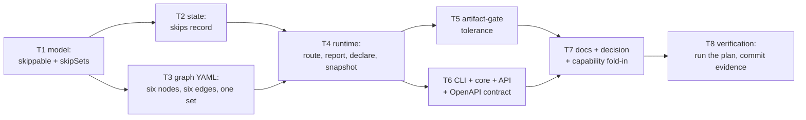

# Tasks: declared skips in the process graph

> Phase 4 of 4. Derived from the locked [`design.md`](design.md) and
> [`testing-plan.md`](testing-plan.md) — each task's `_Test:_` names a row of the matrix.
> Ticket: [issue #177](https://github.com/MadaraUchiha-314/the-loop/issues/177).

## Task list

- [x] **T1 — model: the skip vocabulary** — `Node.skippable` (+ `as_mapping`),
  `Graph.skip_sets`, `expand_skip_tokens()`, and the three compile validations
  (`required`×`skippable`, missing `skipped` edge, bad set member). Depends on: —.
  _Requirements:_ R1.1–R1.4. _Test:_ M1.
- [x] **T2 — state: the declaration record** — `GraphState.skips` loaded/saved
  additively; absent key → `{}`. Depends on: T1. _Requirements:_ R2.1, R3.3. _Test:_ M4,
  M12 (n/a-by-construction, exercised via absent-key loads).
- [x] **T3 — the shipped outer loop declares** — six `skippable: true` markers, six
  `on: skipped` edges, `skipSets.spec-chain`; `pdlc-pr-loop` untouched. Depends on: T1.
  _Requirements:_ R1.5, R1.6, R4.1. _Test:_ M2.
- [x] **T4 — runtime: route, report, declare, snapshot** — `declared_skips()` defensive
  filter; skip routing in `start`/`advance` (including the no-pointer `advance` path);
  provenance in `status()` both modes with forged-declaration warnings; module-level
  `declare_skips()` (reason required, entered/past refused, audit comment, event);
  label snapshot at entry via `get-labels`, best-effort, once. Depends on: T2, T3.
  _Requirements:_ R2.1–R2.7, R3.1–R3.3, R3.5. _Test:_ M3, M4, M6, M7.
- [x] **T5 — artifact gates tolerate declared absences** — `HookContext.skipped_artifacts`
  computed in `evaluate()`; `validate-artifacts` reports an absent, skip-covered slot as
  an info skip; present artifacts gated unchanged. Depends on: T4. _Requirements:_ R3.4.
  _Test:_ M5.
- [x] **T6 — the operator surface** — `core.graphs.skip()`, `POST /graph/skip`,
  the OpenAPI contract entry, `the-loop graph skip` subcommand, `graph show` printing
  `skippable`; no MCP exposure. Depends on: T4. _Requirements:_ R2.3–R2.6, R4.2.
  _Test:_ M7, M8.
- [x] **T7 — docs and the paper trail** — `reference/workflow.md` § Declared skips,
  `SKILL.md` rule bullet, `docs/capabilities/process-graph.md` behaviour + history row,
  `docs/decisions/decision-067.md` (+ index), labels report note. Depends on: T5, T6.
  _Requirements:_ all (documentation of). _Test:_ M9 (markdownlint; docs parity).
- [x] **T8 — verification** — execute the testing plan, fill § Verification results,
  commit evidence. Depends on: T7. _Requirements:_ all. _Test:_ M9 plus the plan itself.
