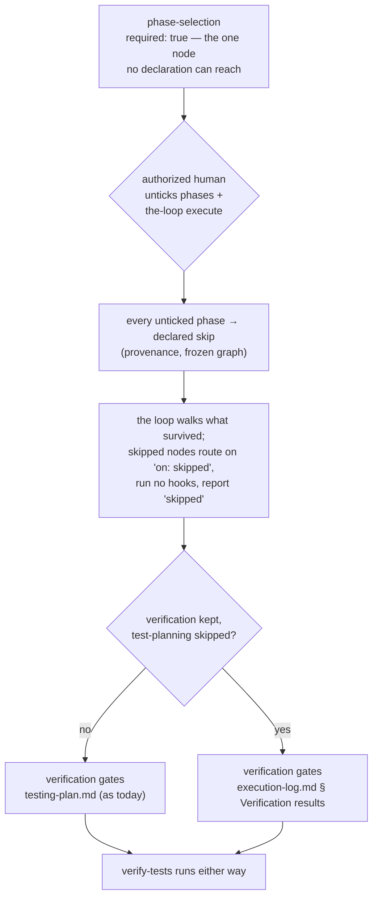

# Design: one unskippable node, and a gate that follows its proof

> Phase 2 of 4. Derived from the locked [`requirements.md`](requirements.md). Ticket:
> [issue #179](https://github.com/MadaraUchiha-314/the-loop/issues/179).

## Overview

Three moves. The first is the ticket; the second is the owner's widening; the third is
what keeps the surviving phases meaningful.

1. **`test-planning` joins the vocabulary** — the ticket's ask: one marker, one
   `on: skipped` edge, one skip-set member.
2. **So does everything else but the gate.** Every node of the outer loop becomes
   `skippable: true` except `phase-selection` and the terminals. `security-review` and
   `human-approval` lose `required: true` — a node cannot be both — and
   `phase-selection` keeps it. The floor stops being a set of phases and becomes a single
   structural invariant: **the loop cannot start without a human answering which phases
   it walks.**
3. **A kept gate keeps a subject.** `verification` gates `testing-plan.md`; a work item
   may now keep the former and skip the latter, which under issue-177's planned-absence
   rule would leave the gate asserting nothing. So `validate-artifacts` learns
   `onlyWhenSkipped:`, and `verification` gains a second entry that gates the shared
   `execution-log.md` for `Verification results` exactly when the plan is a planned
   absence. Precisely one of the two entries is ever live.



What this buys: a documentation fix is one reply away from `implementation → verification
→ human-approval → complete`, and a work item that genuinely needs nothing but a human's
eyes can say so. What it costs is stated in the requirements' security section and in
[decision-068](../../decisions/decision-068.md): the graph no longer guarantees any phase
ran; it guarantees every phase that did not run is attributable to a named human, before
the fact.

## Architecture

### 1. The outer graph (`pdlc-work-item-loop.yaml`)

| Node | Change |
|---|---|
| `phase-selection` | unchanged — `required: true`, no marker. The invariant. |
| `brainstorming` … `tasks-breakdown` | unchanged (already skippable), plus `test-planning` newly marked |
| `implementation`, `verification` | `skippable: true` + `on: skipped` edge |
| `self-review`, `critic-review`, `evidence`, `capability-docs`, `reviewer-briefing` | `skippable: true` + `on: skipped` edge |
| `security-review`, `human-approval` | `skippable: true`, `required: true` **removed**, + `on: skipped` edge |
| `complete`, `escalated` | unchanged — terminal, nothing to route to |

Ten new `on: skipped` edges, each to the node's ordinary forward successor
(`test-planning → design-approval`, `implementation → verification`, `verification →
self-review`, … `reviewer-briefing → human-approval`, `human-approval → complete`), so a
fully-selected-away work item routes `phase-selection → complete` and every intermediate
node carries outcome `skipped` with its declaration.

Skip sets become the ergonomics layer they were designed to be:

```yaml
skipSets:
  spec-chain:  [brainstorming, requirements-definition, requirements-approval,
                design, test-planning, design-approval, tasks-breakdown]
  review-chain: [self-review, critic-review, security-review, evidence,
                 capability-docs, reviewer-briefing]
```

The file's header comment — which today explains why `test-planning` and the floor are
*not* skippable — is rewritten to explain the invariant that replaced them. The graph is
the first thing a reader of the process meets; a stale rationale there is how the next
reader learns the wrong rule.

### 2. `onlyWhenSkipped` (`hooks/artifacts.py`)

A hook entry may declare **when it applies at all**:

```yaml
- hook: validate-artifacts
  with:
    onlyWhenSkipped: testing-plan.md
    validates: execution-log.md
    sections: [Verification results]
```

Semantics, deliberately narrow (R3.1):

- Resolve the parameter with the same `resolve_produces` the rest of the hook uses, so
  alternation (`a.md|b.md`) and lists behave identically to `produces:`/`validates:`.
- The entry applies only while **every** resolved slot is a *planned absence*: every
  accepted name is in `ctx.skipped_artifacts` (derived from declared skips, already
  filtered through the `skippable` vocabulary on every read) **and** no accepted name is
  present on disk.
- Otherwise the hook returns `HookResult.skipped(...)` naming the artifact and why.

The check runs before the "declares checks but names no artifact" fail-closed block, so a
non-applicable entry is a clean skip rather than a block. Three properties fall out, each
a requirement:

- **It can only narrow** (R3.3). It consults nothing but `skipped_artifacts`, so it can
  never make a gate over a *present* artifact stop running.
- **It is additive** (R3.2) — one early return; an entry without it is unchanged.
- **It never doubles the ceremony** (R2.3) — presence of the artifact disables it.

### 3. The execution log gains a section

`skills/the-loop/templates/execution-log.md` gains `## Verification results`, between
`## Progress entries` and `## Review cycles` — the order the loop walks. Not cosmetic:
`test_p5c_every_validated_section_exists_in_that_artifacts_template` exists because
issue-167 gated a section the template did not offer, which blocked every work item
authored from it. The section carries the same placeholder shape as its siblings (what ran,
the outcome, where the raw output lives), so the fallback is a form to fill in rather than
a blank page. It is *offered* to every work item and *required* only by the conditional
entry.

### 4. The checklist copy (`hooks/selection.py`)

`_phase_rows` computes `(skippable, protected)` from the compiled graph; with the widened
vocabulary `protected` is empty for the outer loop, and the "these phases always run"
block simply disappears. An empty block is not the right message for a checklist where
*everything* is now the user's call, so the copy gains its complement: when nothing is
protected, the comment says every phase is selectable, that skipping the review chain or
the approval gate is theirs to decide, and that each omission is recorded against their
name. No behavioural change — the gate, its authorization, its freezing and its provenance
are untouched.

## Components

| Component | Change | Requirement |
|---|---|---|
| `cli/the_loop/graph/pdlc-work-item-loop.yaml` | ten markers, ten `on: skipped` edges, two `required` removals, two skip sets, conditional `verification` entry, header rationale | R1.1–R1.5, R2.2 |
| `cli/the_loop/graph/hooks/artifacts.py` | `onlyWhenSkipped` applicability check | R3.1–R3.3 |
| `cli/the_loop/graph/hooks/selection.py` | checklist copy when no phase is protected | R1.7 |
| `skills/the-loop/templates/execution-log.md` | `## Verification results` section | R2.5 |
| `skills/the-loop/SKILL.md`, `reference/workflow.md`, `reference/security.md` | the widened vocabulary, the invariant, the fallback, the standing prohibition on the agent declaring | R4.3, R4.4 |
| `docs/capabilities/process-graph.md` | behaviour + history row | R4.3 |
| `docs/cli/commands/graph.md` | the floor prose → the invariant; `review-chain` token | R4.3 |
| `docs/decisions/decision-068.md` (+ index, + pointers in 063 and 067) | the reversal on the record, residual stated | R4.1, R4.2 |
| `commands/verify-work.md` | where results go when there is no plan | R2.2 |

Unchanged and deliberately so: the runtime, the state model, the selection gate's
authorization and freezing, the CLI verb, `core.graphs`, the API contract, the MCP surface
and the inner `pdlc-pr-loop`. Everything the widening needs already exists — which is what
issue-177 bought by shipping a vocabulary instead of a list of special cases.

## Data models

Unchanged. `GraphState.skips` keeps its shape; `HookContext.skipped_artifacts` keeps its
shape and gains a second consumer; the frozen graph gains rows automatically because it is
generated from the compiled graph.

## Security design

The requirements' security section is the threat model; this is what the code does about
it.

- **The one invariant.** `phase-selection` stays `required: true` and unmarked, and the
  graph's start node. The compile rule that refuses `required` × `skippable` is what
  enforces it — the same rule that forces `security-review`'s marker to be traded
  explicitly rather than silently coexisting.
- **The vocabulary is still package data.** A repository-supplied graph is ignored
  (issue-109 R1.4); `Runtime.declared_skips` re-filters every declaration through the
  compiled `skippable` set on **every** read; a declaration on a node the graph does not
  mark is inert everywhere and surfaced by `check`. Widening the shipped set does not
  weaken any of that machinery — it changes only what the shipped set contains.
- **Attribution replaces protection.** Because the floor is gone, the audit trail is the
  control: provenance per declaration (channel, actor, token, timestamp), the frozen graph
  in `graph-state.json` and in the portable record, the confirmation comment on the
  ticket, and `graph.skips_declared` / `graph.node_skipped` events. `the-loop check` never
  reports a skipped node as `pass`. A reviewer reading a lean PR sees precisely which
  phases were declared away and by whom — which is the review the mechanism now asks for.
- **The agent still has no channel.** Its comments are self-marked and dropped before
  authorization; it is not in `authorizedUsers`; the skill forbids it from answering the
  gate or running the verb, and that rule is restated where the vocabulary is described.
- **Hollowed gates.** `onlyWhenSkipped` exists so that skipping an *input* cannot silently
  disable a *kept* gate. It can only narrow (it reads only the filtered
  `skipped_artifacts` and disables itself when the artifact exists), so it introduces no
  new way to skip anything.
- **Fail-closed.** A malformed `onlyWhenSkipped` resolves to no slots → the entry does not
  apply → the node's other entry still governs. A skippable node without its `skipped`
  edge is a compile failure. A kept `verification` whose plan was declared away blocks
  until the log carries non-empty results (`validate-artifacts` treats an empty required
  section as a finding).

## Testing strategy

Detailed in [`testing-plan.md`](testing-plan.md). The shape: unit tests over the compiled
shipped graphs (the exact vocabulary, the invariant, every new edge, the two skip sets, the
inner loop untouched), unit tests over `onlyWhenSkipped`'s four states, an **integration**
test walking the real `verification` node both ways, and an end-to-end routing test that
declares every phase away and lands the pointer on `complete` with every intermediate node
recorded `skipped`.

## Alternatives considered

- **Ship the ticket's literal ask only** (`test-planning`, nothing else). What the first
  draft of this design did; superseded by the owner's direction on the ticket.
- **Keep `security-review` and `human-approval` protected.** The recommended middle
  ground, explicitly declined by the owner: a work item may now declare away its review
  chain and its approval gate.
- **Require `## Verification results` in the execution log unconditionally.** No new hook
  parameter, but it taxes every work item with a second place to write the same thing and
  duplicates the section `testing-plan.md` already has. Rejected against
  `reference/minimalism.md`.
- **Have `verify-work` author a minimal `testing-plan.md` when the plan was skipped.**
  Re-creates the artifact the human declared away, one node later, written by the party
  the mechanism exists to keep out of the decision. Rejected.
- **A `docs-loop` graph without the heavy nodes.** N graphs to keep in parity for what is
  one loop with declared detours — the alternative decision-067 already rejected, and the
  skip sets buy the same ergonomics in one token.
