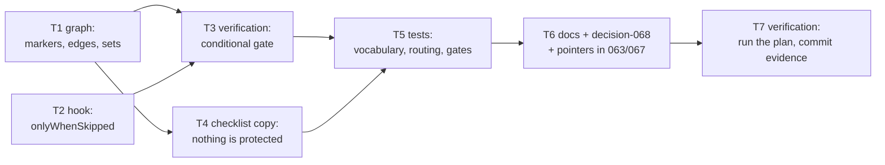

# Tasks: every phase selectable, one node that is not

> Phase 4 of 4. Derived from the locked [`design.md`](design.md) and
> [`testing-plan.md`](testing-plan.md) — each task's `_Test:_` names a row of the matrix.
> Ticket: [issue #179](https://github.com/MadaraUchiha-314/the-loop/issues/179).

## Task list

- [x] **T1 — the outer graph declares the widened vocabulary** — `skippable: true` on
  `test-planning`, `implementation`, `verification`, `self-review`, `critic-review`,
  `security-review`, `evidence`, `capability-docs`, `reviewer-briefing`,
  `human-approval`; `required: true` removed from `security-review` and `human-approval`
  and kept on `phase-selection`; ten `on: skipped` edges to each node's ordinary
  successor; `skipSets.spec-chain` extended with `test-planning` and a new
  `skipSets.review-chain`; the header rationale rewritten around the invariant.
  `pdlc-pr-loop` untouched. Depends on: —. _Requirements:_ R1.1–R1.6, R1.8.
  _Test:_ M1–M6.
- [x] **T2 — `validate-artifacts` learns `onlyWhenSkipped`** — an entry applies only
  while every named artifact is a planned absence (authoring node declared-skipped **and**
  absent on disk); otherwise a clean `skipped` with a reason, checked before the
  names-no-artifact fail-closed block. Additive: an entry without the parameter is
  unchanged. Depends on: —. _Requirements:_ R3.1–R3.3. _Test:_ M7, M8.
- [x] **T3 — `verification` keeps a subject** — the conditional second entry on the
  `verification` node (`onlyWhenSkipped: testing-plan.md` → `validates: execution-log.md`,
  `sections: [Verification results]`), and `## Verification results` added to
  `templates/execution-log.md` so no work item blocks on a heading the template never
  offered. Depends on: T1, T2. _Requirements:_ R2.1–R2.5. _Test:_ M9–M11, M13.
- [x] **T4 — the checklist says what it now means** — when the compiled loop protects no
  phase, the `phase-selection` comment says every phase is selectable and each omission is
  recorded against the declarer's name, instead of rendering an empty "always runs" block.
  No behavioural change to the gate. Depends on: T1. _Requirements:_ R1.7. _Test:_ M12.
- [x] **T5 — tests** — the vocabulary as a set equality (both directions), the
  `phase-selection` invariant, every new edge, both skip sets, the inner loop's
  independence, full-skip routing to `complete`, `onlyWhenSkipped`'s four states, the
  `verification` node walked both ways, and the existing assertions this change
  invalidates (`security-review` required in the outer loop, the old six-node
  `spec-chain`) updated to assert the new truth. Depends on: T3, T4. _Requirements:_ all.
  _Test:_ M1–M13.
- [x] **T6 — the paper trail** — `docs/decisions/decision-068.md` (the reversal, the
  invariant, the residual stated) + index row + pointers from decision-063 and
  decision-067; `SKILL.md`, `reference/workflow.md`, `reference/security.md`,
  `docs/capabilities/process-graph.md` (behaviour + history row),
  `docs/cli/commands/graph.md`, `commands/verify-work.md`. Depends on: T5.
  _Requirements:_ R4.1–R4.4. _Test:_ M13, M14 (markdownlint, docs parity).
- [x] **T7 — verification** — execute the testing plan, fill § Verification results,
  commit evidence under `evidence/`. Depends on: T6. _Requirements:_ all.
  _Test:_ M14 plus the plan itself.
