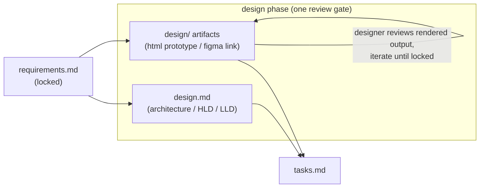

# Design: UI/UX design artifacts in the design phase

> Derives from the approved [`requirements.md`](requirements.md).

## Overview

A **plugin content** change — a config section, a manifest artifact, a new reference doc, a
design-template section, command/skill/README wiring, and one illustrative artifact. No
runtime code. UI/UX design artifacts are modelled *within* the existing `design` phase (not
as a new phase): they are siblings of `design.md` under `docs/specs/<id>/design/`, and they
reuse every existing mechanism — iterate-until-locked, per-phase human review, the
`designer` persona, the paper-trail rule, and the reviewer briefing. This mirrors the
existing **contract-first API** convention: the locked artifact is the *visual contract*.

## Architecture

## Components & interfaces

| Component | Change | Responsibility |
|-----------|--------|----------------|
| `.the-loop/config.schema.json` | edit | Add `design.uiArtifacts` (`dir`/`format`/`selfContained`/`screenshotEvidence`). |
| `.the-loop/config.yaml`, `.the-loop/templates/config.yaml` | edit | Ship the `design.uiArtifacts` block. |
| `.the-loop/manifest.yaml` | edit | Add optional `spec-design-artifacts` work-item artifact (`design/`). |
| `.the-loop/templates/design.md` | edit | Add the **UI/UX design** inventory section. |
| `skills/the-loop/reference/design-artifacts.md` | **new** | The designer iteration loop + artifact conventions. |
| `commands/create-design.md`, `commands/work-on.md` | edit | Produce/iterate UI/UX artifacts when user-facing. |
| `skills/the-loop/SKILL.md`, `reference/workflow.md`, `reference/collaboration.md`, `README.md` | edit | Document the convention; link the reference. |
| `docs/decisions/decision-018.md` + index | **new/edit** | Record the decision. |
| `docs/specs/issue-18/design/design-phase-artifacts.html` | **new** | Illustrative self-contained HTML artifact (dogfoods the convention). |

## UI/UX design

> issue-18 changes plugin **docs/config**, so it has no *product* UI. To **dogfood** the
> new convention, one illustrative, self-contained HTML artifact is checked in — a rendered
> "cheat sheet" of the design-phase artifact model and the designer iteration loop. It
> demonstrates exactly what a locked `design/` artifact looks like (self-contained,
> responsive, theme-aware) and doubles as living documentation. See
> `reference/design-artifacts.md`.

| Artifact | Type | Location / link | Covers (screen · requirement) | Status |
|----------|------|-----------------|-------------------------------|--------|
| `design/design-phase-artifacts.html` | html-prototype | [`design/design-phase-artifacts.html`](design/design-phase-artifacts.html) | Artifact-model reference · R1, R3, R4 | approved |

- **Flows & states:** a single static reference view (light/dark); no interactive states.
- **Design system / tokens:** system font stack, CSS custom properties for the light/dark
  palette, no external assets — the self-contained rule (R3) demonstrated in the artifact.
- **Accessibility & responsiveness:** single-column below 640px; semantic headings; text
  contrast holds in both themes.
- **Evidence:** the file opens standalone in any browser (and as a Claude-style artifact);
  no build, no network.

## Data models

`design.uiArtifacts` adds one config object (four scalar keys, all defaulted). The manifest
gains one `optional: true` work-item artifact. No schema for the artifacts themselves — an
HTML prototype is opaque text; a Figma artifact is a URL recorded in `design.md`'s
inventory.

## Error handling

- **No user-facing surface** → no `design/` folder, UI/UX section is `N/A`; commands skip
  the step (backwards compatible).
- **External dependency in an HTML prototype** → violates the `selfContained` rule (R3);
  caught in the designer/critic review, fixed by inlining.
- **Config drift** → schema validation (`additionalProperties: false`) catches an invalid
  `design.uiArtifacts` key or value.

## Testing strategy

No runtime code, so validation is by **gates + inspection**, mapped to requirements:

- **R1/R2 (config + manifest):** `python scripts/validate_config.py` — `config.yaml`
  validates against the schema (now including `design.uiArtifacts`). Evidence: validator
  exit 0.
- **R1–R5 (docs):** `markdownlint` (via pre-commit) passes on every new/changed markdown
  file. Evidence: `pre-commit run --all-files` output.
- **R3 (self-contained):** inspection — the illustrative HTML artifact contains no external
  URLs / network calls (all CSS/JS inline).
- **R4/R5 (wiring):** inspection — the reference exists and defines the loop; commands and
  skill link it.

No integration tests are added (no code paths), so no new Gherkin scenarios.

## Trade-offs & decisions

Recorded in [`docs/decisions/decision-018.md`](../../decisions/decision-018.md): artifacts
*within* the design phase (no new phase/label), support both HTML and Figma, and reuse the
existing iterate-until-locked + designer-review mechanisms rather than inventing new ones.

## Open questions

None.
