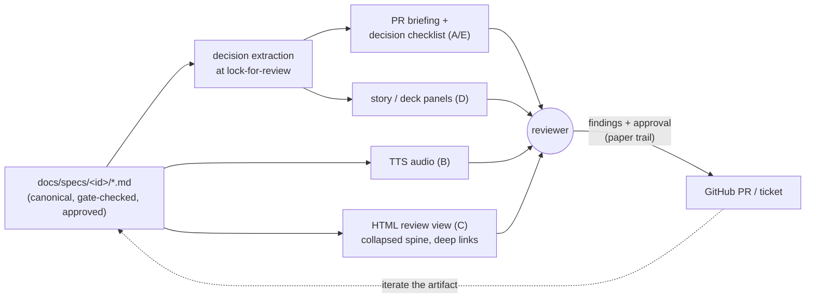

# Brainstorm: a better review interface for generated markdown artifacts

> Phase 0 — the root artifact. Carries the **literature survey**
> [issue #181](https://github.com/MadaraUchiha-314/the-loop/issues/181) asks for, and
> answers to its four modality questions (voice, HTML, slides, story panels).

## Problem / opportunity

Every gate in the loop funnels through one act: a human reading generated markdown, and
the human is now the bottleneck. `requireHumanReviewPerPhase: true` means each work item
asks a reviewer to absorb a `requirements.md`, a `design.md`, a `testing-plan.md` and a
`tasks.md` — documents an agent produced in minutes and a person must genuinely
understand before saying yes, because the yes is what makes the loop safe.

issue-165 attacked the **writing** side: the spine, density instead of budgets,
diagram-first. This item attacks the **reading** side — the interface and the modality of
review, for a document already as tight as the writing skill can make it. The two are
complementary: better writing lowers the load per word; a better review interface lowers
the words per decision.

## Context & constraints

**What already exists in this repo** (any proposal builds on, not beside, these):

- The **PR briefing** (`templates/pr-briefing.md`) — a condensed, prioritized "where to
  focus" list, gated before human review. It is already a hand-rolled review surface.
- The **VitePress site** renders every spec as HTML today — "is HTML better than
  markdown?" is not a rendering question here; it is a *review-purpose view* question.
- `userInteraction.diagramFormat: mermaid` and the writing skill's diagram-first rule.
- `design.uiArtifacts.selfContained: true` — HTML artifacts inline everything, no
  external network dependencies. A review surface inherits this rule.
- GitHub's own rendered prose diff on `.md` files.

**Constraints any direction must respect:**

- **The markdown stays canonical.** Gates validate sections in the `.md` files
  (`validate-artifacts`), locking is a front-matter status, and the repo is the paper
  trail. Anything else — audio, slides, stories, HTML — must be **derived** from the
  markdown, or the two sources drift and the gates guard the wrong one.
- **Findings must anchor.** A review produces comments tied to lines/sections and an
  approval on GitHub. A modality that cannot say *where* it disagrees (audio, stories)
  can prime a reviewer but cannot be the approval surface.
- **Review is decision-making, not learning.** The reviewer's output is yes/no plus
  findings. The interface should surface *decisions to accept*, not *content to absorb*.

## Literature survey

Surveyed August 2026, organized by the issue's own questions.

### 1. Why long-document review is hard (the load literature)

- Code-review research models review as
  [decision-making driven by questions the reviewer must answer](https://arxiv.org/pdf/2507.09637),
  and an [empirical study in EMSE](https://link.springer.com/article/10.1007/s10664-022-10123-8)
  finds explicit reviewing strategies and checklists measurably lower cognitive load;
  under decision fatigue reviewers procrastinate and skim. Transfer: give the reviewer a
  **question list**, not a wall of prose.
- [Progressive disclosure](https://www.nngroup.com/articles/progressive-disclosure/)
  (Nielsen Norman; [IxDF](https://ixdf.org/literature/topics/progressive-disclosure)):
  show what matters most first, expand on demand — reduces load *without deleting
  content*, which is exactly the writing skill's "concision is words, not coverage"
  constraint expressed as UI.
- [Mayer's multimedia-learning principles](https://www.digitallearninginstitute.com/blog/mayers-principles-multimedia-learning):
  humans process auditory and visual channels separately with limited capacity per
  channel; the **modality principle** — visuals + narration beats visuals + on-screen
  text. This is the strongest theoretical support for a voice layer: narration *paired
  with the diagrams*, not narration instead of the document.

### 2. Voice (the issue's "is voice a good modality?")

- [NotebookLM Audio Overviews](https://blog.google/innovation-and-ai/products/notebooklm-audio-overviews/)
  turn documents into a two-host podcast; formats now include **Critique** and
  **Debate**, not just summary — a generated *argument about* the document is closer to
  review than a readback of it.
- [ElevenLabs Audio Native](https://aiproductivity.ai/guides/elevenlabs-audio-native-guide/)
  embeds an auto-TTS player on any page (paid); open-weights/CLI TTS (edge-tts, kokoro)
  can do the same in CI for free. Mechanically, "generate voice of every markdown and
  link it in the markdown itself" is a small CI job at lock-for-review time: render
  `artifact.md → artifact.mp3`, attach to the PR or commit under
  `docs/specs/<id>/review/`, link from front matter.
- Evidence for it: [dual-sense input (listening while reading) improves comprehension](https://elevenlabs.io/blog/text-to-speech-accessibility),
  strongly for dyslexic readers — an accessibility win independent of everything else.
- Evidence against it as the *primary* surface: audio is linear and unskimmable, cannot
  be diffed, and cannot anchor a finding to a section. **Verdict: voice is a priming
  layer** (first pass on a commute, accessibility), never the approval surface.

### 3. Representation (the issue's "is markdown right? HTML? slides?")

- Markdown is the right **source** (diffable, gate-checkable, versioned); the question
  is the right **view**. [VS Code 1.132 ships rendered-markdown diffing](https://textcompareo.com/blog/vscode-markdown-diff)
  and GitHub has rich prose diffs — the industry direction is *review the rendered
  prose, keep the plain-text source*.
- Slides from markdown are a solved build step:
  [Marp, Slidev, reveal.js](https://www.pkgpulse.com/guides/slidev-vs-marp-vs-revealjs-code-first-presentations-2026)
  all compile `---`-delimited markdown to HTML/PDF decks deterministically — a "deck
  view" of a spec can be a derived artifact with zero hand-authoring.
- [Diátaxis](https://diataxis.fr)' diagnosis (already adopted in issue-165): bloat comes
  from mixed modes. The review view should show the *contract* (decisions, EARS
  criteria) and fold away the *explanation* — which the spine's ordering already makes
  mechanically separable.

### 4. Story panels (the issue's "instagram-like story per key decision")

- The open-web version exists: [AMP Web Stories](https://amp.dev/about/stories) —
  full-screen, tappable panels. Engagement evidence is real but from marketing content:
  [Forrester found 64% preferred tappable stories over the scrolling equivalent](https://blog.amp.dev/2019/10/25/users-prefer-tappable-stories-on-the-mobile-web/),
  and publishers report multi-minute session times and ~87% completion rates.
- The honest mapping for the loop: **one panel = one key decision** (its why, its
  trade-off), final panel = "approve / request changes" links. That is the EMSE
  checklist finding and progressive disclosure wearing a story UI — forced pacing, one
  decision at a time, phone-friendly (ticket comments are already "read on a phone" per
  the writing skill).
- What stories lack: random access, annotation, and any way to leave an anchored
  finding. Same verdict as voice: a **priming/triage layer**, generated from structure,
  never the approval surface.

### 5. Prose-review tooling (docs-as-code prior art)

- [pandiff](https://github.com/davidar/pandiff) (prose diffs via Pandoc, outputs
  CriticMarkup/Word track-changes),
  [CriticMarkup](https://github.com/CriticMarkup/CriticMarkup-toolkit) (track changes in
  plain text), [revdiff](https://github.com/umputun/revdiff) (TUI review with inline
  annotations), semantic block diffs of markdown. All solve *diffing* prose; none solve
  *absorbing* it. Google Docs' suggesting mode remains the gold standard for prose
  review, and its gap in docs-as-code is exactly the space this item is probing.

### 6. Interrogation instead of reading (LLM-native review)

- Chat-with-document with **verification by citation** — every answer quotes the exact
  excerpt it derives from — is standard in
  [e-discovery review tooling](https://www.relativity.com/blog/document-review-or-chatbot-which-generative-ai-e-discovery-solution-is-right-for-you/),
  and [InkSync (arXiv)](https://arxiv.org/pdf/2309.15337) shows the executable/auditable
  edit pattern for LLM text.
- The inversion is the interesting one: **the document interrogates the reviewer** — a
  generated checklist "here are the N decisions in this artifact; accept each?" — active
  processing (Mayer) plus checklist support (EMSE) in one move. The PR briefing's
  "where to focus" list is two-thirds of this already; it lacks only the per-decision
  tick-and-approve mechanics that issue-177's phase-selection checklist just proved out
  on tickets.

### What the survey settles

The prior art treats this as a *format* problem — make a podcast, make a deck. But
review needs anchored findings, a paper trail, and one canonical source, and no
alternative format provides those. So the direction is **one canonical markdown
artifact, N derived review surfaces**: extraction of decisions first (cheapest, directly
supported by the load literature), richer modalities (voice, stories, decks) as optional
derived layers generated at lock-for-review time — never hand-authored, so they can
never drift into a second source of truth.

## Ideas & options

- **Option A — decision-first review layer.** At lock-for-review, extract the artifact's
  key decisions (+ trade-off each carries) into a per-decision checklist on the
  PR/ticket; the reviewer ticks decisions and reads the prose only where they hesitate.
  *Pros:* anchored, paper-trailed, no new infra — extends the existing PR briefing and
  reuses issue-177's tick-in-place mechanics. *Cons:* extraction can miss a decision;
  the gate must make the checklist derived-and-complete, not hand-curated.
- **Option B — voice derivative.** TTS/podcast per artifact generated at
  lock-for-review, linked from front matter and the briefing. *Pros:* commute-mode
  first pass, accessibility, modality-principle support. *Cons:* linear, unanchorable;
  engine choice trades cost against `selfContained` (external TTS API vs CI-run model).
- **Option C — review-purpose HTML view.** A VitePress layer over the existing site:
  spine sections collapsed to their first sentence (progressive disclosure), decision
  sidebar, deep links per section. *Pros:* builds on what renders today; honors
  self-contained rule. *Cons:* real UI work, and approval still has to round-trip to
  GitHub — the view can never *be* the gate.
- **Option D — story/deck derivative.** Marp/amp-story build step: one panel per
  decision, last panel links to the PR. *Pros:* forced pacing; phone-native triage;
  free to generate once Option A's decision extraction exists (it is the same data).
  *Cons:* no annotation; another artifact to keep derived-only.
- **Option E — interrogation mode.** Q&A over the locked artifact with mandatory
  citations, and/or the generated reviewer checklist above. *Pros:* active beats
  passive; verification-by-citation bounds hallucination. *Cons:* chat needs harness
  support; the checklist half is just Option A.

**Leaning: sequence, don't pick.** A (with E's checklist half folded in) is the core;
B and D are optional derived layers off the same extraction; C is the long-term surface
that hosts all of them. Nothing here replaces the markdown or the GitHub review.

## Sketches & notes

Every surface deep-links back to the section it derives from; every arrow into the
reviewer is read-only — the only write path is the GitHub one.

## Open questions

1. **Which surface first?** Leaning Option A (decision checklist in the briefing) —
   it is the smallest change with direct literature support. Confirm or reorder.
2. **Voice generation: where and with what?** CI-generated (deterministic; needs an
   engine choice and a cost/`selfContained` call) vs operator-side (NotebookLM by hand —
   zero infra, zero guarantees). Or: not worth it until someone asks to listen?
3. **Is approval ever over a derived surface?** Leaning no — the markdown is always the
   thing approved; surfaces are aids. Saying yes would mean gating derived artifacts,
   which reopens the drift problem.
4. **Scope shape:** one work item that ships Option A, with B/C/D as separate future
   tickets? Or an epic now? (Phase selection for this item is the owner's call either
   way.)
5. **Where do derivatives live** — committed under `docs/specs/<id>/review/` (evidence,
   diffable, repo bloat) or build-time-only artifacts on the PR (light, ephemeral)?

## Leaning / working hypothesis

One canonical markdown artifact; N derived, read-only review surfaces generated at
lock-for-review; findings and approval stay on GitHub. Ship the decision-first checklist
(A+E) as the first slice, config-gated under `userInteraction` beside the existing
`prSummary` block; treat voice (B) and story/deck (D) as optional layers off the same
extraction; grow the HTML review view (C) only if the checklist proves insufficient.

## Hand-off → requirements

If approved, `requirements.md` asserts: a decision-extraction step at lock-for-review; a
per-decision checklist appended to the PR briefing (tick-in-place, issue-177 mechanics);
derived surfaces declared read-only and never gate subjects; a
`userInteraction.reviewSurfaces` config block naming which layers a repo enables.
Non-goals carried as constraints: no hand-authored second artifact, no approval outside
GitHub, no external network dependency in any committed review surface. Everything else
above — the survey, the rejected framings — stays here as the record.

## Review comments

> Appended by the-loop's `record-feedback` hook when a human gate approves with
> comments (issue-109).
