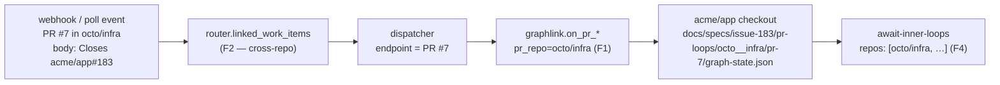

# Design: multi-repo work items — the outer loop stays in the origin repo, and its surface is a choice

> Phase 2. Derives from `requirements.md`. Ticket:
> [#183](https://github.com/MadaraUchiha-314/the-loop/issues/183).

## Overview

**Three small facts are added to a model that already has the right shape.** the-loop
already separates the work item's loop from each pull request's loop (decision-065); what
it lacks is (1) a repository qualifier on an inner loop, (2) a route from a pull request in
another repository back to the ticket, and (3) a name for where the outer loop's artifacts
are iterated. Nothing in the phase graph changes: no node, no edge, no artifact.

| # | Fact added | Where it lives | Consumed by |
|---|---|---|---|
| F1 | An inner loop belongs to a **repository**, not only to a number | `pr-loops/<owner>__<repo>/pr-<n>/` | `graphlink`, `bootstrap`, `graph` CLI, `await-inner-loops` |
| F2 | A pull request may close a ticket in **another** repository | `router.linked_work_items` | `extract_work_items` → the whole ingress |
| F3 | The outer loop has a **surface** | `workflow.outerLoop.surface` | `bootstrap` → assignment + prompt context |
| F4 | A work item may **declare** the repositories it contributes to | `execution-log.md` front matter `repos:` | `await-inner-loops` |



## Architecture

### The three locations, and which repository each is in

The invariant the whole design turns on: **the work item's spec directory is in the origin
repository, and every inner loop's state is under it** — including inner loops for pull
requests in other repositories. The daemon already drives a work item from the origin
repository's checkout (`_checkout_belongs_to` proves it via the `origin` remote), so
writing a foreign PR's inner state there needs no second checkout and no new trust check.

| Thing | Repository | Path |
|---|---|---|
| The ticket, the phase label, the outer loop | origin | — |
| The spec chain (`requirements.md` … `execution-log.md`) | origin | `<specDir>/<id>/` |
| The outer loop's state | origin | `<specDir>/<id>/graph-state.json` |
| An origin-repo PR's inner loop | origin | `<specDir>/<id>/pr-loops/pr-<n>/` |
| A contributing repo's PR inner loop | origin | `<specDir>/<id>/pr-loops/<owner>__<repo>/pr-<n>/` |
| The code a PR changes | that PR's repository | — |

Two shapes rather than one, on purpose (R1.4): every work item that already has
`pr-loops/pr-<n>/` keeps it byte-for-byte, so this change needs no state migration and a
half-finished work item is not stranded by an upgrade.

## Components & interfaces

### C1 — `repo_state_key` and the repo-qualified state directory (`graph/hooks/loops.py`)

```python
def repo_state_key(repo: str) -> str:
    """`owner/repo` (or `host/owner/repo`) → `owner__repo`; ValueError otherwise."""

def inner_loop_state_dir(spec_dir: Path, pr_number: int, repo: str = "") -> Path:
    """`<spec_dir>/pr-loops/pr-<n>`, or `…/pr-loops/<key>/pr-<n>` when `repo` is given."""
```

`repo_state_key` is the **trust boundary** of R1.6 and abuse cases 1–2: at least two
segments, each matching `[A-Za-z0-9._-]+` and neither `.` nor `..`. It raises rather than
sanitizes — a repo name silently rewritten into a valid one would file one repository's
inner-loop state under another repository's name, which is worse than a refusal. `repo=""`
is the origin-repo case and returns the shipped path.

### C2 — `await-inner-loops` gains declared repositories (`graph/hooks/loops.py`)

The hook keeps its shape — a pure read of checked-in files, no network — and gains one
input and one failure mode:

```text
declared = execution-log front matter `repos:`        (F4; [] when absent)
started  = every pr-loops/**/graph-state.json         (both layouts)

PASS   when every started loop is at `complete` AND every declared repo has ≥1 started loop
WAIT   naming the unfinished loops and/or the declared repos with no loop at all
```

A declared repo is matched to loops by its `repo_state_key`: the origin repository's key
matches the **top-level** `pr-<n>` loops, every other key matches its own subdirectory. The
origin repository comes from `ticketing.github` via the runtime config
(`config["originRepo"]`). **When that is unknown, a declared repo with no subdirectory
waits** and the message says why — fail closed, and say what would fix it, rather than
guessing which top-level loop was meant.

`repos:` absent ⇒ `declared = []` ⇒ today's behaviour exactly (R4.3), including the vacuous
pass on zero loops.

### C3 — threading the PR's repository through the runtime (`bootstrap`, `graphlink`, `core`, CLI)

One optional argument, added at each layer in the same position, defaulting to `""`:

| Layer | Change |
|---|---|
| `graph/bootstrap.build_runtime` | `pr_repo: str = ""` → `state_subpath = f"pr-loops/{key}/pr-{n}"` |
| `graphlink.GraphLink._guarded` / `_build_runtime` | `pr_repo` param; the state **lock** directory uses the same path, so two repos' PR #7 do not contend on one lock |
| `graphlink.on_pr_spawn` / `on_pr_event` / `pr_context` / `on_pr_close` | derive it: `pr.path if pr.path != work_item.path else ""` — the caller passes refs it already holds, so no new plumbing reaches the dispatcher |
| `core/graphs.{check,complete,advance,force,skip,show}` | `pr_repo: str = ""`, passed to `build_runtime` |
| `the-loop graph <verb> --pr-repo <owner>/<repo>` | six subparsers, added by one helper alongside `--pr` |

`--pr-repo` without `--pr` is a usage error: a repository does not identify a loop.

### C4 — cross-repo linkage (`webhook/router.py`)

`linked_issue_numbers` returns numbers, which is why it had to drop cross-repo references —
a number alone cannot say which repository it belongs to. It is replaced by a
ref-returning sibling and kept as a same-repo wrapper:

```python
def linked_work_items(entity: dict, owner: str, repo: str, host: str = "") -> List[WorkItemRef]
def linked_issue_numbers(entity: dict, owner: str, repo: str) -> List[int]   # same-repo subset
```

Order and sources are unchanged (GitHub's own `closingIssuesReferences`, then the
`issue-<n>` branch convention, then closing keywords in the body). What changes:

- a **qualified** closing keyword (`Closes octo/infra#12`, or the `https://github.com/octo/infra/issues/12` form) now yields a ref in *that* repository instead of being dropped;
- a `closingIssuesReferences` entry that names its repository (`nameWithOwner`, `{name, owner.login}`, or a parseable `url`) is honoured; one that does not still defaults to the event's repository;
- the branch convention stays same-repo — `issue-12` on a branch says nothing about a repository.

`extract_work_items` then emits those refs before the PR's own ref, exactly as it emits
linked numbers today (decision-036's ordering is untouched).

**What this does not widen:** which events reach the router. The ingress is the operator's
webhook receiver and poll sources; an event from a repository nobody watches never arrives,
and an unarmed work item still drops at `_awaiting_start` (abuse case 3).

### C5 — the outer loop's surface (`harness_config`, `bootstrap`, `assignment`, `graphlink`)

```yaml
workflow:
  outerLoop:
    surface: pull-request      # issue | pull-request   (default: pull-request)
```

- `harness_config.outer_loop_surface(harness) -> str` resolves the value, falling back to
  `pull-request` for absent/unknown/non-string (R2.2, R2.3), and is declared in `READS` —
  the CLI reads it because it renders it into what a session is told.
- `bootstrap` puts `outerLoopSurface` (and `originRepo`) into the runtime config.
- `render_assignment` adds one line to an **outer-loop agent** node that produces an
  artifact:
  `iterate this artifact on: the ticket (workflow.outerLoop.surface: issue)` — or
  `… on: the work item's pull request in the origin repository`.
  An **inner-loop** node's line names its pull request and says the inner loop has no
  surface setting (R2.7).
- `render_graph_context` carries the same fact into the event prompt, via a new
  `GraphContext.surface` field, and its claim command gains `--pr-repo` when the PR is in
  another repository — a session told to report back with the wrong command is a session
  whose claim evaluates the wrong loop.

### C6 — what stays a rule rather than becoming code

R2.4/R2.5 and all of R3 (where artifacts are iterated; the landing pull request) are stated
in `SKILL.md`, `reference/workflow.md` and `reference/collaboration.md` and gated only
through the record every work item already keeps (`## Pull requests` in the execution log,
which the `reviewer-briefing` node gates). the-loop does not open pull requests — the agent
does — so a "landing PR" hook would be code with no caller (`reference/minimalism.md`).

## Data models

**`execution-log.md` front matter** gains one optional key:

```yaml
---
type: execution-log
workItem: issue-183
phase: implementation
status: in-progress
repos:                        # OPTIONAL. The contributing repositories this work item
  - MadaraUchiha-314/the-loop #   raises pull requests in — one inner loop each. Absent
  - octo/infra                #   means single-repo, and the gate behaves as before.
---
```

**`pr-loops/` layout** (in the origin repository, under the work item's spec directory):

```text
docs/specs/issue-183/
├── graph-state.json                      ← the outer loop
└── pr-loops/
    ├── pr-184/graph-state.json           ← a PR in the ORIGIN repository
    └── octo__infra/pr-7/graph-state.json ← a PR in a contributing repository
```

## Error handling

| Condition | Behaviour | Why |
|---|---|---|
| Repository value with `/`-escapes, `..`, or an empty segment | `ValueError` from `repo_state_key`; the graph coupling logs it and the delivery still happens | Fail closed at the path boundary; a graph fault must never cost a delivery (`_guarded`'s existing contract) |
| `--pr-repo` without `--pr` | usage error, no state written | A repository does not identify a loop |
| Declared repo with no inner loop | `wait`, naming the repository | R4.2 — a missing contribution is not an absent one |
| Declared repo but `ticketing.github` unknown | `wait`, naming the missing config | Guessing which loop was meant is how a gate passes on the wrong evidence |
| Unreadable inner state | counts as unfinished (unchanged) | issue-124's silent-pass shape |
| `surface` unknown/malformed | resolves `pull-request` | R2.3 — `check` must still work in a half-edited repo |

## Security design

Each boundary from `requirements.md` § Security considerations, with the mechanism that
enforces it and the negative test that proves it.

- **AuthN/AuthZ.** Unchanged. Control keywords and human gates still resolve against
  `routing.authorizedUsers`; nothing here reads or writes that list. The cross-repo route
  changes *which work item* an event names, never *who may start or approve one*.
- **Input validation — repository → path (boundary 2).** `repo_state_key` accepts
  `[A-Za-z0-9._-]+` segments only, rejects `.`/`..`, and requires at least two segments.
  Every path-building call site goes through it: `inner_loop_state_dir`, `build_runtime`,
  `graphlink`'s lock directory. Negative tests: `../../etc`, `a//b`, `a/..`, `a`, `""`,
  and a Windows-style `a\..\b` (rejected — backslash is outside the class).
- **Input validation — payload → ref (boundary 1).** A qualified closing reference is
  parsed by the existing `_CLOSING_KEYWORD_RE` (already anchored to GitHub's own
  owner/repo grammar) and materialises only as a `WorkItemRef`, which is a dataclass of
  parsed fields — no payload string reaches a path, a command, or a prompt through this
  route. The routing decision remains "does a *registered, armed* session exist for this
  ref"; nothing here registers or arms anything.
- **Injection surfaces.** No new subprocess, no new SQL, no new template. The assignment
  and prompt lines added in C5 are composed from the-loop's own vocabulary plus the
  resolved surface (one of two literals) and the PR's already-parsed `owner/repo` —
  the same "no payload text in a graph message" rule R3.6 states.
- **Secrets handling.** None added. No new file records anything but a repository name and
  a pull-request number.
- **Least privilege.** Unchanged: the daemon writes only inside the origin repository's
  spec directory. A foreign PR's inner state is written *there*, so no credential, remote
  or checkout for the contributing repository is required by any code in this work item.
- **Fail-closed behaviour.** Every ambiguity above resolves to `wait`, `ValueError` or the
  shipped default — never to "proceed as if it were fine".
- **Abuse-case coverage.**

  | Abuse case | Mechanism | Negative test |
  |---|---|---|
  | 1 — hostile repository name in a payload | `repo_state_key` raises | `test_repo_state_key_rejects_traversal` |
  | 2 — hostile `--pr-repo` argument | same function at the CLI boundary | `test_graph_pr_repo_argument_is_validated` |
  | 3 — foreign PR closing an unarmed work item | `_awaiting_start` (unchanged) | `test_cross_repo_link_does_not_arm_a_work_item` |
  | 4 — declared repo that never gets a PR | `await-inner-loops` waits | `test_await_waits_for_a_declared_repo_with_no_loop` |

## Testing strategy

Unit tests carry this work item: every added behaviour is a pure function of files and
arguments (`repo_state_key`, `inner_loop_state_dir`, `await_inner_loops`,
`linked_work_items`, `outer_loop_surface`, `render_assignment`). Two integration
scenarios cover the seams that unit tests cannot: a cross-repo pull request routing to its
work item and walking an inner loop whose state lands under the origin repo's spec
directory, and the outer `implementation` gate holding until a declared repository's loop
finishes. The parity suites (`test_docs_parity`, `test_harness_config`,
`test_graph_parity`) are the regression net for the config/doc surface. The executable
detail is `testing-plan.md`.

## Trade-offs & decisions

Recorded as [decision-069](../../decisions/decision-069.md). In short:

1. **Two state layouts instead of one.** A single repo-qualified layout would be tidier;
   migrating live work items to get it is not worth the tidiness.
2. **`surface` is harness config, not CLI config.** Where a *human sits* is the operator's
   machine (`interaction.mode`, decision-051); where a *project reviews its specs* is the
   project's process. Different axes, different files.
3. **decision-051 §5 is amended, not overturned.** Its invariant becomes: artifacts are
   iterated on a **durable, reviewable surface** — the pull request or the ticket — never in
   a terminal. The configuration it refused (specs discussed in scrollback) is still
   refused.
4. **Cross-repo linkage is unconditional**, not a new config toggle. The ingress and the
   arming gate already bound it, and a toggle would be a second name for "the operator
   configured this repository".
5. **The declared-repos gate is opt-in by declaration.** Inferring the repository set from
   `tasks.md` prose would make a gate depend on parsing prose — the thing the graph exists
   to avoid.

## Open questions

None.

## Review comments

> Appended by the-loop's `record-feedback` hook when a human gate approves with comments.
