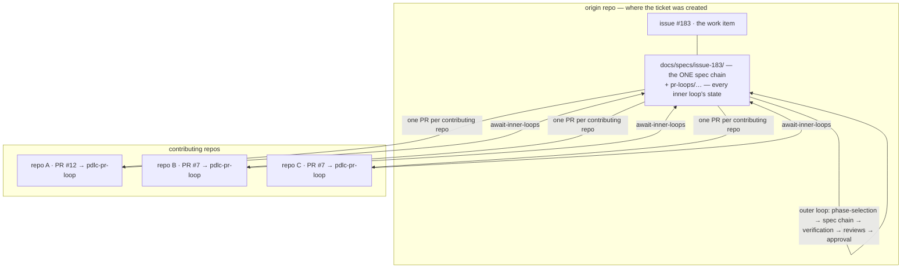

# Requirements: multi-repo work items — the outer loop stays in the origin repo, and each work item chooses its surface

> Phase 1 of the chain (requirements → design → testing plan → tasks). Ticket:
> [#183](https://github.com/MadaraUchiha-314/the-loop/issues/183).

## Introduction

**A work item that needs code in three repositories should produce three pull requests,
not four — and none of them should be a brainstorming PR nobody ever merges.**

the-loop already splits the process in two (decision-065): the **outer** loop
(`pdlc-work-item-loop`) walks the work item, the **inner** loop (`pdlc-pr-loop`) walks each
pull request that delivers it. What the shipped harness never says is *where each loop
lives* when the work spans repositories, and it currently assumes both answers:

| Assumption in the shipped harness | Where it is written | What breaks on a multi-repo work item |
|---|---|---|
| A pull request delivering a work item is in the **same repository** as the ticket | `linked_issue_numbers` drops a closing reference that names another repo | A PR in a contributing repo cannot route to the work item at all |
| A PR number identifies an inner loop | `pr-loops/pr-<n>/` | Two repos' PR #7 collide on one state directory |
| Artifacts are iterated **only** in pull-request review | decision-051 §5, `SKILL.md` | The spec chain needs a PR in the origin repo even when no code lands there — the never-merged brainstorming PR the ticket names |
| Nothing asks a work item where it wants to be collaborated on | — | The answer has to be guessed, or configured repository-wide for work items that differ |
| Every started inner loop is every inner loop the work item needs | `await-inner-loops` passes vacuously on zero | A repo whose PR was never opened is indistinguishable from a work item with no PRs |

This work item fixes the topology and makes the one genuinely optional part of it —
*where the outer loop's artifacts are iterated* — a choice **each work item makes for
itself**, at the gate where it already declares its shape.

## Requirements

### Requirement 1 — the outer loop runs in the origin repository, and only there

**User story:** As an engineer working a change that spans several repositories, I want the
brainstorming, requirements, design and task plan to happen in one place, so that the work
item has a single spec chain instead of one per repository.

The **origin repository** is the repository the ticket was created in — `ticketing.github`
(`<owner>/<repo>`) for a GitHub-ticketed project. A **contributing repository** is any
repository this work item needs code in; it may or may not be the origin.

#### Acceptance criteria (EARS)

1. WHEN a work item is started THEN the-loop SHALL walk its outer loop
   (`pdlc-work-item-loop`) against the **origin repository** only, and SHALL keep the work
   item's one spec chain under that repository's `<workflow.specDir>/<id>/`.
2. WHEN a work item needs contributions in N contributing repositories THEN the-loop SHALL
   raise **one pull request per contributing repository**, each walking its own
   `pdlc-pr-loop`, and SHALL NOT raise an implementation pull request in the origin
   repository unless the origin repository is itself one of the N.
3. WHEN an inner loop is walked for a pull request in a repository **other than** the
   origin THEN the-loop SHALL keep that loop's state under
   `<specDir>/<id>/pr-loops/<owner>__<repo>/pr-<n>/` **in the origin repository's
   checkout**, so that two repositories' pull-request numbers cannot resolve to one state
   directory.
4. WHILE an inner loop belongs to the origin repository the-loop SHALL keep its state at
   the shipped `<specDir>/<id>/pr-loops/pr-<n>/` path, so that every work item that
   existed before this change keeps its state where it already is.
5. WHEN a pull request in a contributing repository carries a closing reference to the work
   item's ticket in the origin repository (`Closes <owner>/<repo>#<n>`, or the equivalent
   URL form, or GitHub's own linkage) THEN the-loop's routing SHALL map that event to the
   work item in the origin repository.
6. IF a repository name reaching the state-directory layer contains anything outside
   `[A-Za-z0-9._-]` — a path separator, `..`, an empty segment — THEN the-loop SHALL
   reject it rather than resolve a path from it.

### Requirement 2 — the outer loop's surface is the work item's own declaration

**User story:** As the author of a work item, I want to say — once, when I say which phases
it needs — whether its outer loop happens on the work item or on a pull request, so that an
item whose code lands in other repositories does not need a pull request here at all.

*(Revised in review, PR #184: the first draft made this a repository config key,
`workflow.outerLoop.surface`. The owner's call moved it to `phase-selection`, because one
repository has both a one-repo bugfix and a three-repo migration and a repository-wide
answer is wrong for one of them.)*

#### Acceptance criteria (EARS)

1. WHEN the-loop posts the `phase-selection` checklist THEN it SHALL include exactly one
   row that is **not** a phase — `outer-loop-on-pull-request` — under its own heading,
   saying what ticking it means.
2. WHEN an authorized user replies with the execute keyword THEN the-loop SHALL resolve the
   surface from the same body the phase selection is read from: **ticked** ⇒
   `pull-request`, **unticked or absent** ⇒ `work-item`.
3. IF nobody ticks the row THEN the surface SHALL be `work-item` — the default — because a
   work item only opens a pull request in the origin repository when its author asks for
   one.
4. WHEN the selection is signed THEN the resolved surface SHALL be frozen with it: written
   to `graph-state.json`, carried in the frozen graph published to the portable work-item
   record, and named in the confirmation comment.
5. The surface SHALL NOT be a key in `.the-loop/harness-config.yaml` or in the CLI config.
   No file-level setting SHALL override a work item's own declaration.
6. WHILE the surface is `work-item` the-loop SHALL iterate every outer-loop artifact
   (`brainstorm.md`, `requirements.md`/`bugfix.md`, `design.md`, `testing-plan.md`,
   `tasks.md`) through comments on the **ticket**, and SHALL NOT open a pull request in
   order to carry them; WHILE it is `pull-request` the-loop SHALL iterate them through
   review on the pull request that carries them in the origin repository.
7. WHEN a session enters an outer-loop agent node THEN the assignment the graph delivers
   SHALL name the resolved surface, so a session is told where to iterate rather than
   inferring it.
8. The inner loop SHALL always run on its own pull request. No declaration and no
   configuration value, in any file, SHALL move it. `pdlc-pr-loop` carries no surface.
9. WHEN the phase parser reads the checklist THEN the surface row SHALL be excluded from
   the phase vocabulary before anything else, so an unticked surface row is never read as a
   declared skip nor reported as a refused phase.

### Requirement 3 — the artifacts are always checked in, and they always land

**User story:** As a reviewer arriving six months later, I want the spec chain in the
default branch of the origin repository, so that "we discussed it on the ticket" does not
mean "there is nothing in the repo".

#### Acceptance criteria (EARS)

1. WHILE the surface is `issue` the-loop SHALL still commit every artifact to the work
   item's branch in the origin repository and SHALL link the checked-in file from the
   ticket — the *reference, don't duplicate* rule is not waived, and `validate-artifacts`
   reads files, never comments.
2. WHEN the surface is `issue` and the origin repository is **not** a contributing
   repository THEN the-loop SHALL land the spec chain through a single **landing pull
   request** opened at the point the work item is otherwise ready — after the chain is
   locked and every inner loop has finished — never at `brainstorming` or
   `requirements-definition`.
3. WHEN the surface is `issue` and the origin repository **is** a contributing repository
   THEN the spec chain SHALL land in that repository's own contribution pull request; no
   second pull request SHALL be opened for it.

### Requirement 4 — a declared contributing repository is a gate, not a hope

**User story:** As an approver, I want the work item to hold at `implementation` until every
repository it said it would touch has actually finished, so that "the PR in repo C was never
opened" surfaces as a blocked gate rather than as a silent pass.

#### Acceptance criteria (EARS)

1. WHEN a work item's `execution-log.md` front matter declares `repos: [<owner>/<repo>, …]`
   THEN `await-inner-loops` SHALL hold the outer `implementation` node until **each declared
   repository has at least one inner loop** and every started inner loop has reached
   `complete`.
2. WHEN a declared repository has no inner loop at all THEN the hook SHALL return `wait`
   naming that repository, and SHALL NOT report a pass.
3. IF a work item declares no `repos` THEN `await-inner-loops` SHALL behave exactly as it
   does today: every started inner loop must finish, and a work item with none passes
   vacuously.
4. WHEN an inner loop's state file cannot be read THEN it SHALL count as *not finished*,
   as it does today.

## Non-functional requirements

- **No new runtime dependency, no network in a gate.** `await-inner-loops` stays a pure read
  of checked-in files, so `the-loop check` in a bare CI checkout evaluates it identically to
  the daemon (the property decision-041 bought).
- **No new configuration at all.** The surface is a work-item declaration, not a key; no
  config key is added, removed or moved, so `CURRENT_CONFIG_VERSION` is untouched and no
  migration runs. `GraphState` gains one optional field, absent in every existing state
  file.
- **Backwards compatible state.** An origin-repo inner loop's directory is byte-identical to
  the shipped layout; a checkout mid-work item does not have to be migrated.

## Security considerations

The change moves one real trust boundary and touches a second, so both are written out
rather than implied.

- **Actors & trust.** Trusted: the operator's daemon and the authorized users in
  `routing.authorizedUsers`. **Untrusted:** the author of any pull request in any repository
  — including a repository the operator does not own — and every string in a webhook or poll
  payload (PR body, branch name, repository name).
- **Trust boundary 1 — cross-repo linkage (new).** R1.5 widens *which work item* an event
  maps to: a PR body in repo B may now name a work item in repo A. Two properties bound it,
  and both are pre-existing: (a) the ingress is unchanged — an event only reaches the router
  if the operator's webhook receiver or poll source is configured for that repository, so a
  stranger's repo cannot inject events; (b) arming is unchanged — a work item that no
  authorized user started with `the-loop start` drops the event at `_awaiting_start`. What a
  hostile PR in a watched repository *can* do is get its comments delivered into an armed
  work item's session, which is exactly what a hostile PR in the origin repository could
  already do. The prompt's untrusted-excerpt framing is the existing mitigation and is not
  weakened.
- **Trust boundary 2 — repository name → filesystem path (new).** R1.3 derives a directory
  name from `<owner>/<repo>`, which arrives from a webhook payload or from an operator's
  `--pr-repo` argument. An unvalidated value escapes the spec directory (`../../etc`), or
  collides two repos onto one state directory (an empty segment). Fail closed: reject, never
  sanitize-and-continue — a silently rewritten repo name would put one repo's inner-loop
  state under another's name.
- **Trust boundary 3 — the checklist row (issue-183 revision).** The surface now comes from
  a **comment**, through the same gate the phase selection comes through — so it inherits
  that gate's authorization exactly: only an authorized user's execute reply is read, the
  harness's own comments are dropped before authorization is considered, and the answer is
  frozen so a later edit changes nothing. The parsed value is one of two literals, never
  payload text. An unreadable checklist resolves to the **default** (the work item), which
  opens nothing — the safe direction.
- **Sensitive data.** None added. The state directory names a repository, which is as public
  as the pull request it tracks; no token, credential or hostname enters any new file.
- **Abuse cases (EARS).**
  1. WHEN a pull-request payload names a repository containing a path separator, `..`, or an
     empty segment THEN the-loop SHALL raise `ValueError` and resolve no path.
  2. WHEN `--pr-repo` is given a value outside `[A-Za-z0-9._-]/[A-Za-z0-9._-]` THEN the
     command SHALL fail with that message rather than write state.
  3. WHEN a pull request in a watched repository closes a work item that no authorized user
     has started THEN the event SHALL be dropped as it is today (`_awaiting_start`), the
     cross-repo reference notwithstanding.
  4. WHEN a work item declares a repository in `repos` that no pull request ever names THEN
     `await-inner-loops` SHALL hold rather than pass — a missing contribution is not an
     absent one.
  5. WHEN an unauthorized user ticks the surface row, or edits the checklist after the
     selection was signed, THEN the frozen surface SHALL NOT change.
- **Fail closed.** An unparseable repository value resolves no path and takes no default. An
  unreadable inner-loop state counts as unfinished. An unreadable or absent surface row
  resolves to the **work item** — the option that opens nothing.

## Out of scope

- **Jira-ticketed work items.** The origin-repo rule is stated in terms of `ticketing.github`;
  a Jira project's "origin repo" is a follow-up, as it is everywhere else in the harness.
- **the-loop opening pull requests itself.** No code in this work item creates a PR — the
  agent does, as it does today. R2 and R3 are rules the harness *states*, and the graph gates
  their record (`## Pull requests` in the execution log), not an automated `gh pr create`.
- **Checking out contributing repositories.** the-loop facilitates verification, it does not
  own the environment (`reference/testing.md`); a multi-repo verification names its
  checkouts in the testing plan's **Verification environment** section, as that section
  already provides for.
- **A repository-wide surface setting.** Removed in review (PR #184): the answer is the work
  item's, and a config key would be a second source for it.

## Open questions

None outstanding. The two answered on the ticket:

1. *Does `surface: issue` mean the artifacts stop being files?* No — R3.1. A spec that is not
   a file cannot be gated, and every gate in the graph reads files.
2. *Which surface is the default, and where is it declared?* The **work item**, declared at
   `phase-selection` (R2.2–R2.5) — the owner's call on PR #184. The first draft made it a
   repository config key defaulting to `pull-request`; both halves of that were wrong. A
   repository-wide answer is wrong for half its work items, and defaulting to a pull
   request re-creates the very PR the ticket is complaining about.

## Review comments

> Appended by the-loop's `record-feedback` hook when a human gate approves with comments.
