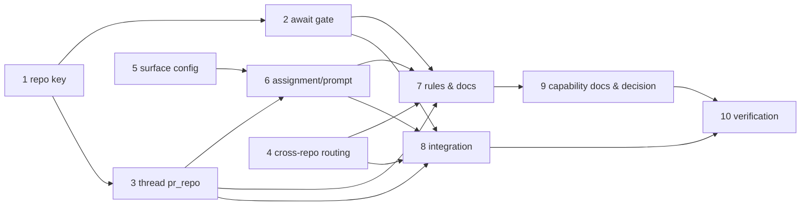

# Tasks: multi-repo work items — the outer loop stays in the origin repo

> Derived from the approved `design.md` and `testing-plan.md`. TDD invariant: no production
> code without a failing test that motivates it.

## Task list

- [x] 1. `repo_state_key` + repo-qualified `inner_loop_state_dir`
  - `cli/the_loop/graph/hooks/loops.py`: the validator (two-plus segments, `[A-Za-z0-9._-]+`,
    never `.`/`..`) and the optional `repo` argument; `repo=""` returns the shipped path.
  - _Depends on:_ none
  - _Requirements:_ R1.3, R1.4, R1.6, abuse case 1
  - _Test:_ `T1/T8 — pytest tests/test_graph_loops.py -k "state_key or state_dir"` (red→green)

- [x] 2. `await-inner-loops` reads declared repositories
  - Same file: read `repos:` from the execution log's front matter, match each declared repo
    to its loops by key (origin ⇒ top level, from `config["originRepo"]`), `wait` naming a
    declared repo with no loop, and `wait` when the origin repo is unknown.
  - _Depends on:_ 1
  - _Requirements:_ R4.1–R4.4, abuse case 4
  - _Test:_ `T1/T8 — pytest tests/test_graph_loops.py -k await` (red→green)

- [x] 3. Thread `pr_repo` through the runtime, the CLI and the daemon link
  - `graph/bootstrap.build_runtime`, `core/graphs.*`, `commands/graph_cmd.py` (`--pr-repo`,
    added beside `--pr` by one helper; `--pr-repo` without `--pr` is a usage error),
  - `graphlink`: `_guarded`/`_build_runtime` parameter, the state-lock directory, and the
    four `on_pr_*`/`pr_context` methods deriving it from the refs they already hold.
  - _Depends on:_ 1
  - _Requirements:_ R1.3, abuse case 2
  - _Test:_ `T1/T8 — pytest tests/test_graphlink.py tests/test_core_graphs.py tests/test_cli.py -k pr_repo` (red→green)

- [x] 4. Cross-repo linkage in the router
  - `webhook/router.py`: `linked_work_items` (ref-returning, honours a qualified closing
    keyword and a `closingIssuesReferences` entry that names its repository);
    `linked_issue_numbers` becomes its same-repo wrapper; `extract_work_items` emits the refs.
  - _Depends on:_ none
  - _Requirements:_ R1.5, abuse case 3
  - _Test:_ `T1/T8 — pytest tests/test_poller.py tests/test_webhook*.py -k "linked or cross_repo"` (red→green)

- [x] 5. `workflow.outerLoop.surface` — schema, reader, runtime config
  - `.the-loop/harness-config.schema.json`, `harness_config.outer_loop_surface` + a `READS`
    row, `graph/bootstrap` (`outerLoopSurface`, `originRepo`), and this repo's own
    `.the-loop/harness-config.yaml` + the bundled template.
  - _Depends on:_ none
  - _Requirements:_ R2.1–R2.3
  - _Test:_ `T1/T12 — pytest tests/test_harness_config.py -k surface` (red→green)

- [x] 6. Tell the session where to iterate, and how to claim
  - `graph/hooks/assignment.render_assignment` and `graphlink.render_graph_context`
    (+ `GraphContext.surface`): the surface line for an outer-loop node, the pull-request
    line for an inner one, and `--pr-repo` in the claim command for a cross-repo loop; the
    dispatcher passes the endpoint's repository.
  - _Depends on:_ 3, 5
  - _Requirements:_ R2.6, R2.7
  - _Test:_ `T1 — pytest tests/test_graph_hooks.py tests/test_graphlink.py -k "surface or claim"` (red→green)

- [x] 7. The rules: skill, references, templates, config docs
  - `skills/the-loop/SKILL.md`, `reference/workflow.md`, `reference/collaboration.md`,
    `reference/testing.md` (multi-repo verification environment pointer),
    `templates/execution-log.md` (`repos:`), `docs/config/harness-config.md` (the option and
    the CLI-read row), `docs/cli/commands/graph.md` (`--pr-repo`).
  - _Depends on:_ 1–6
  - _Requirements:_ R1.1, R1.2, R2.4, R2.5, R2.7, R3.1–R3.3
  - _Test:_ `T12 — pytest tests/test_docs_parity.py tests/test_harness_config.py`

- [x] 8. Integration scenarios
  - `cli/tests/test_graph_multirepo_integration.py`: the cross-repo PR walking its inner
    loop under the origin repo's spec directory, and the outer gate holding until a declared
    repository finishes. Gherkin docstrings, `Requirement:` links.
  - _Depends on:_ 1–6
  - _Requirements:_ R1.1–R1.5, R4.1, R4.2
  - _Test:_ `T2 — pytest tests/test_graph_multirepo_integration.py` (red→green)

- [x] 9. Capability docs, user-facing docs, decision record
  - `docs/capabilities/process-graph.md`, `spec-workflow.md`, `interactive-sessions.md`,
    `webhook-triggers.md`; `README.md`, `docs/index.md`, `docs/guide/how-it-works.md`;
    `docs/decisions/decision-069.md` + the index, and the pointer back from decision-051.
  - _Depends on:_ 7
  - _Requirements:_ all (the ready-to-ship gate)
  - _Test:_ `T12 — pytest tests/test_docs_parity.py`

- [x] 10. Verification: execute `testing-plan.md`, record results and evidence
  - _Depends on:_ 1–9
  - _Requirements:_ all
  - _Test:_ `T1, T2, T8, T10, T12, T13 — the whole matrix`

## Dependency graph (DAG)

## Checkpoints

Tests run after each task (red→green recorded in `execution-log.md`), the full suite plus
lint/typecheck after task 9, and the whole matrix at task 10 — after which the review chain
and the security-review gate run before the work item can be marked ready.

## Review comments

> Appended by the-loop's `record-feedback` hook when a human gate approves with comments.
