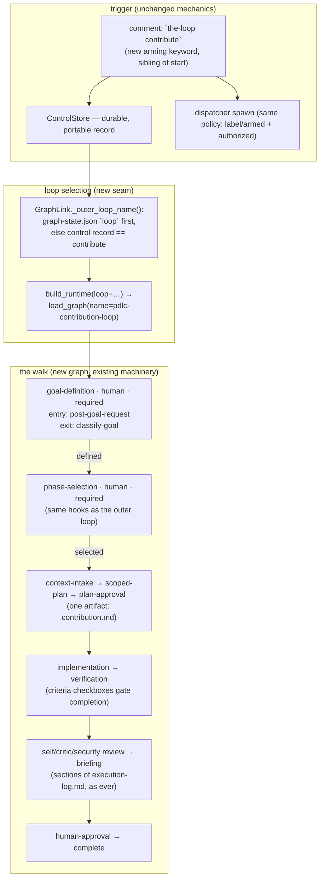

# Design: the contribution loop

> Phase 2. Derived from [requirements.md](requirements.md). Ticket:
> [#185](https://github.com/MadaraUchiha-314/the-loop/issues/185). Decision:
> [decision-070](../../decisions/decision-070.md).

## Architecture

The whole feature is **one new graph plus the smallest set of seams to select it**.
Nothing about the runtime, the state files, the dispatcher's event flow, phase
selection or the review machinery is re-invented — the contribution loop is a third
customer of all of it.

### The graph: `pdlc-contribution-loop`

Shipped as package data beside the two existing loops, compiled by the same
`compile_graph`, warned-on when a repository tries to override it. Nodes, in walk
order (†required — the two structural invariants; every other node is skippable, the
issue-179 stance):

| Node | Actor | Gate |
|---|---|---|
| `goal-definition`† | human | `classify-goal` — waits for an authorized goal + success criteria |
| `phase-selection`† | human | `classify-phase-selection` — unchanged, reads THIS graph's rows |
| `context-intake` | agent | `contribution.md` sections *Goal, Success criteria, Context* |
| `scoped-plan` | agent | `contribution.md` **locked**, + *Approach, Verification plan, Verification results* |
| `plan-approval` | human | `classify-feedback`; feedback recorded into `contribution.md` |
| `implementation` | agent | `verify-tests` (the pdlc-pr-loop shape — no task DAG to gate) |
| `verification` | agent | all checkboxes complete + *Verification results*; execution-log fallback when the plan was declared away |
| `self-review`, `critic-review`, `security-review`, `reviewer-briefing` | agent | the same execution-log sections the other loops gate |
| `human-approval` | human | `classify-feedback` |
| `complete`, `escalated` | — | terminals |

Two skip sets mirror the outer loop's vocabulary: `plan`
(context-intake, scoped-plan, plan-approval) and `review-chain`.

Phase labels: only nodes whose phase already exists in the shipped vocabulary carry
one (`phase-selection`, `implementation`, `verification`, `needs-review`, `complete`).
The contribution-specific nodes carry no `phase:` — deliberately, so consuming
repositories need no new labels and the config schema's phase list is untouched.

### The goal gate (`graph/hooks/goal.py`)

Two hooks, in the mould of `selection.py`:

- **`post-goal-request`** (entry): idempotent via an HTML marker; posts the expected
  format once. Skips posting entirely when a parseable goal already exists in the
  thread — the "goal was in the start comment" fast path, which costs the human zero
  extra round trips.
- **`classify-goal`** (exit): reads the event's comments *and* the full thread
  (`list-comments`), both filtered by the one authorization rule (named author, in
  `authorizedUsers`, not self-authored). Parses `Goal:` plus a `Success criteria:`
  bullet list; the latest qualifying comment wins. On success: posts a confirmation,
  returns `outcome: defined` with `decision: goal-definition` and the goal as data.
  The runtime's existing decision recorder persists it into `state.decisions` (the
  same mechanism that freezes the phase selection), extended by one line to carry the
  goal payload. Otherwise: `wait`, never a guess.

Reading the thread (not just the event) is load-bearing: the arming comment itself is
consumed by the control path and never forwarded, so a goal stated *in* the
`the-loop contribute` comment is only reachable by re-reading the thread — the same
reason `classify-phase-selection` re-reads its checklist comment.

### Loop selection, durably

- `control.py` gains `CONTRIBUTE` ("contribute", default keyword
  `the-loop contribute`) as a fifth+1 command; it is arming (`start_requested` counts
  it), and the dispatcher treats it exactly as `start` at both spawn seams.
- `GraphState` gains a `loop` field, written once by `Runtime.start` from the compiled
  graph's own name. Additive: absent in every existing state file, and an empty value
  reads as the shipped default for that state location.
- `bootstrap.build_runtime` gains `loop=` (outer path only); `GraphLink` resolves the
  name state-first (the recorded fact), control-record-second (the intent before the
  first start), default third. `core/graphs.py` verbs do the same state-first read, so
  `the-loop check`/`graph` on a contribution item address the right graph with no new
  flags.

### Why not auto-detect "in-progress"?

Rejected: inferring contribution mode from the item's history (has commits, has a PR,
lacks a spec dir) makes the mode a heuristic the human never declared — the exact
shape issue-177 removed from skips. Joining someone's work is a *decision*; it gets a
keyword, an authorized author and a durable record, like every other decision here.

### Minimalism

One YAML file, one hooks module, one dataclass field, one keyword, one template, one
command doc. No new dependency, no new runner, no schema change beyond the one keyword
property. The heavy alternatives — a mode flag threaded through every dispatcher path,
a second selection comment format, per-node goal plumbing — are all avoided by reusing
the decision-record and phase-selection machinery as-is.

## Security design

Every trust boundary named in the requirements is enforced at an existing choke point:

- **Comment → daemon action** (the `contribute` keyword): enforced in
  `Dispatcher.handle` — marker check, then `is_authorized` with the named-actor rule,
  then the fixed-vocabulary parser; ambiguity refuses. The new keyword adds a word to
  the vocabulary, not a path around it.
- **Comment → gate release** (the goal): enforced in `classify-goal` by the same
  authorization filter `classify-feedback` uses; the parsed goal is data with
  provenance, never a destination — routing stays with the graph's declared edges
  (abuse case 2).
- **State file → graph choice** (`loop`): the state is agent-writable, so the reader
  accepts only shipped loop names and falls back to the default otherwise; an invented
  name cannot make the runtime load an arbitrary path (fail closed).
- **Schema** (`keywords.contribute`): a `sensitivePaths` match — risk tier 4, human PR
  approval required.

## Testing strategy

Unit tests per seam (graph compiles and routes; goal parsing accepts/refuses;
keyword parses; arming counts; loop resolution prefers state, then control record;
state round-trips `loop`), plus one integration scenario walking
goal-definition → phase-selection with a stubbed integration, proving the two gates
release only on authorized input. Detailed in [testing-plan.md](testing-plan.md).
