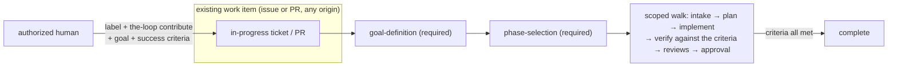

# Requirements: join an existing work item as a contributor — the contribution loop

> Phase 1 of the chain. Ticket:
> [#185](https://github.com/MadaraUchiha-314/the-loop/issues/185).

## Introduction

**the-loop can own a work item from scratch; it cannot yet be *invited into* one.**
Both shipped loops assume the work item is the-loop's own: the outer
`pdlc-work-item-loop` starts a fresh item at `phase-selection` and derives the full
spec chain; the inner `pdlc-pr-loop` walks a pull request *that loop opened*. What is
missing is the third case the ticket names: an issue or PR that already exists, is
already in progress, and was possibly produced by a bespoke process the-loop has never
seen — and a human wants the-loop to make **a scoped intervention** in it: a fix, a
small addition, a follow-up.

Three facts make the existing graphs the wrong shape for that:

| Fact about an in-progress item | Why the shipped loops mishandle it |
|---|---|
| The work already has a direction; the-loop joins for a *purpose* | `the-loop start` carries no goal, so the session would have to guess what "done" means |
| The item was not born from a the-loop spec chain | The outer loop's gates assume `requirements.md → design.md → testing-plan.md → tasks.md`; deriving all four for a small intervention bloats the item |
| The intervention may be tiny ("apply this contained instruction") | Even the lightest walk of the outer loop still frames the work as owning the whole item |

This work item adds a **contribution loop**: a third shipped graph, triggered the same
way as the others (auto-execute label → start comment → phase selection → execute
comment), that cannot start without an authorized human stating a **goal and success
criteria**, and whose phases are sized for an intervention — one lightweight artifact
instead of the four-file spec chain, with every phase selectable so a contained
instruction can run as little as implementation + verification.

## Requirements

### Requirement 1 — a third shipped graph for joining in-progress work

**User story:** As an operator, I want the-loop to walk a loop shaped for contributing
to an existing work item, so that an intervention is not forced through the
own-the-whole-item process.

- WHEN the contribution loop is loaded THEN the system SHALL compile it from a shipped
  graph definition (`pdlc-contribution-loop`), with the same node/edge/hook vocabulary,
  the same runtime and the same state files as the two existing loops.
- WHEN a repository supplies its own `pdlc-contribution-loop.yaml` THEN the system
  SHALL ignore it with a warning, exactly as it does for the other shipped loops.
- WHEN the contribution loop starts for a work item THEN the system SHALL record which
  loop the item walks in its graph state, so every later reader (daemon, CLI `check`,
  `graph` verbs) resolves the same graph without re-deriving the choice.

### Requirement 2 — no goal, no start

**User story:** As the owner of an in-progress work item, I want the-loop to refuse to
intervene until I have stated a goal and success criteria, so that "the-loop start"
alone can never produce an unscoped agent in the middle of my work.

- WHEN the contribution loop enters its first node THEN the system SHALL wait at a
  required `goal-definition` gate until an **authorized** user's comment carries a goal
  and at least one success criterion, and SHALL NOT treat the bare start/execute
  keywords as satisfying it.
- WHEN a comment stating goal and success criteria is found in the thread — including
  the very comment that carried the start keyword — THEN the system SHALL freeze
  `{goal, criteria, author}` into the work item's graph state as a decision with
  provenance, confirm it in a comment, and release the gate.
- WHEN no parseable goal exists yet THEN the system SHALL post (once, idempotently) a
  comment showing the expected format, and keep waiting.
- WHEN a goal-shaped comment comes from an unauthorized author or carries the-loop's
  own self-authored marker THEN the system SHALL ignore it (fail closed).

### Requirement 3 — the trigger stays the trigger

**User story:** As an operator, I want to invite the-loop into existing work with the
same gestures I already use, so that contribution mode is a keyword, not a new system.

- WHEN an authorized user comments the contribute keyword (default
  `the-loop contribute`, configurable as `routing.control.keywords.contribute`) on a
  labelled/armed issue or PR THEN the system SHALL treat it as an arming command
  exactly like `start` — spawn policy, durable control record, restart survival —
  and SHALL select the contribution loop for that work item's outer walk.
- WHEN a work item was armed with `start` (not `contribute`) THEN the system SHALL
  walk the existing outer loop unchanged; every pre-issue-185 behaviour is preserved.
- WHEN phase selection, execution (`the-loop execute`), monitoring of later comments,
  pause/stop/resume, and session lifecycle run for a contribution item THEN the system
  SHALL use the same mechanisms as for owned items, unchanged.
- The collaboration target MAY be a GitHub issue or a pull request, and the system
  SHALL NOT assume the item was created by the-loop (no spec-chain artifacts are
  required to exist before joining).

### Requirement 4 — phases sized for an intervention, every one selectable

**User story:** As the human declaring the intervention, I want to choose how much
process it gets — from "requirements and design are still worth writing" down to
"just do this contained instruction" — so the-loop's machinery never bloats the item.

- WHEN the contribution loop's `phase-selection` gate posts its checklist THEN the
  system SHALL list this loop's own skippable phases (context intake, scoped plan,
  plan approval, implementation, verification, the review chain, human approval), and
  the two required gates (`goal-definition`, `phase-selection`) SHALL NOT be
  selectable.
- WHEN the human keeps the planning phases THEN the system SHALL author **one**
  artifact — `contribution.md` (goal, success criteria, context, approach,
  verification plan) — in the work item's spec directory, iterated-until-locked, in
  place of the four-file spec chain.
- WHEN the human unticks every selectable planning phase THEN the system SHALL still
  run whatever remains (e.g. implementation + verification only) and route the skipped
  nodes as *skipped by declaration* with the declarer's name, exactly as issue-177/179
  defined.

### Requirement 5 — done means the criteria are met

**User story:** As the requester, I want the-loop to know when its intervention is
finished, so it stops when the job I gave it is done rather than when it runs out of
ideas.

- WHEN `contribution.md` is authored THEN the system SHALL carry the frozen success
  criteria as checkboxes in it.
- WHEN the contribution loop's `verification` node gates THEN the system SHALL block
  until every checkbox in the artifact is complete and a `Verification results`
  section records how each criterion was proved.
- WHEN the planning phases were declared away (no `contribution.md`) THEN the
  verification gate SHALL require the `Verification results` section in the execution
  log instead — a kept gate keeps a subject (the issue-124/167 rule).

### Requirement 6 — the target repository need not have adopted the-loop

> Added on PR #187 review (@MadaraUchiha-314): *"we can't depend on the fact that a
> specDir might be present … Putting it in an arbitrary place might cause the PR to
> become unclean and pollute the repo. So in those case, the contribution can just be
> commented on the PR."*

**User story:** As the owner of a repository that never ran the-loop's setup, I want a
contribution to leave no trace of the-loop's machinery in my repository, so that the
contribution PR contains only the intervention I asked for.

- WHEN the target repository carries no `.the-loop/harness-config.yaml` THEN every
  harness-config read on the contribution path SHALL degrade to the built-in defaults
  (decision-044's best-effort rule) — the loop SHALL still arm, gate and walk.
- WHEN the contribution loop starts in such a repository THEN the system SHALL keep
  the work item's spec tree (`contribution.md`, `graph-state.json`,
  `execution-log.md`) out of the repository's history **structurally** — the spec
  directory is written into the checkout's git exclude file, not merely left
  uncommitted by instruction — so the contribution PR cannot carry it.
- WHEN a human gate needs the plan (`plan-approval`) or its verification results
  (`human-approval`) in such a repository THEN the system SHALL post the artifact's
  content to the work item's thread (self-marked, best-effort): the thread is the
  review surface where the repository offers none.
- WHEN the repository does carry the harness config THEN nothing changes: the
  artifact is checked in and reviewable there, and no artifact-content comment is
  posted (the no-bloat rule of Requirement 4 stands).

## Security considerations

**Untrusted actors and trust boundaries.** This work item widens one existing trust
boundary and adds no new kind: comment text on a public repository can already cause a
daemon action through the control vocabulary (issue-106). The new `contribute` keyword
rides that exact boundary — fixed vocabulary, whole-token match, recognised only
*after* the self-authored-marker and `authorizedUsers` guards, refused outright when a
comment carries two different commands. The goal gate is a second reader of comment
text at a trust boundary: it parses goal/criteria out of comment bodies. Mitigations:
only authorized, non-self-authored comments are read at all (the `classify-feedback`
rule: not "handled carefully" — not read); the parsed text becomes a recorded *fact*
(state + confirmation comment) and a section of a reviewed artifact, never an argv, a
path, or a routing destination; the gate can only *release or hold* — no input to it
moves the pointer anywhere the graph does not declare.

**Abuse cases.**

1. *Injected goal:* an attacker comments a goal block on a watched item → not read
   unless the author is in `authorizedUsers`; a self-authored echo is dropped by the
   marker check.
2. *Goal as instruction smuggling:* an authorized-but-careless goal contains "also
   disable the reviews" → the goal never touches the phase set; only the
   `phase-selection` reply (same signed-human rule as issue-179) chooses phases, and
   the review chain still gates the execution log.
3. *Keyword collision:* a comment carrying both `the-loop start` and
   `the-loop contribute` → the existing two-different-commands refusal applies
   (nothing executed, nothing forwarded).
4. *Schema widening:* `keywords.contribute` is added to the cli-config schema
   (a `sensitivePaths` entry) → risk tier 4; the schema change is reviewed by a human
   on the PR.

**Fail-closed defaults.** No goal → the loop waits forever rather than guessing.
Empty `authorizedUsers` → no goal is ever accepted. Unknown loop name in state →
the shipped outer loop, never a guess.
