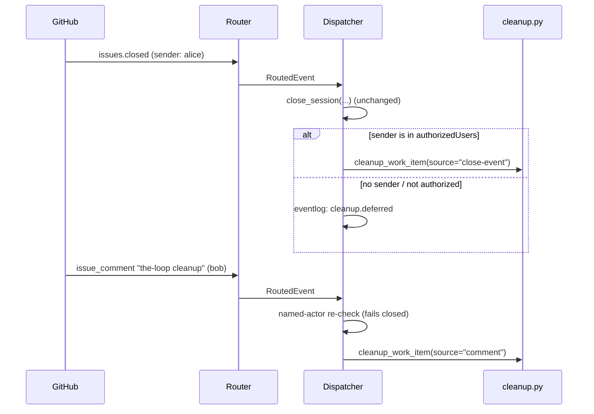

# Design: clean up after a work item is closed

> Phase 2. Derived from [requirements.md](requirements.md). Ticket:
> [#186](https://github.com/MadaraUchiha-314/the-loop/issues/186).

## Architecture

**One new module that owns the order, one new keyword that reaches it, one new graph
node that records it.** Nothing about spawning, dispatch, the registry's shape or the
workspace layout changes — cleanup is a fourth caller of seams that already exist, in
the mould of `reset.py`.

```mermaid
flowchart TB
  subgraph triggers["three triggers, one path"]
    K["comment: `the-loop cleanup`<br/>(authorized actor re-checked)"]
    X["`the-loop sessions cleanup`<br/>HTTP · MCP"]
    E["close event whose<br/>actor IS authorized"]
  end
  K --> D["Dispatcher.cleanup_work_item()"]
  X --> D
  E --> D
  D --> G["GraphLink.on_cleanup() → Runtime.cleanup()<br/>pointer → `cleanup` node, entry chain runs"]
  G --> C["cleanup.cleanup_work_item()<br/>ORDER: endpoints → checkout → record"]
  C --> S1["end_session(endpoint) — harness, then tmux kill"]
  C --> S2["remove_checkout(ref) — worktree or work-item folder"]
  C --> S3["registry.forget(ref) — the machine-local file"]
  C --> EV["eventlog: session.cleaned"]
  D -.never.-> P["portable record<br/>control · poll · graph"]
```

### Why a module rather than a method

`cleanup.py` owns **what is removed, in which order, and how a partial failure is
reported**; the dispatcher owns **how** each piece is removed, because it is what holds
the tmux runner and the workspace. The two seams are plain callables, so the ordering
logic is unit-testable with no tmux, no git and no daemon:

```python
def cleanup_work_item(
    work_item, *, registry,
    end_session: Callable[[Session], bool] | None = None,   # harness + tmux for ONE endpoint
    remove_checkout: Callable[[WorkItemRef], bool] | None = None,
    dry_run: bool = False, actor: str = "", source: str = "",
) -> CleanupOutcome
```

This is deliberately the same shape `reset_work_item` uses (`close: Closer | None`), and
for the same reason: `None` means "do not do that part", which is what a dry run and a
focused unit test both want.

### The order, and why each step is where it is

| # | Step | Why here |
|---|---|---|
| 1 | Graph pointer → `cleanup`, entry chain runs | The chain writes into the checkout (`log-entry`) and onto the ticket (`set-phase-label`); doing it after step 3 would write into a directory that no longer exists |
| 2 | Every endpoint: end the harness, then kill tmux | The harness process's cwd is inside the checkout; killing it first means step 3 is not deleting a live process's working directory |
| 3 | Remove the workspace checkout | — |
| 4 | Close, then delete the machine-local session record | Last, so a crash mid-cleanup leaves a record pointing at gone resources (recoverable: run it again) rather than orphaned resources with no record naming them |
| 5 | Record the control command / emit the event | The event is a *report* of what happened, so it cannot claim a teardown that did not run |

`PIECES = (HARNESS, TMUX, WORKSPACE, SESSION)` names the vocabulary the report, the CLI
and the event log all speak — the same trick `reset.PIECES` plays.

### Unconditional by design

`close_session` consults `routing.tmux.keepSessionOnClose` and
`routing.workspace.keepCheckoutOnClose`; cleanup consults neither. Those settings answer
"what should survive the *end of the work*" — a transcript worth reading, a checkout
worth keeping around. Cleanup is the operator saying "I am done with all of it", and a
retention default that silently made `cleanup` a no-op would be a verb that lies. This
is stated in the CLI help, the schema description and the capability doc.

### Which endpoints

A work item's record holds its own session plus one endpoint per pull request delivering
it (issue-172), and **all of them share one `cwd`** — `_spawn_endpoint` passes
`record.cwd` — so there is exactly one checkout per work item and N tmux sessions.
Cleanup walks `record.pull_requests` first and the record's own session last, so the
work item's session (the one that would notice) is the last conversation ended.

### The graph node

```yaml
- id: cleanup
  phase: cleanup
  actor: code
  terminal: true
  entry: [set-phase-label, log-entry]
  exit: []
```

**No inbound edge, on purpose.** `escalated` is the shipped precedent: a node the
runtime enters directly rather than one an outcome routes to. Making `complete` a
non-terminal predecessor was rejected — `complete` being terminal is read by
`await-inner-loops`, by `on_pr_close`, and by `_context_from`'s status derivation, and
cleanup is not something a work item *walks into* by satisfying a gate. It is entered
when the-loop tears the item down, which can happen from `complete` (the normal case) or
from any node at all (an item closed as `wontfix` mid-flight) — and entering from
mid-flight is honest: the pointer says `cleanup`, and `check --recompute` still reports
every gate that never ran.

The move is **not** `graph.runtime.force`. A force is the operator bypassing a gate: it
warns, records `graph.forced` at warning level, and posts an override announcement on the
ticket. Cleanup bypasses nothing. So `Runtime.cleanup()` is a sibling of `Runtime.start()`
— it enters a node, saves, runs the entry chain, emits `graph.cleaned` — and returns
`None` (a recorded no-op) when the graph declares no `cleanup` node, when there is no
state, or when the pointer is already there.

`GraphLink.on_cleanup` reaches it through the same `_guarded` gate order as everything
else, with one deliberate exception: **the `_awaiting_start` gate is not applied**.
That gate exists to stop work *starting* on an item nobody armed; cleanup runs at the end,
and by the time the control record is written the item is disarmed — applying the gate
would make the graph silently skip the very transition it is meant to record. `_guarded`
therefore grows one keyword-only parameter, `require_started`, defaulting to `True` so
every existing caller is unchanged.

### The keyword

`control.py` gains `CLEANUP = "cleanup"` with default keyword `the-loop cleanup`, added
to `COMMANDS` and `DEFAULT_KEYWORDS`. It joins **no** existing set:

| Set | Member? | Consequence |
|---|---|---|
| `_ARMING_COMMANDS` | no | `start_requested` is false after a cleanup — the item is durably disarmed, exactly as after a `stop` |
| `SPAWN_COMMANDS` | no | a cleanup can never conjure a session |
| `GRAPH_COMMANDS` | no | the comment is consumed by the-loop, not forwarded to the phase-selection gate |
| `TEARDOWN_COMMANDS` (new) | yes | names the one command whose effect is destruction, so the dispatcher and core branch on a constant rather than a string literal |

Recorded **unconditionally**, like the other disarming command (`stop`) and unlike the
arming ones: a cleanup that found nothing must still leave the item disarmed, or the next
event would re-spawn a session for work that has ended.

### The dispatcher's three entry points



1. **`_apply_control`** — a new `CLEANUP` branch. It does *not* require a live session
   (R4.1): `_live_session_for` may return `None` and the teardown still runs against the
   ref the router extracted.
2. **The close path** in `handle()` — after `close_session` and the existing
   `control_store.clear(...)`, cleanup runs when `event_actor` names an authorized user.
   The control record is cleared *before* cleanup so the item is not left armed if the
   teardown fails halfway, and cleanup's own record is written after.
3. **`core.sessions.control_session`** — `cleanup` joins `CONTROL_VERBS`, so the CLI, the
   HTTP route and the MCP tool all reach it through the one implementation that already
   posts the keyword comment back to the ticket.

### What is deliberately not built

- **No time- or size-based garbage collection.** Every cleanup is attributable to a named
  human or an authorized closure. A sweeper is a different work item with a different
  threat model.
- **No new `--all` selector.** `reset --all` exists because a broken CLI strands every
  item at once; cleanup is per-work-item by nature.
- **No cleanup on `pr-closed`/`pr-merged`.** Unchanged from issue-101: a work item may
  be delivered by several PRs.

## Security design

Every trust boundary from `requirements.md` § Security considerations, and where it is
enforced in this design:

| Boundary | Enforced at | Failure mode |
|---|---|---|
| Comment text → destructive action | `Dispatcher.handle` → `parse_command` (fixed vocabulary, never body text) → `is_authorized(event_actor(...))` re-check in `_apply_control` | **Closed**: no actor, or an unallowlisted one, is `_reject_control(..., "unauthorized-actor")` and nothing runs |
| Close action → destructive action | `Dispatcher.handle`'s close branch: cleanup only when `event_actor` is authorized | **Closed**: deferred with a `cleanup.deferred` record naming `no-actor` or `unauthorized-actor` |
| Work-item ref → filesystem path | `Workspace.worktree_dir` / `workitem_dir`, both `_safe_component`-validated; slug from `WorkItemRef` | Unchanged — cleanup derives **no** new paths and calls the existing `Workspace.cleanup` |
| Ambiguous command | `parse_command` returns `ambiguous` for two different keywords | **Closed**: nothing executed, nothing forwarded — the new keyword inherits this by construction |
| Untrusted text reaching the graph | `on_cleanup` passes **no** event and **no** comments to the chain | The entry chain sees only the node definition and the work item's own ref |

The one privilege this design *adds* to an authorized user is destruction of local
working state. That is the point of the verb, and it is bounded: the portable record, the
event log, the committed spec tree and everything remote are outside its reach by
construction (`cleanup.py` never touches `WorkItemStore`, and the daemon's only remote
calls on this path are the ones the graph's entry chain already makes).

## Testing strategy

Three layers, matching where each risk lives — the full matrix is in
[testing-plan.md](testing-plan.md).

- **Unit** (`cli/tests/test_cleanup.py`): the order and the reporting, with both seams as
  recording fakes. This is where "the portable record is untouched", "a missing piece is
  reported absent, not an error" and "one failing piece does not stop the rest" are
  proved, plus the pure keyword-parsing additions.
- **Integration** (`cli/tests/test_cleanup_integration.py`, Gherkin-documented per
  `testing.gherkinDocstrings`): the three triggers end to end against a real
  `SessionRegistry`, a real `Workspace` on a temp git repo and a fake tmux runner — a
  comment from an authorized user, a comment from an unauthorized one (the abuse case), a
  close event with and without a `sender`, and the retroactive case with no session
  record.
- **Graph** (`cli/tests/test_graph_cleanup.py` / extensions to the graph suites): the
  node compiles in both work-item loops and in neither the PR loop; `Runtime.cleanup`
  enters it, is idempotent, and is a no-op on a graph without the node.
