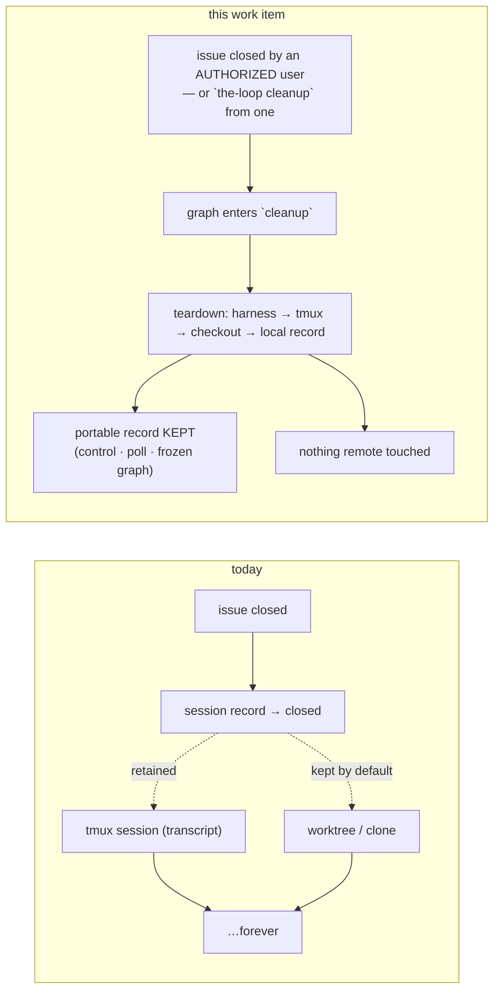

# Requirements: clean up after a work item is closed

> Phase 1 of the chain. Ticket:
> [#186](https://github.com/MadaraUchiha-314/the-loop/issues/186).

## Introduction

**the-loop accumulates local resources per work item and never fully lets go of them.**
Every started work item leaves a tmux session (plus one per pull request delivering it),
a git worktree or a full clone under the workspace root, and a machine-local session
record. When the work item ends, `close_session` transitions the record and — by default
— *keeps* both: `routing.tmux.keepSessionOnClose` retains the tmux session so its
transcript stays readable (issue-86), and `routing.workspace.keepCheckoutOnClose`
governs the checkout. Those defaults are right for the minutes after a merge and wrong
for the months after; nothing in the-loop ever comes back to reclaim them.

There is exactly one verb that removes anything today — `the-loop sessions reset`
(issue-137) — and it is the wrong tool twice over: it is a *bootstrap-and-recovery*
action that removes the **portable** record too (the poll ledger and the control state
this repository keeps precisely for persistence and tracking), and it has no trigger
except an operator's shell.

Three things make this more than "call `rmtree` on close".

| Fact | Consequence |
|---|---|
| A close action may not name **who** closed it | the-loop's authorization rule is *named authorized actor*; a closure with no identifiable actor cannot authorize a destructive act |
| The portable half of a work item's state is deliberately durable | cleanup must be surgical: local resources only, never `control`/`poll`/`graph` |
| Cleanup happens *after* the loop has finished walking | it is a step of the process, so it belongs in the graph like every other step |

The answers, in the ticket's own words: a **new control keyword** (`the-loop cleanup`,
a sibling of `the-loop start`) so a named authorized human can always ask for it — which
also makes it work **retroactively** on any work item the-loop ever tracked — and a
**`cleanup` phase in the graph** so the teardown is a recorded transition rather than an
invisible side effect.

## Requirements

### Requirement 1 — teardown removes the local runtime resources, and only those

**User story:** As an operator, I want a finished work item's local resources reclaimed,
so that a long-lived daemon does not accumulate tmux sessions and checkouts for work
that ended months ago.

**Acceptance criteria (EARS):**

1.1 WHEN the-loop cleans up a work item, THE SYSTEM SHALL end the harness process and
kill the tmux session of **every** endpoint on the work item's record — its own session
and one per pull request delivering it — regardless of
`routing.tmux.keepSessionOnClose`.

1.2 WHEN the-loop cleans up a work item, THE SYSTEM SHALL remove that work item's
workspace checkout — its git worktree under the shared clone (`worktree` strategy) or
its whole per-work-item folder (`clone` strategy) — regardless of
`routing.workspace.keepCheckoutOnClose`.

1.3 WHEN the-loop cleans up a work item, THE SYSTEM SHALL delete the machine-local
session record for it, because every handle in that record (tmux target, harness
conversation id, cwd) names something that no longer exists.

1.4 THE SYSTEM SHALL NOT remove, on any cleanup path, the **portable** record's
`control`, `poll` or `graph` sections, the shared per-repository clone, the work item's
checked-in spec tree, or the event log.

1.5 THE SYSTEM SHALL NOT perform any **remote** action as part of a cleanup beyond the
paper trail the process already posts — no branch deletion, no PR or issue state change,
no label removal, no repository write.

1.6 WHERE a resource named in 1.1–1.3 is already gone, THE SYSTEM SHALL report that
piece as absent and continue, and WHERE removing one fails, THE SYSTEM SHALL record the
failure against the work item and still attempt the rest.

### Requirement 2 — `the-loop cleanup`, a control keyword like `the-loop start`

**User story:** As an authorized user, I want to ask for cleanup by commenting on the
work item, so that I do not need shell access to the machine running the-loop.

**Acceptance criteria (EARS):**

2.1 THE SYSTEM SHALL declare a seventh control command, `cleanup`, whose default
keyword is `the-loop cleanup`, configurable at `routing.control.keywords.cleanup` and
disabled by setting it to the empty string, exactly as every other keyword is.

2.2 WHEN a comment on a work item or its pull request carries the cleanup keyword, THE
SYSTEM SHALL execute the teardown of Requirement 1 and SHALL NOT forward that comment to
the harness.

2.3 THE SYSTEM SHALL refuse a cleanup command whose actor is absent or is not in
`routing.authorizedUsers`, record the refusal, and change nothing — the same named-actor
re-check `start`/`stop` already apply, for the same reason.

2.4 WHEN a cleanup command is honoured, THE SYSTEM SHALL record `cleanup` as the work
item's last control command, so the item is durably **disarmed**: a later event must not
re-spawn a session for work that has been torn down.

2.5 THE SYSTEM SHALL make the same verb available as `the-loop sessions cleanup
--work-item <ref>` and through the control plane (HTTP `POST /sessions/control`, MCP
`control_session`), and the CLI SHALL post the equivalent keyword comment back to the
ticket — marked as the-loop's own — as the other control verbs do.

### Requirement 3 — a closure cleans up only when the closer can be named

**User story:** As an operator, I want closing the ticket to be enough on the common
path, without that becoming a way for an unnamed actor to destroy local state.

**Acceptance criteria (EARS):**

3.1 WHEN the-loop receives a close event for a work item AND the event names an actor in
`routing.authorizedUsers`, THE SYSTEM SHALL clean up that work item after closing its
session.

3.2 WHEN the-loop receives a close event for a work item AND the event names no actor,
or names one that is not authorized, THE SYSTEM SHALL close the session as it does today,
SHALL NOT clean up, and SHALL record that cleanup was deferred and why.

3.3 WHERE cleanup was deferred, THE SYSTEM SHALL still honour a later `the-loop cleanup`
from an authorized user — this is the retroactive path of Requirement 4, and it is the
stated remedy for a ticketing system whose close action carries no identity.

3.4 THE SYSTEM SHALL NOT clean up a work item because one of its **pull requests**
closed or merged: a work item may be delivered by several, and the work item's own
closure is what ends it (the issue-101 rule, unchanged).

### Requirement 4 — cleanup works retroactively, with or without a session

**User story:** As an operator, I want to point cleanup at anything the-loop ever
tracked, so that state left behind by an older version, a crash, or a deferred closure
can be reclaimed without hand-deleting directories.

**Acceptance criteria (EARS):**

4.1 WHEN an authorized user issues cleanup for a work item with **no live session** —
closed, already gone, or never registered — THE SYSTEM SHALL still remove whatever local
resources exist for it and report what it found.

4.2 WHERE a work item has a workspace checkout but no session record, THE SYSTEM SHALL
still remove that checkout, deriving its location from the work-item ref alone.

4.3 WHEN a cleanup finds nothing at all, THE SYSTEM SHALL report "nothing to clean up"
rather than an error, and SHALL still record the request.

### Requirement 5 — `cleanup` is a phase of the graph

**User story:** As a reviewer, I want the teardown to be visible in the process record,
so that "the resources were reclaimed" is a transition with a timestamp rather than
folklore.

**Acceptance criteria (EARS):**

5.1 THE SYSTEM SHALL declare a `cleanup` node, phase `cleanup`, actor `code`, terminal,
in both work-item-level shipped loops (`pdlc-work-item-loop`,
`pdlc-contribution-loop`), and SHALL NOT declare one in `pdlc-pr-loop` — a pull request
owns no workspace of its own.

5.2 WHEN the-loop cleans up a work item whose graph state exists, THE SYSTEM SHALL move
that work item's pointer to the `cleanup` node **before** removing anything, so the
node's entry chain records the transition while the checkout it writes into still
exists.

5.3 THE SYSTEM SHALL add `cleanup` to the configurable phase vocabulary
(`workflow.phases`) so the ticket carries a `loop:cleanup` label at that node.

5.4 THE SYSTEM SHALL treat the graph move as best-effort: a work item with no spec
directory, no graph state, or a graph that declares no `cleanup` node SHALL still be
torn down.

### Requirement 6 — every cleanup is on the record

**User story:** As an operator, I want to answer "what happened to that worktree" from
the event log.

**Acceptance criteria (EARS):**

6.1 WHEN a cleanup runs, THE SYSTEM SHALL emit one event naming the work item, the actor,
the source (`comment` | `cli` | `close-event`), the pieces removed and any errors.

6.2 WHEN a cleanup is deferred or refused, THE SYSTEM SHALL emit an event naming the
reason.

## Security considerations

The change adds one trust boundary and widens the blast radius of an existing one.

| Trust boundary | Threat | Control |
|---|---|---|
| **Comment text → a destructive daemon action** (new) | An attacker comments `the-loop cleanup` and destroys another user's uncommitted work in a worktree | Reached only *after* the self-authored-marker check and the ingress `authorizedUsers` check, then **re-checked** against a named authorized actor in the control path (2.3) — the strictest of the three gates, identical to `start`/`stop`. The parser yields one of the declared constants, never text from the body (`the_loop.control`), and the work item acted on is the router's own extraction. |
| **A close action with no identity → destruction** (the ticket's own concern) | A bot, an automation, or a provider whose close action omits the actor triggers a teardown nobody authorized | Fail closed: no actor, or an unauthorized one, defers cleanup (3.2). The event is recorded so the deferral is visible, and the remedy is a named human's keyword. |
| **Work-item ref → a filesystem path** | A crafted ref escapes the workspace root and deletes an arbitrary directory | Unchanged and reused: paths are built from `WorkItemRef.slug` (provider/owner/repo are `_safe_component`-validated, the number is an `int`) through the existing `Workspace` layout methods. Cleanup adds **no new path derivation** — it calls the same `Workspace.cleanup` the close path already calls. |
| **Loss of evidence** | A cleanup destroys the only record of what an agent did | The durable records are elsewhere by construction: the event log is append-only and outside the workspace, the portable record is untouched (1.4), and the spec tree and graph state are committed to the repository. What is lost is uncommitted working-tree content — which is exactly what the operator asked to reclaim, and is stated in every surface that offers the verb. |

**Abuse cases (negative tests, per `reference/security.md`):**

- *An unauthorized commenter asks for cleanup.* The teardown does not run, nothing is
  removed, and a `control.rejected` record names the actor.
- *A close event carries no `sender`.* The session closes; the tmux session, checkout
  and record survive; a `cleanup.deferred` record names the reason.
- *A pull request merges on a work item that is still open.* The PR's endpoint closes as
  before; no cleanup runs.
- *A comment carries both `the-loop cleanup` and `the-loop start`.* Ambiguity is refused
  outright — nothing executed, nothing forwarded (existing behaviour, extended to the
  new keyword by construction).

**Out of scope:** remote cleanup of any kind (branches, PRs, labels), reclaiming the
shared per-repository clone (it serves every work item on that repo), and any
time-based or automatic garbage collection — cleanup is always something a named human
or an authorized closure asked for.
