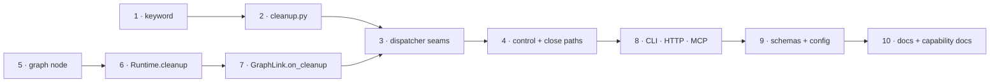

# Tasks: clean up after a work item is closed

> Derived from the approved [design.md](design.md) and [testing-plan.md](testing-plan.md).

## Task list

- [x] 1. Declare the `cleanup` control command
  - `CLEANUP = "cleanup"` in `cli/the_loop/control.py`; add to `COMMANDS`,
    `DEFAULT_KEYWORDS` (`"the-loop cleanup"`) and a new `TEARDOWN_COMMANDS`
  - Keep it out of `_ARMING_COMMANDS`, `SPAWN_COMMANDS` and `GRAPH_COMMANDS`
  - _Depends on:_ none
  - _Requirements:_ R2.1, R2.4
  - _Test:_ T1 — `pytest cli/tests/test_control.py -k cleanup` (red→green)

- [x] 2. `cli/the_loop/cleanup.py` — the order and the report
  - `HARNESS`/`TMUX`/`WORKSPACE`/`SESSION`/`PIECES`, `CleanupOutcome`,
    `cleanup_work_item(...)` with the two injected seams
  - Never touches `WorkItemStore`; per-piece error isolation; dry run
  - _Depends on:_ 1
  - _Requirements:_ R1.1–R1.6, R4.1–R4.3, R6.1
  - _Test:_ T1 — `pytest cli/tests/test_cleanup.py` (red→green)

- [x] 3. Dispatcher seams: `_end_endpoint` and `_remove_checkout`
  - Unconditional harness-terminate + tmux kill for one endpoint; unconditional
    `Workspace.cleanup` derived from the ref alone
  - `Dispatcher.cleanup_work_item(...)` composing graph move → `cleanup_work_item`
  - _Depends on:_ 2, 7
  - _Requirements:_ R1.1, R1.2, R4.2, R5.2
  - _Test:_ T2 — `pytest cli/tests/test_cleanup_integration.py` (red→green)

- [x] 4. Wire the two ingress triggers
  - `_apply_control`: a `CLEANUP` branch that runs without a live session
  - The close path: cleanup when `event_actor` is authorized, else emit
    `cleanup.deferred`
  - _Depends on:_ 3
  - _Requirements:_ R2.2, R2.3, R3.1–R3.4, R6.2
  - _Test:_ T2, T8 — `pytest cli/tests/test_cleanup_integration.py` (red→green)

- [x] 5. The `cleanup` node in the two work-item-level loops
  - `pdlc-work-item-loop.yaml` and `pdlc-contribution-loop.yaml`; **not**
    `pdlc-pr-loop.yaml`
  - _Depends on:_ none
  - _Requirements:_ R5.1
  - _Test:_ T12 — `pytest cli/tests/test_graph_cleanup.py` (red→green)

- [x] 6. `Runtime.cleanup(work_item_id, ref, reason)`
  - Enters the node, saves before the entry chain, emits `graph.cleaned`; `None`
    when the graph has no `cleanup` node, no state, or the pointer is already there
  - _Depends on:_ 5
  - _Requirements:_ R5.2, R5.4
  - _Test:_ T12 — `pytest cli/tests/test_graph_cleanup.py` (red→green)

- [x] 7. `GraphLink.on_cleanup` + `_guarded(require_started=False)`
  - The one caller that skips the `_awaiting_start` gate, documented in place
  - _Depends on:_ 6
  - _Requirements:_ R5.2, R5.4
  - _Test:_ T12 — `pytest cli/tests/test_graph_cleanup.py -k link` (red→green)

- [x] 8. The operator surfaces
  - `core.sessions`: `cleanup` in `CONTROL_VERBS` and an `_apply` branch
  - `commands/sessions_cmd.py`: the `cleanup` subparser and its help
  - HTTP/MCP inherit the verb through `control_session`
  - _Depends on:_ 4
  - _Requirements:_ R2.5
  - _Test:_ T3 — `pytest cli/tests/test_core_sessions.py cli/tests/test_api_routers_integration.py` (red→green)

- [x] 9. Schemas and shipped config
  - `.the-loop/cli-config.schema.json`: `routing.control.keywords.cleanup`
  - `.the-loop/harness-config.schema.json`: `cleanup` in `workflow.phases`
  - `.the-loop/harness-config.yaml`, both templates under `skills/the-loop/templates/`
  - _Depends on:_ 8
  - _Requirements:_ R2.1, R5.3
  - _Test:_ T13 — `pytest cli/tests/test_harness_gate.py cli/tests/test_docs_parity.py` (red→green)

- [x] 10. Documentation and capability docs
  - `docs/config/cli/routing-options.md`, `docs/cli/commands/sessions.md`,
    `docs/cli/state.md`
  - `docs/capabilities/interactive-sessions.md`, `webhook-triggers.md`,
    `process-graph.md`
  - `skills/the-loop/reference/automation.md`, `workflow.md`; `README.md`
  - _Depends on:_ 9
  - _Requirements:_ R2.5, R5.3, R6.1
  - _Test:_ T13 — `pytest cli/tests/test_docs_parity.py` (red→green)
