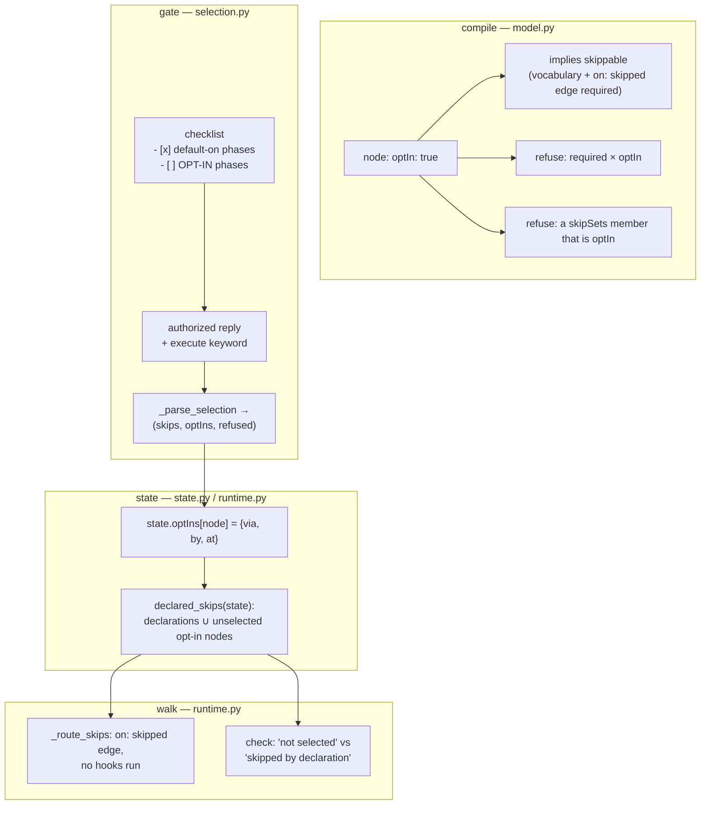

# Design: an opt-in critic review of the locked design

> Phase 2 of the chain. Derives from `requirements.md` (approved).

## Overview

**One new node marker carries the whole feature.** `optIn: true` is the mirror image of
`skippable: true`: same vocabulary, same gate, same provenance, opposite default. The
shipped outer loop then uses it once — `design-critic-review`, sitting between `design`
and `test-planning` — and everything else is rendering and reporting that difference
honestly.

The change touches four layers and adds no fifth:

| Layer | File | What changes |
|---|---|---|
| Compile | `cli/the_loop/graph/model.py` | parse `optIn` + `description`; two new compile-time refusals; `optIn` implies `skippable` |
| State | `cli/the_loop/graph/state.py` | `optIns: {node → provenance}`, additive and defaulting to `{}` |
| Runtime | `cli/the_loop/graph/runtime.py` | default-skip an unselected opt-in node; record a selection; report *not selected* |
| Gate | `cli/the_loop/graph/hooks/selection.py` | a second checklist section, a third parse outcome, a fuller confirmation |
| Process | `cli/the_loop/graph/pdlc-work-item-loop.yaml` | the `design-critic-review` node and its two edges |

## Architecture



The load-bearing idea is that **an unselected opt-in node is expressed as a skip**, not as
a new traversal concept. `declared_skips` is already documented as "the ONE defensive
read" that every consumer — routing, `check`, `--recompute`, `skipped_artifacts` — goes
through. Folding the default there means the new node is routed around, reported and
audited by code that already exists and is already tested; nothing else in the runtime
learns a new word. The cost is one honest distinction to preserve: a skip that a person
declared and a phase nobody asked for are both "not walked", and a reviewer must be able
to tell them apart. That is `via: not-selected` and one branch in `_skip_provenance`.

## Components & interfaces

### `model.py` — the vocabulary

```python
@dataclass(frozen=True)
class Node:
    ...
    #: Is this node OFF unless a human selects it (issue-188)? The mirror of
    #: `skippable`: same gate, same provenance, opposite default.
    opt_in: bool = False
    #: One line rendered beside this node's phase-selection row.
    description: str = ""
```

- `_build_node` maps `optIn`/`description`, and sets `skippable = skippable or optIn` so
  an opt-in node joins the declared-skip vocabulary (and therefore inherits the
  "declares its own `on: skipped` edge" compile check, unchanged).
- Two refusals, both raising `GraphConfigError` naming the node:
  - `required` × `optIn` (R1.2). `required` × `skippable` is already refused; the implied
    `skippable` would make this fire with a message about a marker the author did not
    write, so it is checked explicitly first and says what it means.
  - a `skipSets` member with `opt_in` (R1.3), in the loop that already validates members.
- `as_mapping()` gains `"optIn"` and `"description"` — it is what `ctx.node` hands hooks.

### `state.py` — the record

```python
#: Selected opt-in phases (issue-188): node id -> {via, by, at}.
optIns: Dict[str, Dict[str, Any]] = field(default_factory=dict)
```

Additive and defaulting to `{}` on load, exactly as `skips` was: a pre-issue-188 state
file selects nothing, which is the correct reading of a work item that was never offered
the choice. Serialized as `optIns` in `as_dict()`.

### `runtime.py` — default, route, record, report

```python
def declared_skips(self, state) -> Dict[str, Dict[str, Any]]:
    out = {}
    for node_id, decl in (state.skips or {}).items():
        node = self.graph.nodes.get(node_id)
        if node is not None and node.skippable and not node.required:
            out[node_id] = dict(decl) if isinstance(decl, Mapping) else {}
    for node in self.graph.ordered():                       # issue-188
        if node.opt_in and node.id not in out and not self.selected(state, node.id):
            out[node.id] = {"via": NOT_SELECTED}
    return out
```

- `selected(state, node_id)` is the mirror filter of `declared_skips`: an entry in
  `state.optIns` counts only when the compiled graph marks that node `optIn` (R1.7).
- `invalid_skips` is unchanged and still reports only forged *skip* entries; a forged
  `optIns` entry grants nothing (it can only fail to remove a default skip), so it needs
  no separate surfacing.
- `_record_selected_skips` — already the single writer for what the gate returns — also
  consumes `result.data["optIns"]`, applying the same two guards it applies to skips
  (the compiled graph marks the node, and the pointer has not already entered it) and
  emitting `graph.opt_ins_selected` beside `graph.skips_declared`.
- `_skip_provenance` branches on `via == "not-selected"` and returns
  *"not selected — an opt-in phase, off unless it is ticked at `phase-selection`"*, so
  `check` never dresses an unrequested phase as somebody's declaration (R1.5).

### `selection.py` — the checklist and the reply

`_phase_rows` returns a third list. Opt-in nodes are excluded from the default-on rows
(they are `skippable`, so an unfiltered list would print them twice) and, being skippable,
they were never in `protected`:

```python
def _phase_rows(ctx) -> Tuple[List[str], List[str], List[str]]:   # (default_on, opt_in, protected)
```

The checklist grows one section between the phases and the surface row:

```text
**Optional phases — off unless you tick them.** These do not run by default:

- [ ] design-critic-review — a different model reviews the locked design.md …
```

`_parse_selection` returns `(skips, opt_ins, refused)`. Per checkbox row:

| Row | Ticked | Unticked | Absent from the reply |
|---|---|---|---|
| default-on (`skippable`) | runs | declared skip | runs (unchanged) |
| **opt-in** | **selected → runs** | not selected | not selected |
| protected | runs | refused + named | runs |

The "absent" column is where the default lives, and it needs no code in the parser: an
opt-in node the reply never mentions simply never reaches `state.optIns`, and the runtime
default-skips it. That is also what makes an unreadable checklist, a truncated reply and a
deleted comment all fail to *off* (R2.4, fail-closed).

`_frozen_graph` gains `"optIn": bool(node.opt_in)` per node and marks an unselected opt-in
node `"skipped": true`, so the portable record distinguishes *nobody asked for it* from
*somebody removed it* (R1.8). `_confirmation` gains one line naming the selected opt-in
phases, or — when the loop offered some and none were chosen — one line saying so (R2.5).

### `pdlc-work-item-loop.yaml` — the shipped phase

```yaml
  - id: design-critic-review
    actor: agent
    optIn: true             # OFF unless selected at phase-selection (issue-188)
    description: >-
      a different model reviews the locked design.md against the requirements,
      before the testing plan and task DAG are derived from it
    stage: critic-review
    entry: [log-entry, deliver-assignment]
    exit:
      - {hook: validate-artifacts, with: {validates: execution-log.md, sections: ["Design critic review"]}}
```

Edges: `design → design-critic-review` on `pass` and on `skipped` (the skipped edge of
`design` moves one node along), plus `design-critic-review → test-planning` on `pass` and
on `skipped`. Node placement is immediately after `design` in declaration order, which is
also the order `check` reports in.

**No `phase:`**, deliberately, and for the same reason `critic-review` and
`security-review` carry none: the phase label is the coarse public state of the work item,
and this node happens *within* the design phase. A new label would have to be created in
every consuming repository and added to `workflow.phases` in every config, for a phase most
work items never walk. The `test_p4_the_graph_defines_the_phase_sequence` parity test is
therefore satisfied without touching either shipped config.

### `execution-log.md` — the subject the gate reads

A new `## Design critic review` section, gated by the node and shipped in the template
(the P5c parity test requires exactly that: every validated section exists in the
validated artifact's template). It is a section of its own rather than a row in
`## Review cycles` because the six review-chain nodes already prove the pattern — one
gate, one section — and folding it into the shared table would let a node pass on a row
another node wrote.

## Data models

`graph-state.json` gains one key, additive:

```json
{
  "skips": { "brainstorming": { "via": "selection", "by": "@user", "at": "…" } },
  "optIns": { "design-critic-review": { "via": "selection", "by": "@user", "at": "…" } }
}
```

The frozen graph's node entries gain `optIn`:

```json
{ "id": "design-critic-review", "phase": "", "skipped": false, "selectable": true, "optIn": true }
```

## Error handling

- **Compile faults are startup faults.** Both new refusals raise `GraphConfigError` at
  load, naming the node (and the set), consistent with every other structural check.
- **Best-effort remains best-effort.** The checklist post, the confirmation comment and
  the frozen-graph publish keep their existing failure behaviour; none of them gates the
  selection.
- **Every unreadable path resolves to off** for an opt-in node — the fail-closed direction
  for a phase that adds a review rather than gating one.

## Security design

- **AuthN/AuthZ:** unchanged. The selection is authorized exactly as before —
  `_authorized_comments` drops the-loop's self-authored comments, then filters by
  `routing.authorizedUsers`, then requires the execute keyword. Ticking an opt-in box is
  the same act as unticking a default-on one, by the same person, at the same gate.
- **Input validation & injection surfaces:** the reply is parsed by the existing
  `_CHECK_LINE` regex and every token is matched against compiled node ids; an unknown
  token is refused or ignored as it is today. The new `description` field is authored in
  the shipped graph (package data, not repo-supplied) and is the only new text reaching a
  posted comment — no payload text reaches it.
- **Secrets handling:** none stored, read or moved.
- **Least privilege:** `optIns` can only *add* a phase. A forged entry cannot remove a
  gate, pass a node, or excuse an artifact — the widest possible abuse is causing an extra
  review to run.
- **Fail-closed behaviour:** stated above; the direction is *off* for opt-in nodes, which
  is the safe direction because no gate depends on this node's output.
- **Abuse-case coverage:**

  | Abuse case | Mechanism | Test |
  |---|---|---|
  | Unauthorized commenter ticks and executes | `_authorized_comments` (pre-existing) | `test_unauthorized_reply_does_not_select` |
  | Hand-edited `optIns` on a non-opt-in node | `selected()` filters through the compiled graph | `test_forged_opt_in_on_a_normal_node_is_inert` |
  | Hand-edited `optIns` deleted | node reverts to *not selected*; `check` reports it as such, never `pass` | `test_check_reports_an_unselected_opt_in_node_as_not_selected` |
  | Critic output carrying instructions | `reference/reviewing.md`, unchanged | — (documented rule) |

## Testing strategy

Three groups, mirroring the three-party split the declared-skip tests already use
(compile / declare / route & report), added to `cli/tests/test_graph_skips.py` beside the
mechanism they extend, plus the shipped-graph shape assertions in the same file's M2
group. Unit tests cover the compiler refusals, the parser's three-way outcome, the
runtime default and the provenance line; an integration test walks a miniature graph end
to end twice — once selecting the opt-in node, once leaving it — and asserts the pointer,
the state file and the `check` report in both. The full detail, and what is `n/a` and why,
is in `testing-plan.md`.

## Trade-offs & decisions

- **`optIn` as a node marker, not a config key.** A config key (`workflow.optIn: [...]`)
  would let a repository turn a phase on for every work item, which is exactly the
  "imposed on items that never asked" this ticket avoids — and it would put process shape
  back in a file, after issue-183 deliberately moved a sibling choice out of one.
- **`optIn` implies `skippable` instead of being a third state.** The alternative — a
  parallel `opt_in_sets`, a parallel filter, a parallel report — duplicates the entire
  declared-skip machinery for a difference that is one boolean at render time.
- **The unselected node is a skip with `via: not-selected`.** Rejected alternative: a new
  `NOT_SELECTED` status in `check`. Every consumer of `declared_skips` would have to learn
  it, and `check`'s output contract would change for a case that reads perfectly as a skip
  with an honest reason.
- **The round records into `execution-log.md`, not `design.md`.** The design is the
  subject under review; a review that writes its own findings into its subject makes the
  locked artifact's history unreadable. The execution log is where every other round is
  recorded already.
- **Recorded as [decision-071](../../decisions/decision-071.md).**

## Open questions

None.

## Review comments

> Appended by the-loop's `record-feedback` hook when a human gate approves with comments.
