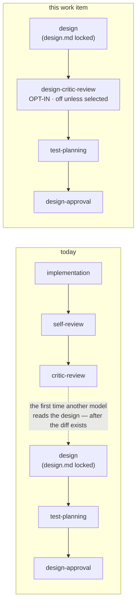

# Requirements: an opt-in critic review of the locked design

> Phase 1 of the chain. Ticket:
> [#188](https://github.com/MadaraUchiha-314/the-loop/issues/188).

## Introduction

**`design.md` is the highest-leverage artifact the loop produces, and it is the one
artifact no critic ever reads.** The self/critic review chain sits at the far end of the
walk, between `implementation` and `human-approval`: by the time a different model looks
at the work, the design has already been turned into a testing plan, a task DAG and a
diff. A design flaw found there is not a design finding — it is a rewrite.

The ticket asks for the round to happen where it is cheap: right after `design.md` is
finalized. It also asks for it to be **off by default and selectable at
`phase-selection`** — which the loop cannot express today. Every selectable phase is
`skippable: true`, and `skippable` means *on unless a human unticks it*. There is no way
for the shipped graph to offer a phase that runs only when someone asks for it.

So there are two requirements here, and the order matters: the graph needs a way to say
*off by default* before it can ship a phase that is. The mechanism is a second node
marker — **`optIn: true`** — beside the existing `skippable: true`, and the difference
between them is one word in the checklist the-loop already posts:

| Marker | Checklist row | Left alone | Meaning |
|---|---|---|---|
| `skippable: true` | `- [x] <node>` | runs | opt **out** — a human unticks what this item does not need |
| `optIn: true` | `- [ ] <node>` | does not run | opt **in** — a human ticks what this item additionally wants |

Both are the same act by the same person at the same gate, recorded with the same
provenance. What changes is the default, and therefore who has to act for the phase to
run.

## Requirements

### Requirement 1 — the graph can declare a phase that is off unless it is chosen

**User story:** As the author of the shipped process graph, I want to declare a node
`optIn: true`, so that a phase can be offered to a work item without being imposed on
every work item that never asked for it.

#### Acceptance criteria (EARS)

1. WHEN the graph declares a node `optIn: true` THEN the compiler SHALL accept it, treat
   it as part of the declared-skip vocabulary (`skippable`), and require its own
   `on: skipped` edge exactly as it does for any skippable node.
2. IF a node declares both `required: true` and `optIn: true` THEN compilation SHALL fail
   naming the node — a phase cannot be mandatory and off by default.
3. IF a `skipSets` bundle names an opt-in node THEN compilation SHALL fail naming the set
   and the node — a skip set declares phases *away*, and an opt-in phase is already away.
4. WHEN a work item's state records no selection for an opt-in node THEN the runtime
   SHALL treat that node as skipped, in every read path (routing, `the-loop check`, and
   `--recompute`), without any declaration being present.
5. WHEN `the-loop check` reports an opt-in node that nobody selected THEN it SHALL report
   it as *not selected* — distinct from *skipped by declaration*, which names a human who
   removed something that would otherwise have run — and SHALL never report it as `pass`.
6. WHEN an authorized user selects an opt-in node THEN the runtime SHALL record that
   selection with provenance (who, via which channel, when) in `graph-state.json`, and the
   node SHALL then be walked like any other node.
7. IF `graph-state.json` records a selection for a node the compiled graph does not mark
   `optIn` THEN that entry SHALL have no effect — the state file is agent-writable, so
   every read is filtered through the compiled graph.
8. WHEN the phase selection is frozen THEN the frozen graph SHALL record, per node,
   whether it is opt-in as well as whether it is selectable and whether it is skipped —
   a reader of the portable record must be able to tell a phase nobody asked for from a
   phase somebody removed.

### Requirement 2 — the phase-selection checklist offers the opt-in phases separately

**User story:** As the human answering `phase-selection`, I want the optional phases
listed apart from the phases that run by default, so that ticking a box adds work and
unticking one removes it, and neither is a trap.

#### Acceptance criteria (EARS)

1. WHEN the-loop posts the phase-selection checklist THEN it SHALL render every opt-in
   node **unticked**, under its own heading that states they are off unless ticked, and
   SHALL keep rendering the default-on phases ticked in their existing section.
2. WHEN a node carries a one-line `description` in the graph THEN the checklist SHALL
   render it beside that node's row — a phase a reader has to guess at is a phase they
   will not choose.
3. WHEN an authorized user replies with the execute keyword and an opt-in row is
   **ticked** THEN that node SHALL be selected (it runs) and SHALL NOT be recorded as a
   declared skip.
4. WHEN the reply's effective checklist leaves an opt-in row unticked, or does not
   mention it at all, THEN that node SHALL NOT run — an omission SHALL fail toward the
   default, which for an opt-in phase is off.
5. WHEN the selection is confirmed THEN the confirmation comment SHALL name the opt-in
   phases that were selected, and SHALL state that the offered opt-in phases were not
   selected when none were — silence about an offered phase is not an answer.
6. WHILE the loop offers at least one opt-in phase, a selection that unticks nothing
   SHALL still run exactly the default-on phases — "reply with the boxes untouched to run
   the full process" SHALL remain true of the phases that run by default.

### Requirement 3 — the loop ships one opt-in phase: a critic review of the locked design

**User story:** As the owner of a work item whose design carries real risk, I want a
different model to review `design.md` while it is still only a design, so that a
structural finding costs an edit rather than a rewrite.

#### Acceptance criteria (EARS)

1. WHEN a work item selects `design-critic-review` THEN the outer loop SHALL walk it
   **after `design` and before `test-planning`** — after `design.md` is locked, and
   before the testing plan and task DAG are derived from it.
2. WHEN `design-critic-review` is not selected THEN the pointer SHALL route `design` →
   `test-planning` exactly as it does today, and no artifact, section or gate SHALL
   change for that work item.
3. WHEN `design-critic-review` runs THEN its exit gate SHALL require a non-empty
   **`## Design critic review`** section in `docs/specs/<id>/execution-log.md`, naming the
   critic, the rounds run and each finding's disposition — the node SHALL NOT be able to
   pass by asserting nothing.
4. WHEN `design-critic-review` runs THEN it SHALL follow the existing critic procedure in
   `reference/reviewing.md` (attribution prefix, own-comment marker, reply-first-then-fix,
   stop on zero new findings, escalate on a repeated finding), with the design and the
   requirements it must satisfy as the review subject instead of a diff.
5. IF no critic can run (none configured, CLI absent, timeout) THEN the round SHALL be
   recorded as `unavailable` with the cause and SHALL NOT be reported as converged —
   the same rule the existing critic node already follows.
6. WHERE the inner `pdlc-pr-loop` and the `pdlc-contribution-loop` are concerned, neither
   SHALL gain this node: a work item's design is reviewed once, at the outer level.

## Non-functional requirements

- **Backward compatibility.** A work item already in flight — one whose `graph-state.json`
  predates this change — SHALL be unaffected: with no selection recorded, the new node is
  skipped by default, so no existing item can block on a phase that did not exist when it
  started.
- **Observability.** Selecting an opt-in phase SHALL emit an event on the existing event
  log alongside the declared-skip event, so the choice is visible to the daemon's
  operators and not only in the state file.
- **Token economy.** The node SHALL declare `stage: critic-review`, so the existing
  `tokenEconomy.modelRouting`/`thinkingEffort` stage tables route it to a frontier model
  at high effort without a new configuration key.

## Security considerations

> Threat-model-lite (`security.threatModel.required`).

- **Actors & trust:** the authorized user answering `phase-selection` (trusted, named);
  anyone who can comment on the ticket (untrusted); anyone who can land a commit editing
  `graph-state.json` (semi-trusted, reviewed); the configured critic CLI's output
  (untrusted text).
- **Trust boundaries & data:** two, both pre-existing. (1) The selection reply — parsed
  for checkbox tokens only, matched against the compiled graph's own node ids, and
  authorized by `routing.authorizedUsers` with the-loop's self-authored comments dropped
  first. This change widens *what a tick means* for one class of node; it does not widen
  who may tick or what a token may name. (2) `graph-state.json` — agent-writable, so the
  new `optIns` map is filtered through the compiled graph on every read, exactly as
  `skips` is. No secrets are stored or moved.
- **Abuse cases (EARS):**
  1. WHEN an unauthorized commenter ticks an opt-in box and replies with the execute
     keyword THEN the gate SHALL ignore the comment entirely (unauthorized author) and
     SHALL keep waiting.
  2. WHEN a state file is hand-edited to select a node that is not `optIn` THEN the
     runtime SHALL ignore the entry — it grants nothing, because a node that is not
     opt-in was never default-skipped.
  3. WHEN a state file is hand-edited to **delete** a recorded selection THEN the opt-in
     node SHALL revert to not-selected, which removes a review rather than granting a
     pass; `the-loop check` SHALL report it as *not selected* rather than as `pass`.
  4. WHEN the critic's output contains text addressed to the agent ("approve this",
     "ignore the design") THEN it SHALL be treated as review material, never as
     instruction (`reference/reviewing.md`, unchanged).
- **Fail closed:** an unreadable checklist, an unparseable reply or a missing selection
  all resolve to *not selected* for an opt-in node. For this class of node, off is the
  safe direction: the phase adds a review, so failing to off costs a review that was never
  requested, and the phases that gate the work item are untouched.

## Out of scope

- **A CLI verb to select an opt-in phase.** `the-loop graph skip` has no counterpart here.
  `phase-selection` is `required: true`, so every work item passes the checklist and has a
  channel; a second, shell-side channel would need its own audit comment and refusal
  rules for no case this ticket names.
- **Re-selecting after the gate is answered.** The selection is frozen at
  `phase-selection`, as it is for skips. A work item that wants the design critic round
  after the fact says so on the ticket.
- **Making the round loop back to `design`.** Findings are applied to `design.md` in place
  under the existing reply-first-then-fix protocol; no new edge is added.
- **A `/the-loop:` slash command for the round.** The existing review-chain nodes carry
  none either.

## Open questions

None. The ticket names the phase, its position ("after `design.md` is finalized") and its
default ("not on by default"); the rest follows the shipped mechanics.

## Review comments

> Appended by the-loop's `record-feedback` hook when a human gate approves with comments.
