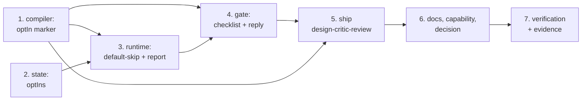

# Tasks: an opt-in critic review of the locked design

> Derived from the approved `design.md` and `testing-plan.md`.

## Task list

- [x] 1. Teach the compiler the `optIn` marker
  - `Node.opt_in` / `Node.description` in `cli/the_loop/graph/model.py`, mapped in
    `_build_node` and exposed in `as_mapping()`
  - `optIn` implies `skippable` (vocabulary membership + the existing `on: skipped` edge
    requirement)
  - refuse `required` × `optIn` explicitly, before the implied `skippable` makes the
    existing message misleading
  - refuse a `skipSets` member that is `opt_in`
  - _Depends on:_ none
  - _Requirements:_ R1.1, R1.2, R1.3
  - _Test:_ `T1 — pytest cli/tests/test_graph_skips.py -k "opt_in and compile"` (red→green)

- [x] 2. Record a selection in the graph state
  - `GraphState.opt_ins` (`optIns` on disk), additive, defaulting to `{}` on load
  - round-trips through `load`/`as_dict`; a pre-issue-188 file loads with no selection
  - _Depends on:_ none
  - _Requirements:_ R1.6, NFR backward compatibility
  - _Test:_ `T1/T10 — pytest cli/tests/test_graph_state.py -k opt_in` (red→green)

- [x] 3. Default-skip an unselected opt-in node, and say so honestly
  - `Runtime.selected()` — the mirror filter of `declared_skips`, honouring an entry only
    when the compiled graph marks the node `optIn`
  - `declared_skips()` folds in every unselected opt-in node as `{"via": "not-selected"}`
  - `_skip_provenance` branches on that marker so `check` reports _not selected_, never
    _skipped by declaration_ and never `pass`
  - `_record_selected_skips` consumes the gate's `optIns`, applying the same
    already-entered and vocabulary guards, and emits `graph.opt_ins_selected`
  - _Depends on:_ 1, 2
  - _Requirements:_ R1.4, R1.5, R1.6, R1.7
  - _Test:_ `T1/T8 — pytest cli/tests/test_graph_skips.py -k "opt_in and (route or report or forged)"` (red→green)

- [x] 4. Offer the opt-in phases at `phase-selection`
  - `_phase_rows` returns `(default_on, opt_in, protected)`; opt-in nodes are excluded
    from the default-on rows
  - `_checklist_body` renders an "Optional phases" section with unticked rows and each
    node's `description`
  - `_parse_selection` returns `(skips, opt_ins, refused)`: ticked opt-in → selected,
    unticked → not selected, absent → not selected
  - `_confirmation` names the selected opt-in phases, or says none were selected
  - `_frozen_graph` carries `optIn` per node and marks an unselected opt-in node skipped
  - `classify_phase_selection` returns `optIns` in its result data
  - _Depends on:_ 1, 3
  - _Requirements:_ R2.1–R2.6, R1.8
  - _Test:_ `T1/T8 — pytest cli/tests/test_graph_skips.py -k "opt_in and (checklist or reply or unauthorized)"` (red→green)

- [x] 5. Ship the `design-critic-review` node
  - the node in `cli/the_loop/graph/pdlc-work-item-loop.yaml` between `design` and
    `test-planning`, `optIn: true`, `stage: critic-review`, gating the execution log's
    `Design critic review` section; four edges (`pass`/`skipped` in, `pass`/`skipped` out)
  - the `## Design critic review` section in
    `skills/the-loop/templates/execution-log.md` (P5c parity)
  - assert the inner PR loop and the contribution loop declare no opt-in node
  - _Depends on:_ 1, 4
  - _Requirements:_ R3.1, R3.2, R3.3, R3.6
  - _Test:_ `T2/T12 — pytest cli/tests/test_graph_skips.py -k "opt_in and shipped" cli/tests/test_graph_parity.py` (red→green)

- [x] 6. Write the procedure down where a reviewer reads it
  - `reference/reviewing.md` — the design critic round: subject, prompt contents, where it
    is recorded, the `unavailable` rule
  - `reference/workflow.md` — opt-in phases beside declared skips, and the sequence
  - `SKILL.md` — one sentence in the selection rule
  - `docs/capabilities/process-graph.md` + `review-loop.md` + `capabilities.md` history rows
  - `docs/decisions/decision-071.md` + the decisions index
  - _Depends on:_ 5
  - _Requirements:_ R3.4, R3.5
  - _Test:_ `T12 — pytest cli/tests/test_docs_parity.py cli/tests/test_writing_parity.py`

- [x] 7. Verify: run the plan, capture the evidence
  - every activity in `testing-plan.md`, ticked only once run; results and evidence
    committed under `evidence/`
  - _Depends on:_ 6
  - _Requirements:_ all
  - _Test:_ `T1–T13 + full suite`

## Dependency graph (DAG)

## Checkpoints

After tasks 3, 5 and 6: run the targeted suites named in each task's `_Test:_`, then
`make lint typecheck`, and append the outcome to `execution-log.md`. After task 7 the
`verification` node's record is complete and the review chain runs (self → critic →
security), followed by the capability/documentation gates and the reviewer briefing.

## Review comments

> Appended by the-loop's `record-feedback` hook when a human gate approves with comments.
