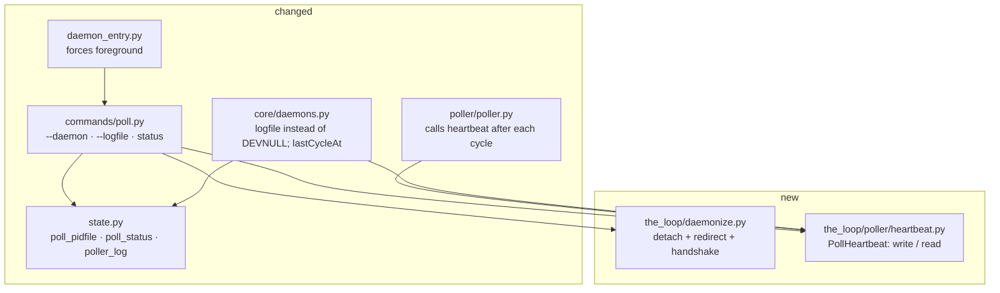

# Design: `poll start` runs as a proper daemon

> Phase 2 of the chain. Derives from the approved
> [`requirements.md`](requirements.md). Ticket:
> [#191](https://github.com/MadaraUchiha-314/the-loop/issues/191).

## Overview

**Three small pieces, none of which changes how a cycle runs.** A detach primitive that
knows nothing about polling; a heartbeat the poller writes after each cycle; and a
`status` action that reads the lock and the heartbeat and prints one answer. `poll start`
gains one setting (`--daemon` / `--foreground`, default foreground) and one path
(`--logfile`); the run loop, the dispatcher and the ledger are untouched.

The load-bearing choice is **where the lock is taken**. The pidfile is already the
single-instance lock ([issue-159](https://github.com/MadaraUchiha-314/the-loop/issues/159)),
so "who is running" and "how do I signal them" are one fact — and that fact stays true
only if the process that *holds* the lock is the one that survives. So the forks happen
**before** the existing `_start` body, and everything after it — lock, dependency checks,
the run loop — happens unchanged in the daemon.

```mermaid
sequenceDiagram
    participant Sh as operator's shell
    participant P as poll start (original)
    participant C as intermediate child
    participant D as daemon (grandchild)
    Sh->>P: poll start --daemon
    P->>P: open logfile (fails here = no fork)
    P->>P: probe lock — held? refuse, exit 1
    P->>C: fork()
    C->>C: setsid() — new session, no tty
    C->>D: fork()
    C-->>P: _exit(0) — reaped, no zombie
    D->>D: dup2 logfile → stdout/stderr, /dev/null → stdin
    D->>D: RunLock.acquire() → pidfile = D's pid
    D->>D: dependency + provider checks
    D-->>P: ready(pid) over the handshake pipe
    P-->>Sh: "poller started (pid N); logging to …" exit 0
    D->>D: run loop … heartbeat after every cycle
```

The dashed edge is what makes `--daemon` reportable: the daemon signals **after** it holds
the lock and has passed its checks, so the original process's exit code is a statement
about the daemon, not about `fork()`.

## Architecture



Nothing in `daemonize.py` knows what a poller is, and nothing in `heartbeat.py` knows what
a daemon is. That is deliberate: `gh-webhook start --daemon` is a follow-up ticket, and it
should need no new primitive.

## Components & interfaces

### `the_loop.daemonize` (new)

One public function with a `fork()`-shaped contract, plus the daemon's half of the
handshake.

```python
def daemonize(logfile: Path, *, timeout: float = 60.0) -> Optional[int]:
    """Detach into a daemon whose stdout/stderr append to *logfile*.

    Returns ``None`` **in the daemon** — execution continues, and the caller MUST
    call :func:`notify_ready` once it is genuinely up.

    Returns **in the original process** the daemon's pid, or ``0`` when the daemon
    exited (or timed out) without ever reporting itself up. The caller must exit.
    """

def notify_ready() -> None:
    """Report this daemon as up to the process that started it. A no-op when not daemonized."""
```

| Step | Why exactly this |
|---|---|
| open the logfile first, `O_APPEND \| O_CREAT` | R2.4 — a start with nowhere to log fails in the operator's terminal, before any fork |
| `os.pipe()` before the first fork | the only channel back; the original closes its write end so EOF is meaningful |
| `fork` → parent waits on the pipe | the original is the one holding the operator's stderr and exit code |
| `setsid()` in the child | a new session and process group: no controlling terminal, no group teardown to inherit |
| `fork` again → intermediate `_exit(0)` | the daemon is not a session leader, so it can never *re*-acquire a controlling terminal |
| `waitpid` the intermediate in the original | it exits immediately; reaping it is what keeps `poll start` from leaving a zombie behind |
| `dup2` in the daemon only | fds 0/1/2 are replaced after the last fork, so nothing the original prints is redirected |
| **no** `chdir("/")` | R1.6 — every path the poller resolves is relative to the cwd |

The handshake is a raw pipe rather than a file or a signal for one reason: **EOF is free**.
If the daemon dies at any point before `notify_ready()`, the kernel closes its write end,
the original's `read` returns empty, and the failure is reported with no timer involved.
The timeout only covers a daemon that is alive but wedged.

### `the_loop.poller.heartbeat` (new)

```python
@dataclass(frozen=True)
class Heartbeat:
    pid: int
    started_at: str          # ISO-8601 Z, when this poller took the lock
    last_cycle_at: str       # ISO-8601 Z, end of the most recent cycle ("" = none yet)
    interval_seconds: int
    last_cycle: dict         # the PollSummary counters, camelCase

class PollHeartbeat:
    def __init__(self, path, pid=None, interval_seconds=0): ...
    def record(self, summary: PollSummary) -> None:   # called after every cycle
    @staticmethod
    def read(path) -> Optional[Heartbeat]:            # None when absent/unreadable
```

Written with the same `tempfile` + `os.replace` discipline as the record stores, so a
crash never leaves half a file, and wrapped so an `OSError` warns **once** and is
swallowed (R5.4).

### `poll start` — the two new options

| Flag | Default | Meaning |
|---|---|---|
| `--daemon` / `--foreground` | foreground | one setting (`argparse` `store_true`/`store_false` on the same `dest`), so the last flag on the line wins (R1.4) |
| `--logfile` | `<state.root>/logs/poller.out` | where a daemonized poller's stdout/stderr go |

`--daemon --once` is refused by the parser's own validation (R1.5).

The new code sits at the top of `_start`, and everything below it is unchanged:

```python
def _start(self, args):
    if args.daemon:
        if args.once: → error, exit 2
        open/prepare(args.logfile)               # R2.4, before any fork
        if RunLock(args.pidfile).is_held(): → error naming the holder, exit 1   # R3.3
        pid = daemonize(args.logfile)
        if pid is not None:                      # the original process
            print(…) if pid else error(…); return 0 if pid else 1
    …existing body: logging.basicConfig, eventlog,
      _clear_stale_pidfile(args.pidfile),        # R3.2 — both paths
      RunLock.acquire, _run_poller…
```

The stale-pidfile sweep sits in the shared body rather than in the detach path: a pidfile
naming a dead pid is just as misleading for a foreground start, and doing it after
`logging.basicConfig` is what makes the removal *appear* — in the terminal for a foreground
start, in the logfile for a daemonized one. It is not needed before the fork, because the
lock probe is already immune to a stale file.

`notify_ready()` is called from `_run_poller`, immediately before the run loop starts —
after the lock, after the dependency and provider checks, after the web terminal. That
placement is the whole point of R3.5: everything that can fail at startup has already
either failed or passed when the original process is told "up".

### `poll status` (new action)

```
the-loop poll status [--pidfile <path>] [--logfile <path>] [--format text|json]
```

Exit `0` when a poller holds the lock, `1` when none does (R4.3) — the same convention
`stop` already uses for "nothing to do", and what makes `poll status || restart` a
one-liner in a keepalive script.

```
poller:     running (pid 48213)
pidfile:    .the-loop/poll.pid
logfile:    .the-loop/logs/poller.out
started:    2026-08-10T09:58:03Z
last cycle: 2026-08-10T10:42:00Z (2m ago) — 5 item(s), 1 spawn, 0 comment(s) forwarded
```

and, when nothing holds the lock:

```
poller:     not running
pidfile:    .the-loop/poll.pid (stale — pid 48213 is not running)
logfile:    .the-loop/logs/poller.out
last cycle: 2026-08-10T10:42:00Z (18m ago), before it stopped
```

`--format json` emits the same facts as one object. `status` **reports** a stale pidfile
but does not delete it: removal belongs to the two verbs that already act on the lock
(`start`, `stop`), and a read-only command that mutates state is a trap for the operator
who ran it to find out what was there.

### `core.daemons` — two edits

1. `_pidfile()` reads `layout.poll_pidfile` instead of re-deriving `<root>/poll.pid`; the
   duplicate string in `commands/poll.py` goes the same way.
2. The `start` verb's `subprocess.Popen` sends `stdout`/`stderr` to the daemon's logfile
   (append) instead of `DEVNULL` (R2.5), and `daemon_status("poller")` gains `startedAt`
   and `lastCycleAt` from the heartbeat (R4.7). `gh-webhook` reports both as `None`; it
   has no heartbeat, and saying so is more useful than omitting the keys.

`daemon_entry` explicitly forces `args.daemon = False`: the control plane has *already*
detached it with `start_new_session=True`, and a second daemonization would report a pid
the control plane never sees.

## Data models

`<state.root>/poll-status.json` — **local**, one file, rewritten atomically after every cycle:

```json
{
  "pid": 48213,
  "startedAt": "2026-08-10T09:58:03Z",
  "lastCycleAt": "2026-08-10T10:42:00Z",
  "intervalSeconds": 60,
  "lastCycle": {
    "itemsSeen": 5, "spawns": 1, "commentsForwarded": 0,
    "closures": 0, "failures": 0, "errors": 0, "interrupted": false
  }
}
```

It is **not** removed when the poller stops, so `status` can still say when the last cycle
ran. Liveness never comes from it.

Three `StateLayout` properties are added, and with them three `GENERATED_PATHS` entries,
three rows in the state page's classification table, and one new `.gitignore` line:

| Path | Property | Travels? | Why |
|---|---|---|---|
| `<root>/poll.pid` | `poll_pidfile` | local | a pid is meaningless on another host (and it was already being derived ad hoc in two places) |
| `<root>/poll-status.json` | `poll_status` | local | a pid and a clock reading from one machine's poller |
| `<root>/logs/poller.out` | `poller_log` | local | the daemon's own stdout, appended to continuously — two machines writing one tracked file conflict on every line |

`.the-loop/logs/` and `.the-loop/*.pid` already cover two of the three; `poll-status.json`
needs a new line in the published block, which the portability test enforces on both sides.

### Why a heartbeat file rather than the event log

The event log already carries `poll.cycle` with a timestamp, so the tempting answer is to
read the last one. Rejected on two grounds. It is **optional** —
`eventLog.enabled: false` is a supported configuration, and a health check that silently
degrades to "unknown" on a valid config is worse than no health check. And it is
**append-only and unrotated**: answering one question would mean scanning (or reverse-seeking)
a file that grows for the life of the installation. A fixed-size file rewritten in place
answers it in one `read_text`. Per `reference/minimalism.md` the ladder stops at "reuse
what exists" only when what exists actually answers the question; here it does not.

## Error handling

| Failure | Where it surfaces | Behaviour |
|---|---|---|
| `--daemon --once` | the parser | exit `2` with the conflict named |
| logfile cannot be opened | the operator's terminal | exit `1`, no fork (R2.4) |
| another poller holds the lock | the operator's terminal | exit `1`, names the pid, no fork (R3.3) |
| daemon dies before reporting up | the operator's terminal, via pipe EOF | exit `1`, "the poller exited during startup — see `<logfile>`" |
| daemon alive but silent past the timeout | the operator's terminal | exit `1`, "did not report ready within 60s — see `<logfile>`" |
| heartbeat write fails | the poller's log, once | warn and keep polling (R5.4) |
| heartbeat unreadable / absent | `poll status` | liveness and pid still reported; the cycle line says "no cycle recorded yet" (R4.6, R4.8) |

Observability is unchanged in kind: the existing `poller.started` / `poller.stopped` /
`poller.blocked` events keep their meaning, and `poller.started` gains `daemon` and
`logfile` fields so the event log records *how* a poller was started.

## Security design

Derived from the requirements' threat model; nothing here adds an ingress.

- **AuthN/AuthZ:** unchanged. No new decision is taken about any actor. The poller's
  `authorizedUsers` guard is untouched, and detaching does not change the uid the poller
  runs as.
- **Input validation & injection surfaces:** no new parsed input. `--logfile` is a path
  from the operator's own command line, opened with `open()` — no shell, no expansion, no
  `subprocess` (the one `Popen` in `core/daemons.py` keeps its fixed argv and gains only a
  file object). Provider-supplied text reaches the logfile exactly as it already reaches
  stdout.
- **Secrets handling:** none read, written or logged. The poller holds no token; GitHub is
  reached through the operator's own `gh`.
- **Least privilege:** the daemon drops its controlling terminal and gains nothing. It
  does **not** reset the umask, so the logfile and heartbeat inherit the operator's
  default permissions rather than being widened by us.
- **Fail-closed behaviour:** every start-path failure aborts the start (table above). The
  single fail-open path is the heartbeat write, and it is fail-open by requirement:
  observability must never break ingress.
- **Abuse-case coverage:**
  - *planted pidfile → `stop` signals a stranger*: defeated by the unchanged flock rule —
    a pid is signalled only when the lock proves a poller holds that file. Proven by the
    existing issue-159 tests, plus the new stale-pidfile tests for `start` and `status`.
  - *forged heartbeat → a dead poller looks healthy*: defeated by R4.8 — liveness is the
    lock, never the file. Proven by a test that writes a heartbeat with no poller running
    and asserts `status` reports "not running" and exits `1`.

## Testing strategy

Requirements map to three layers. **Unit tests** cover what can be observed without a
process: the heartbeat's write/read round-trip and its atomicity, `status` rendering in
both formats against a fabricated lock and heartbeat, the argument wiring
(`--daemon`/`--foreground`/`--logfile`, and the `--daemon --once` refusal), and the
`StateLayout`/`GENERATED_PATHS` additions (which the existing portability test picks up
for free).

**Integration tests** are where detaching is actually proved, because forking cannot be
faked: `test_poll_daemon_integration.py` spawns `the-loop poll start --daemon` as a real
subprocess in a temp `state.root`, and asserts against the running system — that the
returned pid is not the child's, that the daemon's ppid is `1` (reparented) and its `sid`
is its own, that the pidfile holds the daemon's pid and is locked, that the logfile
receives the startup lines, and that the daemon is still alive after its starter's process
group is torn down. Scenario titles: *A daemonized poller outlives the shell that started
it*, *A daemonized start refuses when a poller already holds the lock*, *A daemonized
start reports a startup failure to the caller*, *`poll status` reports a running poller,
its pid and its last cycle*.

The executable detail — the full matrix, the environment, the evidence — is
[`testing-plan.md`](testing-plan.md).

## Trade-offs & decisions

- **`--daemon` is opt-in, not the default** — [decision-072](../../decisions/decision-072.md).
  The ticket offers both. Defaulting to detach would silently break every
  `Type=simple` systemd unit and every foreground `poll start` in a terminal, to save one
  discoverable flag; the incantation this ticket is about is five things, and `--daemon`
  replaces all five.
- **A handshake pipe rather than "wait for the lock to appear"**. Polling `RunLock.is_held()`
  from the original process needs no new machinery, but it cannot distinguish "starting
  slowly" from "already dead", so every failure would cost the full timeout. The pipe
  makes death instantaneous (EOF) and keeps the timeout for the wedged case only.
- **`status` reports a stale pidfile without removing it.** A read-only verb that mutates
  is a trap; `start` and `stop` already remove it, and they are the verbs an operator runs
  next.
- **No new config keys.** `polling.daemon` would let a host default to detaching, and
  would then apply to `daemon_entry` too — where the control plane has already detached
  the process, so it would double-fork and orphan the pid the control plane reports.
  A flag has no such reach. (`reference/minimalism.md`: YAGNI, and the cheapest thing that
  cannot be wrong.)
- **`gh-webhook` gets R2.5 and nothing else.** Its `--daemon` needs a second readiness
  signal (the port is bound or it is not), which is a ticket, not a paragraph.

## Open questions

None. The one open choice in the ticket — flag versus default — is answered above and
recorded as decision-072; it is the reviewer's to overturn.

## Review comments

<!-- Appended by the-loop's record-feedback hook when a human gate approves with comments. -->
