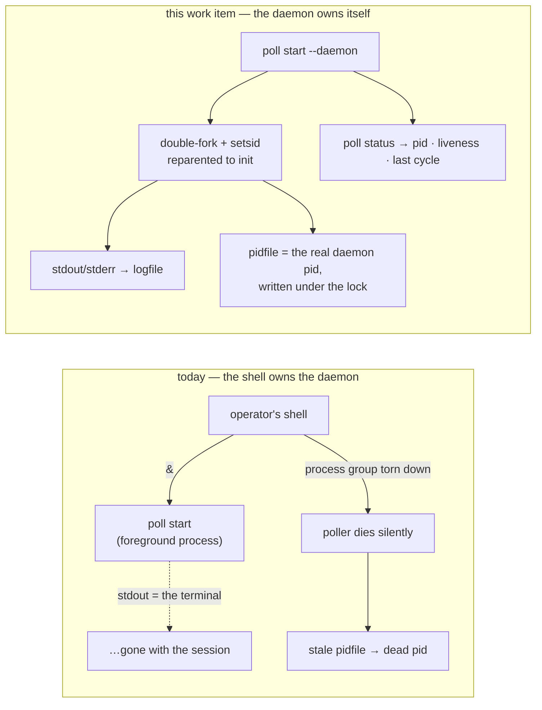

# Requirements: `poll start` runs as a proper daemon

> Phase 1 of the chain. Ticket:
> [#191](https://github.com/MadaraUchiha-314/the-loop/issues/191).

## Introduction

**`the-loop poll start` is a long-lived daemon that does none of the things a daemon
does.** It runs in the foreground and leaves detaching, redirecting and reporting to
whoever typed the command, so a poller's survival depends on the shell that launched it.
It has already cost us one: a poller started as a child of another tool's background task
ran for ~4.5 hours and then died silently when the parent's process group was torn down —
no crash, no log line, no OOM. Because that start had not redirected stdout either, the
poller stopped writing to its log at the same moment, and the pidfile it left behind
pointed at a dead pid.

The workaround is an incantation every operator has to remember:

```bash
setsid nohup the-loop --config … poll start --pidfile … >> .the-loop/logs/poller.out 2>&1 &
```

Four things in that line are the tool's job, not the operator's.



Three facts shape what follows.

| Fact | Consequence |
|---|---|
| `poll start` is *also* how cron (`--once`) and systemd (`Type=simple`) run the poller | detaching cannot become the unconditional behaviour of `start`; the foreground path stays exactly as it is |
| The pidfile is already the single-instance **lock** ([issue-159](https://github.com/MadaraUchiha-314/the-loop/issues/159)) | the pid must be published by the process that *holds* the lock — so it is written after the final fork, and a stale pidfile is by construction unlocked |
| A detached start reports nothing to the shell that asked for it | the caller has to learn whether the daemon actually came up, or `--daemon` trades a lost poller for a silently absent one |

**Non-goals** (the ticket's own): supervision, auto-restart after a host reboot or a
suspend, and any form of process babysitting. That is systemd's, cron's or a keepalive's
job. This work item is only about the poller surviving the shell that launched it and
leaving truthful state behind. Making `--daemon` the *default* is also out of scope — see
[decision-072](../../decisions/decision-072.md).

## Requirements

### R1 — `poll start --daemon` detaches from the invoking shell

**User story:** As an operator, I want `the-loop poll start --daemon` to survive the
session that started it, so that a poller is not lost when a terminal, a CI step or
another tool's background task ends.

Acceptance criteria:

1. WHEN `poll start` is run with `--daemon` THEN the system SHALL fork twice and call
   `setsid` between the forks, so the running poller is a session leader's child: it owns
   its own session and process group, has no controlling terminal, and is reparented to
   init.
2. WHEN the daemonized poller is running THEN the system SHALL leave it running after the
   invoking process, its process group and its session have all ended.
3. WHEN `poll start` is run without `--daemon` THEN the system SHALL run the poller in the
   foreground exactly as it does today, so `--once` under cron and `Type=simple` under
   systemd are unaffected.
4. WHEN `poll start` is run with `--foreground` THEN the system SHALL run in the
   foreground even if `--daemon` was also given earlier on the command line — the two
   flags are one setting, last one wins.
5. WHEN `--daemon` and `--once` are given together THEN the system SHALL refuse to start,
   naming the conflict: a single cycle has nothing to detach for, and detaching would hide
   its exit code from the cron job that asked for it.
6. WHEN the poller daemonizes THEN the system SHALL NOT change the process's working
   directory, because every path the poller resolves — the CLI config, `state.root`, the
   workspace root — is relative to it.

### R2 — a daemonized poller always has a log to write to

**User story:** As an operator, I want a detached poller's output to land in a file it
owns, so that "the poller stopped logging" can never be a side effect of how it was
started.

Acceptance criteria:

1. WHEN the poller daemonizes THEN the system SHALL redirect its stdout and stderr, in
   append mode, to a logfile, and its stdin to `/dev/null`.
2. The system SHALL default that logfile to `<state.root>/logs/poller.out`, beside the
   event log, and SHALL accept `--logfile <path>` to place it elsewhere.
3. WHEN the logfile's parent directory does not exist THEN the system SHALL create it.
4. WHEN the logfile cannot be opened THEN the system SHALL fail the start **in the
   foreground**, with the reason, and SHALL NOT fork — a daemon whose output has nowhere
   to go is the defect this requirement exists to prevent.
5. WHEN the control plane starts a daemon (`the-loop service`, the HTTP API, the MCP
   tool) THEN the system SHALL redirect that daemon's output to the same logfile rather
   than to `/dev/null`, so no start path silently discards the log.

### R3 — the pidfile tells the truth, and cleans up after itself

**User story:** As an operator, I want the pidfile to name the process that is actually
running, so that `stop`, `status` and any script I write can trust it.

Acceptance criteria:

1. WHEN the poller daemonizes THEN the system SHALL acquire the single-instance lock and
   write the pidfile **after the final fork**, so the recorded pid is the daemon's own and
   not that of a process which has already exited.
2. WHEN `poll start` finds a pidfile that no live poller holds THEN the system SHALL
   report it as stale, remove it, and continue starting.
3. WHEN `poll start --daemon` finds a pidfile a live poller **does** hold THEN the system
   SHALL refuse to start, name the holding pid, and exit non-zero **without forking**, so
   the refusal reaches the operator's terminal rather than a logfile.
4. WHEN a daemonized start fails after forking — a dependency check, a provider error, a
   lost race for the lock — THEN the system SHALL report the failure and a pointer to the
   logfile on the invoking process's stderr, and exit non-zero.
5. WHEN a daemonized start succeeds THEN the system SHALL print the daemon's pid and its
   logfile, and exit `0` only once the daemon holds the lock — so a scripted
   `poll start --daemon && poll status` cannot race its own daemon.

### R4 — `poll status` answers "is the poller actually running?"

**User story:** As an operator, I want one command that tells me whether the poller is
running and whether it is making progress, so that I do not have to cross-check `ps`, the
pidfile and the log.

Acceptance criteria:

1. The system SHALL provide `the-loop poll status`, reporting: liveness, the pid,
   the pidfile, the logfile, when the poller started, and when it last completed a cycle.
2. WHEN a poller holds the lock THEN the system SHALL report it as running and exit `0`.
3. WHEN no poller holds the lock THEN the system SHALL report it as not running and exit
   `1`, so `poll status` is usable as a scripted health check.
4. WHEN a pidfile exists that no poller holds THEN the system SHALL report it as stale,
   naming the pid it records.
5. WHEN the poller has completed at least one cycle THEN the system SHALL report the
   timestamp of the most recent one, how long ago that was, and what that cycle did.
6. WHEN the poller has never completed a cycle, or its heartbeat has been removed, THEN
   the system SHALL say so explicitly rather than reporting a missing timestamp as `0` or
   as an absence of activity.
7. WHEN `--format json` is given THEN the system SHALL emit the same facts as a single
   JSON object, and the same facts SHALL be available through the control plane's
   `daemon_status` (HTTP `GET /api/v1/daemons`, the MCP tool).
8. WHEN a poller is running that predates this change, or whose heartbeat file has been
   deleted, THEN `poll status` SHALL still report liveness and pid correctly — the
   heartbeat is an enrichment, never the source of truth for "is it running".

### R5 — the new state file is classified, documented and ignored

**User story:** As an operator carrying state between machines, I want to know whether the
poller's heartbeat travels with my work, so that I do not commit a machine handle or lose
something I needed.

Acceptance criteria:

1. The system SHALL record the heartbeat at `<state.root>/poll-status.json`, and SHALL
   classify it, the poller pidfile and the poller logfile as **local** (they name a
   process and a file on one machine).
2. The system SHALL derive all three paths from `StateLayout`, so `state.root` is the only
   place they are configured, and SHALL declare each in `GENERATED_PATHS` with its
   reason.
3. The system SHALL document them in the state page's classification table and SHALL
   ensure the published `.gitignore` block excludes them.
4. WHEN the heartbeat cannot be written THEN the system SHALL log a warning at most once
   and continue polling — observability never breaks ingress.

## Security considerations

**Threat-model-lite.** This work item adds no network surface, no new authorization
decision and no new remote effect. What it does add is a process that outlives its
terminal, a file that is written on every cycle, and a file that accumulates output.

| Untrusted actor / input | Trust boundary | Abuse case | Mechanism |
|---|---|---|---|
| Anyone with write access to `state.root` | the pidfile / lock | plant a pidfile naming another process's pid so `poll stop` signals a stranger | unchanged from [issue-159](https://github.com/MadaraUchiha-314/the-loop/issues/191): a pid is only ever signalled when `flock` proves a live poller holds that file. A planted pidfile is *unlocked*, so it is reported stale and removed, never signalled |
| The same actor | the heartbeat file | write a false `lastCycleAt` so an operator believes a dead poller is healthy | the heartbeat is **never** the source of truth for liveness — that is the lock alone (R4.8). A tampered heartbeat can misreport progress, and is displayed as reported, not trusted; it is machine-local, non-portable, and never re-read by the poller itself |
| The polled provider (GitHub) | the logfile | flood the log with attacker-influenced text (issue titles, comment bodies) to exhaust the disk | pre-existing: the same text already reaches stdout today. The logfile is a plain append; rotation is the host's job (`logrotate`), stated in the docs rather than reimplemented |
| — | file permissions | the logfile or heartbeat exposing secrets | the poller holds no token (GitHub is reached through the operator's own `gh`), and the redirected streams carry exactly what the terminal carried before. Both files are created with the process umask under `state.root`, which is already `.gitignore`d |

**Fail-closed behaviour.** Every failure in this work item fails *closed on starting*, never
open: an unopenable logfile aborts before forking (R2.4), a lock we cannot take aborts the
start (R3.3), and a failed post-fork start exits non-zero with a pointer to the log
(R3.4). The one deliberately fail-*open* path is the heartbeat write (R5.4): a poller that
cannot write its own health file must keep delivering events.

**No new attack surface**, stated precisely: no listener is bound, no credential is read,
written or logged, no input is parsed that was not already parsed, and the only privilege
change is the *removal* of a controlling terminal.

## Out of scope

- Supervision, restart-on-failure, restart-after-reboot (the ticket's stated non-goal).
- Log rotation and retention for the new logfile — `logrotate`'s job; documented, not built.
- `gh-webhook start --daemon`. The receiver has the same shape and deserves the same
  treatment, but it is a separate ticket: it binds a port, so "did it come up?" has a
  second failure mode this work item does not model. R2.5 still fixes its *control-plane*
  start path, because that is one line in shared code.
- Making `--daemon` the default ([decision-072](../../decisions/decision-072.md)).

## Review comments

<!-- Appended by the-loop's record-feedback hook when a human gate approves with comments. -->
