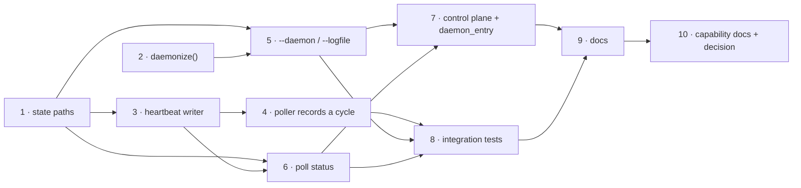

# Tasks: `poll start` runs as a proper daemon

> Phase 4 of the chain. Derives from [`design.md`](design.md) and
> [`testing-plan.md`](testing-plan.md) — each task's `_Test:_` names a matrix row.
> Ticket: [#191](https://github.com/MadaraUchiha-314/the-loop/issues/191).

## Tasks

- [x] **1. `StateLayout` grows the three poller paths.**
  Add `poll_pidfile`, `poll_status` and `poller_log`; declare each in `GENERATED_PATHS`
  as **local** with its reason; replace the two ad-hoc `<root>/poll.pid` derivations
  (`commands/poll.py`, `core/daemons.py`) with the property.
  _Requirements: R5.1, R5.2_ · _Test: T4_

- [x] **2. `the_loop/daemonize.py` — detach, redirect, handshake.**
  `daemonize(logfile, timeout=60)` (double-fork, `setsid`, `dup2`, reap the intermediate,
  no `chdir`) and `notify_ready()`. Pure stdlib; nothing poller-specific.
  _Requirements: R1.1, R1.6, R2.1, R2.3, R3.4_ · _Test: T6_

- [x] **3. `the_loop/poller/heartbeat.py` — write and read.**
  `PollHeartbeat.record(summary)` (atomic `tempfile` + `os.replace`, warn-once on
  `OSError`) and `PollHeartbeat.read(path)` → `Heartbeat | None`.
  _Requirements: R5.4, R4.5, R4.6_ · _Test: T1_

- [x] **4. The poller records a heartbeat after every cycle.**
  An optional `heartbeat` callable on `Poller`, invoked at the end of `poll_once` — so a
  `--once` run and a long-lived poller both leave one, and the poller core keeps no file
  handle of its own.
  _Requirements: R4.5_ · _Test: T1, T6_

- [x] **5. `poll start` gains `--daemon` / `--foreground` / `--logfile`.**
  One `dest`, last-flag-wins; `--daemon --once` refused; the logfile opened and the lock
  probed **before** the fork, and the lock acquired (and a stale pidfile cleared) after it,
  on both the daemon and the foreground path;
  `notify_ready()` once the run loop is about to start; `poller.started` carries `daemon`
  and `logfile`.
  _Requirements: R1.3, R1.4, R1.5, R2.2, R2.4, R3.1, R3.2, R3.3, R3.5_ · _Test: T3, T6_

- [x] **6. `poll status`.**
  New action: liveness from the lock, pid from the pidfile, the rest from the heartbeat;
  `--format text|json`; exit `0` running / `1` not; stale pidfile reported, not removed.
  _Requirements: R4.1–R4.8_ · _Test: T2, T7_

- [x] **7. The control plane starts daemons with a log, and reports the heartbeat.**
  `core/daemons.control_daemon("start")` redirects `stdout`/`stderr` to the daemon's
  logfile instead of `DEVNULL`; `daemon_status` carries `startedAt`/`lastCycleAt`;
  `daemon_entry` forces `args.daemon = False`.
  _Requirements: R2.5, R4.7_ · _Test: T5_

- [x] **8. Integration tests against a real detached process.**
  `cli/tests/test_poll_daemon_integration.py`, Gherkin-documented, one scenario per row of
  the T6 trace; each test kills what it spawned in a `finally`.
  _Requirements: R1.1, R1.2, R2.1, R3.1, R3.3, R3.4, R3.5_ · _Test: T6, T7_

- [x] **9. Documentation.**
  `docs/cli/commands/poll.md` (the two flags, the `status` action, when to use which start
  mode, log rotation as the host's job), `docs/cli/state.md` (three classification rows,
  the `.gitignore` line) and the repository's own `.gitignore`.
  _Requirements: R5.3_ · _Test: T4_

- [x] **10. Capability docs and the decision record.**
  `docs/capabilities/cli.md` (the poller's lifecycle), `docs/decisions/decision-072.md`
  (`--daemon` opt-in, not the default) plus its index row, and the execution log's
  `## Documentation` section.
  _Requirements: R1.3 (why the default did not move)_ · _Test: T4 (docs parity)_
