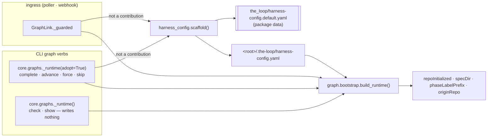
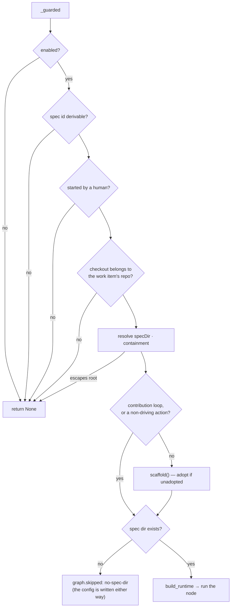

# Design: a default harness config for repositories that never adopted the-loop

> Phase 2 of 3 (requirements → design → tasks). Derives from the approved
> requirements. MUST be reviewed and approved before moving to tasks breakdown.

## Overview

One data file, one writer, two call sites, one carve-out.

The **data file** is the built-in default harness config, shipped *inside* the CLI
package (`cli/the_loop/harness-config.default.yaml`) exactly as the process graphs are —
because the thing that has to read it is the installed CLI, which has no plugin checkout
to read the `/the-loop:init` template from. Byte parity with that template is enforced by
a test, so "the default" is one configuration with two writers rather than two
configurations with one name (R1.1, R1.2).

The **writer** is `harness_config.scaffold(root, owner, repo)`: the only function that
creates a harness config, living in the only module allowed to touch that filename
(decision-044, pinned by `test_h2_only_the_shared_reader_opens_a_harness_config`). It is
idempotent, best-effort, and refuses any owner/repo that is not a plain GitHub name
(R2.4, R2.5, abuse case 1).

The **call sites** are the two places where the-loop stops reading a repository and
starts working it: `GraphLink._guarded` on the ingress path (poller and webhook share it)
and `core.graphs._runtime(adopt=True)` on the CLI's mutating graph verbs. Both call
before building the runtime, which is what makes `repoInitialized` true for the run that
adopted the repository — so no other module needs to change.

The **carve-out** is the contribution loop: a guest does not install itself (R4).



## Architecture

Nothing new joins the architecture: this is one function added to the module that already
owns the harness-config filename, plus two calls placed one line before existing runtime
construction. The read surface (`READS`) is unchanged — the CLI reads no key it did not
read before, so `docs/config/harness-config.md`'s CLI-read table and its four parity
assertions stand.

The load-bearing choice is **where in the gate order** the ingress adopts. `_guarded`'s
existing order is: coupling enabled → work item is nameable → the item was started →
**the checkout is provably the work item's own repository** → spec directory resolved and
contained → the work item has a spec directory. Adoption sits after containment and
before the spec-directory gate:



Two properties fall out of that placement and neither is incidental:

- **The ownership proof still precedes every write.** A payload cannot name a directory;
  it can only fail to match one (abuse case 2).
- **The config is written even when the graph is skipped.** A brand-new work item has no
  spec directory yet, so the coupling declines to drive its graph — but the session the
  daemon just spawned is *already running in that checkout* and needs a configuration to
  read. Adopting only on the path where the graph moves would leave exactly the case the
  ticket is about unfixed.

## Components & interfaces

### `the_loop/harness-config.default.yaml` — package data (new)

The built-in default. A byte-for-byte copy of
`skills/the-loop/templates/harness-config.yaml`, resolved relative to `__file__` so a
wheel, an editable install and a repository checkout all answer identically — the
argument `graph.model.shipped_graph_path` already makes for the process graphs.

### `the_loop/harness_config.py` — three additions

```python
DEFAULT_CONFIG_FILE: str          # "harness-config.default.yaml", package data

def default_config_path() -> Path:
    """The packaged default's path (may not exist in an odd install)."""

def defaults() -> Dict[str, Any]:
    """The built-in default harness config, or {} if it cannot be read."""

def scaffold(root: Path, owner: str = "", repo: str = "") -> str:
    """Adopt `root` with the built-in default. Returns:
         "written"  — the file was created
         "present"  — a harness config was already there; nothing done
         ""         — could not (unreadable default, unwritable tree)
       Never raises."""
```

`scaffold` writes `<root>/.the-loop/harness-config.yaml`: the current filename, never the
pre-rename one — a repository being adopted today has no legacy to preserve. The written
bytes are the packaged default preceded by a three-line provenance header naming
the-loop, the ticket and `/the-loop:init`, so the next human to open the file knows who
put it there and how to tailor it.

`owner`/`repo` are substituted into the `ticketing.github` block only, and only when both
match `^[A-Za-z0-9][A-Za-z0-9._-]*$` (GitHub's own owner/repo charset). The substitution
is a line-anchored replacement of `owner: ""` / `repo: ""` **within the `ticketing:`
block** — bounded at the next top-level key — which preserves the template's inline
comments where a `yaml.safe_dump` round-trip would destroy every one of them.

### `the_loop/graphlink.py` — one call in `_guarded`

```python
loop = self._outer_loop_name(...) if pr_number is None else ""
self._adopt(action, root, work_item, loop)     # no-op for a contribution
```

`_outer_loop_name` is already resolved on the outer path a few lines below, for exactly
this kind of question; it is hoisted so both the adoption decision and the runtime build
share one resolution. An **inner** loop (`pr_number is not None`) always runs in the
origin repository's checkout — `_checkout_belongs_to` proves that — so it adopts on the
same terms as the outer one.

`_guarded` serves four actions, and only the two that **drive** the graph adopt
(`_ADOPTING_ACTIONS = {"start", "advance"}`). `context` resolves the `$graph_context`
prompt block before every delivery and is documented as mutating nothing — an exception
for "only a config file" is how that property stops being true — and `clean` runs while
the work item's checkout is being released, where a freshly written file is litter.
Found in self-review, after the first implementation adopted on all four.

A `"written"` outcome emits `harness.config_scaffolded` (work_item, path) into the event
log (R2.3). `"present"` and `""` say nothing: the first is the overwhelmingly common
case, and the second is already visible as a warning from the writer.

### `the_loop/core/graphs.py` — one parameter

`_runtime(..., adopt: bool = False)`. `complete`, `advance`, `force` and `skip` pass
`adopt=True`; `check` and `show` do not, which is how R3.2's purity is expressed as code
rather than as a promise. The CLI has no work-item ref to derive owner/repo from here, so
it scaffolds the default without them — `originRepo` stays empty exactly as it is today
for an unadopted repository, and the daemon path (which does have the ref) fills it.

### Unchanged on purpose

`Runtime.start`'s `repoInitialized is False → exclude the spec tree from git` branch,
`publish-artifact`'s mirror of it, and `harness_config.load`/`load_strict`'s best-effort
contract. Adoption happens *before* `build_runtime`, so an adopted repository reports
`repoInitialized: True` on the very run that adopted it and both behaviours simply stop
applying to it — while a contribution, which never adopts, keeps them.

## UI/UX design

N/A — a CLI/daemon change with no user-facing surface.

## Data models

No new model. The written document is validated by the existing
`.the-loop/harness-config.schema.json`; the packaged default is asserted against it in
the test suite (R1.3), which is the only way the schema and the default can be kept from
drifting apart.

## Error handling

Every failure degrades, and each one has a distinct, visible outcome:

| Failure | Behaviour | Visible as |
|---|---|---|
| packaged default missing/unreadable | no write; per-key defaults carry the run | `logger.warning`, `scaffold` returns `""` |
| `.the-loop/` cannot be created / file cannot be written | no write; run continues | `logger.warning`, returns `""` |
| a harness config already exists | nothing written | returns `"present"` |
| owner/repo not a plain GitHub name | written with empty `ticketing.github` | the file itself |
| anything raised inside `scaffold` | swallowed at its boundary | `logger.warning` |

The ingress call additionally inherits `_guarded`'s blanket `except`, so even a
programming error there costs a log line and an event, never a delivery.

## Security design

- **AuthN/AuthZ:** unchanged. Adoption is strictly downstream of the two gates that
  already decide whether the-loop may touch this checkout at all — `_awaiting_start` (an
  authorized human asked for this work item) and `_checkout_belongs_to` (the directory is
  provably the work item's own repository).
- **Input validation & injection surfaces:** the only untrusted values that reach the
  written bytes are `owner` and `repo`, and they are allow-listed against
  `^[A-Za-z0-9][A-Za-z0-9._-]*$` before substitution. That charset contains no quote, no
  newline and no colon-space, so a YAML document cannot be extended, terminated or
  re-keyed through it; a value that fails the test is dropped, not escaped, so there is
  no encoder to get wrong. No path component is payload-derived: the target is
  `<proved root>/.the-loop/harness-config.yaml`, a constant relative to a proved root.
- **Secrets handling:** none. The default config contains policy only — no tokens, no
  URLs, no credentials — and the writer reads no environment.
- **Least privilege:** the writer creates one directory and one file, and only when the
  file does not exist. It never opens an existing config for writing, so an operator's
  `autonomy` tiers, `sensitivePaths` and `reviews.critics[]` (executable config) cannot
  be replaced by an inbound event (abuse case 3).
- **Fail-closed behaviour:** unprovable checkout ⇒ no write; unreadable default ⇒ no
  write; invalid owner/repo ⇒ empty `ticketing.github`, which `origin_repo()` already
  reports as unknown and whose callers already fail closed (issue-183).
- **Abuse-case coverage:**

  | Abuse case | Mechanism | Negative test |
  |---|---|---|
  | 1. YAML injection via owner/repo | allow-list, drop-don't-escape | `T8` — `test_scaffold_refuses_a_forged_owner` |
  | 2. write into a foreign checkout | adoption placed after `_checkout_belongs_to` | `T8` — `test_a_foreign_checkout_is_never_adopted` |
  | 3. overwrite an operator's policy | `config_path(root) is not None → "present"` | `T8` — `test_scaffold_never_overwrites_an_existing_config` |
  | 4. a guest installs itself | contribution carve-out at both call sites | `T2` — `test_a_contribution_never_adopts_its_host_repository` |

## Testing strategy

Unit tests pin the writer's contract (idempotence, provenance header, owner/repo
substitution, the four degradations) and the parity assertions that keep the packaged
default, the `/the-loop:init` template, the schema, the phase sequence and the module's
per-key default constants from drifting into five answers. Integration tests drive the
two real call sites end to end: a `GraphLink` action against a git checkout with no
`.the-loop/` (adopted, and its graph still skipped for want of a spec directory —
both facts asserted in one scenario), a contribution against the same checkout (not
adopted, spec tree still excluded from git), and `core.graphs.complete` vs
`core.graphs.check` against an unadopted repository (one writes, one does not).
Abuse cases 1–3 are the negative tests named in the table above; abuse case 4 is the
contribution scenario. Executable detail lives in `testing-plan.md`.

## Trade-offs & decisions

**A copy of the template in the package, not a reference to it.** The CLI ships
independently of the plugin (`pip install the-loopy-one`), and issue-152's
`shipped_graph_path` docstring records what happens when runtime data lives only in the
plugin: `the-loop check` failed, advising operators to set `CLAUDE_PLUGIN_ROOT` to a
plugin they had never installed. A copy plus an enforced byte-parity test costs one test
and makes divergence a build failure; a `CLAUDE_PLUGIN_ROOT` lookup costs an environment
variable that is absent in every CI checkout and every `pip` install. Recorded as
**decision-073**.

**The contribution loop never adopts.** PR #187 decided that a repository the-loop was
invited into keeps the-loop out of its history; writing a config there would be the
loudest possible violation of it — a committed file declaring the-loop's process in
somebody else's repository. Also decision-073.

**`adopt` is an explicit parameter, not an inference.** `_runtime` could have inspected
the verb, or `Runtime` could have adopted on first mutation. Both hide a filesystem write
behind a call that reads like a lookup, and `check`'s purity (issue-109 R8.8, the
property that lets CI run the real runtime) would then rest on nothing checkable. One
boolean at four call sites is the version a reviewer can verify by reading.

**No `collaborators.yaml`, no docs tree, no labels.** The ticket asks for the harness
config. A default collaborators file would name nobody and gate nothing, and the docs
tree and labels are `/the-loop:init`'s guided work.

## Open questions

None.

## Review comments

> Appended by the-loop's `record-feedback` hook when a human gate approves with
> comments (issue-109). Append-only and attributed: an approval never silently
> discards a reviewer's suggestions, and the feedback travels with the document
> it concerns rather than living in a side-channel tracker.
