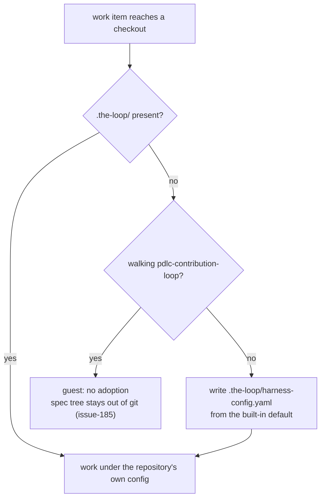

# Requirements: a default harness config for repositories that never adopted the-loop

> Phase 1 of 3 (requirements → design → tasks). Following the Kiro spec approach
> (https://kiro.dev/docs/specs/). This phase MUST be reviewed and approved by the
> required collaborators before moving to design.

## Introduction

the-loop can be pointed at a repository that never ran `/the-loop:init`. The daemon
clones it, spawns a session in it, and the session finds no `.the-loop/` at all — so the
skill has no `workflow`, no `tooling`, no `phases` to work from, and the CLI falls back
to whatever literal each call site happens to carry. Ticket:
[#193](https://github.com/MadaraUchiha-314/the-loop/issues/193).

Two things are asked for, and they are the same fact stated at two altitudes:

1. **A default exists.** the-loop carries one built-in harness config and works an
   unadopted repository under it, instead of under a scatter of per-call-site literals.
2. **The default is materialized.** When the-loop starts working such a repository it
   writes `.the-loop/harness-config.yaml` from that default, so the session, the CLI and
   the next run all read one file rather than each inventing an answer.

One repository is deliberately exempt, and the exemption is not an edge case: a
**contribution** (`pdlc-contribution-loop`, issue-185) joins somebody else's
in-progress work item, and PR #187 settled that the-loop's machinery must not reach that
repository's history. Adopting a repository the-loop was invited into as a guest would
undo that decision.

## Requirements

### Requirement 1 — one built-in default harness config

**User story:** As an operator pointing the-loop at a repository that has not adopted it,
I want the-loop to work under a named default configuration, so that "what does the-loop
assume here?" has one answer I can read rather than N answers spread across call sites.

#### Acceptance criteria (EARS)

1. WHEN the CLI is asked for the built-in default harness config THEN the system SHALL
   return the configuration shipped **inside the installed package**, so a
   `pip install the-loopy-one` with no plugin checkout resolves it identically.
2. WHEN the built-in default is compared with the template `/the-loop:init` writes
   (`skills/the-loop/templates/harness-config.yaml`) THEN the two SHALL be the same
   configuration, so an adopted-by-default repository and an `init --defaults` repository
   are configured alike.
3. WHEN the built-in default is read THEN it SHALL satisfy the harness-config schema
   (`.the-loop/harness-config.schema.json`) and declare the phase sequence the shipped
   process graph walks.
4. IF the packaged default cannot be read THEN the system SHALL degrade to the existing
   per-key defaults rather than raise — reading configuration is best-effort by contract
   (decision-044), and a packaging fault must not cost a webhook delivery.

### Requirement 2 — the ingress adopts an unadopted repository

**User story:** As an operator whose poller or webhook drives work items in a repository
that never ran `/the-loop:init`, I want the-loop to put its default config there before
it works the item, so that the spawned session has a configuration to read.

#### Acceptance criteria (EARS)

1. WHEN the ingress→graph coupling handles a work item in a checkout it has **proved**
   to be that work item's own repository (`_checkout_belongs_to`), and that checkout
   carries neither `harness-config.yaml` nor the pre-rename `config.yaml`, THEN the
   system SHALL write `.the-loop/harness-config.yaml` from the built-in default.
2. WHEN that file is written AND the work item's owner and repository are known THEN the
   written config SHALL name them under `ticketing.github`, so `originRepo` resolves
   instead of failing closed (issue-183).
3. WHEN the write happens THEN the system SHALL record it in the event log, so an
   operator can see that the-loop — not a person — put that file in their repository.
4. IF the checkout already carries a harness config THEN the system SHALL write nothing
   and leave the operator's file byte-for-byte untouched.
5. IF the write fails for any reason THEN the system SHALL log and continue: no delivery,
   spawn or graph transition is lost because a config could not be written.

### Requirement 3 — the CLI's mutating graph verbs adopt too

**User story:** As an agent session running the-loop's graph verbs inside an unadopted
checkout, I want the same default config to be there, so that the loop I am walking and
the loop the daemon walks read the same configuration.

#### Acceptance criteria (EARS)

1. WHEN a graph verb that **changes state** (`graph complete`, `graph advance`,
   `graph force`, `graph skip`, `graph run`) runs against a repository with no harness
   config THEN the system SHALL write the built-in default before building the runtime.
2. WHILE a **read-only** command runs (`the-loop check`, `graph status`, `graph show`)
   the system SHALL write nothing — the check operation is pure by contract (issue-109
   R8.8), and CI must not be made dirty by asking a question.

### Requirement 4 — a contribution never adopts its host repository

**User story:** As the maintainer of a repository the-loop was invited into as a
contributor, I want no the-loop machinery in my tree, so that the contribution PR carries
the intervention I asked for and nothing else.

#### Acceptance criteria (EARS)

1. WHEN the work item walks `pdlc-contribution-loop` THEN the system SHALL NOT write a
   harness config into that repository, whatever its adoption state.
2. WHILE such a repository stays unadopted the system SHALL keep issue-185's behaviour
   intact: the spec tree excluded from git, and the plan published to the work item's
   thread because the repository offers no reviewable surface.

## Non-functional requirements

- **Observability.** The one new side effect on an operator's disk is an event
  (`harness.config_scaffolded`) in the same log every other daemon action lands in, with
  the path it wrote.
- **Idempotence.** Every adoption path is safe to run repeatedly and on every event: the
  second call finds the file and does nothing.
- **No new dependency.** The default is data shipped in the package, read with the
  PyYAML the CLI already requires.

## Security considerations

- **Actors & trust:** the untrusted inputs on the ingress path are webhook payloads and
  the poller's API responses — specifically the work item's `owner`/`repo`, which reach
  this feature as the values written into the scaffolded YAML. The operator's filesystem
  is the asset.
- **Trust boundaries & data:** two boundaries. (a) *Which directory is written* — a
  payload must never choose a path; the write target is `<root>/.the-loop/` where `root`
  is the checkout the coupling has already proved, via the `origin` remote, to be the
  work item's own repository (issue-113 A6, decision-044). (b) *What is written* —
  payload-derived text entering a YAML document is an injection surface: an `owner` of
  `x"\n\nautonomy: {defaultTier: 1}` would otherwise rewrite the configuration the-loop
  then obeys. No secret is read or written; the file contains policy only.
- **Abuse cases (EARS):**
  1. WHEN a work item's `owner` or `repo` is not a plain GitHub name
     (`^[A-Za-z0-9][A-Za-z0-9._-]*$`) THEN the system SHALL write the default's empty
     `ticketing.github` values rather than embed the input.
  2. WHEN the checkout cannot be proved to be the work item's own repository THEN the
     system SHALL write nothing — the existing gate order puts the ownership proof first,
     and adoption stays behind it.
  3. WHEN a harness config already exists THEN the system SHALL NOT overwrite it, so no
     inbound event can replace an operator's policy (autonomy tiers, sensitive paths,
     `reviews.critics[]` — executable config) with the-loop's defaults.
  4. WHEN the work item walks the contribution loop THEN the system SHALL write nothing
     into the host repository (R4.1) — a guest does not install itself.
  5. WHEN the checkout's `.the-loop` resolves outside the checkout — a symlink committed
     by whoever can push to the repository the daemon clones — THEN the system SHALL
     write nothing, rather than plant a file at a path the repository chose. *(Added by
     the security review; see `design.md` § Security design.)*
- **Fail closed:** unknown/invalid owner or repo ⇒ empty `ticketing.github`, which
  `origin_repo()` already reports as "unknown" and whose callers already fail closed.
  Unprovable checkout ⇒ no write at all. Unreadable packaged default ⇒ no write, and the
  existing per-key defaults carry the run.

## Out of scope

- **Interactive onboarding.** `/the-loop:init`'s guided, schema-driven walkthrough
  (detection, ask levels, collaborators) is the agent's, and stays there. This work item
  writes the same baseline non-interactively; it does not detect languages or ask
  questions.
- **The `no-spec-dir` skip.** The coupling still declines to drive a graph for a work
  item that has no spec directory yet, adopted repository or not. That gate is about the
  work item, not about the repository's configuration, and it behaves identically before
  and after this change.
- **`.the-loop/collaborators.yaml`** and the rest of the `/the-loop:init` scaffold (docs
  tree, phase labels). The ticket asks for the harness config; a default collaborators
  file would name no one and gate nothing.
- **Migrating existing repositories.** A repository that already carries a config is
  untouched; `/the-loop:upgrade-the-loop` remains how a config moves forward.

## Open questions

None. The one judgement call — whether the contribution loop adopts its host repository —
is settled by PR #187's decision and recorded as R4.

## Review comments

> Appended by the-loop's `record-feedback` hook when a human gate approves with
> comments (issue-109). Append-only and attributed: an approval never silently
> discards a reviewer's suggestions, and the feedback travels with the document
> it concerns rather than living in a side-channel tracker.
