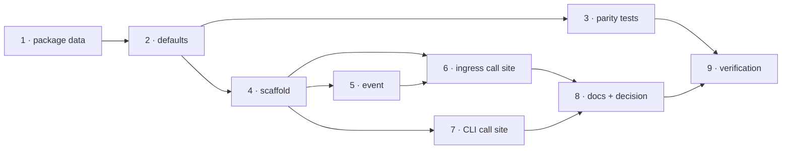

# Tasks: a default harness config for repositories that never adopted the-loop

> The last spec artifact (requirements → design → testing plan → tasks). A DAG of
> implementation tasks derived from the approved design and testing plan. MUST be
> reviewed/approved before implementation begins.

## Task list

- [x] 1. Ship the built-in default as package data
  - Copy `skills/the-loop/templates/harness-config.yaml` to
    `cli/the_loop/harness-config.default.yaml` (byte-for-byte).
  - _Depends on:_ none
  - _Requirements:_ R1.1, R1.2
  - _Test:_ `T7 — pytest cli/tests/test_harness_config.py::test_the_packaged_default_is_the_shipped_template` (red→green)

- [x] 2. `defaults()` and `default_config_path()` in `harness_config.py`
  - Resolve the packaged file relative to `__file__`; parse best-effort; `{}` on any
    failure, with a warning.
  - _Depends on:_ 1
  - _Requirements:_ R1.1, R1.4
  - _Test:_ `T1 — pytest cli/tests/test_harness_config.py -k defaults` (red→green)

- [x] 3. Parity and drift assertions for the default
  - The packaged default: byte-identical to the template, valid against
    `.the-loop/harness-config.schema.json`, declaring the graph's phase sequence
    (`test_graph_parity.py`'s existing parametrization), and agreeing with
    `DEFAULT_SPEC_DIR` and the runtime's `phaseLabelPrefix` fallback.
  - _Depends on:_ 2
  - _Requirements:_ R1.2, R1.3
  - _Test:_ `T7 — pytest cli/tests/test_graph_parity.py cli/tests/test_harness_config.py -k "packaged or parity"` (red→green)

- [x] 4. `scaffold(root, owner, repo)` — the only writer
  - Idempotent (`"present"` when a config of either name exists), best-effort (`""` on
    any failure), provenance header, `ticketing.github` substitution behind the
    `^[A-Za-z0-9][A-Za-z0-9._-]*$` allow-list.
  - _Depends on:_ 2
  - _Requirements:_ R2.1, R2.2, R2.4, R2.5, abuse cases 1 & 3
  - _Test:_ `T1 + T8 + T10 — pytest cli/tests/test_harness_config.py -k "scaffold or present or forged or overwrite"` (red→green)

- [x] 5. The event: `harness.config_scaffolded`
  - Add it to `EVENT_TYPES` with what it records and why an operator wants it.
  - _Depends on:_ 4
  - _Requirements:_ R2.3
  - _Test:_ `T2 — pytest cli/tests/test_harness_config_scaffold_integration.py -k event`

- [x] 6. Adopt on the ingress path (`GraphLink._guarded`)
  - Hoist the outer-loop resolution, skip adoption for `pdlc-contribution-loop`, scaffold
    after the containment check and before the spec-directory gate, emit the event on a
    write.
  - _Depends on:_ 4, 5
  - _Requirements:_ R2.1, R2.3, R4.1, abuse case 2
  - _Test:_ `T2 + T8 — pytest cli/tests/test_harness_config_scaffold_integration.py -k "ingress or foreign or contribution"` (red→green)

- [x] 7. Adopt on the CLI path (`core.graphs._runtime(adopt=...)`)
  - `complete`/`advance`/`force`/`skip` adopt; `check`/`show` do not.
  - _Depends on:_ 4
  - _Requirements:_ R3.1, R3.2
  - _Test:_ `T2 — pytest cli/tests/test_harness_config_scaffold_integration.py -k verb` (red→green)

- [x] 8. Documentation, capability docs and the decision record
  - `docs/config/harness-config.md` (a "When there is no config" section),
    `docs/capabilities/process-graph.md` + `webhook-triggers.md` history rows,
    `docs/decisions/decision-073.md` + the index, and the skill's
    `reference/automation.md` where it describes what the daemon does to a checkout.
  - _Depends on:_ 6, 7
  - _Requirements:_ R1–R4 (the described behaviour)
  - _Test:_ `T13 — make lint` (markdownlint over the new prose)

- [x] 9. Verification: execute `testing-plan.md`
  - Run every activity, record command/outcome/evidence, commit evidence under
    `docs/specs/issue-193/evidence/`.
  - _Depends on:_ 3, 6, 7, 8
  - _Requirements:_ all
  - _Test:_ `T12 + T13 — make test`, `make lint format-check typecheck validate`

## Dependency graph (DAG)

## Checkpoints

After task 4 (the writer is complete and its abuse cases are red→green), after task 7
(both call sites wired; the whole suite must be green because adoption now writes into
checkouts many existing tests build without a config), and at task 9, where the testing
plan is executed and its evidence committed. Each checkpoint appends to
`execution-log.md`. The security review gate runs with the review phases, before the
work item can be marked ready.

## Review comments

> Appended by the-loop's `record-feedback` hook when a human gate approves with
> comments (issue-109). Append-only and attributed: an approval never silently
> discards a reviewer's suggestions, and the feedback travels with the document
> it concerns rather than living in a side-channel tracker.
