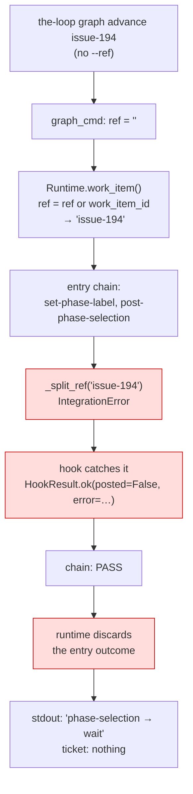

# Bugfix spec: graph commands post nothing when `--ref` is omitted, and say nothing about it

> Phase 1 of 4 for a bug (bugfix → design → testing plan → tasks). This phase MUST be
> reviewed/approved before moving on; the human gate for this work item is the pull
> request.

## Summary

**Every outbound GitHub call a graph hook makes is dead when `--ref` is omitted, and the
command prints a clean success anyway.** A work item driven by `the-loop graph advance
<id>` — the form the skill and the docs show — parks at `phase-selection` with no
checklist comment on the ticket, no `loop:phase-selection` label, and no indication that
anything failed. The gate is then waiting for a reply to a question nobody was asked.

Two independent defects compose into it, and either one alone would have been survivable:

1. **The ref is not derived.** `--ref` defaults to `""`, `Runtime.work_item()` falls back
   to the bare work-item id, and `_split_ref("issue-194")` has no `owner/repo#number` to
   find, so it raises for every operation.
2. **The failure is swallowed.** Each outbound hook catches the error and returns
   `HookResult.ok(..., posted=False, error=...)`. The chain sees a pass; the runtime
   discards entry-chain results entirely; the CLI prints the node's status and nothing
   else. The only trace is a `logging.warning` on a logger nothing configures.

Ticket: [#194](https://github.com/MadaraUchiha-314/the-loop/issues/194). Version:
the-loop 9.5.0.



## Steps to reproduce

1. A repository with a work item at the start of `pdlc-work-item-loop` — the pointer at
   `phase-selection`, nothing posted yet.
2. Run the command the way the skill and `docs/cli/commands/graph.md` show it:

   ```sh
   the-loop graph advance 123
   ```

3. Output looks healthy:

   ```text
   123: phase-selection → wait
     · waiting for an authorized user to choose the phases and reply `the-loop execute`
   ```

4. No checklist comment appears on the issue, no `loop:phase-selection` label is set, and
   nothing in the command output says posting failed.

## Expected vs actual

- **Expected:** the checklist goes up on the ticket and the phase label is applied — the
  ref is derived from what the repository already declares. If it genuinely cannot be
  derived, the command says so on stdout, naming the remedy.
- **Actual:** every outbound call raises `IntegrationError: malformed work item ref:
  '123'`, each hook degrades to `posted=False`, and the command reports `wait` with no
  further output. Deterministic, not transient.

## Root cause (confirmed)

| Where | What it does | Why it composes |
|-------|--------------|-----------------|
| `commands/graph_cmd.py` | `advance.add_argument("--ref", default="")` | `--ref` is optional on `advance`, `complete`, `skip`, `force` and `run`, and nothing tells a caller to pass it. |
| `graph/runtime.py` `work_item()` | `ref=ref or work_item_id` | An empty ref becomes the bare id — a value no integration can use, presented as if it were a ref. |
| `graph/integrations/github.py` `_split_ref()` | raises `IntegrationError` | Correct: `"issue-194"` has no `owner/repo#number`. The message names neither remedy. |
| `graph/hooks/selection.py`, `hooks/sideeffects.py` | `except Exception: … return HookResult.ok(name, posted=False, error=str(exc))` | Best-effort by design (an outage must not wedge the item) — but the `error` it carefully records has no reader. |
| `graph/runtime.py` `advance()`/`start()`/`cleanup()` | `run_chain(entry_node.entry, …)` with the return value dropped | The one place an entry-chain result could reach the operator, and it is discarded. |

The blast radius is every outbound hook, not just the checklist: `_already_posted`,
`_checklist_state`, `set-phase-label`, `request-review`, `publish-artifact`, the force and
skip audit comments. `_already_posted` failing open is what makes a later re-post possible
at all; `_checklist_state` failing to empty is what would silently read a selection as
"no phases unticked".

## Requirements

### Requirement 1 — the ref is derived from what the repository already declares

The repository's harness config names the origin repository (`ticketing.github.owner` /
`.repo`, already loaded into the runtime config as `originRepo`), and the work-item id
carries the number (`issue-194`). That is a complete ref. Deriving it is the inverse of
`graphlink.spec_id_for()`, which already translates the other way.

#### Acceptance criteria (EARS)

1. WHEN a graph verb runs with no `--ref` for a work item whose id is `issue-<n>` in a
   repository whose harness config declares `ticketing.github.owner` and
   `ticketing.github.repo`, THEN the system SHALL use the ref
   `github:<owner>/<repo>#<n>` for every outbound integration call.
2. WHEN `--ref` is given, THEN the system SHALL use it verbatim and SHALL NOT derive
   anything — an explicit ref always wins.
3. WHEN the work-item id is not of the form `issue-<n>`, OR the harness config declares no
   usable `ticketing.github` owner/repo pair, THEN the system SHALL leave the work item's
   ref as the bare id — the pre-fix behaviour — rather than guessing an owner, a
   repository or a number.
4. WHEN a derived owner or repository name is not a shape GitHub accepts, THEN the system
   SHALL derive nothing: a ref pointing at the wrong repository is worse than no ref.
5. WHEN the runtime is walking a pull request's **inner** loop (`--pr`), THEN the derived
   ref SHALL be that **pull request's** — `github:<--pr-repo or origin>#<--pr>` — and it
   SHALL NOT fall back to the work item's ref when it cannot be built. A pull request's
   review comments on the ticket would be a worse outcome than the silence this fixes.
6. The fix SHALL include a regression test that fails before the fix and passes after.

### Requirement 2 — a best-effort hook that did not do its job says so on stdout

Best-effort stays best-effort: an outbound failure MUST NOT block a node, park a work
item, or change any edge the graph takes. It MUST become one visible line.

#### Acceptance criteria (EARS)

1. WHEN a hook in a node's entry or exit chain returns `pass` carrying a non-empty
   `data["error"]`, THEN the system SHALL append one message naming the hook and the error
   to the `NodeReport` that `advance`, `start` and `cleanup` return.
2. WHEN such a message is present, THEN `the-loop graph advance` and `the-loop graph run`
   SHALL print it on stdout as part of the node's messages.
3. WHEN such a message is present, THEN the system SHALL emit a `warning`-level
   `graph.hook_degraded` event naming the work item, the node, the hook and the error, so
   the daemon path — which prints nothing — records it too.
4. WHEN such a hook fails, THEN the node's status, outcome and the edge taken SHALL be
   exactly what they are today: surfacing a degradation SHALL NOT turn a passing chain
   into a blocked or parked one.
5. WHEN `the-loop graph force` cannot post its audit comment, THEN the system SHALL report
   it in the force result's `warnings`, which the CLI already prints.
6. WHEN `the-loop graph skip` cannot post its audit comment, THEN the system SHALL report
   it in the skip result's `warnings` and the CLI SHALL print it.
7. The fix SHALL include a regression test that fails before the fix and passes after.

### Requirement 3 — the unusable-ref error names its remedies

#### Acceptance criteria (EARS)

1. WHEN `_split_ref` is given a value with no `owner/repo#number` shape, THEN the raised
   `IntegrationError` SHALL name the expected shape and both remedies — passing `--ref`,
   or declaring `ticketing.github` in the harness config.

## Security considerations

**No new attack surface, and one boundary tightened.** The change adds no input channel,
no credential path and no network call that did not exist.

- **Untrusted actors / trust boundary.** The two inputs to derivation are the work-item id
  (already used as a filesystem path component, already validated by every caller that
  builds `spec_dir`) and the harness config's `ticketing.github` values. The harness config
  is a checked-in file in the repository being worked, reviewed like code —
  `harness-config.yaml` is on this project's own `autonomy.sensitivePaths` list. It was
  already read for `originRepo` and used to place inner-loop state directories, so
  deriving a ref from it adds no new trust in it.
- **Fail closed.** Derivation is validated before it is used: the id must match
  `^issue-(\d+)$` and the owner/repo must match the same `_GITHUB_NAME_RE` the existing
  `WorkItemRef.url` uses. Anything else derives nothing, and the pre-fix bare-id behaviour
  stands. A malformed config therefore cannot redirect a comment to an attacker-controlled
  repository — the failure mode is "no ref", not "a ref somewhere else".
- **Nothing new is disclosed.** The new stdout line and the new event carry the-loop's own
  vocabulary plus a hook name and an `IntegrationError` message — text the-loop composes,
  never payload text from a comment (the `Message` rule, R3.6). `IntegrationError`
  messages already avoid credentials by construction: the API transport reports
  `<code> <reason>`, never a body or a header.
- **Newly reachable calls.** The fix makes previously-dead GitHub calls actually happen in
  repositories that omit `--ref`. They are the calls the graph always declared, to the
  repository the config names, with the credentials the operator already configured — the
  restored intent, not a widened one. A repository that does not want them declares no
  `ticketing.github`.

## Out of scope

- **`_split_ref` mis-parsing host-qualified refs** (`github:ghe.example.com/owner/repo#1`
  → owner `ghe.example.com`, repo `owner/repo`). Named in the ticket as "probably worth its
  own issue" and treated as such. `WorkItemRef.parse` already handles hosts correctly, so
  the eventual fix is to route `_split_ref` through it; that changes the `api` transport's
  base URL handling for GitHub Enterprise and deserves its own spec. This work item derives
  only default-host refs, so it cannot reach the mis-parse.
- **Making `--ref` required.** Rejected: it would break every existing invocation and every
  caller that legitimately has no ref (`the-loop check` in CI).
- **Reworking the best-effort contract into a blocking one.** Explicitly not done — R2.4
  pins the current routing behaviour.

## Open questions

None. The two suggested fixes in the ticket are both implemented; the third note is
recorded as out of scope above.
