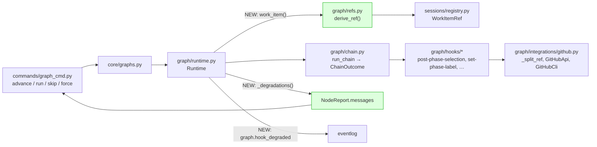
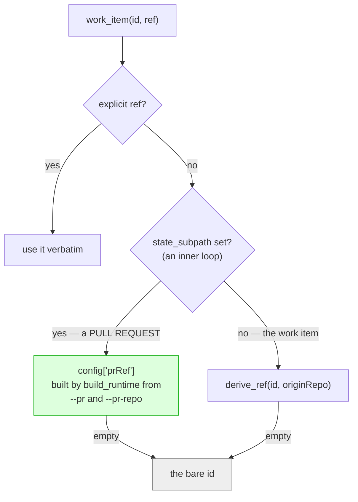

# Design: derive the work-item ref, and stop swallowing outbound-hook failures

> Phase 2 of 4 (bugfix → design → testing plan → tasks). Derives from the approved
> `bugfix.md`. The human gate for this work item is the pull request.

## Overview

**One new pure function, one changed line in `Runtime.work_item()`, and one new reader for
results the runtime already had.** The two defects are fixed independently, because they
are independent: derivation makes the common case work, and visibility makes every other
case — a real outage, a missing token, a repository that declares no ticketing — say what
happened instead of printing a clean `wait`.

| Requirement | Mechanism |
|-------------|-----------|
| R1 — derive the ref | `graph/refs.py::derive_ref()`, called from `Runtime.work_item()` with `config["originRepo"]` |
| R2 — surface degradations | `graph/runtime.py::_degradations()`, read in `advance`/`start`/`cleanup`; `warnings` on the force and skip results |
| R3 — actionable error | one message in `integrations/github.py::_split_ref()` |

Nothing changes about which edge a node takes, when a node blocks, or what any hook is
allowed to do. The best-effort contract is untouched: a degraded hook still passes, and the
work item still moves.

```mermaid
flowchart TD
    subgraph before["before"]
        A1["--ref ''"] --> B1["ref = 'issue-194'"]
        B1 --> C1["_split_ref raises"]
        C1 --> D1["HookResult.ok(posted=False, error=…)"]
        D1 --> E1["entry outcome discarded"]
        E1 --> F1["stdout: 'wait'"]
    end
    subgraph after["after"]
        A2["--ref ''"] --> B2["derive_ref('issue-194', 'octo/repo')<br/>→ 'github:octo/repo#194'"]
        B2 --> C2["comment posted, label set"]
        B2 -. "no originRepo,<br/>or id not issue-n" .-> D2["ref = 'issue-194'<br/>(unchanged)"]
        D2 --> E2["_split_ref raises,<br/>naming both remedies"]
        E2 --> F2["HookResult.ok(posted=False, error=…)"]
        F2 --> G2["_degradations() reads it"]
        G2 --> H2["stdout: 'warning: post-phase-selection …'<br/>+ graph.hook_degraded event"]
    end

    style C1 fill:#fdd,stroke:#c00
    style E1 fill:#fdd,stroke:#c00
    style C2 fill:#dfd,stroke:#0a0
    style H2 fill:#dfd,stroke:#0a0
```



## Architecture

The change sits in the graph package, on the path every graph verb already takes. No new
module boundary, no new dependency, no new config key.



`refs.py` is a new file rather than a function inside `runtime.py` for one reason: it is the
mirror of `graphlink.spec_id_for()`, and the two translations belong at the same level of
the stack. `graphlink` is daemon-side and imports the graph package, so the inverse cannot
live there without inverting the dependency; `runtime.py` is 1200 lines of state machine and
is the wrong home for a pure string translation the daemon may later want too.

## Components & interfaces

### `cli/the_loop/graph/refs.py` (new)

```python
def ref_for(repo_slug: str, number: int) -> str:
    """``octo/repo`` + ``7`` → ``github:octo/repo#7``; ``""`` when it cannot."""

def derive_ref(work_item_id: str, origin_repo: str) -> str:
    """``issue-194`` + ``octo/repo`` → ``github:octo/repo#194``; ``""`` when it cannot."""
```

- **Inputs:** the spec-directory id, and `<owner>/<repo>` as `harness_config.origin_repo()`
  produces it (already in the runtime config as `originRepo`).
- **Output:** a provider-qualified ref, or `""` — never a partial one.
- **Validation, in order.** The id must match `^issue-(\d+)$` (R1.3). `origin_repo` must
  split into exactly one owner and one repo (R1.3). Both must match GitHub's own name
  shape (R1.4) — reused from `sessions/registry.py`, not re-declared, so "what GitHub
  accepts" has one definition. The ref itself is built by `WorkItemRef(...).ref`, so its
  spelling cannot drift from the parser that reads it back.
- **Purity:** no I/O, no config read, no exception. A caller gets a ref or an empty string.

### `graph/runtime.py::Runtime.work_item()` (changed)

Three tiers, in priority order (R1.1, R1.2, R1.3): an explicit ref, a derived one, the bare
id. The last tier is the pre-fix behaviour and is kept deliberately — `WorkItem.ref` is also
the event log's name for the work item and the `_announce_*` audit path's, and returning
`""` there would degrade both to nothing rather than to the id they print today.

**Which** ref is derived depends on the loop (R1.5). This is the one place the fix could
have made things *worse* rather than merely silent, and it is worth stating plainly:



An inner-loop runtime deliberately does **not** fall through to `derive_ref`: a
`pdlc-pr-loop` posts review requests and briefings, and putting those on the ticket instead
of the pull request would be a worse failure than posting nothing. `build_runtime` computes
`prRef` because it is the only place that knows which pull request a runtime walks; the
daemon path is unaffected either way, since `graphlink` already passes `pr.ref` explicitly.

`work_item()` is the single funnel: `advance`, `start`, `cleanup`, `complete`, `force` and
`declare_skips` all build their `WorkItem` here, so one branch fixes all six verbs on both
loops.

### `graph/runtime.py::_degradations()` (new)

```python
def _degradations(outcome: ChainOutcome) -> List[Tuple[str, str]]:
    """(hook, error) for every hook that passed while recording a failure."""
```

Keyed on a non-empty `data["error"]`, which is the one thing every best-effort hook already
records — `post-phase-selection`, `set-phase-label`, `request-review`, `publish-artifact`,
`log-entry`, `notify`. Deliberately **not** keyed on `posted=False`: a
`post-phase-selection` that finds its own marker returns `posted=False,
reason="already asked"`, and that is a correct no-op, not a degradation.

Read in three places, all of which already own a `NodeReport`:

| Verb | Chains read | Where it lands |
|------|-------------|----------------|
| `advance` | the current node's **exit** chain and the target node's **entry** chain | `report.messages` |
| `start` | the start node's entry chain | the returned `NodeReport.messages` |
| `cleanup` | the cleanup node's entry chain | the returned `NodeReport.messages` |

Each degradation also emits `graph.hook_degraded` at `warning` level (R2.3) — the daemon
prints no stdout, so the event log is where its operator finds this.

The message text is fixed by the-loop: `warning: <hook> did not complete: <error>`. The
`<error>` half is an `IntegrationError` message, composed by the-loop's own integration
layer, never reviewer or payload text (R3.6).

### `graph/runtime.py::force()` and `declare_skips()` (changed)

`_announce_force` and `_announce_skips` already catch and log. They now **return** the error
string, and each caller appends `could not post the audit comment: <error>` to its result's
`warnings`:

- `ForceResult.warnings` already exists, is already in the API response, and is already
  printed by `graph_cmd` as `WARNING: …` — nothing else to do (R2.5).
- `SkipResult` gains `warnings: List[str]`; `core/graphs.skip()` adds it to its dict and
  `graph_cmd` prints it (R2.6). The API response schema for `/graph/skip` is
  `additionalProperties: true`, so no contract change.

### `graph/integrations/github.py::_split_ref()` (changed)

Message only (R3.1):

```text
malformed work item ref: 'issue-194' — expected '[<provider>:]<owner>/<repo>#<number>'.
Pass --ref, or declare ticketing.github in .the-loop/harness-config.yaml so the-loop can
derive it.
```

## UI/UX design

N/A — a CLI and library change. The only surface is stdout, specified above and pinned by
the tests in `testing-plan.md`.

## Data models

No new persisted data. `graph-state.json` is unchanged: derivation happens on the way *out*
to an integration, not on the way in to state. Two existing shapes gain a field or a value:

| Shape | Change |
|-------|--------|
| `SkipResult` | new `warnings: List[str]`, default `[]` |
| `graph.hook_degraded` | new event: `work_item`, `node`, `hook`, `error`, `level=warning` |

## Error handling

Failure surfaces at three levels, and none of them changes control flow:

1. **Derivation fails** → `""` → the bare id → the integration raises → level 2.
2. **An outbound hook fails** → `HookResult.ok(..., error=…)` → the chain passes (unchanged)
   → `_degradations()` → one stdout line and one `warning` event.
3. **The hook itself raises** → `run_chain` already converts that to `block` (unchanged).

Observability is identical at dev-time and runtime: the same `graph.hook_degraded` event is
emitted whether the caller is the CLI or the daemon, and the existing `logger.warning` calls
in the hooks stay, so a debug-level operator sees no less than before.

## Security design

The requirements' **Security considerations** named one boundary and one property; both are
enforced mechanically.

- **AuthN/AuthZ:** unchanged. Derivation grants no credential and bypasses no authorization
  — `authorizedUsers` still gates every human answer, and the integration still resolves
  the operator's own token or `gh` session.
- **Input validation.** The derivation boundary is validated before use, not after:
  `^issue-(\d+)$` on the id, `_GITHUB_NAME_RE` (shared with `WorkItemRef.url`) on owner and
  repo. A path separator, a `..`, an `@host` or an empty component in `ticketing.github`
  therefore derives nothing. This is the mechanism that defeats abuse case 1 below.
- **Secrets handling:** unchanged — the runtime config carries env-var *names*, never
  values (R2.7), and this change reads only `originRepo`, a repository slug.
- **Least privilege:** unchanged. No new operation is added to `OPERATIONS`; the same four
  GitHub operations the graph always declared are the only ones reachable.
- **Fail closed:** a derivation that cannot be validated yields `""`, which reproduces the
  pre-fix behaviour exactly — no comment goes anywhere. "No ref" is the closed direction;
  "a ref somewhere else" is the open one, and is unreachable.

| Abuse case | Mechanism | Negative test |
|------------|-----------|---------------|
| A malformed or hostile `ticketing.github` redirects the-loop's comments to another repository | owner/repo validated against `_GITHUB_NAME_RE`; a value containing `/`, `#`, `:` or whitespace derives nothing | `test_derive_ref_refuses_malformed_origin_repo` |
| A crafted work-item id (`issue-1/../../other`) escapes into a different ref | the id must match `^issue-(\d+)$`, and the number is `int()`-parsed before use | `test_derive_ref_refuses_non_issue_ids` |
| A degradation message leaks credentials or reviewer-controlled text into agent input | the message is composed from the hook name and an `IntegrationError` string, both the-loop's own vocabulary; the API transport reports `<code> <reason>` only | `test_degradation_message_is_the_loops_own_text` |

## Testing strategy

Every requirement maps to a unit test on the pure seam plus an integration test on the
observable behaviour. R1 is proved by `derive_ref` unit tests (the happy path, an explicit
`--ref` winning, and the three refusal paths) and by an integration scenario that runs a
real `Runtime.advance()` against a fake integration and asserts the comment arrived at
`github:octo/repo#194` — the test that fails before the fix. R2 is proved by an integration
scenario where the integration raises: the node's status, outcome and pointer are asserted
unchanged (R2.4) *and* the warning is asserted on stdout and in the event log. R3 is a
string assertion on `_split_ref`.

The Gherkin scenarios, named here and carried as docstrings on the integration tests:

- `Scenario: a graph verb with no --ref posts to the repository the config declares`
- `Scenario: an outbound hook that fails reports on stdout without changing the edge`
- `Scenario: a repository with no ticketing config says what to do about it`

No contract involved: `/api/v1/graph/*` responses are open objects, and the added
`warnings` key is additive. The executable matrix, verification environment and evidence
live in `testing-plan.md`.

## Trade-offs & decisions

- **Derive from the harness config, not from a new `ticket:` front-matter key.** The
  ticket suggested the execution log's front matter as a source. Rejected on the
  minimalism ladder (reuse before invention): the owner/repo is already declared once, in
  `ticketing.github`, and already loaded into the runtime as `originRepo`. A second source
  would be a second thing to keep in sync, and would fail exactly where the config already
  fails — a repository that never declared its ticketing.
- **Keep the bare-id fallback.** Returning `""` from `work_item()` when derivation fails
  would make the failure louder, but `item.ref` is also what the event log and the audit
  comments print. Losing the id there to gain a marginally better error is a bad trade;
  R3's improved message covers the same ground.
- **Key degradations on `data["error"]`, not on `posted=False`.** Every best-effort hook in
  the codebase already sets `error` on failure and omits it on a legitimate no-op, so this
  needs no hook changes and cannot cry wolf on the idempotent re-entry path.
- **Do not fix the host-qualified `_split_ref` mis-parse here.** The ticket calls it out as
  its own issue. It is genuinely separable — it changes GitHub Enterprise behaviour for the
  `api` transport — and this work item cannot reach it, since `derive_ref` only ever
  produces default-host refs. Recorded in `bugfix.md` § Out of scope.

No new durable project decision: this restores intended behaviour rather than establishing
a new rule, so `docs/decisions/` gains nothing.

## Open questions

None.

## Review comments

None yet.
