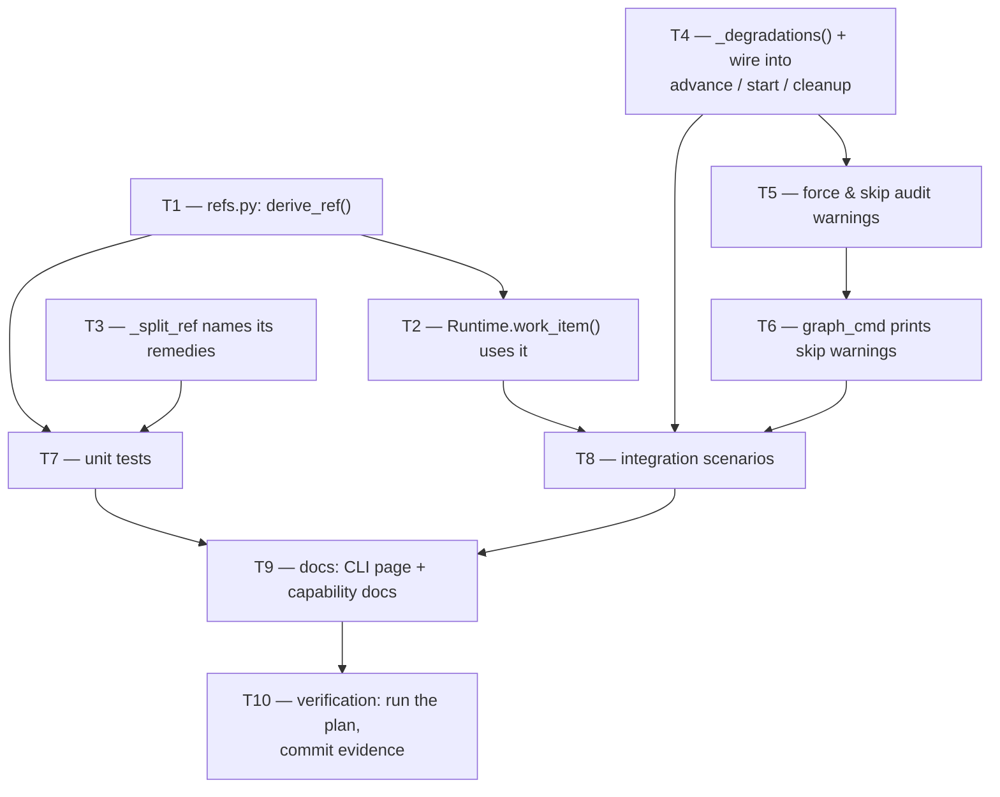

# Tasks: derive the work-item ref, and stop swallowing outbound-hook failures

> Derived from the approved `bugfix.md`, `design.md` and `testing-plan.md`. A DAG, not a
> list: tasks with no edge between them are independent. Each `_Test:_` names a row of the
> testing plan.

## Tasks

- [x] **T1 — `cli/the_loop/graph/refs.py`: the pure translation.**
  New module with `derive_ref(work_item_id, origin_repo) -> str`. Validates the id against
  `^issue-(\d+)$`, splits `origin_repo` into exactly one owner and one repo, checks both
  against `sessions/registry.py`'s existing GitHub name regex (imported, not re-declared),
  and builds the ref through `WorkItemRef(...).ref`. Returns `""` on any failure; raises
  nothing; performs no I/O.
  _Requirements: R1.1, R1.3, R1.4_ · _Test: T1_

- [x] **T2 — `Runtime.work_item()` derives when `--ref` is absent.**
  An explicit ref still wins; an underivable one still falls back to the bare id. One
  debug log line when derivation happens, so `-v` shows which ref was used. **An inner
  loop derives the pull request's ref instead** (`config["prRef"]`, built by
  `build_runtime` from `--pr`/`--pr-repo`) and never falls through to the work item's —
  found in self-review, and the one way this fix could have been worse than the bug.
  _Requirements: R1.1, R1.2, R1.3, R1.5_ · _Test: T1, T2_

- [x] **T3 — `_split_ref` names both remedies.**
  Message only: the expected shape, `--ref`, and `ticketing.github` in the harness config.
  No behaviour change.
  _Requirements: R3.1_ · _Test: T1_

- [x] **T4 — `_degradations()` and its three readers.**
  New helper in `graph/runtime.py` returning `(hook, error)` for every result that passed
  while carrying a non-empty `data["error"]`. Wired into `advance` (both the exit chain
  and the target's entry chain), `start` and `cleanup`: each appends
  `warning: <hook> did not complete: <error>` to its `NodeReport.messages` and emits
  `graph.hook_degraded` at `warning` level. Status, outcome, edge and pointer unchanged.
  _Requirements: R2.1, R2.3, R2.4_ · _Test: T1, T2_

- [x] **T5 — the force and skip audit comments report their own failure.**
  `_announce_force` and `_announce_skips` return the error string instead of only logging
  it; `force()` appends it to `ForceResult.warnings`, `declare_skips()` to a new
  `SkipResult.warnings`. `core/graphs.skip()` carries `warnings` in its dict.
  _Requirements: R2.5, R2.6_ · _Test: T2_

- [x] **T6 — `graph_cmd` prints the skip warnings.**
  `WARNING: <text>` per entry, matching the force verb's existing output. `advance` and
  `run` need no change — they already print `result["messages"]`, which is where T4's
  lines land.
  _Requirements: R2.2, R2.6_ · _Test: T2, T6_

- [x] **T7 — unit tests (`cli/tests/test_graph_refs.py`).**
  Every row of the T1 trace: the happy path, the four id refusals, the three origin-repo
  refusals, the three name-shape refusals, `_degradations`' keying on `error` and its
  silence on a legitimate no-op, and `_split_ref`'s message. Includes the three abuse
  cases from `design.md` § Security design.
  _Requirements: R1.1, R1.3, R1.4, R2.1, R3.1_ · _Test: T1, T9_

- [x] **T8 — integration scenarios (`cli/tests/test_graph_refs_integration.py`).**
  Gherkin-docstringed, against a real `Runtime` and a fake integration: the checklist
  reaching the derived ref; a failing hook printing without moving the edge; a repository
  with no ticketing config; the force and skip audit failures. Two of them drive
  `GraphCommand` and assert on `capsys`, which is the T6 row.
  _Requirements: R1.1, R1.2, R1.3, R2.1–R2.6, R3.1_ · _Test: T2, T6_

- [x] **T9 — documentation.**
  `docs/cli/commands/graph.md`: what `--ref` now defaults to, and the new warning line.
  `docs/capabilities/process-graph.md`: the ref-resolution ladder and the degradation
  reporting. `docs/capabilities/cli.md` if the skip verb's output is described there.
  Execution log's `## Documentation` section records what changed and why.
  _Requirements: all_ · _Test: T13_

- [x] **T10 — verification.**
  Execute `testing-plan.md`: run every activity, tick only what ran, record command,
  outcome and evidence, and commit the evidence under `evidence/`.
  _Requirements: all_ · _Test: T1, T2, T4, T6, T9, T13_

## Unplanned work, recorded

Two changes the plan did not anticipate. Both are in the diff and both are here rather
than folded silently into a task above.

- **`hooks/sideeffects.py` resolves its integration at call time.** Found while writing
  T8: the module bound `resolve` at import, so the seam every other hook and every test
  patches did not apply to it, and the test reached `api.github.com` for real. Fixed the
  seam rather than the test — a hook whose failure path cannot be exercised is the same
  class of defect this work item is about. One-line change, no behaviour difference in
  production (the same `resolve`, one frame later).
- **`graph.hook_degraded` registered in `eventlog.EVENT_TYPES`.** `test_eventlog.py`
  gates every emitted event against the catalogue, and rightly failed until the new
  event was documented there.
