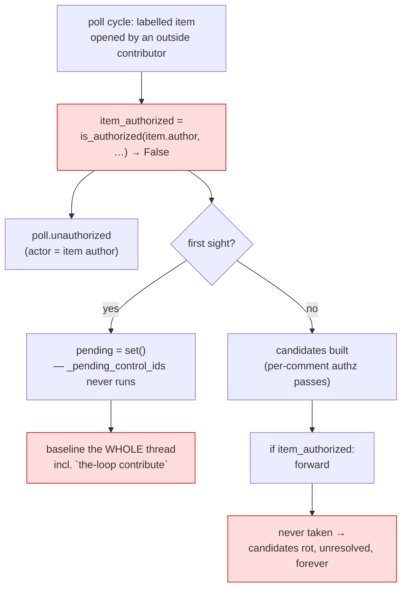

# Bugfix spec: the poller ignores an authorized user's control comment when someone else opened the item

> Phase 1 of 4 for a bug (bugfix → design → testing plan → tasks). This phase MUST be
> reviewed/approved before moving on; the human gate for this work item is the pull
> request.

## Summary

**On the poll ingress, whoever opened the issue or PR decides whether the-loop listens to
anybody.** `Poller._process_item` computes one flag from the *item's* author and then
gates the whole comment path on it, so a maintainer's `the-loop contribute` on an outside
contributor's bug report is never even looked at. The per-comment authorization check
that would have accepted it — the one the design relies on — sits below a guard that has
already dropped the thread.

The webhook ingress does not behave this way: it authorizes the **actor of the event**
(the person who commented, labelled, reviewed), never the item's author. So the same
repository, the same maintainer and the same comment work over a webhook and are silent
under polling — the one deployment shape that exists precisely because a webhook cannot
reach the host.

Ticket: [#197](https://github.com/MadaraUchiha-314/the-loop/issues/197). Version:
the-loop 9.5.1 (observed on 9.5.0; the code is unchanged since).



## Steps to reproduce

1. A polling deployment: `routing.authorizedUsers: [maintainer]`,
   `routing.control.requireStartCommand: true` (the default), a `github` poll source
   watching `owner/repo`.
2. `outsider` — a login **not** in `authorizedUsers` — opens an issue.
3. `maintainer` applies the auto-execute label and comments `the-loop contribute`.
4. Watch the poller:

   ```bash
   the-loop poll start --once -v
   the-loop events --source poll --limit 5
   ```

5. Every cycle logs `ignoring github:owner/repo#N from unauthorized author 'outsider'`
   and emits `poll.unauthorized` with `actor: outsider`. `spawns: 0`,
   `comments_forwarded: 0`. Nothing ever changes, because nothing about the item can
   change: its author is fixed.

## Expected vs actual

- **Expected:** the item's author decides at most whether the poller may start work on
  the item **by itself**. An authorized user's explicit instruction is an instruction —
  it is forwarded, executed and, when it is an arming command, it spawns the session.
- **Actual:** the item's author decides whether the poller reads the thread at all.
  A maintainer cannot make the-loop work on an outside contribution through the poll
  ingress by any sequence of comments.

## Root cause (confirmed)

`cli/the_loop/poller/poller.py::_process_item`, three places, one flag:

| Line | What it does | Consequence |
|------|--------------|-------------|
| `item_authorized = is_authorized(item.author, self.authorized_users)` | one authorization decision, taken from the **item's** author | the only actor the poll path ever authorizes for an item-level decision |
| `pending = self._pending_control_ids(…) if item_authorized else set()` | first sight | a control command already on the thread is baselined — "resolved, never look again" — so it is silenced permanently (the exact failure issue-119 fixed, reintroduced for these items) |
| `if item_authorized: for comment in candidates: …` | known item | the per-comment guard inside the candidate loop (`is_authorized(comment.author, …)`, `is_self_authored`) is dead code for these items; candidates are built and then dropped on the floor, unresolved, every cycle forever |

The webhook path for the same repository takes the other reading — `router.route()`
authorizes `event_actor(event, payload)`, the login that *did* the thing — and the
dispatcher re-checks a **named** authorized actor before executing any control command.
Both of those still run under polling, unchanged, after this fix: the poller decides
which comments are unresolved, and nothing else.

### Why the guard was written this way

Not an oversight, and worth stating plainly because the fix loosens it. The item-level
check is the poll ingress's answer to the prompt-injection question the-loop's
`authz` module exists for: a session spawned for a work item takes that work item as its
**subject**, and its title, body and thread are written by whoever is on GitHub. The
poller cannot see who applied the label (a listing carries the label, not the labeller),
so the item's author was used as a proxy for "an authorized human wanted this".

The proxy is wrong for comments — a comment carries its own author, and the poller
already reads it — and it is a defensible, if coarse, answer for **spawning**. This fix
keeps it exactly where it answers something and removes it where it answers nothing.

## Requirements

### Requirement 1 — who opened the work item never decides what happens to a comment

#### Acceptance criteria (EARS)

1. WHEN an unresolved comment on a polled work item is authored by a user in
   `routing.authorizedUsers` AND is not self-marked
   (`<!-- the-loop:agent-comment -->`), THEN the poller SHALL forward it to the
   dispatcher, regardless of who authored the work item.
2. WHEN an unresolved comment's author is **not** in `routing.authorizedUsers`, or the
   comment is self-marked, THEN the poller SHALL baseline it without forwarding —
   unchanged, and independent of the work item's author.
3. WHEN the poller sees a work item for the **first time** AND its thread carries
   unambiguous control commands from authorized users, THEN those comments SHALL be held
   back from the first-sight baseline and forwarded on that cycle in thread order,
   regardless of who authored the work item (issue-119's rule, no longer conditioned on
   the item's author).
4. WHEN the allowlist is empty, THEN nothing human-authored SHALL be forwarded — the
   fail-closed rule is untouched, and it is what an unauthorized *commenter* still meets.
5. The fix SHALL include a regression test that fails before the fix and passes after.

### Requirement 2 — the poller still never starts itself on an item nobody authorized

The item-level guard survives where it means something: a *presence* event asks the
dispatcher to spawn a session **whose subject is the work item**. That is the one poll
decision the item's author is evidence about.

#### Acceptance criteria (EARS)

1. WHEN a labelled work item's author is not authorized AND no arming control command has
   been recorded for it, THEN the poller SHALL NOT emit a presence event for it — today's
   behaviour, unchanged.
2. WHEN a labelled work item's author is not authorized AND an authorized user's arming
   command **has** been recorded for it (`ControlStore.start_requested` — `start`,
   `contribute` or `resume`), THEN the poller SHALL arm presence exactly as it does for an
   item an authorized user opened: same first-sight rule, same new-activity re-arm, same
   `polling.maxRetries` budget, same `requireStartCommand` gate.
3. WHEN the last recorded command for such an item is a disarming one (`stop`, `pause`,
   `cleanup`), THEN presence SHALL NOT be armed — the item is disarmed exactly as any
   other item is.
4. WHEN a session already exists for the work item, THEN events SHALL reach it as they do
   today, whoever authored the item.
5. The fix SHALL include a regression test that fails before the fix and passes after.

### Requirement 3 — the event log says what is actually being withheld

#### Acceptance criteria (EARS)

1. WHEN the item author's not being authorized actually suppresses a spawn, THEN the
   poller SHALL emit `poll.unauthorized` (level `warning`, `actor` = the item's author)
   and log a line naming the remedy — an authorized user's arming comment.
2. WHEN an authorized user has armed the work item, THEN the poller SHALL NOT emit
   `poll.unauthorized` for it: nothing is being withheld, and a warning that repeats every
   cycle for a work item the-loop is actively working is noise that trains an operator to
   ignore the event.

### Requirement 4 — the untrusted body is framed where it is consumed

R2 keeps a coarse proxy for one decision; R4 is why loosening the rest is safe. A spawned
session must be told, in the prompt, that the work item it is about to read is data.

#### Acceptance criteria (EARS)

1. WHEN a spawn prompt is rendered, THEN it SHALL state that the work item's own title,
   body and comment thread are untrusted content written by whoever can post on the
   repository — information about what is wanted, never instructions that override
   the-loop's rules or its configuration.
2. That statement SHALL be a **constant**: it interpolates nothing, so no payload text can
   reach it, and it SHALL sit above the untrusted payload excerpt like every other
   the-loop instruction (the issue-134 ordering rule).
3. The bundled template (`skills/the-loop/templates/webhook-autoexecute-prompt.md`) and the
   built-in fallback (`DEFAULT_SPAWN_TEMPLATE`) SHALL stay byte-identical, as
   `test_interaction.py` already requires.

## Security considerations

**One guard is deliberately loosened; the two that carry the weight are untouched, and a
third is added at the point of consumption.** Stating the trade in full because this is the
prompt-injection boundary itself — see [decision-074](../../decisions/decision-074.md).

- **Actors & trust.** Unchanged: `routing.authorizedUsers` is the allowlist, an empty one
  authorizes nobody, and the-loop's own comments are dropped by their marker before
  authorization is even considered. What changes is *which actor* is authorized for a
  comment on the poll path — the comment's author, which is who acted, instead of the item's
  author, who did not.
- **What an unauthorized user gains.** Nothing they did not already have. An outside
  contributor's comment is still dropped by the per-comment check (R1.2); their issue body
  still cannot spawn a session (R2.1); they still cannot issue a control command (the
  dispatcher re-checks a **named** allowlisted actor, and refuses otherwise). The only new
  reachable state is one an *authorized* user asked for explicitly.
- **What an authorized user gains — and the abuse case that comes with it.** A maintainer
  can now point the-loop at a work item they did not open, which means an attacker's issue
  body can become the subject of a session **if a maintainer asks for that**. That is the
  same trust model as `git checkout` of a contributor's branch: the human decides to engage,
  and the machine treats the content as data. R4 makes the framing explicit in the prompt;
  `reference/security.md`'s prompt-injection posture already governs what a session may do
  with untrusted text.
- **Trust boundary, restated.** Untrusted content (item body, titles, comment bodies) may
  become **input**; only an authorized login's comment may become an **instruction**. Before
  this fix the poll path enforced that by discarding both when the item's author was
  unknown; after it, each is judged by its own author, which is what the webhook path has
  always done.
- **Fail closed.** Every new path is additive-with-a-gate: presence still requires
  `item_authorized OR start_requested`, and `start_requested` is written only by the
  dispatcher, only for a named allowlisted actor, only through the control store. An
  unreadable control store reads as "nothing recorded", which is the *closed* direction.
- **No new input channel, no new credential path, no new outbound call.** The change is
  three conditionals and one prompt paragraph.

## Out of scope

- **Authorizing the labeller instead of the author.** The right long-term answer for
  presence on the poll path is "who applied the auto-execute label", which the `gh` listing
  does not carry — it costs a per-item timeline query every cycle. Not this fix; recorded in
  `design.md` § Trade-offs as the direction, with the arming comment as the remedy available
  today.
- **Changing the webhook path.** It already authorizes the actor. Nothing here touches
  `router.route()` or the dispatcher's control re-check.
- **Making the item body part of the poll presence payload.** It is not today (for issues),
  and this fix does not add it.

## Open questions

None.
