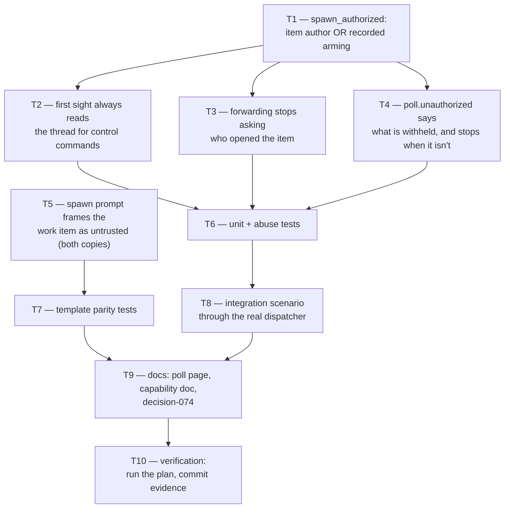

# Tasks: the item's author gates spawning, and nothing else

> Derived from the approved `bugfix.md`, `design.md` and `testing-plan.md`. A DAG, not a
> list: tasks with no edge between them are independent. Each `_Test:_` names a row of the
> testing plan.

## Tasks

- [ ] **T1 — `_process_item` computes `spawn_authorized`.**
  `item_authorized or self.control_store.start_requested(ref)`, replacing `item_authorized`
  at both presence seams (first sight and known item). No other behaviour moves.
  _Requirements: R2.1, R2.2, R2.3, R2.4_ · _Test: T1, T4_

- [ ] **T2 — first sight always asks which control comments are pending.**
  Drop the `if item_authorized else set()` conditional on `_pending_control_ids`. The
  method's own guards (authorized comment author, not self-marked, unambiguous, no existing
  control record) are the whole gate — none of them changes.
  _Requirements: R1.3_ · _Test: T1_

- [ ] **T3 — forwarding stops asking who opened the item.**
  Remove the `if item_authorized:` wrapper around the candidate loop. Candidates are
  already filtered by their own author and by the self-marker.
  _Requirements: R1.1, R1.2_ · _Test: T1, T4_

- [ ] **T4 — the withheld-spawn warning tells the truth.**
  Emit `poll.unauthorized` (and log) only when the item's author being unauthorized
  actually withholds a spawn — i.e. when `spawn_authorized` is false — and name the remedy
  in the log line.
  _Requirements: R3.1, R3.2_ · _Test: T1_

- [ ] **T5 — the spawn prompt frames the work item itself as untrusted.**
  One constant paragraph, added identically to
  `skills/the-loop/templates/webhook-autoexecute-prompt.md` and `DEFAULT_SPAWN_TEMPLATE`
  in `webhook/dispatcher.py`, above `$payload_excerpt`.
  _Requirements: R4.1, R4.2, R4.3_ · _Test: T6_

- [ ] **T6 — unit and abuse-case tests.**
  In `cli/tests/test_poller.py`: the R1/R2/R3 cases from the trace table, including the
  four abuse cases. Rewrite `test_first_sight_ignores_the_thread_of_an_unauthorized_items_author`
  (it asserted the bug) and keep `test_poller_does_not_spawn_for_unauthorized_item_author`
  (it asserts R2.1, which does not change).
  _Requirements: R1.1–R1.5, R2.1–R2.5, R3.1, R3.2_ · _Test: T1, T4_

- [ ] **T7 — template parity holds.**
  `cli/tests/test_interaction.py` — assert the new paragraph exists in both copies and
  still precedes the untrusted payload block.
  _Requirements: R4.1, R4.2, R4.3_ · _Test: T6_

- [ ] **T8 — integration scenario.**
  In `cli/tests/test_poller_integration.py`: a Gherkin-docstringed scenario driving a real
  `Dispatcher` — a maintainer's `the-loop contribute` on a stranger's item records the
  command and spawns; the same command from the stranger does neither.
  _Requirements: R1.1, R1.2, R1.3, R2.2_ · _Test: T2_

- [ ] **T9 — documentation.**
  `docs/cli/commands/poll.md` (the Guards block states the old rule verbatim),
  `docs/capabilities/webhook-triggers.md` (behaviour + history row), and
  `docs/decisions/decision-074.md` with its index row.
  _Requirements: all_ · _Test: T13_

- [ ] **T10 — verification.**
  Execute the testing plan, fill in its results table, commit the evidence.
  _Requirements: all_ · _Test: T5, T13_

## Unplanned work, recorded

None yet — anything done that no task above named is recorded here, with why.
