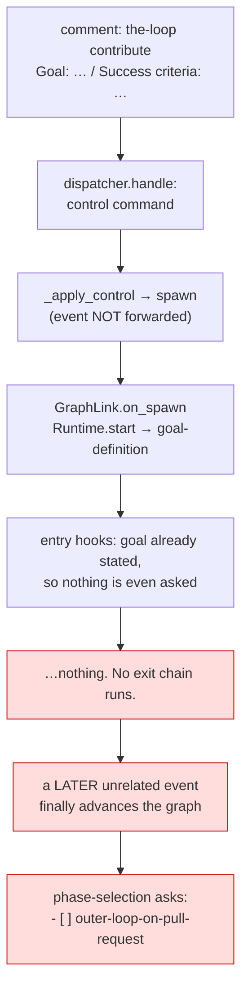

# Bugfix spec: a contribution is asked where its outer loop goes, and then waits for a second command

> Phase 1 of 4 for a bug (bugfix → design → testing plan → tasks). This phase MUST be
> reviewed/approved before moving on; the human gate for this work item is the pull
> request.

## Summary

**`the-loop contribute` produces a phase-selection gate that asks an unanswerable question,
and then sits there.** Two independent defects, both in the seam between the contribution
loop (issue-185) and machinery written for the loop that owns a work item:

1. **A question with no true answer.** The `phase-selection` checklist ends with
   `- [ ] outer-loop-on-pull-request — on a pull request in this repository.` (issue-183).
   `pdlc-contribution-loop` has no outer loop: it joins a work item somebody else is
   already running, authors **one** artifact on that thread, and opens no pull request to
   carry a spec chain. Whichever way the box is left, the answer is wrong — untick it and
   the confirmation promises "the outer loop happens here, on this work item… each
   repository this item contributes code to gets its own pull request for the inner loop";
   tick it and the record claims a pull request the loop will never open.
2. **The arming comment reaches no gate.** `the-loop contribute` is a *control* command:
   the dispatcher executes it and deliberately does **not** forward the event
   (`dispatcher.py::handle`). The spawn it causes enters the graph
   (`GraphLink.on_spawn` → `Runtime.start`) but never evaluates the node it entered. So a
   contribution whose arming comment already carried the goal — the fast path
   `goal.py::post_goal_request` is written for, and the one the request comment advertises
   ("If your `the-loop contribute` comment already contained this block, nothing more is
   needed") — parks at `goal-definition` with nothing left to happen, until some
   *unrelated* later event arrives and `_dispatch_one` advances the graph as a side effect
   of delivering it.

Ticket: [#199](https://github.com/MadaraUchiha-314/the-loop/issues/199). Version:
the-loop 9.6.0.



## Steps to reproduce

1. A repository the daemon watches, `routing.control` at its defaults.
2. An authorized user comments on an existing, in-progress issue:

   ```text
   the-loop contribute
   Goal: make the retry loop honour the configured backoff
   Success criteria:
   - [ ] the flaky-timeout test passes 50 consecutive runs
   ```

3. **Observed:** a session spawns, the ticket gains `loop:phase-selection`-less silence —
   the pointer is at `goal-definition`, the goal is already stated so no request is
   posted, and nothing further happens. Any second comment (`the-loop start`, or any
   ordinary remark) moves it on.
4. **Then observed:** the phase-selection checklist arrives carrying
   `outer-loop-on-pull-request`, a row about a loop this work item does not have.

**Expected:** step 2 alone carries the item to `phase-selection`, and the checklist it
posts asks only questions this loop can answer.

## Root cause

| # | Defect | Where |
|---|--------|-------|
| 1 | The surface row is rendered, parsed and confirmed for **every** graph that reaches `phase-selection`, though only the outer loop has an outer loop to place | `cli/the_loop/graph/hooks/selection.py` (`_checklist_body`, `_parse_surface`, `_confirmation`, `_frozen_graph`) |
| 2 | The session prompt tells a contribution where to iterate "the outer loop's artifacts" | `cli/the_loop/graphlink.py::render_graph_context` |
| 3 | A spawn enters the start node and never evaluates it, while the comment that caused the spawn is the one input a control command can never deliver later | `cli/the_loop/graphlink.py::GraphLink.on_spawn`, `cli/the_loop/webhook/dispatcher.py::_spawn_tmux` |

Defect 3 is invisible on the outer loop because its start node, `phase-selection`, needs a
*different* comment anyway (`the-loop execute`, which cannot ride along with `the-loop
start` — two keywords in one comment are refused as ambiguous). The contribution loop is
the first graph whose start node can be answered by the arming comment itself, and it was
designed to be.

## Requirements

### R1 — a loop with no outer loop is not asked where to put one

- R1.1 — WHEN the graph being walked is `pdlc-contribution-loop` THEN the
  `phase-selection` checklist SHALL NOT render the `outer-loop-on-pull-request` row, and
  SHALL say instead where this contribution's conversation happens.
- R1.2 — Every other graph SHALL render the row exactly as before, including a
  repository-supplied outer loop.
- R1.3 — WHEN a contribution's reply carries the `outer-loop-on-pull-request` token
  anyway (habit, copy-paste, or an injected checklist) THEN it SHALL change nothing: no
  surface recorded, no phase declared away, no refusal reported.
- R1.4 — The frozen record and `graph-state.json` SHALL carry an **empty** surface for
  such a work item, distinct from the recorded default `work-item`; the confirmation
  comment SHALL claim no surface at all.
- R1.5 — A session working a contribution SHALL NOT be told in `$graph_context` where to
  iterate "the outer loop's artifacts".

### R2 — the arming comment is an input to the node it lands on

- R2.1 — WHEN a spawn enters a start node whose `actor` is `human` THEN the-loop SHALL
  evaluate that node's exit chain once, with the spawning event's comments attached.
- R2.2 — IF the gate does not release THEN the work item SHALL stay exactly where it was,
  parked with the gate's own reason — never advanced, never blocked past.
- R2.3 — A **respawn** (a work item that already has a pointer) SHALL evaluate nothing:
  no attempt counted, no state changed but the session binding.
- R2.4 — An **agent** start node SHALL NOT be evaluated at spawn: its exit chain reads
  artifacts the session it was spawned for has not yet had a chance to write.
- R2.5 — Every failure here SHALL remain best-effort: a gate that raises, a runtime that
  cannot be built, or an unreadable graph SHALL leave the work item as the pre-issue-199
  code left it and SHALL NOT cost the delivery.

### R3 — the paper trail

- R3.1 — The capability docs (`process-graph`, `webhook-triggers`, `spec-workflow`), the
  `graph` CLI page and the skill's `workflow.md`/`collaboration.md`/`SKILL.md` SHALL state
  both behaviours in the same change.

## Security considerations

The change moves **when** untrusted comment text reaches a hook chain, not **whether**.

| Boundary | Before | After |
|----------|--------|-------|
| Who may answer a gate | `authorizedUsers`, enforced inside each classify hook | unchanged — `on_spawn` passes comments, it does not authorize them |
| What a comment can cause | at most one node boundary, along a declared edge | unchanged; the spawn path now runs the same `advance` the delivery path already ran |
| What a spawn can reach | `Runtime.start` (entry chain) | plus one exit chain, only on a human node, only on a fresh entry |
| The surface value | one of two literals, from a ticked box | one of two literals **or empty**; a contribution can no longer be given a pull-request surface at all — strictly less reachable state |

Abuse cases considered:

1. **An unauthorized user's comment spawns a session and answers the gate.** It cannot:
   the spawn itself requires an armed item and an authorized control command, and the
   gate re-checks `authorizedUsers` on every comment it reads (`_authorized_comments`,
   `goal.py::_thread_comments`). A comment that spawns nothing reaches nothing.
2. **An injected `outer-loop-on-pull-request` row in a contribution's thread makes
   the-loop open a pull request.** It cannot: the token is not parsed for that loop at
   all, and it was never a destination — only a recorded literal.
3. **A gate that raises during a spawn wedges the spawn or the delivery.** It cannot:
   `_guarded` swallows and records every fault, and the spawn's own return value is
   already committed by then.
