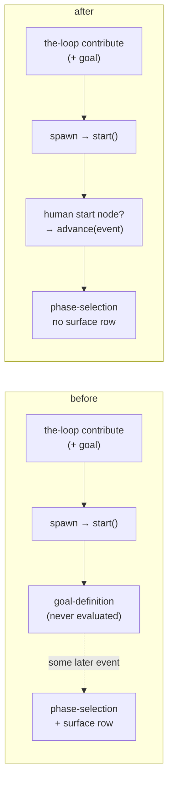

# Design: a contribution has no outer loop, and its arming comment answers its first gate

> Phase 2 of 4 (bugfix → design → testing plan → tasks). Derives from the approved
> `bugfix.md`. The human gate for this work item is the pull request.

## Overview

Two small, independent changes, each in the module that owns the fact it is about.

| Requirement | Mechanism |
|-------------|-----------|
| R1.1–R1.4 | `graph/hooks/selection.py`: one predicate, `_asks_surface(ctx)`, read at the three places the surface question exists — render, parse, confirm — with the frozen record carrying `""` |
| R1.5 | `graphlink.py`: `GraphContext.loop`, and one branch in `render_graph_context` |
| R2.1–R2.5 | `graphlink.py::GraphLink.on_spawn`: evaluate a **human** start node once, with the spawning event; `dispatcher.py::_spawn_tmux` passes `routed` |

Nothing changes about which edges exist, who may answer a gate, or what a hook may do.



## D1 — the surface question belongs to loops that have an outer loop

`_asks_surface(ctx)` is `ctx.graph.name != PDLC_CONTRIBUTION_LOOP`. Three properties made
this the right shape:

- **Derived from the compiled graph in context**, the same source `_phase_rows` reads. The
  checklist a user sees, the vocabulary their reply is validated against, and the record
  that is frozen therefore cannot disagree about which loop this is.
- **Named negatively — "not the contribution loop" — rather than positively.** A
  repository may supply its own `pdlc-work-item-loop.yaml`; it owns a work item, it has an
  outer loop, and it keeps the question. Only the one graph a repository *cannot* override
  loses it, which is also the only graph we can be certain has no outer loop.
- **`pdlc-pr-loop` needs no case.** It has no `phase-selection` node and never reaches
  this hook; the existing docstring already says so, and this change does not make that
  claim load-bearing.

The absent row is replaced by a sentence, not by silence: a reader of somebody else's
ticket should not have to work out where this conversation is going to happen.

**The record carries `""`, not the default.** `NO_SURFACE = ""` distinguishes *never
asked* from *offered and left alone*, and it costs nothing downstream because
`Runtime._record_selected_skips` already writes `state.surface` only for a truthy value —
so `graph-state.json` keeps its pre-issue-199 shape, and no reader learns a third literal.
`_confirmation` gains the same guard: claiming "the outer loop happens here, on this work
item (the default)" would report a choice the human was never offered.

## D2 — the prompt does not name an outer loop for a contribution

`GraphContext` gains `loop`, read from the same `graph-state.json` the rest of the context
comes from, and `render_graph_context` branches on it. This is the *reader's* half of D1:
the gate stops asking, and the prompt stops instructing. Both go through
`_is_contribution(loop)` rather than an inline comparison — two very different callers
asking one question.

## D3 — a human start node is evaluated once, at spawn

```python
def call(rt, item):
    report = rt.start(item, work_item.ref)
    self._bind_session(rt, item, session_id, runner)
    if report is None or not self._entered_a_human_gate(rt, report):
        return
    rt.advance(item, ref=work_item.ref, event={"comments": comments_from(routed)})
```

Four deliberate narrowings, each answering "what could this break?":

1. **`report is None` returns.** `Runtime.start` is pointer-idempotent, so this is exactly
   "a fresh entry happened". A respawn, a redelivered spawn and a session restarted after
   a crash all evaluate nothing (R2.3).
2. **Human nodes only.** An agent node's exit chain gates checked-in artifacts; running it
   before the session has done any work would count a failed attempt against work that has
   not begun, and `max_attempts` escalation is a real consequence (R2.4).
3. **The event rides along.** `comments_from(routed)` is the same translation `on_event`
   uses; `routed=None` yields `[]`. `classify-goal` re-reads the thread anyway, so this is
   not what makes the fix work — it is what keeps the two paths from disagreeing about
   what a gate is handed.
4. **Inside `_guarded`, and therefore inside the state lock and the blanket `except`.**
   The advance runs after `_bind_session`, so a `session: inherit` gate resolves against
   the session that was just spawned. Nothing here re-acquires the lock (`Runtime.advance`
   does not; only `Runtime.complete` does).

`_entered_a_human_gate` fails closed on anything unreadable: not evaluating leaves the
work item where the pre-issue-199 code left it.

**Why not fix it in the dispatcher instead** (forward the arming comment after
`_apply_control`)? Because that would change what a *control* command is: the whole point
of issue-106's boundary is that a keyword is executed by the-loop and not handed to the
harness. Delivering it as an event would also render a second prompt into the freshly
spawned session. The graph coupling is the right place: it already owns "an event reached
this work item, let the graph see it".

**Why the spawn prompt is not re-rendered.** `_spawn_for` resolves context *before* the
spawn by design (issue-148 D5: reads before, writes after), so a prompt whose gate resolved
milliseconds later is momentarily stale. It is not corrected here: the session's own
`the-loop check`/`graph complete` read live state, the stale line is a status echo rather
than an instruction, and re-ordering the spawn around the graph would trade a cosmetic
staleness for the possibility of entering a graph for a session that never started.

## Trade-offs considered

| Option | Why not |
|--------|---------|
| Give `pdlc-contribution-loop` its own selection hooks | Two copies of a gate that must stay identical in authorization, freezing and provenance — the failure mode is silent divergence |
| A `surface: none` marker in the graph YAML | A repository cannot override this graph, so the marker would be configuration nobody can set; the loop's identity already carries the fact |
| Record `surface: "work-item"` for contributions | Reads back as a choice that was made; the whole complaint is a question that should not have been asked |
| Evaluate **every** start node at spawn | Breaks R2.4 — agent nodes would block/escalate on artifacts nobody has been asked for yet |
| Have `classify-goal` poll, or the poller re-check | Adds a scheduled path for something the event that already exists can answer |
