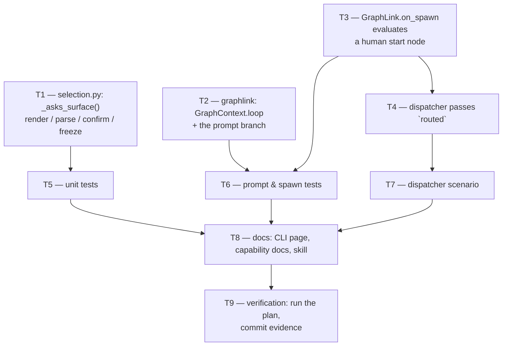

# Tasks: a contribution has no outer loop, and its arming comment answers its first gate

> Derived from the approved `bugfix.md`, `design.md` and `testing-plan.md`. A DAG, not a
> list: tasks with no edge between them are independent. Each `_Test:_` names a row of the
> testing plan.

## Tasks

- [x] **T1 — `selection.py`: the surface question becomes conditional.**
  `_asks_surface(ctx)` reads the compiled graph's name; `_checklist_body` renders the row
  or a sentence saying where a contribution's conversation happens;
  `classify_phase_selection` parses a surface only when the question was asked;
  `_confirmation` claims one only when there is one; `NO_SURFACE = ""` documents the
  distinction the frozen record now carries.
  _Requirements: R1.1, R1.2, R1.3, R1.4_ · _Test: T1_

- [x] **T2 — `graphlink.py`: the prompt stops naming an outer loop for a contribution.**
  `GraphContext.loop`, populated from `graph-state.json` in `_context_from`; one branch in
  `render_graph_context` behind `_is_contribution(loop)`.
  _Requirements: R1.5_ · _Test: T4_

- [x] **T3 — `GraphLink.on_spawn` evaluates a human start node once.**
  Fresh entries only (`Runtime.start` returned a report), human nodes only
  (`_entered_a_human_gate`, failing closed), with `comments_from(routed)` attached —
  inside the existing lock and blanket `except`, after the session binding.
  _Requirements: R2.1, R2.2, R2.3, R2.4, R2.5_ · _Test: T2, T4_

- [x] **T4 — the dispatcher hands the spawning event over.**
  `_spawn_tmux` passes `routed=routed`; the respawn seam deliberately does not, because a
  respawn evaluates nothing anyway.
  _Requirements: R2.1_ · _Test: T3_

- [x] **T5 — unit tests for the surface question.**
  `test_graph_contribution.py`: the contribution checklist omits the row and says where the
  conversation happens; the outer loop's still asks; a ticked token in a contribution's
  reply changes nothing (pointer, `state.surface`, frozen record, skips, confirmation).
  _Requirements: R1.1, R1.2, R1.3, R1.4_ · _Test: T1, T10_

- [x] **T6 — tests for the spawn-time gate and the prompt.**
  `test_graph_contribution.py`: the arming comment reaches the goal gate at spawn; no goal
  parks with a reason; a respawn re-evaluates nothing. `test_graph_drive.py`: the
  contribution prompt line, the outer-loop prompt line, and an agent start node left
  unevaluated at spawn.
  _Requirements: R1.5, R2.1, R2.2, R2.3, R2.4_ · _Test: T2, T4_

- [x] **T7 — dispatcher scenario.**
  `test_graph_drive_integration.py`: the `RoutedEvent` that spawned the session is the one
  handed to `on_spawn`; the existing link double accepts and records it.
  _Requirements: R2.1_ · _Test: T3_

- [x] **T8 — documentation.**
  `docs/cli/commands/graph.md` (the checklist section), `docs/capabilities/process-graph.md`
  (the contribution-loop bullet, the ingress-drives-the-graph bullet, a history row),
  `docs/capabilities/webhook-triggers.md` (the control-keyword bullet, a history row),
  `docs/capabilities/spec-workflow.md`, `skills/the-loop/SKILL.md`,
  `skills/the-loop/reference/workflow.md`, `skills/the-loop/reference/collaboration.md`.
  _Requirements: R3.1_ · _Test: T14_

- [x] **T9 — verification.**
  Run every applicable row of the testing plan, record the results in
  `testing-plan.md` § Verification results, and commit the evidence.
  _Requirements: all_ · _Test: T1–T14_

## Unplanned changes

- **`test_graph_drive_integration.py::_SeqLink.on_spawn` gained the `routed` parameter.**
  The double is a stand-in for `GraphLink` at the dispatcher seam, so a new argument at
  that seam is a change to it. It records the value, which is what T7 asserts.
