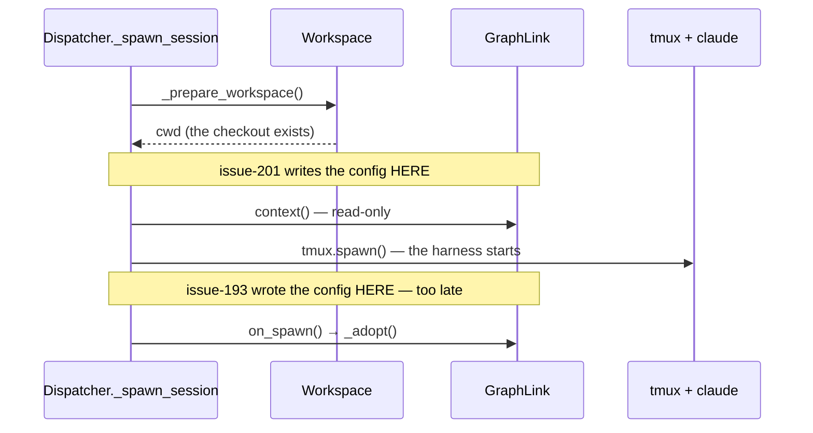

# Bugfix: adopt an unconfigured repository before the session is spawned

> A **bugfix** in place of `requirements.md` (both clear the same gate, decision-045): the
> behaviour was specified and built in issue-193; only its *ordering* is wrong. The
> design lives here too rather than in a `design.md` of its own — the fix is one new
> method, two call sites and a test that asserts a sequence.

## Introduction

issue-193 made the-loop write its built-in default harness config into a repository that
carries no `.the-loop/`. It is programmatic and on the daemon path — and it runs on the
wrong side of the only moment that matters. Ticket:
[#201](https://github.com/MadaraUchiha-314/the-loop/issues/201).

The window between `tmux.spawn` and `on_spawn` is short and the write is fast, but a
harness whose whole claim is predictability cannot leave *"did the session find a
config?"* to a race with its own SessionStart hook. The bug is not that the outcome is
wrong — the file does appear — it is that **nothing guarantees when**.

## Requirements

### Requirement 1 — the config exists before the harness starts

**User story:** As an operator whose daemon spawns sessions into fresh clones, I want the
harness config on disk before the harness process exists, so that a session can never
begin in a repository with nothing to read.

#### Acceptance criteria (EARS)

1. WHEN the dispatcher spawns a session for a work item in a checkout carrying no harness
   config THEN `.the-loop/harness-config.yaml` SHALL exist **before** `tmux.spawn` is
   called.
2. WHEN a dead session is respawned THEN adoption SHALL run in the same pre-flight as the
   harness-trust preparation, before the harness process restarts.
3. WHEN the ordering is verified THEN it SHALL be observed **from inside the spawn call**,
   not after the dispatch returns — the outcome was already correct before this fix, and
   only the ordering was not.

### Requirement 2 — the gates do not move with it

**User story:** As the same operator, I want the earlier write to be no less careful than
the later one, so that fixing an ordering bug does not widen what the daemon may touch.

#### Acceptance criteria (EARS)

1. WHEN adoption runs pre-spawn THEN it SHALL apply the same gates the driving actions
   apply: the coupling is enabled, the work item is nameable, an authorized human armed
   it, and the checkout is proved by its `origin` remote to be the work item's own
   (issue-113 A6, decision-044).
2. WHEN the work item walks `pdlc-contribution-loop` THEN nothing SHALL be written, exactly
   as before (issue-185, PR #187).
3. IF the checkout already carries a harness config THEN it SHALL be left byte-for-byte as
   it is.
4. WHILE the graph's driving actions run, adoption SHALL remain available as an idempotent
   safety net, so a session spawned before this change — or reaching the graph by a route
   the dispatcher does not own — is still adopted.

## Security considerations

**No new attack surface, and one gate order preserved deliberately.** The write target,
the allow-listed `owner`/`repo` substitution, the symlink containment (`_inside`) and the
never-overwrite rule are all unchanged — this work item moves *when* `scaffold()` is
called, not *what* it does.

The one thing that could have gone wrong is the reason `GraphLink.adopt` exists at all
rather than a bare `harness_config.scaffold(cwd, …)` in the dispatcher: at the pre-spawn
point, `cwd` is **not yet known to be the work item's repository**. Under the legacy
`spawnWorkdir` setup it is a static directory that may be the operator's own checkout, and
writing there would be issue-113's A6 defect with a different payload. So the ownership
proof moves with the write.

- **Abuse cases (EARS):**
  1. WHEN a spawn is prepared in a checkout whose `origin` is not the work item's
     repository THEN nothing SHALL be written (`test_a_foreign_checkout_is_never_adopted`
     covers the same gate on the `_guarded` path; the pre-spawn path shares the method).
  2. WHEN the work item is a contribution THEN nothing SHALL be written.
- **Fail closed:** every gate that cannot be evaluated returns without writing.

## Out of scope

The content of the default, the substitution rules, and the `harness.config_scaffolded`
event — all settled in issue-193 / decision-073 and unchanged here.

## Testing

| Row | Type | What it proves | Command |
|---|---|---|---|
| T1 | Integration (ordering) | `.the-loop/harness-config.yaml` is present **at the moment `tmux.spawn` is called**, asserted from inside a `FakeTmux.spawn` override; verified red by disabling the pre-spawn call | `pytest cli/tests/test_harness_config_scaffold_integration.py -k before_the_harness` |
| T2 | Integration (sequence) | the dispatcher's recorded call order is `adopt → context → deliver → spawn` | `pytest cli/tests/test_graph_drive_integration.py` |
| T3 | Regression | issue-193's whole suite — gates, carve-out, abuse cases — still passes with adoption moved | `pytest cli/tests/test_harness_config_scaffold_integration.py cli/tests/test_harness_config.py` |
| T4 | Regression (whole suite) | nothing else moved | `make test` |
| T5 | Lint / type-check | repository gates | `make lint format-check typecheck validate` |

### Verification results

| Activity | Command | Outcome | Evidence |
|---|---|---|---|
| T1 | `pytest … -k before_the_harness` | pass — and **fails** with the pre-spawn call removed, which is what makes it a test of the ordering rather than of the outcome | [`evidence/ordering.md`](evidence/ordering.md) |
| T2 | `pytest cli/tests/test_graph_drive_integration.py` | pass — 9 passed | [`evidence/ordering.md`](evidence/ordering.md) |
| T3 | `pytest cli/tests/test_harness_config*.py` | pass — 47 passed | [`evidence/ordering.md`](evidence/ordering.md) |
| T4 | `make test` | pass — 1782 passed, 1 skipped | [`evidence/ordering.md`](evidence/ordering.md) |
| T5 | `make lint format-check typecheck validate` | pass — ruff clean, 0 markdown errors, pyright 0 errors, 7 configs VALID | [`evidence/ordering.md`](evidence/ordering.md) |

**Not executed:** none.

## Review comments

> Appended by the-loop's `record-feedback` hook when a human gate approves with
> comments (issue-109).
