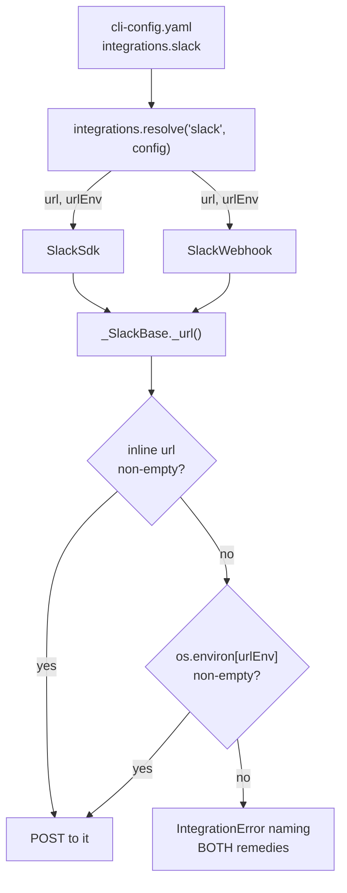

# Design: an inline `url` for the Slack integration

> Phase 2 of the chain. Derives from the approved
> [`requirements.md`](requirements.md).

## Overview

**One optional schema property, one extra constructor argument, and one changed line in
`_SlackBase._url()`.** The resolution point is already centralised — both transports
inherit `_url()` from `_SlackBase`, and `resolve()` is the only place a Slack provider is
built — so the change is additive at both ends and nothing between them moves.



## Architecture

Nothing architectural moves. The pieces this touches:

| Piece | File | Change |
|-------|------|--------|
| Config schema | `.the-loop/cli-config.schema.json` | `integrations.slack.url` — optional `string` |
| Transport resolution | `cli/the_loop/graph/integrations/base.py` | read `url` beside `urlEnv`; pass both to either provider |
| The providers | `cli/the_loop/graph/integrations/slack.py` | `_SlackBase.__init__(url_env, url="")`; precedence + error message in `_url()` |
| Docs | `docs/config/cli/integrations-options.md` | a `### slack.url` section stating the trade-off |
| Config template | `skills/the-loop/templates/cli-config.yaml` | a commented-out `url:` line naming its cost |

The `version` field of the CLI config schema is **not** touched: the property is optional
and additive, so every config valid before this change stays valid, and
`the-loop migrate-config` has nothing to do (R3.2). The version gate exists to refuse a
config whose *shape* the CLI no longer understands; this shape is a superset.

## Components & interfaces

### `resolve("slack", config)` — `base.py`

```python
url_env = str(section.get("urlEnv", "THE_LOOP_SLACK_WEBHOOK_URL"))
url = str(section.get("url") or "")
```

Both values are read once, in the one place that builds a Slack provider, and handed to
whichever transport is selected. `or ""` collapses `None`, a missing key and an explicitly
empty string into the same "absent" — abuse case 2: a blank `url:` cannot silently disable
a working env-based setup.

The `transport` branches are untouched apart from threading the extra argument, so
`sdk`/`webhook`/`auto` selection and the `slack-sdk` `ImportError` fallback keep behaving
exactly as they do today.

### `_SlackBase` — `slack.py`

```python
def __init__(self, url_env: str, url: str = ""):
    self.url_env = url_env
    self.url = url

def _url(self) -> str:
    url = self.url or os.environ.get(self.url_env) or ""
    if not url:
        raise IntegrationError(
            "slack has no webhook url — set integrations.slack.url in the CLI "
            f"config, or export {self.url_env}"
        )
    return url
```

`url` is keyword-defaultable, so `SlackWebhook("X")` — the shape used across the existing
tests and by any embedder — keeps working unchanged (R3.1). Both transports inherit this
method, which is what makes them undriftable by construction (R3.3).

Resolution stays at **call time**, not construction time: a provider built once and used
across many transitions must see the environment as it is when it posts, and that
property is unchanged.

## Data models

The schema addition, in full:

```json
"url": {
  "type": "string",
  "description": "The incoming-webhook URL itself, for operators who judge it non-secret. Takes precedence over urlEnv. A Slack webhook URL is a bearer credential for one channel: putting it here commits it. Prefer urlEnv where the config file is shared or public."
}
```

`"type": "string"` is what rejects a mapping, a list or a number (abuse case 1);
`additionalProperties: false` on the `slack` object is retained, so this widens the
surface by exactly one named key (R1.4).

The `docs/config/cli/integrations-options.md` page must gain a matching
``### `slack.url` `` section with `Type` and `Default` bullets, or `test_docs_parity`'s P4
fails — the schema-leaf-must-be-documented gate from issue-117. That coupling is the
reason the documentation trade-off statement (R1.5) is enforced by a test rather than by
good intentions.

## Error handling

One message changes. Before: `slack has no webhook url — set THE_LOOP_SLACK_WEBHOOK_URL`.
After, it names both sources. The severity, the exception type and the caller's handling
are all the same: `notify` catches `IntegrationError`, logs a warning, and returns
`delivered=False` — a channel outage never wedges the graph, and this work item does not
change that (R2.2).

## Security design

- **AuthN/AuthZ:** none is added. The new key is read by the daemon from a local file; no
  remote actor can set it. The daemon's existing authorization gates (`authorizedUsers`,
  the self-authored marker) are on a different path entirely and are untouched.
- **Input validation & injection surfaces:** the value is typed `string` by the schema and
  used as a request target by `urllib.request.Request` / `slack_sdk`'s `WebhookClient`.
  It is never interpolated into a shell command, a path or a prompt, so the injection
  surfaces are the ones a URL always has, and no new class of them appears. A non-string
  is refused at validation, before any code sees it.
- **Secrets handling:** the URL is read at call time and passed straight to the HTTP
  client. It is not logged, not written to the event log, and not included in the
  `IntegrationError` message — the error names the *sources*, never the value (abuse
  case 3). The `urlEnv` path is unchanged and remains the recommended default for anyone
  whose config file is shared or public.
- **Least privilege:** a Slack incoming-webhook URL is already the narrowest Slack
  credential there is — post rights to one channel, no read, no workspace scope. Nothing
  here broadens it.
- **Fail-closed behaviour:** neither source set → raise before any network call. The
  best-effort `notify` contract then records the failure rather than swallowing it
  silently.
- **Abuse-case coverage:**

  | Abuse case | Mechanism | Negative test |
  |---|---|---|
  | 1 — `url` supplied as a non-string | JSON-Schema `"type": "string"` | `test_a_non_string_url_is_refused_by_the_schema` |
  | 2 — `url` present but empty | `str(section.get("url") or "")` in `resolve()` | `test_an_empty_inline_url_falls_back_to_the_environment` |
  | 3 — the URL leaking into logs/errors | the error names sources, not the value | `test_the_failure_names_both_remedies_and_not_the_url` |

## Testing strategy

Every requirement is provable without a network call, because the seam is resolution, not
delivery: build a provider through `resolve()` with a given config and environment, and
assert what `_url()` returns. R1 is four precedence cases (inline only, both, env only,
neither) plus a schema-validation case; R2 is the message content; R3 is the
already-existing suite continuing to pass with the old positional constructor shape.

Integration rows (`cli/tests/test_*_integration.py`, Gherkin-documented) cover the one
thing unit tests over `_url()` cannot: that the URL an operator wrote in the config file
is the URL the `notify` hook actually posts to, end to end through `resolve()` — the
scenario `A notification is delivered to the URL configured inline`. The delivery itself
is faked at the HTTP boundary; the-loop does not test Slack.

Executable detail — the matrix, environment, evidence — is
[`testing-plan.md`](testing-plan.md).

## Trade-offs & decisions

**The decision worth recording is not "add a key", it is "the-loop stops encoding one
credential's secrecy policy as a capability limit".** It is logged as
[decision-075](../../decisions/decision-075.md).

| Option | Why not |
|--------|---------|
| Keep env-only | The failure mode is silent and three processes deep. The policy is defensible for a token; for single-channel post rights it costs an operator more than it protects. |
| `urlFile` as well | A third source for one value, with no operator asking for it. Additive later on the same resolution point if one does. |
| Warn at `poll start` | Cannot be made accurate — see [`requirements.md`](requirements.md) § Out of scope. |
| `url` overrides `urlEnv` | **Chosen.** Precedence the other way round would make the effective configuration depend on ambient environment, so reading the file would no longer tell you where a notification goes. |

## Open questions

None.

## Review comments

> Appended by the-loop's `record-feedback` hook when a human gate approves with
> comments (issue-109).
