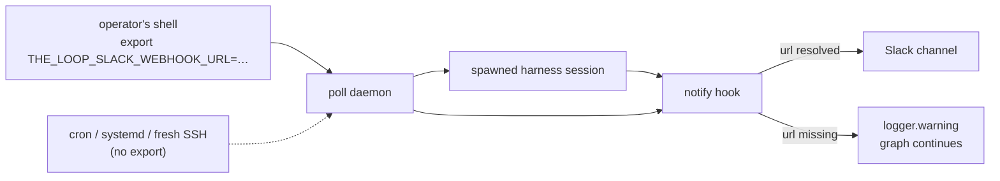

# Requirements: an inline `url` for the Slack integration

> Phase 1 of the chain. Ticket:
> [#203](https://github.com/MadaraUchiha-314/the-loop/issues/203).

## Introduction

**The one value that turns Slack notifications on is the only value the-loop's own
configuration cannot hold.** `integrations.slack` accepts a *variable name*
(`urlEnv`, default `THE_LOOP_SLACK_WEBHOOK_URL`) and the schema forbids anything else
(`additionalProperties: false`), so the URL itself has to be exported into the
environment of every process that might deliver a notification.

Those processes start from different places, and each one is a chance to lose the export:

The failure is silent by contract: `notify` is best-effort, so a missing URL becomes a
log line and the graph moves on. Everything validates, `the-loop check` is green, and
delivery simply does not happen.

An operator who judges the webhook URL non-secret — a personal channel in a private
workspace — has no way to say so. The env-only rule is a *policy* about secrecy encoded
as a *capability* limit, and it is the operator's risk to price, not the harness's.

## Requirements

### Requirement 1 — the URL may be configured inline

**User story:** As an operator who considers the incoming-webhook URL non-secret, I want
to put it in the CLI config the-loop already owns, so that notifications are configured
in one file rather than in every process environment that might deliver one.

#### Acceptance criteria (EARS)

1. WHEN `integrations.slack.url` is set THEN the Slack provider SHALL post to that URL.
2. WHEN `integrations.slack.url` is set AND the environment variable named by `urlEnv`
   is also set THEN the provider SHALL use `integrations.slack.url` — configuration is
   the more specific declaration, and precedence that depends on the environment is not
   a precedence rule at all.
3. WHEN `integrations.slack.url` is absent THEN the provider SHALL read the environment
   variable named by `urlEnv`, exactly as before this work item.
4. WHEN a CLI config carrying `integrations.slack.url` is validated THEN validation
   SHALL pass; WHEN it carries a key the schema does not define THEN validation SHALL
   still fail.
5. WHERE the `url` key is documented, the documentation SHALL state that the URL is a
   credential, and that inlining it commits it — the choice is offered with its cost
   attached, not silently.

### Requirement 2 — a resolution failure names every remedy

**User story:** As the same operator, I want the error I get when no URL resolves to name
both places one can come from, so that a misconfiguration is diagnosable from the message
alone.

#### Acceptance criteria (EARS)

1. IF neither `integrations.slack.url` nor the environment variable named by `urlEnv` is
   set THEN the provider SHALL raise `IntegrationError` naming **both** the config key and
   the environment variable, mirroring the `auto`-transport contract that a failure
   "always names *every* remedy".
2. WHEN that error is raised inside the `notify` hook THEN the hook SHALL remain
   best-effort — it records `delivered=False` with the message and the graph continues,
   unchanged by this work item.

### Requirement 3 — the existing deployment keeps working untouched

**User story:** As an operator who does treat the URL as a secret, I want this change to
be invisible to me, so that adopting a new the-loop version costs me nothing.

#### Acceptance criteria (EARS)

1. WHEN a CLI config written before this work item is loaded THEN behaviour SHALL be
   identical: `urlEnv` (explicit or defaulted) is read from the environment.
2. WHEN the config schema version is compared before and after THEN it SHALL be
   unchanged — an optional additive property is not a breaking change and SHALL NOT
   require `the-loop migrate-config`.
3. WHILE both transports (`sdk`, `webhook`) exist, they SHALL resolve the URL through the
   same code path, so the two cannot drift.

## Non-functional requirements

- **Observability:** unchanged. The URL is read at call time, never logged. A failure to
  resolve one surfaces exactly where it did before — `notify`'s warning — with a message
  that now names both sources.
- **Minimalism:** one optional key, one new parameter, no new dependency and no new
  configuration mechanism.

## Security considerations

**This work item widens what a config file may contain, so the trust question is the
whole of it, not a footnote.**

- **Actors & trust:** the actor is the operator editing `.the-loop/cli-config.yaml` — a
  trusted, local, file-system actor. No untrusted input reaches the new key: nothing in a
  webhook payload, a ticket comment or a poll response can set or influence it. The
  config file is read by the daemon only.
- **Trust boundaries & data:** a Slack incoming-webhook URL *is* a bearer credential —
  whoever holds it can post to that channel, and nothing else. It grants no read access,
  no workspace access and no privilege escalation; the blast radius of disclosure is
  unsolicited messages in one channel, revoked by deleting the webhook. That is why the
  operator is competent to price this risk and the harness is not. The new key moves that
  credential from process environment into a file that is very often committed — the real
  cost, and the reason acceptance criterion 1.5 makes the documentation say so.
- **What does not change:** `github.api.tokenEnv` and `webhooks.ghWebhook.secretEnv`
  remain **env-only**. A GitHub token and a webhook-signing secret are not
  single-channel post rights; the issue-117 audit finding — "every one is an env-var
  name" — holds for them deliberately, and this work item does not generalise into a
  "values allowed everywhere" policy.
- **Abuse cases (EARS):**
  1. WHEN a config supplies `url` as a non-string (a mapping, a list, a number) THEN
     validation SHALL reject it rather than coercing it into a request target.
  2. WHEN `url` is present but empty THEN it SHALL be treated as absent — falling back to
     `urlEnv` — so a blank key cannot silently disable a working env-based setup.
  3. WHEN a URL resolves from either source THEN it SHALL NOT be written to the event log
     or any log line, so enabling the key does not leak the credential into
     `<state.root>` or a daemon logfile.
- **Fail closed:** with no URL from either source the provider raises before any network
  call is attempted; `notify` records the failure and the graph continues, which is the
  pre-existing, deliberate contract for a best-effort channel.

## Out of scope

Two of the three options the ticket offers are deliberately **not** taken:

- **`urlFile`** (option 2) — a third source for one value. An operator who wants the URL
  in a file, and inline configuration available, can already have both. Adding a
  file-reading source now is speculative generality; if a real need appears (a
  systemd `LoadCredential` deployment), it is a small additive follow-up on the same
  resolution point this work item creates.
- **A startup warning at `poll start`** (option 3) — the ticket offers it as the fallback
  *if neither additive option is wanted*. It also cannot be made accurate: `slack` is
  present in every scaffolded CLI config, while `notifications.events` — the thing that
  decides whether a notification is ever raised — lives in the *repository's*
  harness config, which the repo-independent daemon does not have at `poll start`. A
  warning that fires for every operator who never uses Slack is noise, and noise is how a
  diagnostic gets ignored. Requirement 2 addresses the diagnosability half of the ticket
  where the information actually exists: at resolution.

Also out of scope: Jira and GitHub credential handling, and the `notify` hook's
best-effort contract.

## Open questions

None. The ticket states the expected shape (`url`, precedence over `$urlEnv`), and this
spec implements it.

## Review comments

> Appended by the-loop's `record-feedback` hook when a human gate approves with
> comments (issue-109).
