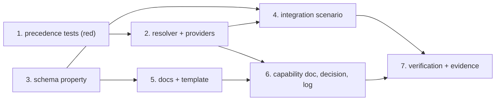

# Tasks: an inline `url` for the Slack integration

> The last spec artifact. Derived from the approved [`design.md`](design.md) and
> [`testing-plan.md`](testing-plan.md).

## Task list

- [x] 1. Precedence tests over `resolve("slack", …)` — red first
  - Four cases in `cli/tests/test_graph_integrations.py`: inline only; inline **and**
    env set (inline wins); env only; neither (the error). Parametrised over both
    transports so the two cannot drift, with `slack-sdk` absence skipping only the `sdk`
    leg.
  - Plus abuse case 2 (an empty `url` falls back to the environment) and abuse case 3
    (the message names both remedies and contains neither URL).
  - _Depends on:_ none
  - _Requirements:_ R1.1, R1.2, R1.3, R2.1, R3.3
  - _Test:_ `T1`, `T8` — `pytest -q cli/tests/test_graph_integrations.py` (red→green)

- [x] 2. Thread the inline URL through resolution and make the tests green
  - `base.py`: read `url` beside `urlEnv`, collapse absent/blank/`None` to `""`, pass to
    whichever transport is built.
  - `slack.py`: `_SlackBase.__init__(url_env, url="")` (keyword-defaulted, so the
    existing positional call sites keep working) and the precedence + two-remedy error in
    `_url()`.
  - _Depends on:_ 1
  - _Requirements:_ R1.1, R1.2, R1.3, R2.1, R3.1, R3.3
  - _Test:_ `T1`, `T8` — the same command, now green

- [x] 3. Schema: the optional `url` property
  - `.the-loop/cli-config.schema.json` — `"type": "string"` under
    `integrations.slack`, with a description that states the trade-off rather than a
    prohibition. `additionalProperties: false` and the schema `version` are both left
    alone.
  - _Depends on:_ none
  - _Requirements:_ R1.4, R3.2, abuse case 1
  - _Test:_ `T8`, `T10` — `pytest -q cli/tests/test_graph_integrations.py -k refused`;
    `uv run python scripts/validate_config.py`

- [x] 4. Integration scenario — config file in, HTTP request out
  - `cli/tests/test_graph_slack_url_integration.py`: drive the `notify` hook with a
    config carrying an inline `url` and a faked HTTP boundary, and assert the request
    went to that URL; then the same with no inline `url` and the env var set.
    Gherkin docstrings with a `Requirement:` link, per `testing.gherkinDocstrings`.
  - _Depends on:_ 2, 3
  - _Requirements:_ R1.1, R1.2, R1.3
  - _Test:_ `T2` — `pytest -q cli/tests/test_graph_slack_url_integration.py` (red→green)

- [x] 5. Documentation and the config template
  - `docs/config/cli/integrations-options.md`: a `### slack.url` section with `Type` and
    `Default` bullets (required by `test_docs_parity` P4/P5), the precedence rule, and
    the danger note rewritten from "never the URL" to the actual trade-off.
  - `skills/the-loop/templates/cli-config.yaml`: a commented-out `url:` line naming its
    cost, so a scaffolded config shows the choice exists without inviting it.
  - _Depends on:_ 3
  - _Requirements:_ R1.5
  - _Test:_ `T10` — `pytest -q cli/tests/test_docs_parity.py`

- [x] 6. Capability doc, decision record and execution log
  - `docs/capabilities/cli.md` — the `integrations` bullet gains the inline-URL rule and
    a history row.
  - `docs/decisions/decision-075.md` + the index row.
  - `docs/specs/issue-203/execution-log.md` — phases, reviews, security gate, evidence.
  - _Depends on:_ 2, 5
  - _Requirements:_ all (the paper trail the loop gates on)
  - _Test:_ `T10` — `make lint` (markdownlint over every doc touched)

- [x] 7. Verification: execute `testing-plan.md` and commit the evidence
  - Run every row, record command/outcome/evidence, tick the activities.
  - _Depends on:_ 1–6
  - _Requirements:_ all
  - _Test:_ `make test` and `make lint format-check typecheck validate`

## Dependency graph (DAG)

Tasks 1 and 3 are independent roots — the schema addition does not wait on the resolver,
and the resolver's tests do not wait on the schema.

## Checkpoints

After task 2 (the behaviour is complete and unit-proved), after task 4 (the end-to-end
claim holds), and after task 7 (the whole suite plus the repository gates). Each task's
red→green transition is recorded in the execution log; the committed proof lives under
[`evidence/`](evidence/).

## Review comments

> Appended by the-loop's `record-feedback` hook when a human gate approves with
> comments (issue-109).
