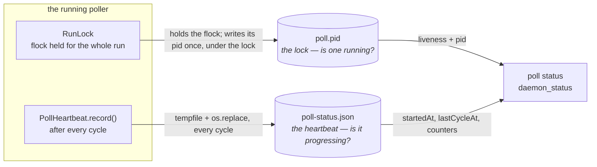

# Requirements: one source of truth for the poller's pid — and why the lock and the heartbeat stay two files

> The design lives here rather than in a `design.md` of its own, and so does the test
> matrix: the work item is one question, one deleted field and the record of why the
> answer is what it is. Scaled per `config.autonomy` (risk tier 2 — no consumer of the
> deleted field exists), the way issue-201 was.

## Introduction

**Two files, because they answer two questions — and the redundancy issue-205 spotted is
real, but it is not the second file. It is the `pid` field *inside* the heartbeat.**
Ticket: [#205](https://github.com/MadaraUchiha-314/the-loop/issues/205).



`poll.pid` is not a file the poller writes *about* itself; it is the **lock** (issue-159).
Liveness is "can I take the flock?" — the one formulation the kernel releases on `SIGKILL`
and on reboot, that pid reuse cannot fool, and that nobody can forge by writing a file.
`poll-status.json` carries the three facts a lock cannot: when this poller started, when it
last finished a cycle, what that cycle did (issue-191).

The `pid` field in the heartbeat sits across that line. It is written every cycle and
**read by nothing** — `poll status` (`cli/the_loop/commands/poll.py`), the control plane's
`daemon_status` (`cli/the_loop/core/daemons.py`) and the MCP/HTTP surface all take the pid
from `RunLock.holder()`, and always have. So it is a second answer to a question the lock
already owns: unused, unverifiable and forgeable. Deleting it makes the single source of
truth literal rather than merely documented.

### Why the two files cannot be merged

Three properties collide, and the first is decisive.

**1. The lock lives on the inode; the heartbeat replaces the inode every cycle.** The
heartbeat is written the way the record stores are — `tempfile` + `os.replace` — so a crash
never leaves half a document. `os.replace` swaps in a *new* inode at the same path. A flock
is held on the open file description, which names the old one. Write a heartbeat over the
pidfile and the running poller keeps a lock on an orphaned inode while the path it guards
becomes free; `RunLock._open_locked`'s stale-inode check then lets the next `poll start`
take the lock on the new file and run a **second poller against the same ledger** — the
exact defect issue-159 exists to prevent, back on a 60-second timer. Measured, not
reasoned:

```text
lock held: True inode: 1884214
before atomic rewrite -> another process sees it held: True
after atomic rewrite  -> another process sees it held: False inode: 1884215
```

Writing the heartbeat *in place* into the locked fd avoids that and buys two new problems:
`poll status` can read a torn JSON document mid-rewrite, and a crash mid-write leaves one
on disk. A status file that lies is worse than one that is absent — and it still leaves
points 2 and 3 standing.

**2. Their lifetimes are opposites.** `RunLock.release` unlinks the pidfile, because a
pidfile outliving its process is the stale-pid bug. The heartbeat is deliberately *kept*
after the poller stops, so `poll status` can still say when the last cycle ran and that the
poller stopped after it. One file cannot both be removed on exit and survive it.

**3. Their failure policies are opposites.** A pidfile that cannot be written aborts the
start — a daemon that cannot prove exclusivity must not run. A heartbeat that cannot be
written warns once and is swallowed — observability must never break ingress. One file
cannot be both fatal and ignorable.

## Requirements

### Requirement 1 — the pid has exactly one source of truth

**User story:** As an operator debugging a poller, I want exactly one place that names the
polling process, so that two files can never disagree about who is running.

#### Acceptance criteria (EARS)

1. WHEN the poller records a heartbeat THEN `<state.root>/poll-status.json` SHALL NOT
   contain a `pid` field.
2. WHEN any surface reports which process is polling — `poll status` in either format, the
   control plane's `daemon_status`, and the HTTP/MCP clients over it — THEN that pid SHALL
   come from the pidfile lock and from nowhere else.
3. IF a heartbeat written before this change is present, carrying a `pid` THEN it SHALL be
   read without error, its remaining facts SHALL be reported, and the recorded pid SHALL be
   ignored.
4. WHEN `poll status` renders its text or JSON output THEN every field an operator saw
   before this change SHALL still be present with the same meaning.

### Requirement 2 — the separation is recorded where the next reader will meet it

**User story:** As the next person to ask issue-205's question, I want the answer in the
files themselves, so that it is not re-derived from an issue thread.

#### Acceptance criteria (EARS)

1. WHEN a reader opens `docs/cli/state.md` at either file THEN it SHALL state what that
   file answers and why the other one cannot answer it.
2. WHEN a developer opens `the_loop.poller.heartbeat` THEN its module docstring SHALL name
   the inode/atomic-rewrite conflict as the reason the heartbeat is not the pidfile.
3. WHEN the decision log is read THEN it SHALL carry a record of this split and of the
   deleted field.

## Non-functional requirements

- **Behaviour:** none changes. `poll status` prints the same lines and the same JSON keys;
  the poller writes one fewer field per cycle.
- **Compatibility:** the heartbeat is machine-local generated state (`docs/cli/state.md`
  classifies it `local`), never committed and never read by an older CLI, so the file's
  shape is not a contract with anything but itself. `Heartbeat.from_mapping` ignores
  unknown keys, so a heartbeat written by the previous version reads cleanly.

## Security considerations

**No new attack surface; one forgeable claim removed.** The change deletes a field and
adds no reader, no writer and no path.

- **Actors & trust:** anyone who can write inside `state.root` — the operator, anything
  else running as them, and any process that has escaped into that directory. The
  heartbeat has always been *untrusted input* to `poll status`: it is a claim written by a
  process that may since have died.
- **Trust boundaries & data:** the boundary is unmoved — liveness and pid cross from the
  lock, progress from the heartbeat. Removing `pid` narrows what a forged heartbeat can
  even appear to say: previously a hostile file could name a live pid belonging to
  somebody else, and although nothing read it, an operator reading the file by hand could
  be misled into signalling it. The heartbeat carries no secrets, and gains none.
- **Abuse cases (EARS):**
  1. WHEN a forged `poll-status.json` is placed beside a lock nobody holds THEN
     `poll status` SHALL report *not running* and exit `1`
     (`test_a_forged_heartbeat_cannot_make_a_dead_poller_look_alive`).
  2. WHEN a forged heartbeat carries a `pid` naming a live process THEN no the-loop
     surface SHALL report, signal or otherwise act on that pid.
- **Fail closed:** an absent, truncated or wrong-shaped heartbeat costs the progress lines
  and nothing else; liveness is still answered by the lock.

## Out of scope

- **Merging the two files** — rejected above, and recorded as
  [decision-076](../../decisions/decision-076.md).
- **The pidfile's own format** and the lock discipline (issue-159), unchanged.
- **`gh-webhook`**, which keeps no heartbeat; `daemon_status` reports empty `startedAt` /
  `lastCycleAt` for it, as before.

## Testing

| Row | Type | What it proves | Command |
|---|---|---|---|
| T1 | Unit | A recorded heartbeat has no `pid` key, and `Heartbeat` has no `pid` attribute — the field is gone from the file *and* the model | `pytest cli/tests/test_poll_heartbeat.py -k pid` |
| T2 | Unit (rationale, executable) | An atomic rewrite over a held `RunLock` frees the lock — the measurement behind "the heartbeat cannot be the pidfile" | `pytest cli/tests/test_poll_heartbeat.py -k pidfile` |
| T3 | Unit (compat) | A pre-change heartbeat carrying `pid` reads without error and reports its remaining facts | `pytest cli/tests/test_poll_heartbeat.py -k older` |
| T4 | Integration | `poll status` reports the same text and the same JSON keys, with liveness and pid from the lock, over a heartbeat that carries none | `pytest cli/tests/test_poll_status.py` |
| T5 | Regression | The poller, daemon and control-plane suites are unaffected | `pytest cli/tests/test_poll_daemon_integration.py cli/tests/test_core_daemons.py cli/tests/test_poller_integration.py` |
| T6 | Regression (whole suite) | Nothing else moved | `make test` |
| T7 | Lint / type-check / docs parity | Repository gates, including the docs↔CLI parity test | `make lint format-check typecheck validate` |

### Verification results

| Activity | Command | Outcome | Evidence |
|---|---|---|---|
| T1 | `pytest cli/tests/test_poll_heartbeat.py -k pid` | pass — 3 passed (the selector also picks up T2 and T3) | [`evidence/verification.md`](evidence/verification.md) |
| T2 | `pytest cli/tests/test_poll_heartbeat.py -k pidfile` | pass — 1 passed; the same measurement quoted in § Why the two files cannot be merged | [`evidence/verification.md`](evidence/verification.md) |
| T3 | `pytest cli/tests/test_poll_heartbeat.py -k older` | pass — 1 passed | [`evidence/verification.md`](evidence/verification.md) |
| T4 | `pytest cli/tests/test_poll_status.py` | pass — 11 passed | [`evidence/verification.md`](evidence/verification.md) |
| T5 | `pytest cli/tests/test_poll_daemon_integration.py cli/tests/test_core_daemons.py cli/tests/test_poller_integration.py` | pass — 31 passed | [`evidence/verification.md`](evidence/verification.md) |
| T6 | `make test` | pass — 1800 passed, 1 skipped | [`evidence/verification.md`](evidence/verification.md) |
| T7 | `make lint format-check typecheck validate` | pass — ruff clean, 0 markdown errors, pyright 0 errors, 7 configs VALID | [`evidence/verification.md`](evidence/verification.md) |

**Not executed:** none.

## Open questions

None. The ticket asked one question with two admissible answers ("remove it" / "say why
two are required"); both halves are answered above — two files are required, and the
duplicate *field* is removed.

## Review comments

> Appended by the-loop's `record-feedback` hook when a human gate approves with
> comments (issue-109).
