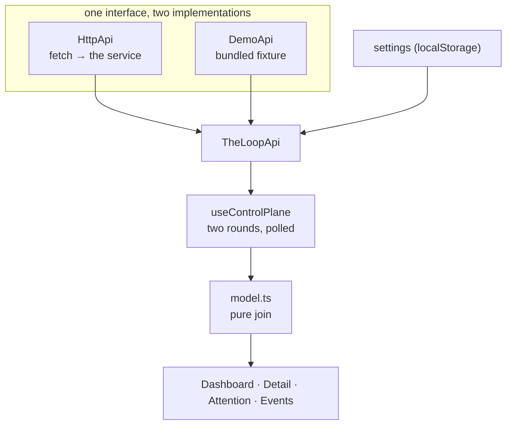

# Design: a control-plane dashboard over `/api/v1`

> Phase 2 of the chain. Derives from [`requirements.md`](requirements.md).

## Overview

A single-page app in `ui/`, built with Vite and TypeScript, published to
`/the-loop/ui/` alongside the docs site. It adds no server: it is a browser client of the
service the repository already ships.

The design's one architectural idea is that **the join is the app**. Fetching is
mechanical, rendering is the design system, and everything that could be wrong lives in
one pure module that turns four API records into one row per work item. That module is
where the tests point.



Views depend on `TheLoopApi`, never on a concrete client, which is what makes the demo
mode a transport rather than a parallel code path through the screens.

## Architecture

| Piece | File | What it is |
|---|---|---|
| Record types | `ui/src/api/types.ts` | The shapes `/api/v1` serves, written against the records themselves (`docs/cli/state.md`, `graph/runtime.py`) because the contract types most responses as bare objects |
| HTTP client | `ui/src/api/client.ts` | `fetch` + URL building + `ApiError` with operator-facing advice |
| The join | `ui/src/api/model.ts` | Pure functions: ref parsing, spec-id derivation, rails, the inbox union, transcript paths |
| Demo transport | `ui/src/demo/{fixture,client}.ts` | The same interface, answered from a fixture |
| Board state | `ui/src/state/useControlPlane.ts` | Two-round fetch, concurrency-capped graph round, polling |
| Settings | `ui/src/state/settings.ts` | Validated `localStorage` |
| Route | `ui/src/state/route.ts` | Hash router |
| Screens | `ui/src/views/*.tsx` | One file each |
| Design system | `ui/src/styles/industry.css` | Vendored export, not hand-edited |
| Deployment | `.github/workflows/docs.yml` | Builds both apps, uploads one Pages artifact |

## Components & interfaces

### `TheLoopApi` — the seam

```ts
interface TheLoopApi {
  readonly baseUrl: string;
  readonly isDemo: boolean;
  workItems(signal?): Promise<WorkItemRecord[]>;
  sessions(signal?): Promise<SessionRecord[]>;
  attention(signal?): Promise<AttentionItem[]>;
  events(query?, signal?): Promise<EventRecord[]>;
  daemons(signal?): Promise<DaemonStatus[]>;
  graphCheck(query, signal?): Promise<GraphStatus>;
  graphComplete(query): Promise<CoreResult>;
  controlSession(ref, verb, comment?): Promise<CoreResult>;
  // …health, graphDefinition, controlDaemon
}
```

`graphCheck` is a POST despite being a read: the contract keeps `repo` (a filesystem path)
and work-item refs (which contain `/` and `#`) out of path segments, and the client
follows that rather than re-deciding it.

### `useControlPlane` — why the board paints twice

Round one is the four flat lists, in parallel. The board renders from them immediately.
Round two is one `graph/check` per loop, and it **cannot** start earlier because its
arguments come from round one:

- `repo` ← the session record's `cwd`
- `workItem` ← the portable record's `graph.workItem`, else `issue-<number>`

The round is a worker pool of four. Failures are swallowed per job: an unreadable
checkout, a spec directory that does not exist yet, a repository moved off the machine —
all of them mean "no position known", which `railFromFrozen` already renders. Escalating
any of them would blank a board over one bad row (R1.3).

### `model.ts` — the join

| Function | Decides |
|---|---|
| `parseRef` | `<provider>:[<host>/]<owner>/<repo>#<number>`, mirroring `WorkItemRef` — the host is unwritten when it is `github.com`, so GHE refs are three path segments and github.com refs are two |
| `specId` | `graph.workItem` when the phase-selection gate froze one, else the `issue-<n>` convention |
| `railFromStatus` | Positional read of a report: passed-before-pointer is done, `skip` is skipped, `block`/`fail`/`escalated` is blocked — a stuck item must not read as "in progress" |
| `buildWorkItemViews` | The union of refs from both lists, so neither a session without a record nor a record without a session disappears |
| `attentionEntries` | `/attention` ∪ parked gates (outer and per-PR), urgent first |
| `transcriptPath` | `~/.claude/projects/<cwd with non-alphanumeric runs → ->/<session-id>.jsonl`; null for cursor |

### Error handling

`ApiError` carries a `kind`, and `advice` turns it into the sentence an operator can act
on. The case that matters is `network`: a cross-origin block surfaces in the browser as an
opaque `TypeError` with no status, and it is the *expected* failure for a hosted page
given the loopback bind and absent CORS headers. Reporting it as "failed to fetch" would
send an operator to look at the wrong thing, so it reports the tunnel-and-gateway remedy
instead. HTTP failures surface FastAPI's own `detail`.

## Data models

No new persisted model. One browser-local record:

```ts
interface Settings { baseUrl: string; mode: "live" | "demo"; pollSeconds: number }
```

Stored under `the-loop:settings:v1`, validated field by field on read so a hand-edited
store degrades rather than blanks (abuse case 4).

## Security design

Restating the boundary from `requirements.md` § Security considerations as implementation
rules:

- **No credential exists in this app.** Nothing is read from or written to storage except
  the settings record above.
- **Everything from the service is data, never code.** All rendering is React text
  interpolation. No `dangerouslySetInnerHTML`, no dynamic `import()`, no service-supplied
  value reaching a `src`, `href` scheme other than the record's own derived `https://`
  URL, or a style string. External links carry `rel="noreferrer"` (abuse case 2).
- **The posture is stated, not worked around.** Settings names the loopback bind, the
  absent CORS headers and the gateway/tunnel remedy, and the app never proposes
  `service.exposed: true` (abuse case 1).
- **Demo mode is unmistakable.** `isDemo` drives a banner on every screen; its control
  verbs mutate memory (abuse case 5).
- **The base URL is always visible** in the connection banner and on Settings, and the
  health probe reports the version of whatever it actually reached (abuse case 3).

The Pages workflow gains no new secret: it uses the same `pages: write` / `id-token:
write` grant the docs deploy already had.

## Testing strategy

The join and the transport carry the risk, so they carry the unit tests; the React layer
gets one behavioural suite against the demo transport, which is exactly what a reviewer
would click through. See [`testing-plan.md`](testing-plan.md).

## Trade-offs & decisions

| Option | Why not |
|---|---|
| Extend the VitePress site with a Vue island | Couples the dashboard's release to a docs build, and inherits VitePress's routing and SSR for an app that is pure client state. Rejected |
| A separate Pages workflow for `ui/` | Pages serves **one** artifact per origin; a second `deploy-pages` replaces the first rather than sitting beside it. The two builds are assembled into one artifact instead. **This is the reason the docs workflow was modified rather than duplicated** |
| History-API routing | Pages 404s any path the build did not emit, so every deep link would break on refresh. Hash routing, which also makes the base path irrelevant to the router |
| Fetch the graph report inside each row component | N uncoordinated requests with no cap and no shared cache; a 20-item board would open 40 sockets against a single-worker uvicorn. One capped round in the board hook |
| Show a work item's title and a PR's checks | Not served, and not the-loop's to serve — the portable record deliberately keeps no copy of GitHub's mutable fields. Link out |
| Mock the reply box so the prototype demos end to end | Ships a control that looks real and does nothing. Rendered disabled, naming the missing route |
| Drop the reply box until the verb lands | Loses the design's conclusion and the place it belongs. Disabled is the honest middle |
| Live-only, no demo mode | The hosted page's first impression would be a connection error, and reviewers of this PR could not see the screens at all |

## Open questions

None. The two proposed backend verbs are follow-up work items, not decisions this design
is waiting on.

## Review comments

<!-- Populated at review. -->
