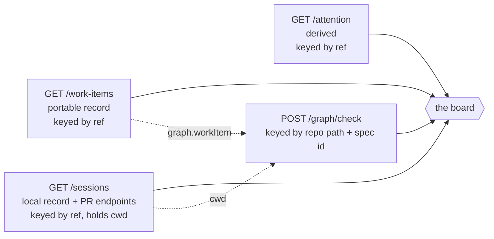

# Requirements: a control-plane dashboard over `/api/v1`

> Phase 1 of the chain. Ticket:
> [#206](https://github.com/MadaraUchiha-314/the-loop/issues/206).
>
> **The ticket number is provisional.** The session that authored this chain had no
> GitHub write credential and could not file the issue; the number was taken as the next
> free one. Renaming this directory and the three cross-references inside it is the whole
> reconciliation — see [`execution-log.md`](execution-log.md).

## Introduction

**the-loop can already answer every question an operator has, and has no way to ask
them.** [issue-161](https://github.com/MadaraUchiha-314/the-loop/issues/161) built the
core facade, the `/api/v1` service and the `attention` surface, then descoped the UI on
owner review: *"the UI arrives as its own work item."* This is that work item.

Today the only clients are the CLI and an MCP endpoint. Both are one-work-item-at-a-time
and both live on the machine running the daemon. An operator with five to twenty work
items in flight has no view of the board — which items are moving, which are parked on a
human, which session died — without running `the-loop sessions list`, then `the-loop
check` per item, then `the-loop events`, and holding the join in their head.

That join is the actual product here. Four records answer "where is everything?", and no
two of them are keyed the same way:

The graph report — the only thing that says *where in the loop* an item is — cannot be
fetched without a field from the session record and a field from the work-item record. No
single call answers the dashboard's first column, which is why this is a real client and
not a `curl | jq`.

A second constraint shapes everything: the dashboard must be **statically hostable**. An
operator's work items live on their workstation, not on a server anyone else can reach,
so the app is deployed once (GitHub Pages, beside the docs) and pointed at whichever
machine is running the service.

## Requirements

### Requirement 1 — the board shows every tracked work item and where it is

**User story:** As an operator running several work items, I want one screen that lists
all of them with their loop position, so that I can see what is moving without a command
per item.

#### Acceptance criteria

1. R1.1 — The dashboard SHALL list every work item the service reports, from the union of
   `GET /api/v1/work-items` and `GET /api/v1/sessions`; a work item with no session and a
   session with no portable record SHALL both appear.
2. R1.2 — Each row SHALL show the current graph node and progress along the loop, derived
   from `POST /api/v1/graph/check` with `repo` from the session's `cwd` and `workItem`
   from the record's `graph.workItem` (falling back to the `issue-<number>` convention).
3. R1.3 — When a graph report cannot be obtained — no session, no checkout on this
   machine, an unreadable spec directory — the row SHALL still render, showing the frozen
   node list from the portable record with no pointer. It SHALL NOT show an error and
   SHALL NOT omit the row.
4. R1.4 — Each row SHALL show session state (`active` / `paused` / `closed` / none), the
   pull requests delivering the item with each one's inner-loop node, and time since last
   activity.
5. R1.5 — A row whose graph is parked on a human, whose current node is blocked, or which
   `/attention` reports on SHALL carry a flag naming which.

### Requirement 2 — a work item's detail shows both loops and the trace

**User story:** As an operator, I want one work item's outer loop, every PR's inner loop
and what the agent has been doing, so that I can judge whether to intervene.

#### Acceptance criteria

1. R2.1 — The detail screen SHALL render the outer `pdlc-work-item-loop` as a node rail
   with the reached, current, skipped and blocked nodes distinguished.
2. R2.2 — Each pull request in the session record SHALL get its own card with its own
   `pdlc-pr-loop` rail, its tmux target and its session state.
3. R2.3 — An inner-loop report SHALL be requested with `prRepo` set **only** when the PR's
   repository differs from the work item's; state for a same-repo PR lives at
   `pr-loops/pr-<n>/`, not `pr-loops/<owner>__<repo>/pr-<n>/`.
4. R2.4 — The screen SHALL show the event-log trail for the work item, and for each
   session SHALL show the derivable Claude Code transcript path.
5. R2.5 — Where the design specified a surface the API cannot back — the inline reply box,
   the turns-and-tool-calls trace — the surface SHALL be rendered **disabled**, naming the
   route that would enable it. It SHALL NOT be silently dropped and SHALL NOT be backed by
   invented data.

### Requirement 3 — the operator can act, through the routes that exist

**User story:** As an operator, I want to pause, resume or stop a session and approve a
graph gate from the board, so that the common interventions do not need a shell.

#### Acceptance criteria

1. R3.1 — Session control SHALL go through `POST /api/v1/sessions/control`, offering only
   the verbs valid for the session's current state.
2. R3.2 — Approving a parked human gate SHALL go through `POST /api/v1/graph/complete`
   with the parked node, and SHALL be disabled when no checkout path is known.
3. R3.3 — A failed action SHALL report the service's own `detail` message, and SHALL NOT
   leave the board showing the state it tried to reach.
4. R3.4 — After a successful action the board SHALL re-fetch rather than guess the result.

### Requirement 4 — the inbox is the union, not just the endpoint

**User story:** As an operator, I want one list of everything waiting on me, so that a
parked gate is as visible as a paused session.

#### Acceptance criteria

1. R4.1 — The inbox SHALL show every item from `GET /api/v1/attention`.
2. R4.2 — It SHALL additionally show graph gates — outer and per-PR — parked awaiting a
   human. `core.attention` documents these as out of its scope because they are
   repo-scoped; the UI has already read those reports for the rails.
3. R4.3 — Urgent entries (gates, errors) SHALL sort above the rest, and the count SHALL
   appear on the navigation.

### Requirement 5 — one static bundle, any workstation

**User story:** As an operator, I want to open one hosted URL and point it at whichever
machine is running the service, so that there is nothing to install or deploy per
workstation.

#### Acceptance criteria

1. R5.1 — The app SHALL build to static assets with no server-side component and SHALL be
   published to GitHub Pages at `/the-loop/ui/`, beside the docs site at `/the-loop/`,
   from a single Pages artifact.
2. R5.2 — The API base URL SHALL be settable at runtime and persisted per browser;
   changing it SHALL NOT require a rebuild.
3. R5.3 — Saving a base URL SHALL probe `GET /api/v1/health` and report the outcome.
4. R5.4 — A cross-origin failure — the expected one, given the loopback bind and the
   absent CORS headers — SHALL be reported as such, naming the tunnel and gateway remedy,
   never as a bare "failed to fetch".
5. R5.5 — With no service reachable the app SHALL offer a bundled demo dataset in the same
   record shapes, behind a banner on every screen, with no control verb leaving the
   browser.
6. R5.6 — Deep links SHALL survive a reload on GitHub Pages.

## Non-functional requirements

1. NFR1 — A board of 20 work items SHALL issue at most 4 concurrent graph requests, and
   SHALL render the flat lists before the graph round completes.
2. NFR2 — The build SHALL be reproducible from a lockfile, and lint, type-check and tests
   SHALL run in CI on every pull request and again before any Pages publish.
3. NFR3 — The rendered result SHALL match the approved design's tokens: the vendored
   Industry stylesheet is the source of the look and is not hand-edited.
4. NFR4 — Every interactive control SHALL be reachable by keyboard, and the pulse
   animation SHALL be suppressed under `prefers-reduced-motion`.

## Security considerations

The dashboard holds **no credential** and mints none. That is deliberate and it is also
the whole boundary: the service has no in-app auth by decision
([decision-059](../../decisions/decision-059.md)), so anything that can reach it can drive
it. The threats are therefore about *reach* and about *what the page will render*.

| # | Abuse case | Mitigation |
|---|---|---|
| 1 | An operator hosts the page publicly and exposes the service to make it work, giving the internet unauthenticated `sessions/control` | The Settings note states the posture and names the gateway/tunnel as the supported path; the app never suggests `service.exposed: true`. The service's own exposure guard remains the enforcement point |
| 2 | A hostile or compromised service returns fields crafted to execute in the page | Every value is rendered as text through React; no `dangerouslySetInnerHTML`, no `eval`, no URL from the service used as a script or style source. Links out carry `rel="noreferrer"` |
| 3 | A stored base URL points at an attacker's host, so the operator drives someone else's service believing it is theirs | The base URL is shown in the chrome and on Settings, and the health probe reports the version it actually reached |
| 4 | Hand-edited or corrupt `localStorage` blanks the app | Settings are validated field by field on read; a bad field degrades to its default |
| 5 | The demo fixture is mistaken for a real board and an operator acts on it | `isDemo` drives a banner on every screen and control verbs are in-memory only |

No secret is read, written or logged by this app. The one thing it persists is a URL the
operator typed.

## Out of scope

- **`the-loop ask` and `POST /sessions/reply`.** The verb the design concluded was
  missing, and the route that would deliver an answer. Both are CLI/service work; this
  work item builds the surface against the event the verb would emit and ships it
  disabled. Follow-up tickets.
- **A transcript endpoint.** Same reasoning: the app derives and displays the JSONL path
  and falls back to the event log.
- **Ticket titles, PR checks and review state.** GitHub's, not the-loop's; the portable
  record deliberately keeps no copy. The app links out.
- **Authentication, and any gateway configuration.** decision-059 places both outside the
  service, and therefore outside its client.
- **Cursor transcripts.** Undocumented SQLite; and per the interactive-sessions capability
  `cursor-agent` cannot be tmux-hosted anyway.

## Open questions

None blocking. The two proposed backend verbs are tracked as follow-ups rather than
questions.

## Review comments

<!-- Populated at review. -->
